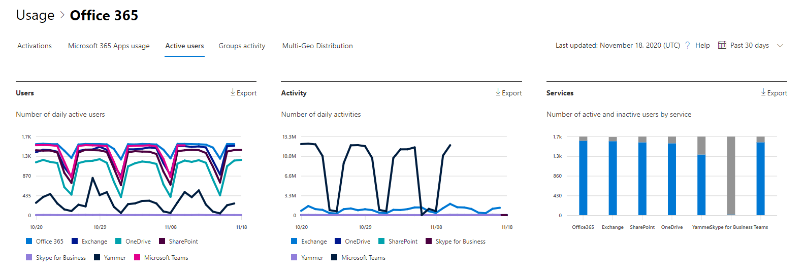

# 評估 Microsoft 365 作用中使用者報告

[Microsoft 365 **報告**] 儀表板會顯示您組織中產品的活動概況。 此功能可讓您深入了解個別產品層級報表，更加深入解析各產品內的活動。 請參閱[報告概觀主題](activity-reports.md)。
  
例如，您可以使用 [作用中的 **使用者** ] 報告，找出組織中個人使用的產品授權數目，並深入瞭解使用者使用哪些產品的相關資訊。 這份報告可協助系統管理員識別使用率低的產品或可能需要其他訓練或資訊的使用者。 
  
> [!NOTE]
> 您必須是全域系統管理員、全域讀取者或報告讀取者 Microsoft 365 或 Exchange、SharePoint、Teams 服務、Teams 通訊或商務用 Skype 管理員查看報告。  

## 如何取得作用中的使用者報告

1. 在系統管理中心中，移至 **[報告]** \> <a href="https://go.microsoft.com/fwlink/p/?linkid=2074756" target="_blank">[使用量]</a> 頁面。 
2. 在 [儀表板] 主頁上，按一下 [作用中的使用者-Microsoft 365 服務] 上的 [**查看其他**] 按鈕。

## 解讀作用中的使用者報告

您可以選擇 [作用中的 **使用者**] 索引標籤，在 Office 365 報告中查看作用中的使用者。 

- [作用中的使用者] 報告可讓您檢視過去 7 天、30 天、90 天或 180 天的趨勢。 不過，如果您在報告中查看某一天，則 table (7) 會從目前的日期顯示最多28天的資料， (不是) 產生報表的日期。

- 每個報告中的資料通常會涵蓋過去24到48小時。

- [使用者] 圖表會向您顯示以產品分隔的報表期間中每日作用中的使用者。
[活動] 圖表會顯示以產品分隔報告期間中的每日活動計數。
[服務] 圖表會顯示活動類型和服務的使用者數目。

- 在 [使用者] 圖表上，X 軸會顯示所選的報表時間期間，y 軸會顯示每日作用中的使用者，並依授權類型以色彩編碼。
在 [活動] 圖表上，X 軸會顯示所選的報表時間期間，y 軸會顯示每日活動計數和依授權類型編碼的色彩。
在 [服務] 活動圖表上，X 軸會顯示在指定的時間週期中使用者啟用的各個服務，而 Y 軸是依活動狀態顯示使用者數目，以不同顏色表示不同的活動狀態。

- 您可以選取圖例中的專案，以篩選您在圖表上看到的數列。 變更此選取項目並不會變更格線資料表中的資訊。

- 您也可以選取 [匯出] 連結，將報表資料匯出至 Excel .csv 檔案中。 這會匯出所有使用者的資料，並可讓您進行簡單的排序和篩選，以便進一步分析。 如果您的使用者少於 2000 個，您可以直接在報告中的表格內進行排序和篩選。 如果您的使用者多於 2000 個，則需要匯出資料才能進行排序和篩選。

- 您可以使用欄控制項來變更格線表格中顯示的資訊。
如果您的訂閱是由世紀運作，您就不會看到 Yammer。

如果貴組織的原則防止您檢視可識別之使用者資訊的報告，您可以變更所有這類報告的隱私權設定。 請參閱 [Microsoft 365 系統管理中心中活動報告](activity-reports.md)中的 [**我要如何隱藏使用者層級詳細資料？** ] 區段。  
