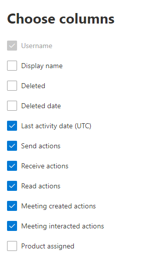

# Microsoft 365系統管理中心內的報告-電子郵件活動

[Microsoft 365 **報告**] 儀表板會顯示您組織中產品的活動概況。 此功能可讓您深入了解個別產品層級報表，更加深入解析各產品內的活動。 請參閱[報告概觀主題](activity-reports.md)。
  
例如，您可以從 [報告] 頁面取得組織內電子郵件流量的高層級檢視，然後深入電子郵件活動小工具，以了解組織內的趨勢和每個使用者層級的電子郵件活動詳細資料。
  
> [!NOTE]
> 您必須是全域系統管理員、全域讀取者或報告讀取者 Microsoft 365 或 Exchange、SharePoint、Teams 服務、Teams 通訊或商務用 Skype 管理員查看報告。 

## 如何取得電子郵件活動報告

1. 在系統管理中心中，移至 **[報告]** \> <a href="https://go.microsoft.com/fwlink/p/?linkid=2074756" target="_blank">[使用量]</a> 頁面。
2. 選取 [**電子郵件活動**] 底下的 [**流覽**]。 
3. 在 [**電子郵件活動**] 下拉式清單中，選取 [ **Exchange** \> **電子郵件活動**]。
  
## 解讀電子郵件活動報告

您可以查看 [ **活動** ] 和 [ **使用者** ] 圖表，以瞭解使用者的電子郵件活動。 
  

  
|項目|描述|
|:-----|:-----|
|1.    |您可以針對過去7天、30天、90天或180天的趨勢，查看 **電子郵件活動** 報告。 不過，如果您在報告中選取某一天，則 table (7) 會從目前的日期顯示最多28天的資料， (不是) 產生報表的日期。    |
|2.    |每個報告中的資料通常會涵蓋過去24到48小時。    |
|3.    |[ **活動** ] 圖表可讓您瞭解組織中發生的電子郵件活動數量趨勢。 您可以瞭解電子郵件傳送、電子郵件讀取、接收電子郵件、會議建立或會議互動活動的分割。    |
|4.    |**使用者** 圖表可讓您瞭解會產生電子郵件活動之唯一使用者的數量趨勢。 您可以查看執行電子郵件傳送、電子郵件閱讀、接收電子郵件、會議建立或會議互動活動的使用者趨勢。    |
|5.    | 在 [ **活動** ] 圖表上，Y 軸是已傳送電子郵件、已接收電子郵件、讀取電子郵件、會議建立及會議互動的類型活動計數。     在 [ **使用者** ] 活動圖表中，Y 軸是使用者執行的電子郵件傳送、電子郵件接收、電子郵件讀取、會議建立或會議互動的活動。     這兩份圖表的 X 軸都代表該特定報告的已選取日期範圍。    |
|6.    |您可以選取圖例中的專案，以篩選您在圖表上看到的數列。    |
|7.    | 表格顯示每個使用者層級的電子郵件活動明細。 這會顯示所有已受指派 Exchange 產品的使用者以及他們的電子郵件活動。     [使用者 **名稱**] 是使用者的電子郵件地址。    [**顯示名稱**] 是使用者的完整名稱。    [**已刪除**] 代表目前狀態為已刪除的使用者，但在報告的部分報告期間內為作用中狀態。    「**刪除日期**」是指使用者已遭刪除的日期。    [**上次活動日期**] 是指使用者上次執行讀取或傳送電子郵件活動的時間。    [**傳送動作**] 是針對使用者記錄的電子郵件傳送動作次數。    「**接收動作**」是為使用者記錄的電子郵件接收動作次數。    「**讀取動作**」是為使用者記錄的電子郵件讀取動作次數。    「**會議建立動作**」是為使用者記錄會議要求傳送動作的次數。    「**會議互動動作**」是為使用者記錄會議邀請接受、暫定、謝絕或取消動作的次數。    「已 **指派產品**」是指派給此使用者的產品。     如果貴組織的原則防止您檢視可識別之使用者資訊的報告，您可以變更所有這類報告的隱私權設定。 請參閱 [Microsoft 365 系統管理中心的活動報告中](activity-reports.md)的 [**我要如何隱藏使用者層級詳細資料？** ] 區段。    |
|8.    |選取 **[選擇欄位** ]，以新增或移除報告中的欄。    |
|9.    |您也可以選取 [**匯出**] 連結，將報表資料匯出至 Excel .csv 檔案中。 這會匯出所有使用者的資料，並可讓您進行簡單的排序和篩選，以便進一步分析。 如果您的使用者少於 2000 個，您可以直接在報告中的表格內進行排序和篩選。 如果您的使用者多於 2000 個，則需要匯出資料才能進行排序和篩選。    |
|||
   
> [!NOTE]
> 「電子郵件活動報告」只適用于具有授權之使用者的信箱。
