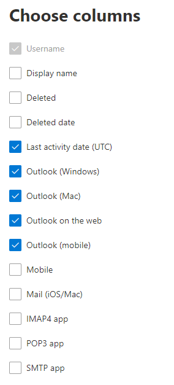

# Microsoft 365系統管理中心的報告-電子郵件應用程式使用方式

[Microsoft 365 **報告**] 儀表板會顯示您組織中產品的活動概況。 此功能可讓您深入了解個別產品層級報表，更加深入解析各產品內的活動。 請參閱[報告概觀主題](activity-reports.md)。 在 [電子郵件應用程式使用狀況] 報告中，您可以看到有多少電子郵件應用程式正在連接至 Exchange Online。 您也可以看到使用者正在使用之 Outlook App 的版本資訊，這可讓您追蹤使用不支援之版本的使用者，並要求他們安裝支援的 Outlook 版本。
  
> [!NOTE]
> 您必須是全域系統管理員、全域讀取者或報告讀取者 Microsoft 365 或 Exchange、SharePoint、Teams 服務、Teams 通訊或商務用 Skype 管理員查看報告。  
 
## 如何取得「電子郵件應用程式」報告

1. 在系統管理中心中，移至 **[報告]** \> <a href="https://go.microsoft.com/fwlink/p/?linkid=2074756" target="_blank">[使用量]</a> 頁面。
2. 選取 [**電子郵件活動**] 底下的 [**流覽**]。 
3. 從 [**電子郵件活動**] 下拉式清單中，選取 [ **Exchange** \> **電子郵件應用程式使用**]。
  
## 轉譯電子郵件應用程式報告

您可以查看 [ **使用者** ] 和 [ **用戶端** ] 圖表，以取得電子郵件應用程式活動的方式。 
  

  
|項目|描述|
|:-----|:-----|
|1.    |您可以針對過去7天、30天、90天或180天的趨勢，查看「 **電子郵件應用程式使用方式** 報告」。 不過，如果您在報告中選取某一天，則 table (7) 會從目前的日期顯示最多28天的資料， (不是) 產生報表的日期。    |
|2.    |每個報告中的資料通常會涵蓋過去24到48小時。    |
|3.    |[**使用者**] 視圖會顯示使用任何電子郵件應用程式連線至 Exchange Online 的唯一使用者數目。    |
|4.    |[ **應用程式** ] 視圖會以應用程式為您顯示選取的時段內，依應用程式的唯一使用者數目。    |
|5.    |**版本** 視圖會顯示 Windows 中每個 Outlook 版本的唯一使用者數目。    |
|6.    | 在 [ **使用者** ] 圖表上，Y 軸是在報表期間的任意一天連接至應用程式的唯一使用者總數。     在 [ **使用者** ] 圖表上，X 軸是使用該報告期間之應用程式的唯一使用者數目。     在 [ **應用程式** ] 圖表上，Y 軸是在報表期間內使用特定 app 的唯一使用者總數。     在 [ **app** ] 圖表上，X 軸是您組織中的應用程式清單。     在 [**版本**] 圖表上，Y 軸是使用特定版本 Outlook 桌面的唯一使用者總數。 如果報表無法解析 Outlook 的版本號碼，該數量會顯示為 **未定**。     在 [ **版本** ] 圖表上，X 軸是您組織中的應用程式清單。    |
|7.    |您可以選取圖例中的專案，以篩選您在圖表上看到的數列。    |
|8.    | 您可能無法在欄中看到下方清單中的所有項目，直到您新增那些項目之後才會出現。  **Username** 是電子郵件應用程式擁有者的名稱。    [**上次活動日期**] 是使用者讀取或傳送電子郵件訊息的最晚日期。    **mac 郵件**、 **mac Outlook** 和 **Outlook**、 **Outlook** **網頁上** 的行動和 Outlook 都是您組織中可能擁有的電子郵件 app 範例。     如果貴組織的原則防止您檢視可識別之使用者資訊的報告，您可以變更所有這類報告的隱私權設定。 請參閱 [Microsoft 365 系統管理中心的活動報告中](activity-reports.md)的 [**我要如何隱藏使用者層級詳細資料？** ] 區段。    |
|9.    |選取 **[選擇欄位** ]，以新增或移除報告中的欄。    |
|10.    |您也可以選取 [**匯出**] 連結，將報表資料匯出至 Excel .csv 檔案中。 這會匯出所有使用者的資料，並可讓您進行簡單的排序和篩選，以便進一步分析。 如果您的使用者少於 2000 個，您可以直接在報告中的表格內進行排序和篩選。 如果您的使用者多於 2000 個，則需要匯出資料才能進行排序和篩選。    |
|||
   
