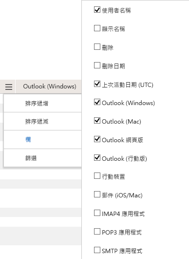

# 系統管理中心的 Microsoft 365 報告-電子郵件應用程式使用方式Microsoft 365 Reports in the admin center - Email apps usage

Microsoft 365 **報告** 儀表板會向您顯示組織中各產品的活動概況。The Microsoft 365 **Reports** dashboard shows you the activity overview across the products in your organization. 此功能可讓您深入了解個別產品層級報表，更加深入解析各產品內的活動。It enables you to drill in to individual product level reports to give you more granular insight about the activities within each product. 請參閱[報告概觀主題](activity-reports.md)。Check out [the Reports overview topic](activity-reports.md). 在 [電子郵件應用程式使用狀況] 報告中，您可以看到有多少電子郵件應用程式正在連線到 Exchange Online。In the email apps usage report, you can see how many email apps are connecting to Exchange Online. 您也可以看到使用者正在使用之 Outlook App 的版本資訊，這可讓您追蹤使用不支援之版本的使用者，並要求他們安裝支援的 Outlook 版本。You can also see the version information of Outlook apps that users are using, which will allow you to follow up with those who are using unsupported versions to install supported versions of Outlook.
  
> [!NOTE]
> 您必須是 Microsoft 365 中的全域系統管理員、全域讀取者或報告讀取器、Exchange、SharePoint、小組服務、小組通訊或商務用 Skype 系統管理員，才能查看報告。You must be a global administrator, global reader or reports reader in Microsoft 365 or an Exchange, SharePoint, Teams Service, Teams Communications, or Skype for Business administrator to see reports.  
 
## 如何取得「電子郵件應用程式」報告How to get to the email apps report

1. 在系統管理中心中，移至 **[報告]** \> <a href="https://go.microsoft.com/fwlink/p/?linkid=2074756" target="_blank">[使用量]</a> 頁面。In the admin center, go to the **Reports** \> <a href="https://go.microsoft.com/fwlink/p/?linkid=2074756" target="_blank">Usage</a> page.

    
2. 從 [ **選取報告** ] 下拉式清單中，選取 [ **Exchange** \> **電子郵件 app 使用狀況**]。From the **Select a report** drop-down, select **Exchange** \> **Email app usage**.
  
## 轉譯電子郵件應用程式報告Interpret the email apps report

您可以查看 [ **使用者** ] 和 [ **用戶端** ] 圖表，以取得電子郵件應用程式活動的方式。You can get a view into email apps activity by looking at the **Users** and **Clients** charts. 
  

  
|項目Item|描述Description|
|:-----|:-----|
|1.1.    |您可以針對過去7天、30天、90天或180天的趨勢，查看「 **電子郵件應用程式使用方式** 報告」。The **Email apps usage** report can be viewed for trends over the last 7 days, 30 days, 90 days, or 180 days. 不過，如果您在報告中選取某一天，則 table (7) 會從目前的日期顯示最多28天的資料， (不是) 產生報表的日期。However, if you select a particular day in the report, the table (7) will show data for up to 28 days from the current date (not the date the report was generated).    |
|2.2.    |每個報告中的資料通常會涵蓋過去24到48小時。The data in each report usually covers up to the last 24 to 48 hours.    |
|3.3.    |[ **使用者** ] 視圖會顯示使用任何電子郵件應用程式連線至 Exchange Online 的特殊使用者數目。The **Users** view shows you the number of unique users that connected to Exchange Online using any email app.    |
|4.4.    |[ **應用程式** ] 視圖會以應用程式為您顯示選取的時段內，依應用程式的唯一使用者數目。The **Apps** view shows you the number of unique users by app over the selected time period.    |
|5.5.    |**版本**視圖顯示 Windows 中每個 Outlook 版本的唯一使用者數目。The **Versions** view shows you the number of unique users for each version of Outlook in Windows.    |
|6.6.    | 在 [ **使用者** ] 圖表上，Y 軸是在報表期間的任意一天連接至應用程式的唯一使用者總數。On the **Users** chart, the Y axis is the total count of unique users that connected to an app on any day of the reporting period.     在 [ **使用者** ] 圖表上，X 軸是使用該報告期間之應用程式的唯一使用者數目。On the **Users** chart, the X axis is number of unique users that used the app for that reporting period.     在 [ **應用程式** ] 圖表上，Y 軸是在報表期間內使用特定 app 的唯一使用者總數。On the **Apps** chart, the Y axis is the total count of unique users who used a specific app during the reporting period.     在 [ **app** ] 圖表上，X 軸是您組織中的應用程式清單。On the **Apps** chart, the X axis is the list of apps in your organization.     在 [ **版本** ] 圖表上，Y 軸是使用特定版本 Outlook desktop 的唯一使用者總數。On the **Versions** chart, the Y axis is the total count of unique users using a specific version of Outlook desktop. 如果報表無法解析 Outlook 的版本號碼，該數量會顯示為 **未定**。If the report can't resolve the version number of Outlook, the quantity will show as **Undetermined**.     在 [ **版本** ] 圖表上，X 軸是您組織中的應用程式清單。On the **Versions** chart, the X axis is the list of apps in your organization.    |
|7.7.    |您可以選取圖例中的專案，以篩選您在圖表上看到的數列。You can filter the series you see on the chart by selecting an item in the legend. 例如，在 [ **使用者** ] 圖表上，選取 [ **Mac 郵件** ] 或 [ **Outlook** ![ 的電子郵件用戶端清單]。For example, on the **Users** chart, select **Mac mail** or **Outlook** Select the email client to get more reporting data on that client.](../../media/19b9da1b-7b69-4a04-8527-38349f859e84.png) ，以查看只與各類別相關的資訊。to see only the info related to each one. 變更此區段不會變更格線表格中的資訊。Changing this selection doesn't change the info in the grid table. Mac 郵件、Mac 版 Outlook、Outlook Mobile、電腦版 Outlook 與 Outlook 網頁版都是您組織中可能擁有的電子郵件 App 範例。Mac mail, Outlook for Mac, Outlook mobile, Outlook desktop, and Outlook on the web are examples of email apps you may have in your organization.    |
|8.8.    | 您可能無法在欄中看到下方清單中的所有項目，直到您新增那些項目之後才會出現。You might not see all the items in the list below in the columns until you add them.  **Username** 是電子郵件應用程式擁有者的名稱。**Username** is the name of the email app's owner.    [**上次活動日期**] 是使用者讀取或傳送電子郵件訊息的最晚日期。**Last activity date** is the latest date the user read or sent an email message.    **Mac 郵件**、 **Mac outlook** 和 **outlook**、 **outlook mobile** 和 outlook **網頁** 版都是您組織中可能擁有的電子郵件 app 範例。**Mac mail**, **Mac Outlook** and **Outlook**, **Outlook mobile** and **Outlook on the web** are examples of email apps you may have in your organization.     如果貴組織的原則防止您檢視可識別之使用者資訊的報告，您可以變更所有這類報告的隱私權設定。If your organization's policies prevents you from viewing reports where user information is identifiable, you can change the privacy setting for all these reports. 請參閱[Microsoft 365 系統管理中心的活動報告中](activity-reports.md)的 [**我要如何隱藏使用者層級詳細資料？** ] 區段。Check out the **How do I hide user level details?** section in the [Activity Reports in the Microsoft 365 admin center](activity-reports.md).    |
|9.9.    |選取 [ **管理欄** ] 以新增或移除報告中的欄。Select **Manage columns** to add or remove columns from the report.    |
|10.10.    |您也可以選取 [ **匯出** ] 連結，將報告資料匯出至 Excel .csv 檔案。You can also export the report data into an Excel .csv file, by selecting the **Export** link. 這會匯出所有使用者的資料，並可讓您進行簡單的排序和篩選，以便進一步分析。This exports data of all users and enables you to do simple sorting and filtering for further analysis. 如果您的使用者少於 2000 個，您可以直接在報告中的表格內進行排序和篩選。If you have less than 2000 users, you can sort and filter within the table in the report itself. 如果您的使用者多於 2000 個，則需要匯出資料才能進行排序和篩選。If you have more than 2000 users, in order to filter and sort, you will need to export the data.    |
|||
   
