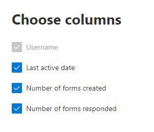

# 系統管理中心的 Microsoft 365 報告-表單活動

Microsoft 365 **報告** 儀表板會向您顯示組織中各產品的活動概況。 此功能可讓您深入了解個別產品層級報告，更加深入解析各產品內的活動。 請參閱[報告概觀主題](activity-reports.md)。
  
例如，您可以查看使用者與表單的互動，以瞭解授權使用 Microsoft Forms 的每位使用者的活動。 它也可協助您瞭解所建立的共同作業層級，方法是查看使用者所建立及表單的表單數目。
  
> [!NOTE]
> 您必須是 Microsoft 365 中的全域系統管理員、全域讀取者或報告讀取器、Exchange、SharePoint、小組服務、小組通訊或商務用 Skype 系統管理員，才能查看報告。  
 
## 如何取得表單活動報告

1. 在系統管理中心中，移至 **[報告]** \> <a href="https://go.microsoft.com/fwlink/p/?linkid=2074756" target="_blank">[使用量]</a> 頁面。 
2. 在 [儀表板] 主頁上，按一下表單卡片上的 [ **View more** ] 按鈕。
  
## 轉譯表單活動報告

您可以選擇 [ **活動** ] 索引標籤，以查看表單報告中的活動。 

選取 **[選擇欄位** ]，以新增或移除報告中的欄。    

您也可以選取 [ **匯出** ] 連結，將報告資料匯出至 Excel .csv 檔案。 這會匯出所有使用者的資料，並可讓您進行簡單的排序和篩選，以便進一步分析。 如果您的使用者少於 2000 個，您可以直接在報告中的表格內進行排序和篩選。 如果您的使用者多於 2000 個，則需要匯出資料才能進行排序和篩選。 
  
|項目|描述|
|:-----|:-----|
|**計量**|**定義**|
|使用者名稱    |在 Microsoft Forms 上執行活動之使用者的電子郵件地址。    |
|上次活動日期 (UTC)     |最近一天使用者在選取的日期範圍中執行表單活動的日期。 若要查看特定日期發生的活動，請直接選取圖表中的日期。  這會篩選表格，僅針對在該特定日執行活動的使用者，顯示檔活動資料。    |
|建立的表單數目    |使用者建立的表單數目。     |
|已回應表單數目    |使用者向其提交回應的表單數目。|
|||
