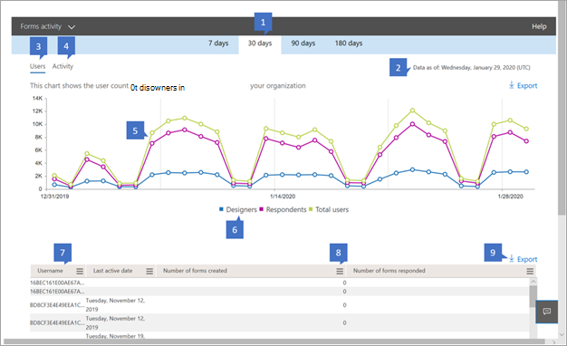

# 系統管理中心的 Microsoft 365 報告-表單活動Microsoft 365 Reports in the admin center - Forms activity

Microsoft 365 **報告** 儀表板會向您顯示組織中各產品的活動概況。The Microsoft 365 **Reports** dashboard shows you the activity overview across the products in your organization. 此功能可讓您深入了解個別產品層級報表，更加深入解析各產品內的活動。It enables you to drill in to individual product level reports to give you more granular insight about the activities within each product. 請參閱[報告概觀主題](activity-reports.md)。Check out [the Reports overview topic](activity-reports.md).
  
例如，您可以查看使用者與表單的互動，以瞭解授權使用 Microsoft Forms 的每位使用者的活動。For example, you can understand the activity of every user licensed to use Microsoft Forms by looking at their interaction with forms. 它也可協助您瞭解所建立的共同作業層級，方法是查看使用者所建立及表單的表單數目。It also helps you to understand the level of collaboration going on by looking at the number of forms created and forms the user responded to.
  
> [!NOTE]
> 您必須是 Microsoft 365 中的全域系統管理員、全域讀取者或報告讀取器、Exchange、SharePoint、小組服務、小組通訊或商務用 Skype 系統管理員，才能查看報告。You must be a global administrator, global reader or reports reader in Microsoft 365 or an Exchange, SharePoint, Teams Service, Teams Communications, or Skype for Business administrator to see reports. 

## 如何取得表單活動報告How to get to the Forms activity report

1. 在系統管理中心中，移至 **[報告]** \> <a href="https://go.microsoft.com/fwlink/p/?linkid=2074756" target="_blank">[使用量]</a> 頁面。In the admin center, go to the **Reports** \> <a href="https://go.microsoft.com/fwlink/p/?linkid=2074756" target="_blank">Usage</a> page.

    
2. 從 [ **選取報告** ] 下拉式清單中，選取 [ **表單** \> **活動** ]。From the **Select a report** drop-down, select **Forms** \> **activity** .

## 轉譯表單活動報告Interpret the forms activity report

您可以查看 [ **活動** ] 和 [ **使用者** ] 圖表，以取得使用者的表單活動。You can get a view into your user's forms activity by looking at the **Activity** and **Users** charts. 

|項目Item|描述Description|
|:-----|:-----|
|1.1.    |**表單活動** 報告可查看過去7天、30天、90天或180天的趨勢。The **Forms activity** report can be viewed for trends over the last 7 days, 30 days, 90 days, or 180 days. 不過，如果您在報告中選取某一天，則 table (7) 會從目前的日期顯示最多28天的資料， (不是) 產生報表的日期。However, if you select a particular day in the report, the table (7) will show data for up to 28 days from the current date (not the date the report was generated).    |
|2.2.    |每個報告中的資料通常會涵蓋過去24到48小時。The data in each report usually covers up to the last 24 to 48 hours.    |
|3.3.    |[ **使用者** ] 視圖可協助您瞭解作用中表單使用者數目的趨勢。The **Users** view helps you to understand the trend in the number of active forms users. 如果使用者已在表單 (建立、編輯、查看等等 ) 或在特定期間內回應表單，則會被視為作用中的使用者。A user is considered active if he or she has executed an activity around a form (create, edit, view, etc.) or responded to a form within the specific time period.    |
|4.4.    |[ **活動** ] 視圖可協助您瞭解作用中使用者數目的趨勢。The **Activity** view helps you to understand the trend in the number of active users. 使用者在指定的期間內若曾經執行過檔案活動 (儲存、同步處理、修改或共用) 或瀏覽過頁面，就會被視為作用中使用者。A user is considered active if he or she has executed a file activity (save, sync, modify, or share) or visited a page within the specific time period.  附注：單一表單的活動可能會發生多次，但是只會計為一個作用中的表單。NOTE: An activity can occur multiple times for a single form, but will count only as one active form. 例如，您可以建立表單，並在指定的時間週期內繼續編輯相同表單，但它只會算作一個單一表單。For example, you can create a form and continue to edit the same form multiple times over a specified time period, but it will count only as one single form. 不過，如果使用者已送出相同表單的多個回應，則每個回應仍會是個別回應，因此會進行多次計數。However if a user submitted multiple responses for the same form, each response would still be an individual response and thus be counted multiple times.   |
|5.5. |在 [ **使用者** ] 圖表上，Y 軸是唯一使用者的數目。On the **Users** chart, the Y axis is the number of unique users. X 座標軸是唯一使用中使用者的日期。X axis is the date that the unique users are active on. 圖例如下：The legends are:  **設計者** 表示使用者已建立或編輯表單。**Designers** means the user has created or edited a form. **回應** 方表示使用者已提交 (s) 表單的回應。**Responders** means that the user has submitted response(s) to a form.  [ **使用者總數** ] 表示公司中的任何人，都是設計者或回應者。**Total users** means anyone in the company who has been a designer or responder.   在 [ **活動** ] 圖表上，Y 軸是唯一表單或回應的計數。On the **Activity** chart, the Y axis is the count of unique forms or responses. X 座標軸是指發生表單或回應活動的日期。X axis is the date that the form or response activity occurred. 圖例如下：The legends are:  [ **建立表單** ] 是使用者所建立之獨特表單的計數。**Forms created** is the count of unique forms that the users have created.  [ **已登入] 回應** 組織中的使用者已收到已登入回應的計數。**Signed in responses** the count of signed in responses the users in the organization have received.  **匿名回應** 是組織中的使用者已接收的匿名回應計數。**Anonymous responses** is the count of anonymous responses the users in the organization have received.  |
|6.6. |您可以選取圖例中的專案，以篩選您在圖表上看到的數列。You can filter the series you see on the chart by selecting an item in the legend. 例如，在 [使用者] 圖表上，選取 [設計者]、[回應者] 或 [總計使用者]，以查看只與各項相關的資訊。For example, on the Users chart, select designers, responders, or total users to see only the info related to each one. 變更此選取專案並不會變更下方格線表格中的資訊。Changing this selection doesn't change the info in the grid table below it.|
|7.7. |下表顯示每個使用者層級的活動明細。The table shows you a breakdown of the activities at the per-user level. 圖例如下：The legends are:  **Username** 是在 Microsoft Forms 上執行活動之使用者的電子郵件地址。**Username** is the email address of the user who performed the activity on Microsoft Forms. [ **上次活動日期 (UTC)** 是使用者為選取的日期範圍執行表單活動的最晚日期。**Last activity date (UTC)** is the latest date a form activity was performed by the user for the selected date range. 若要查看特定日期發生的活動，請直接選取圖表中的日期。To see activity that occurred on a specific date, select the date directly in the chart.  這會篩選表格，僅針對在該特定日執行活動的使用者，顯示檔活動資料。This will filter the table to display file activity data only for users who performed the activity on that specific day.  [ **建立的表單數目** ] 是使用者建立的表單數目。**Number of forms created** is the number of forms that the user created.  「 **表單回應數目** 」是使用者送出回應的表單數目。**Number of forms responded** is the number of forms that the user has submitted responses to.|
|8.8. |選取 [ **管理欄** ] 圖示，以新增或移除報告中的欄。Select the **Manage columns** icon to add or remove columns from the report.|
|9.9. |您也可以選取 [ **匯出** ] 連結，將報告資料匯出至 Excel .csv 檔案。You can also export the report data into an Excel .csv file by selecting the **Export** link. 這會匯出所有使用者的資料，並可讓您進行簡單的匯總、排序及篩選，以進行進一步的分析。This exports data for all users and enables you to do simple aggregation, sorting and filtering for further analysis. 如果您的使用者少於100個，您可以在報表本身的資料表中進行排序和篩選。If you have fewer than 100 users, you can sort and filter within the table in the report itself. 如果您有超過100的使用者，為了進行篩選和排序，您將需要匯出資料。If you have more than 100 users, in order to filter and sort, you will need to export the data.|