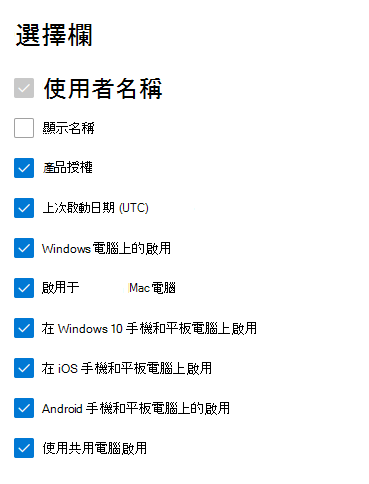

# Admin center 中的 microsoft 365 報告-Microsoft Office 啟用Microsoft 365 Reports in the admin center - Microsoft Office activations

Microsoft 365 **報告** 儀表板會向您顯示組織中各產品的活動概況。The Microsoft 365 **Reports** dashboard shows you the activity overview across the products in your organization. 此功能可讓您深入了解個別產品層級報表，更加深入解析各產品內的活動。It enables you to drill in to individual product level reports to give you more granular insight about the activities within each product. 請參閱[報告概觀主題](activity-reports.md)。Check out [the Reports overview topic](activity-reports.md).
  
您可從 [Office 啟用] 報告中檢視哪些使用者至少已在一部裝置上啟用其 Office 訂閱。The Office Activation report gives you a view of which users have activated their Office subscription on at least one device. 它可提供 Microsoft 365 應用程式（適用于企業、Project 和 Visio Pro for Office 365 訂閱）的細目分類，以及在桌面和裝置上進行的啟動細分。It provides a breakdown of the Microsoft 365 Apps for enterprise, Project, and Visio Pro for Office 365 subscription activations, as well as the breakdown of activations across desktop and devices. 此報告有助您找出可能需要額外協助的使用者，並支援他們啟用其 Office 訂閱。This report could be useful in helping you identify users that might need additional help and support to activate their Office subscription.
  
> [!NOTE]
> 您必須是 Microsoft 365 中的全域系統管理員、全域讀取者或報告讀取器、Exchange、SharePoint、小組服務、小組通訊或商務用 Skype 系統管理員，才能查看報告。You must be a global administrator, global reader or reports reader in Microsoft 365 or an Exchange, SharePoint, Teams Service, Teams Communications, or Skype for Business administrator to see reports.  
  
## 如何查看 Office 啟用報告How to get to the Office activations report

1. 在系統管理中心中，移至 **[報告]** \> <a href="https://go.microsoft.com/fwlink/p/?linkid=2074756" target="_blank">[使用量]</a> 頁面。In the admin center, go to the **Reports** \> <a href="https://go.microsoft.com/fwlink/p/?linkid=2074756" target="_blank">Usage</a> page. 
2. 在 [儀表板] 主頁上，按一下 Office 啟用卡片上的 [ **View more** ] 按鈕。From the dashboard homepage, click on the **View more** button on the Office activations card.
  
## 解讀 Office 啟用報告Interpret the Office activations report
  
您可以選擇 [ **啟用] 索引** 標籤，在 Office 365 報告中查看啟用。You can view the activations in the Office 365 report by choosing the **Activations** tab. 

選取 **[選擇欄位** ]，以新增或移除報告中的欄。Select **Choose columns** to add or remove columns from the report.    

您也可以選取 [ **匯出** ] 連結，將報告資料匯出至 Excel .csv 檔案。You can also export the report data into an Excel .csv file by selecting the **Export** link. 這會匯出所有使用者的資料，並可讓您進行簡單的排序和篩選，以便進一步分析。This exports data of all users and enables you to do simple sorting and filtering for further analysis. 如果您的使用者少於 2000 個，您可以直接在報告中的表格內進行排序和篩選。If you have less than 2000 users, you can sort and filter within the table in the report itself. 如果您的使用者多於 2000 個，則需要匯出資料才能進行排序和篩選。If you have more than 2000 users, in order to filter and sort, you will need to export the data. 

|項目Item|描述Description|
|:-----|:-----|
|**計量****Metric**|**定義****Definition**|
|使用者名稱Username    |使用者的電子郵件地址。The email address of the user.    |
|顯示名稱Display name    |使用者的完整名稱。The full name of the user.    |
|產品授權Product licenses    |指派給此使用者的產品。The products that are assigned to this user.    |
|上次啟動日期 (UTC) Last activated date(UTC)    |使用者在桌面機或裝置上啟用 Office 的日期。The date the user activated Office on a desktop or a device.    |
|Windows 電腦上的啟用Activation on Windows computers    |使用者啟用 Office 的 Windows 桌面數目。The number of Windows desktops a user activated Office on.    |
|在 Mac 電腦上啟用Activation on Mac computers   |使用者啟用 Office 的 Mac 桌面數目。The number of Mac desktops a user activated Office on.|
|在 Windows 10 手機和平板電腦上啟用Activation on Windows 10 phones and tablets    |使用者在其上啟用 Office 的 Windows 10 行動裝置數目。The number of Windows 10 mobile devices a user activated Office on.    |
|在 iOS 手機和平板電腦上啟用Activation on iOS phones and tablets    |使用者啟用 Office 的 iOS 裝置數目。The number of iOS devices a user activated Office on.|
|Android 手機和平板電腦上的啟用Activation on Android phones and tablets    |使用者啟用 Office 的 Android 裝置數目。The number of Android devices a user activated Office on.    |
|使用共用電腦啟用Used Shared Computer Activation |如果使用者透過共用電腦啟用來使用 Office，則為 true。This is true if the user used Office through shared computer activation.|
|||
   