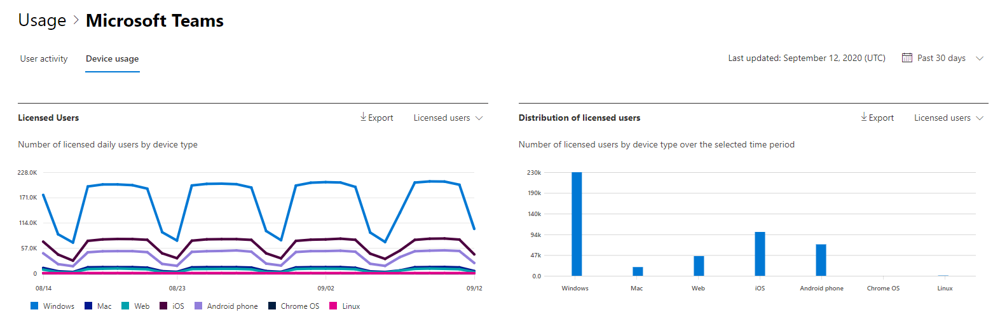

# 系統管理中心的 microsoft 365 報告-Microsoft 團隊裝置使用量

Microsoft 365 **報告** 儀表板會向您顯示組織中各產品的活動概況。 此功能可讓您深入了解個別產品層級報表，更加深入解析各產品內的活動。 請參閱[報告概觀主題](activity-reports.md)。 在 Microsoft Teams App 使用情況報告，您能夠深入了解組織中的 Microsoft Teams App 使用情形。
  
> [!NOTE]
> 您必須是 Microsoft 365 中的全域系統管理員、全域讀取者或報告讀取器、Exchange、SharePoint、小組服務、小組通訊或商務用 Skype 系統管理員，才能查看報告。  
 
## 如何取得 Microsoft Teams App 使用情況報告

1. 在系統管理中心中，移至 **[報告]** \> <a href="https://go.microsoft.com/fwlink/p/?linkid=2074756" target="_blank">[使用量]</a> 頁面。 
2. 在 [儀表板] 主頁上，按一下 [Microsoft 小組] 活動卡片上的 [ **View more** ] 按鈕。
  
## 解讀 Microsoft Teams App 使用情況報告

您可以選擇 [ **裝置使用狀況** ] 索引標籤，在 [小組] 報告中查看裝置使用方式。 

選取 **[選擇欄位** ]，以新增或移除報告中的欄。    

您也可以選取 [ **匯出** ] 連結，將報告資料匯出至 Excel .csv 檔案。 這會匯出所有使用者的資料，並可讓您進行簡單的排序和篩選，以便進一步分析。 如果您的使用者少於 2000 個，您可以直接在報告中的表格內進行排序和篩選。 如果您的使用者多於 2000 個，則需要匯出資料才能進行排序和篩選。 
  
|項目|描述|
|:-----|:-----|
|**計量**|**定義**|
|使用者名稱    |使用者的顯示名稱。    |
|Windows    |如果使用者是在 Windows 電腦上的小組桌面用戶端中使用中，則選取此選項。    |
|Mac    |如果使用者是在 macOS 電腦上的小組桌面用戶端使用中，則選取此選項。    |
|iOS    |如果使用者在 iOS 的團隊行動用戶端使用中，則選取此選項。    |
|Android 手機    | 如果使用者在適用于 Android 的團隊行動用戶端使用中，則為選取狀態。    |
|Chrome 作業系統    |如果使用者是在 ChromeOS 電腦上的團隊桌面用戶端使用中，則選取此選項。|
|Linux    | 如果使用者是在 Linux 電腦上的小組桌面用戶端中使用中，則選取此選項。    |
|網址    |如果使用者是在裝置上的小組網頁用戶端使用中，則選取此選項。|
|上次活動日期 (UTC)     |使用者參與小組活動的最後一個日期 (UTC) 。    |
|已授權|如果使用者授權使用小組，則選取此選項。|
|||