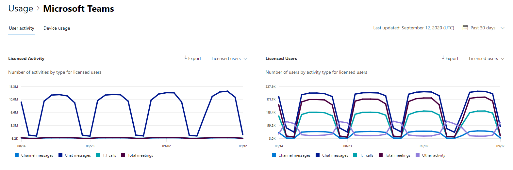
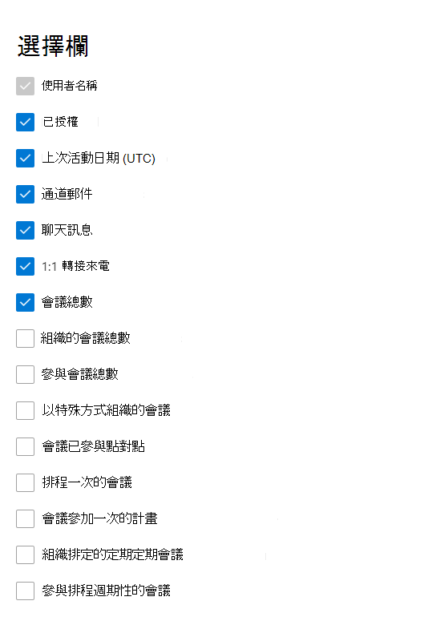

# 系統管理中心的 microsoft 365 報告-Microsoft 團隊使用者活動

Microsoft 365 **報告** 儀表板會向您顯示組織中各產品的活動概況。 此功能可讓您深入了解個別產品層級報表，更加深入解析各產品內的活動。 請參閱[報告概觀主題](activity-reports.md)。 在 Microsoft Teams 使用者活動報告，您能夠深入了解組織中的 Microsoft Teams 活動情形。
  
> [!NOTE]
> 您必須是 Microsoft 365 中的全域系統管理員、全域讀取者或報告讀取器、Exchange、SharePoint、小組服務、小組通訊或商務用 Skype 系統管理員，才能查看報告。  
 
## 如何取得 Microsoft Teams 使用者活動報告

1. 在系統管理中心中，移至 **[報告]** \> <a href="https://go.microsoft.com/fwlink/p/?linkid=2074756" target="_blank">[使用量]</a> 頁面。
2. 在 [儀表板] 主頁上，按一下 [Microsoft 小組] 活動卡片上的 [ **View more** ] 按鈕。

## 解讀 Microsoft Teams 使用者活動報告

您可以選擇 [ **使用者活動** ] 索引標籤，以查看小組報表中的使用者活動。  

選取 **[選擇欄位** ]，以新增或移除報告中的欄。    

您也可以選取 [ **匯出** ] 連結，將報告資料匯出至 Excel .csv 檔案。 這會匯出所有使用者的資料，並可讓您進行簡單的排序和篩選，以便進一步分析。 如果您的使用者少於 2000 個，您可以直接在報告中的表格內進行排序和篩選。 如果您的使用者多於 2000 個，則需要匯出資料才能進行排序和篩選。 **音訊時間**、**影片時間** 和 **螢幕共用時間** 的匯出格式會遵循 ISO8601 持續時間格式。

您可以針對過去7天、30天、90天或180天的趨勢，查看 **Microsoft 團隊使用者活動** 報告。 不過，如果您在報告中選取某一天，則 table (7) 會從目前的日期顯示最多28天的資料， (不是) 產生報表的日期。

為了確保資料品質，我們會在過去三天執行每日資料驗證檢查，並填入偵測到的任何空隙。 在處理過程中，您可能會發現歷史資料的差異。

|項目|描述|
|:-----|:-----|
|**計量**|**定義**|
|使用者名稱    |使用者的電子郵件地址。 您可以顯示實際的名稱，也可以讓此欄位匿名。     |
|通道郵件     |使用者在指定期間內于小組聊天中張貼的唯一郵件數目。    |
|聊天訊息     |使用者在指定期間內，于私人聊天中張貼的唯一郵件數目。    |
|會議總數     |使用者在指定期間內參與的線上會議數目。    |
|1:1 通話     | 使用者在指定期間內參與的1:1 通話數目。    |
|上次活動日期 (UTC)     |使用者參與 Microsoft 小組活動的最後日期。  |
|會議已參與點對點     | 使用者在指定期間內參與的 ad hoc 會議數目。    |
|以特殊方式組織的會議   |使用者在指定期間內組織的特定會議的數目。  |
|組織的會議總數    |在指定期間內，使用者所組織的排程、週期性、臨時及未分類會議的總和。    |
|參與會議總數    |使用者在指定期間內參與的一次性排程、週期性、臨時及未分類會議的總數。    |
|排程一次的會議    |使用者在指定期間內組織的一次性排程會議數目。    |
|組織排定的定期定期會議    |使用者在指定期間內組織的週期性會議數目。    |
|會議參加一次的計畫    |使用者在指定期間內參與的單一時間排程會議數目。    |
|參與排程週期性的會議    |使用者在指定期間內參與的週期性會議數目。    |
|已授權    |如果使用者授權使用小組，則選取此選項。  |
|其他活動   |使用者已在使用中，但已執行其他活動，而不是在報告中提供的動作類型 (傳送或回復通道郵件和聊天訊息、排程或參與1:1 通話和會議) 。 範例動作是使用者變更小組狀態或小組狀態訊息或開啟通道郵件時，但不會回復。   |
|未分類的會議  |無法分類為排程或週期性或臨時的一種。 因為遙測資訊遭到篡改，所以這些號碼很短，大部分無法識別。 |
|||