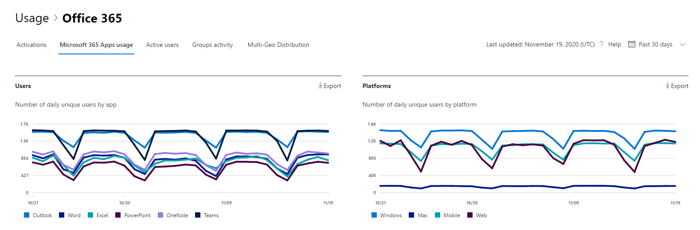

# Admin center 中的 microsoft 365 報告-Microsoft 365 應用程式使用量Microsoft 365 Reports in the admin center - Microsoft 365 Apps usage

Microsoft 365 **報告** 儀表板會向您顯示組織中各產品的活動概況。The Microsoft 365 **Reports** dashboard shows you the activity overview across the products in your organization. 此功能可讓您深入了解個別產品層級報表，更加深入解析各產品內的活動。It enables you to drill in to individual product level reports to give you more granular insight about the activities within each product. 請參閱[報告概觀主題](activity-reports.md)。Check out [the Reports overview topic](activity-reports.md).

 例如，您可以查看使用者在應用程式中的活動，以及如何在平臺上使用這些應用程式，來瞭解每個使用者授權使用 Microsoft 365 App 應用程式的活動。For example, you can understand the activity of each user licensed to use Microsoft 365 Apps apps by looking at their activity across the apps and how they are utilized across platforms.

 > [!NOTE]
 > 您必須是 Microsoft 365 或 Exchange、SharePoint 或商務用 Skype 系統管理員的全域系統管理員、全域讀取器或報告讀取器，才能查看報告。You must be a global administrator, global reader or reports reader in Microsoft 365 or an Exchange, SharePoint, or Skype for Business administrator to see reports.

## 如何取得 Microsoft 365 應用程式使用方式報告How to get to the Microsoft 365 Apps usage report

1. 在系統管理中心中，移至 **[報告]** \> <a href="https://go.microsoft.com/fwlink/p/?linkid=2074756" target="_blank">[使用量]</a> 頁面。In the admin center, go to the **Reports** \> <a href="https://go.microsoft.com/fwlink/p/?linkid=2074756" target="_blank">Usage</a> page. 
2. 在 [儀表板] 主頁上，按一下 [作用中使用者]-Microsoft 365 App 卡片上的 [ **View more** ] 按鈕。From the dashboard homepage, click on the **View more** button on the Active users - Microsoft 365 Apps card.

## 解讀 Microsoft 365 應用程式使用方式報告Interpret the Microsoft 365 Apps usage report

您可以查看 [ **使用者** ] 和 [ **平臺** ] 圖表，以取得使用者的 Microsoft 365 應用程式活動。You can get a view into your user's Microsoft 365 Apps activity by looking at the **Users** and **Platform** charts.

|項目Item|描述Description|
 |:-----|:-----|
 |1.1.   |**Microsoft 365 應用程式使用方式** 報告可查看過去7天、30天、90天或180天的趨勢。The **Microsoft 365 Apps usage** report can be viewed for trends over the last 7 days, 30 days, 90 days, or 180 days. 不過，如果您在報告中選取某一天，則 table (7) 會從目前的日期顯示最多28天的資料， (不是) 產生報表的日期。However, if you select a particular day in the report, the table (7) will show data for up to 28 days from the current date (not the date the report was generated).   |
 |2.2.   |每個報告中的資料通常會涵蓋過去7天。The data in each report usually covers up to the last seven days.   |
 |3.3.   |[ **使用者** ] 視圖會顯示每個應用程式的作用中使用者數目的趨勢-Outlook、Word、Excel、PowerPoint、OneNote 和團隊。The **Users** view shows the trend in the number of active users for each app – Outlook, Word, Excel, PowerPoint, OneNote, and Teams. 「作用中使用者」是指任何在這些應用程式中執行任何故意動作的使用者。"Active users" are any who perform any intentional actions within these apps.   |
 |4.4.   |[ **平臺** ] 視圖會顯示每個平臺（Windows、Mac、Web 及行動裝置）上的每個應用程式中使用中使用者的趨勢。The **Platforms** view shows the trend of active users across all apps for each platform – Windows, Mac, Web, and Mobile.   |
 |5.5. |在 [ **使用者** ] 圖表上，Y 軸是個別應用程式的唯一作用中使用者數目。On the **Users** chart, the Y-axis is the number of unique active users for the respective app. 在 [ **平臺**]   圖表上，Y 軸是個別平臺的唯一使用者數目。On the **Platforms** chart, the Y-axis is the number of unique users for the respective platform. 這兩張圖表的 X 軸都是在指定的平臺上使用應用程式的日期。The X-axis on both charts is the date on which an app was used on a given platform. |
 6.6. |您可以選取圖例中的專案，以篩選您在圖表上看到的數列。You can filter the series you see on the chart by selecting an item in the legend. 例如，在 [ **使用者** ] 圖表上，選取 [Outlook]、[Word]、[PowerPoint Excel]、[OneDrive] 或 [小組]，以查看只與各項相關的資訊。For example, on the **Users** chart, select Outlook, Word, Excel, PowerPoint, OneDrive, or Teams to see only the info related to each one. 變更此選取專案並不會變更下方格線表格中的資訊。Changing this selection doesn't change the info in the grid table below it.|
 |7.7. |表格顯示每個使用者層級的資料明細。The table shows you a breakdown of data at the per-user level. 您可以新增或移除表格中的欄位。You can add or remove columns from the table.   **Username** 是在 Microsoft app 上執行活動之使用者的電子郵件地址。**Username** is the email address of the user who performed the activity on Microsoft Apps.  **上次啟用日期 (UTC)** 是使用者啟用其 Microsoft 365 應用程式訂閱的最晚日期。**Last activation date (UTC)** is the latest date on which the user activated their Microsoft 365 Apps subscription.  **上次活動日期 (UTC)** 是使用者執行有意活動的最晚日期。**Last activity date (UTC)** is the latest date an intentional activity was performed by the user. 若要查看特定日期發生的活動，請直接選取圖表中的日期。To see activity that occurred on a specific date, select the date directly in the chart.  其他欄會識別使用者在該平臺上是否有作用中的使用者，該應用程式 (于所選期間365內) 中的應用程式。The other columns identify if the user was active on that platform for that app (within Microsoft 365 Apps) in the period selected. |
 |8.8. |選取 [ **選擇欄** ] 圖示，以新增或移除報告中的欄。Select the **Choose columns** icon to add or remove columns from the report.|
 |9.9. |您也可以選取 [ **匯出** ] 連結，將報告資料匯出至 Excel .csv 檔案。You can also export the report data into an Excel .csv file by selecting the **Export** link. 這會匯出所有使用者的資料，並可讓您進行簡單的匯總、排序及篩選，以進行進一步分析。This exports data for all users and enables you to do simple aggregation, sorting, and filtering for further analysis. 如果您的使用者少於100，您可以在報表本身的資料表中進行排序和篩選。If you have less than 100 users, you can sort and filter within the table in the report itself. 如果您有超過100的使用者，為了進行篩選和排序，您將需要匯出資料。If you have more than 100 users, in order to filter and sort, you will need to export the data.|
