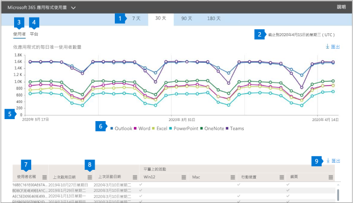

# Admin center 中的 microsoft 365 報告-Microsoft 365 應用程式使用量

Microsoft 365**報告**儀表板會向您顯示組織中各產品的活動概況。 此功能可讓您深入了解個別產品層級報表，更加深入解析各產品內的活動。 請參閱[報告概觀主題](activity-reports.md)。

 例如，您可以查看使用者在應用程式中的活動，以及如何在平臺上使用這些應用程式，來瞭解每個使用者授權使用 Microsoft 365 App 應用程式的活動。

 > [!NOTE]
 > 您必須是 Microsoft 365 或 Exchange、SharePoint 或商務用 Skype 系統管理員的全域系統管理員、全域讀取器或報告讀取器，才能查看報告。

## 如何取得 Microsoft 365 應用程式使用方式報告

1. 在系統管理中心中，移至 **[報告]** \> <a href="https://go.microsoft.com/fwlink/p/?linkid=2074756" target="_blank">[使用量]</a> 頁面。

 2. 從 [**選取報告**] 下拉式清單中，選取 [ **Office 365**   \>  **Microsoft 365 應用程式使用量**]。

## 解讀 Microsoft 365 應用程式使用方式報告

您可以查看 [**使用者**] 和 [**平臺**] 圖表，以取得使用者的 Microsoft 365 應用程式活動。

|||
 |:-----|:-----|
 |1.   |**Microsoft 365 應用程式使用方式**報告可查看過去7天、30天、90天或180天的趨勢。 不過，如果您在報告中選取某一天，表格（7）將會從目前的日期顯示最多28天的資料（不是報告產生的日期）。   |
 |2.   |每個報告中的資料通常會涵蓋過去24到48小時。   |
 |3.   |[**使用者**view iew] 會顯示每個應用程式的作用中使用者數目的趨勢-Outlook、Word、Excel、PowerPoint、OneNote 和團隊。 「作用中使用者」是指任何在這些應用程式中執行任何故意動作的使用者。   |
 |4.   |[**平臺**] 視圖會顯示每個平臺（Windows、Mac、Web 及行動裝置）上的每個應用程式中使用中使用者的趨勢。   |
 |5. |在 [**使用者**] 圖表上，Y 軸是個別應用程式的唯一作用中使用者數目。 在 [ **平臺**]   圖表上，Y 軸是個別平臺的唯一使用者數目。 這兩張圖表的 X 軸都是在指定的平臺上使用應用程式的日期。 rm。 |
 6. |您可以選取圖例中的專案，以篩選您在圖表上看到的數列。 例如，在 [**使用者**] 圖表上，選取 [Outlook]、[Word]、[PowerPoint Excel]、[OneDrive] 或 [小組]，以查看只與各項相關的資訊。 變更此選取專案並不會變更下方格線表格中的資訊。|
 |7. |表格顯示每個使用者層級的資料明細。 您可以新增或移除表格中的欄位。   **Username**是在 Microsoft app 上執行活動之使用者的電子郵件地址。  **[上次啟用日期（UTC）** ] 是使用者啟用其 Microsoft 365 應用程式訂閱的最晚日期。  **[上次活動日期（UTC）** ] 是指使用者有意執行活動的最晚日期。 若要查看特定日期發生的活動，請直接選取圖表中的日期。  對應至每個應用程式的下列各欄，識別使用者在該應用程式中所選期間內是否為作用中：   **Outlook**  **Word**  **Excel** **PowerPoint**  **OneNote**   下列對應于每個平臺的各欄，識別所選期間內的任何應用程式在該平臺上是否為使用中（Microsoft 365 應用程式內）的使用者：  **Outlook （Windows）** **Outlook （Mac）** **Outlook （Web）**  **Outlook （Mobile）**  **Word （Windows）**  **Word （Mac）**  **Word （Web）**  **Word （Mobile）**  **Excel （Windows）**  **Excel （Mac）**  **Excel （Web）**  **Excel （Mobile）**  **PowerPoint （Windows）**  **PowerPoint （Mac）** **PowerPoint （Web）**  **PowerPoint （行動裝置）**  **OneNote （Windows）**  **OneNote （Mac）**  **OneNote （Web）** **OneNote （行動裝置）**  **小組（Windows）**  **小組（Mac）**  **小組（Web）** **小組（行動裝置）** |
 |8. |選取 [**管理欄**] 圖示，以新增或移除報告中的欄。|
 |9. |您也可以選取 [**匯出**] 連結，將報告資料匯出至 Excel .csv 檔案。 這會匯出所有使用者的資料，並可讓您進行簡單的匯總、排序及篩選，以進行進一步的分析。 如果您的使用者少於100，您可以在報表本身的資料表中進行排序和篩選。 如果您有超過100的使用者，為了進行篩選和排序，您將需要匯出資料。|