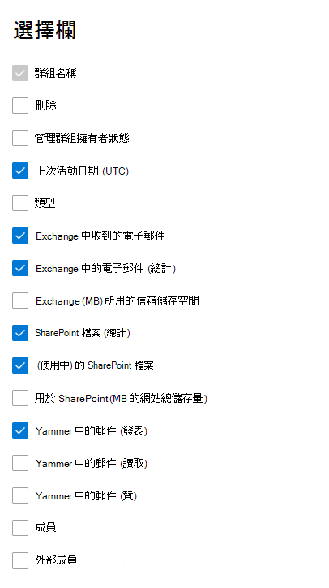

# Admin center 中的 microsoft 365 報告-Microsoft 365 群組Microsoft 365 Reports in the admin center - Microsoft 365 groups

Microsoft 365 **報告** 儀表板會向您顯示組織中各產品的活動概況。The Microsoft 365 **Reports** dashboard shows you the activity overview across the products in your organization. 此功能可讓您深入了解個別產品層級報表，更加深入解析各產品內的活動。It enables you to drill in to individual product level reports to give you more granular insight about the activities within each product. 請參閱[報告概觀主題](activity-reports.md)。Check out [the Reports overview topic](activity-reports.md). 在 [Microsoft 365 群組報告] 中，您可以深入瞭解組織中群組的活動，並查看已建立及使用的群組數目。In the Microsoft 365 groups report, you can gain insights into the activity of groups in your organization and see how many groups are being created and used.
  
> [!NOTE]
> 您必須是 Microsoft 365 中的全域系統管理員、全域讀取者或報告讀取器、Exchange、SharePoint、小組服務、小組通訊或商務用 Skype 系統管理員，才能查看報告。You must be a global administrator, global reader or reports reader in Microsoft 365 or an Exchange, SharePoint, Teams Service, Teams Communications, or Skype for Business administrator to see reports.  
  
## 如何取得群組報告How to get to the groups report

1. 在系統管理中心中，移至 **[報告]** \> <a href="https://go.microsoft.com/fwlink/p/?linkid=2074756" target="_blank">[使用量]</a> 頁面。In the admin center, go to the **Reports** \> <a href="https://go.microsoft.com/fwlink/p/?linkid=2074756" target="_blank">Usage</a> page. 
2. 在 [儀表板] 主頁上，按一下 [作用中的使用者-Microsoft 365 應用程式] 或 [作用中使用者]-Microsoft 365 服務卡片上的 [ **View more** ] 按鈕，以取得 Office 365 報告頁面。From the dashboard homepage, click on the **View more** button on the Active users - Microsoft 365 Apps or the Active users - Microsoft 365 Services card to get to the Office 365 report page.
  
## 轉譯群組報告Interpret the groups report

您可以選擇 [群組] [ **活動** ] 索引標籤，在 Office 365 報告中查看啟用。You can view the activations in the Office 365 report by choosing the **Groups activity** tab. 

選取 **[選擇欄位** ]，以新增或移除報告中的欄。Select **Choose columns** to add or remove columns from the report.    

您也可以選取 [ **匯出** ] 連結，將報告資料匯出至 Excel .csv 檔案。You can also export the report data into an Excel .csv file by selecting the **Export** link. 這會匯出所有使用者的資料，並可讓您進行簡單的排序和篩選，以便進一步分析。This exports data of all users and enables you to do simple sorting and filtering for further analysis. 如果您的使用者少於 2000 個，您可以直接在報告中的表格內進行排序和篩選。If you have less than 2000 users, you can sort and filter within the table in the report itself. 如果您的使用者多於 2000 個，則需要匯出資料才能進行排序和篩選。If you have more than 2000 users, in order to filter and sort, you will need to export the data. 

|項目Item|描述Description|
|:-----|:-----|
|**計量****Metric**|**定義****Definition**|
|群組名稱Group name    |群組的名稱。The name of the group.    |
|已刪除Deleted    |已刪除的群組數目。The number of deleted groups. 如果群組已刪除，但報告期間此群組有活動，那麼它會出現在格線中並被標幟為 True。If the group is deleted, but had activity in the reporting period it will show up in the grid with this flag set to true.    |
|群組擁有者Group owner    |群組擁有者的名稱。The name of the group owner.    |
|上次活動日期 (UTC) Last activity date (UTC)    |最近一天群組收到郵件的日期。The latest date a message was received by the group. 這是電子郵件交談、Yammer 或網站上發生之活動的上次日期。- This is the latest date an activity happened in an email conversation, Yammer, or the Site.    |
|類型Type    |群組的類型。The type of group. 這可以是私人群組或公開群組。This can be private or public group.    |
|Exchange 中收到的電子郵件Emails received in Exchange    |群組接收的郵件數目。The number of messages received by the group.|
|Exchange 中的電子郵件 (總計) Emails in Exchange (total)    |群組信箱中的總專案數。The total number of items in the group's mailbox.    |
|Exchange (MB) 所用的信箱儲存空間Mailbox storage used for Exchange (MB)    |群組信箱所使用的儲存空間。The storage used by the group's mailbox.  |
|SharePoint 檔案 (總計) SharePoint files (total)    |儲存在 SharePoint 群組網站中的檔案數目。The number of files stored in SharePoint group sites.    |
| (使用中) 的 SharePoint 檔案SharePoint files (active)    |在報告期間內 (查看或修改、同步處理、內部或外部共用) 的 SharePoint 群組網站中的檔案數目。The number of files in the SharePoint group site that were acted on (viewed or modified, synched , shared internally or externally) during the reporting period.    |
|用於 SharePoint (MB 的網站總儲存量) Total site storage used for SharePoint (MB)    |報告期間使用的儲存空間（MB）。The amount of storage in MB used during the reporting period.    |
|Yammer 中的郵件 (發表) Messages in Yammer (posted)    |在報告期間內，在 Yammer 群組中張貼的郵件數目。The number of messages posted in the Yammer group over the reporting period.    |
|Yammer 中的郵件 (讀取) Messages in Yammer (read)    |在報告期間，Yammer 群組中讀取的交談數目。The number of conversations read in the Yammer group over the reporting period.    |
|Yammer 中的郵件 (贊) Messages in Yammer (liked)    |在報告期間，Yammer 群組中所贊的郵件數目。The number of messages liked in the Yammer group over the reporting period.    |
|成員Members    |群組中的成員數目。The number of members in the group.    |
|外部成員External members |群組中的外部使用者數目。The number of external users in the group.|
|||

## 相關內容Related content

在系統[管理中心的 microsoft 365 報告](activity-reports.md)中 (篇文章) [《安全性 & 合規性中心」中的報告](../../compliance/reports-in-security-and-compliance.md) (文章) 系統[管理中心的 microsoft 365 報告-作用中的使用者](../../admin/activity-reports/active-users-ww.md) (文章) [Microsoft 365 Reports in the admin center](activity-reports.md) (article) [Reports in the Security & Compliance Center](../../compliance/reports-in-security-and-compliance.md) (article) [Microsoft 365 Reports in the admin center - Active Users](../../admin/activity-reports/active-users-ww.md) (article)

