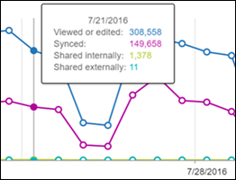

# 在系統管理中心-SharePoint 活動的 Microsoft 365 報告

身為 Microsoft 365 系統管理員在**報告**儀表板顯示您的活動概觀跨組織中各種產品。 此功能可讓您更深入解析各項產品的特定活動。 請參閱[在 Microsoft 365 系統管理中心的活動報告](activity-reports.md)。
  
例如，您可以查看每位授權使用 SharePoint 的使用者與檔案的互動，以了解他們的活動。也可以查看共用的檔案數量，幫助您了解共同作業的程度。
  
> [!NOTE]
> 一些功能會逐步地增加。這表示您可能還未見到此功能，或者功能可能與說明文章中描述的不一樣。如果您還未見到，不用擔心，功能即將推出！ 
  
如果要了解每個 SharePoint 網站的活動量和儲存空間使用情形，請檢視 [SharePoint 網站流量報告](sharepoint-site-usage.md)。
  
> [!NOTE]
> 您必須是全域系統管理員、 全域讀者或報告讀取者，在 Microsoft 365 或 Exchange、 SharePoint 或 Skype 商務系統管理員，才能查看報告。 
 
## 如何存取 SharePoint 活動報告？

1. 在系統管理中心中，移至 **[報告]** \> <a href="https://go.microsoft.com/fwlink/p/?linkid=2074756" target="_blank">[使用量]</a> 頁面。

    
2. 從 [**選取 [報告]** 下拉式清單，選取 [ **SharePoint** \> **活動**。
  
## 解讀 SharePoint 活動報告

您可以透過檢視 SharePoint 活動查看 [**檔案**] 和 [**使用者**檢視。  
  
|||
|:-----|:-----|
|1.    |**SharePoint 活動報告**可檢視的趨勢，過去 7 天、 30 天、 前 90 天或 180 天。 不過，如果您在報表中選取的特定一天，表格 (7) 將會顯示資料 28 天，從目前的日期 （不是該報告產生的日期）。    |
|2.    |每個報告中的資料通常涵蓋的最後一個 24 到 48 小時。    |
|3.    |[**檔案**] 檢視可協助您了解執行檔案儲存在 SharePoint 網站上檔案互動的授權使用者的唯一號碼。    |
|4.    |[**頁面**] 檢視會顯示使用者瀏覽之唯一頁面的數目。    |
|5.    |[**使用者**] 檢視可協助您了解在作用中使用者人數的趨勢。 使用者在指定的期間內若曾經執行過檔案活動 (儲存、同步處理、修改或共用) 或瀏覽過頁面，就會被視為作用中使用者。    附註： 單一檔案，可以發生多次檔案活動，但只會算做一個使用中檔案。 例如，您可能會在指定時間週期中多次儲存並同步處理同一個檔案，但在資料中它都只會計算為一個使用中的檔案和一個同步處理的檔案           |
|6.    | 在 [**檔案**] 圖表中，Y 軸是代表使用者曾經寫儲存、 同步處理、 修改或共用的唯一檔案計數。     在 [**使用者**] 圖表中，Y 軸是一項執行檔案互動的唯一使用者數目 （儲存、 同步處理、 修改或共用） 網站上。     在 [**頁面**] 圖表中，X 軸是使用者瀏覽唯一頁面的計數。     所有圖表中的 X 軸都代表此特定報告的所選日期範圍。    |
|7.    |您可以篩選看圖表所選取項目在圖例中的數列。 例如，在 [**檔案**] 圖表中，選取 [**檢視或編輯**，**已同步處理**、**內部共用**，或**外部共用**以查看只與其個別相關的資訊。 變更此選取項目並不會變更格線資料表中的資訊。    |
|8.    | 表格顯示每個網站層級的活動明細。       **Username**是 SharePoint 網站執行該活動之使用者的電子郵件地址。    **[上次活動日期 (UTC)** 是最新的日期執行檔案活動或頁面已瀏覽選取的日期範圍。 若要查看特定日期發生的活動，請直接選取圖表中的日期。       這會篩選表格，顯示檔案活動資料僅針對該特定日期執行該活動的使用者。     **檔案檢視或編輯**是使用者上傳、 下載、 修改或檢視的檔案數目。     **檔案同步處理**為已同步處理使用者的本機裝置從 SharePoint 網站的檔案數目。     **在內部共用的檔案**是與組織內的使用者或群組 （也可能會包括外部使用者） 內的使用者共用的檔案數目。     **外部共用的檔案**是指與組織外部使用者共用的檔案數目。     **瀏覽的頁面**是由使用者的唯一頁面的次數。     **刪除的郵件**會指出使用者的授權被移除。     **附註：** 仍會顯示已刪除的使用者活動報告中，只要曾有過授權，在選取的時間期間一些時間。 [已刪除] 欄可提醒您該名使用者可能已停止使用，但仍對報告中的資料有影響。    **已刪除日期**是在其使用者的授權被移除的日期。     **產品指派**] 是已授權給使用者的 Microsoft 365 產品。    |
|9.    |選取 [**管理欄**] 圖示來新增或移除報告中的欄。    |
|10.    |您也可以選取 [**匯出**] 連結，來匯出到 Excel.csv 檔案的報表資料。 這會匯出所有使用者的資料，並可讓您進行簡單的排序和篩選，以便進一步分析。 如果您的使用者少於 2000 位，您可以直接在報告中的表格上進行排序和篩選。 如果您的使用者多於 2000 個，則需要匯出資料才能進行排序和篩選。    |
|||
   

