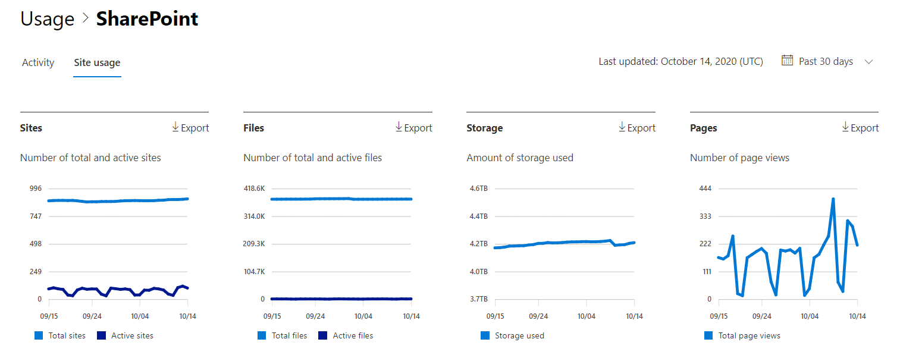

# Microsoft 365系統管理中心的報告-SharePoint 網站使用狀況Microsoft 365 Reports in the admin center - SharePoint site usage

Microsoft 365 系統管理員，「**報告**」儀表板會顯示您組織中各種產品的活動概況。As a Microsoft 365 admin, the **Reports** dashboard shows you the activity overview across various products in your organization. 此功能可讓您更深入解析各項產品的特定活動。It enables you to drill in to get more granular insight about the activities specific to each product. 例如，您可以從 SharePoint 中取得您所取得之價值的高層級視圖、使用者儲存在 SharePoint 網站中的檔案總數、使用的檔案數目，以及所有這些網站所使用的儲存空間。For example, you can get a high level view of the value you are getting from SharePoint in terms of the total number of files that users store in SharePoint sites, how many files are actively being used, and the storage consumed across all these sites. 接著，您可以深入 SharePoint 網站流量報告來了解使用趨勢，以及所有網站每個網站層級的詳細資料。Then, you can drill into the SharePoint site usage report to understand the trends and per site level details for all sites. 
  
> [!NOTE]
> 您必須是全域系統管理員、全域讀取者或報告讀取者 Microsoft 365 或 Exchange、SharePoint、Teams 服務、Teams 通訊或商務用 Skype 管理員查看報告。You must be a global administrator, global reader or reports reader in Microsoft 365 or an Exchange, SharePoint, Teams Service, Teams Communications, or Skype for Business administrator to see reports.
Microsoft 365admin center 中的報表不支援 GCC 高和 DoD 承租人。Microsoft 365 Reports in the admin center is not supported for GCC High and DoD tenants.
 
## 如何取得 SharePoint 網站使用狀況報告How to get to the SharePoint site usage report

1. 在系統管理中心中，移至 **[報告]** \> <a href="https://go.microsoft.com/fwlink/p/?linkid=2074756" target="_blank">[使用量]</a> 頁面。In the admin center, go to the **Reports** \> <a href="https://go.microsoft.com/fwlink/p/?linkid=2074756" target="_blank">Usage</a> page. 
2. 在 [儀表板] 主頁上，按一下 [SharePoint 卡片上的 [ **View more** ] 按鈕。From the dashboard homepage, click on the **View more** button on the SharePoint card.
  
## 解讀 SharePoint 網站使用量報告Interpret the SharePoint site usage report

您可以選擇 [**網站使用狀況**] 索引標籤，在 SharePoint 報告中查看網站使用狀況。You can view the site usage in the SharePoint report by choosing the **Site usage** tab. 

選取 **[選擇欄位** ]，以新增或移除報告中的欄。Select **Choose columns** to add or remove columns from the report.    

您也可以選取 [**匯出**] 連結，將報表資料匯出至 Excel .csv 檔案。You can also export the report data into an Excel .csv file by selecting the **Export** link. 這會匯出所有使用者的資料，並可讓您進行簡單的排序和篩選，以便進一步分析。This exports data of all users and enables you to do simple sorting and filtering for further analysis. 如果您的使用者少於 2000 個，您可以直接在報告中的表格內進行排序和篩選。If you have less than 2000 users, you can sort and filter within the table in the report itself. 如果您的使用者多於 2000 個，則需要匯出資料才能進行排序和篩選。If you have more than 2000 users, in order to filter and sort, you will need to export the data. 
  
|項目Item|描述Description|
|:-----|:-----|
|**計量****Metric**|**定義****Definition**|
|網站 URLSite URL    |網站的完整 URL。The full URL of the site.   |
|已刪除Deleted    |網站的刪除狀態。The deletion status of the site. 網站標示為已刪除至少需要7天。It takes at least 7 days for sites to be marked as deleted.    |
|網站擁有人Site owner    |網站主要擁有人的使用者名稱。The username of the primary owner of the site.     |
|網站擁有者主要名稱Site owner principal name    |網站擁有者的電子郵件地址。The email address of the owner of the site.   |
|上次活動日期 (UTC) Last activity date (UTC)    | 上次偵測到檔案活動的日期，或在網站上查看頁面。The date of the last time file activity was detected or a page was viewed on the site.    |
|網站敏感度標籤識別碼Site sensitivity label id    | 網站上的靈敏度標籤。The sensitivity label on the site.    |
|外部共用External sharing    | 網站上的外部可共用設定。The external sharable settings on the site.    |
|未受管理的裝置原則Unmanaged device policy    | 非管理裝置的網站存取原則。The site access policy for unmanaged devices.    |
|地理位置Geo location    | 網站的地理位置。The Geo location of the site.    |
|檔案Files    |網站上的檔數目。The number of files on the site.  |
|使用中檔Active files    | 網站上的使用中檔案數目。The number of active files on the site.  附注：如果在報告的指定期間內已移除檔案，則報告中顯示的使用中檔數目可能會大於目前網站上的檔數目。NOTE: If files were removed during the specified time period for the report, the number of active files shown in the report may be larger than the current number of files on the site.    |
|儲存體使用 (MB) Storage used (MB)    |目前在網站上使用的儲存空間量。The amount of storage currently being used on the site.   |
|儲存體分攤 (MB) Storage allocated (MB)    |為網站所分配的儲存空間上限。The maximum amount of storage allocated for the site.   |
|網頁檢視Page views    |在網站上查看頁面的次數。The number of times pages were viewed on the site.   |
|訪問的頁面Pages visited    |網站上已訪問的唯一頁面數目。The number of unique pages that were visited on the site.   |
|匿名連結計數Anonymous link count    |在網站上使用「連結的任何人都共用檔或資料夾」的次數。The number of times documents or folders are shared using "Anyone with the link" on the site.   |
|公司連結計數Company link count    |在網站上，使用「組織中的人員與連結」共用檔或資料夾的次數。The number of times documents or folders are shared using "People in org with the link" on the site.   |
|來賓計數的安全連結Secure link for guest count    |使用網站上的「特定人員」共用檔或資料夾的次數。The number of times documents or folders are shared using "specific people" on the site.   |
|成員計數的安全連結Secure link for member count    |使用網站上的「特定人員」共用檔或資料夾的次數。The number of times documents or folders are shared using "specific people" on the site.   |
|根網站範本Root Web Template    |用來建立網站的範本。The template used for creating the site.    附注：如果您想要依不同的網站類型來篩選資料，請匯出資料，並使用根 Web 範本欄。NOTE: If you want to filter the data by different site types, then export the data and use the Root Web Template column. |
|||