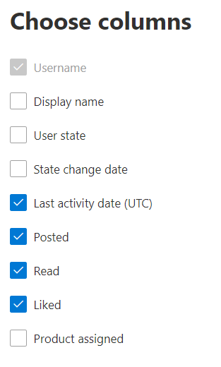

# Microsoft 365系統管理中心的報告-Yammer 活動報告

Microsoft 365 系統管理員，「**報告**」儀表板會顯示您組織內產品使用狀況的資料。 請參閱系統 [管理中心的活動報告](activity-reports.md)。 透過「 **Yammer 活動」報告**，您可以透過查看使用 Yammer 張貼的唯一使用者數目，例如或讀取郵件，以及整個組織產生的活動數量，瞭解 Yammer 組織的服務使用程度。 
  
> [!NOTE]
> 您必須是全域系統管理員、全域讀取者或報告讀取者 Microsoft 365 或 Exchange、SharePoint、Teams 服務、Teams 通訊或商務用 Skype 管理員查看報告。  
 
## 如何取得 Yammer 活動報告？

1. 在系統管理中心中，移至 **[報告]** \> <a href="https://go.microsoft.com/fwlink/p/?linkid=2074756" target="_blank">[使用量]</a> 頁面。 
2. 在 [儀表板] 主頁上，按一下 [Yammer 卡片上的 [ **View more** ] 按鈕。

  
## 解讀 Yammer 活動報告

您可以選擇 [**活動**] 索引標籤，以查看 Yammer 報告中的活動。 

選取 **[選擇欄位** ]，以新增或移除報告中的欄。    

您也可以選取 [**匯出**] 連結，將報表資料匯出至 Excel .csv 檔案。 這會匯出所有使用者的資料，並可讓您進行簡單的排序和篩選，以便進一步分析。 如果您的使用者少於 2000 個，您可以直接在報告中的表格內進行排序和篩選。 如果您的使用者多於 2000 個，則需要匯出資料才能進行排序和篩選。 
  
|項目|描述|
|:-----|:-----|
|**計量**|**定義**|
|使用者名稱    |使用者的電子郵件地址。 您可以顯示實際的名稱，也可以讓此欄位匿名。 這個格線會顯示使用 Microsoft 365 帳戶登入 Yammer 的使用者，或使用單一登入登入網路的使用者。   |
|顯示名稱    |使用者的完整名稱。 您可以顯示實際的名稱，也可以讓此欄位匿名。    |
|使用者狀態    |三個值之一：已啟用、已刪除或已暫停。 這些報告顯示作用中、已停權及已刪除的使用者。 報告不會反映出擱置中使用者，因為擱置中的使用者不能張貼訊息、閱讀訊息或對訊息按讚。    |
|狀態變更日期 (UTC)     |在 Yammer 中變更使用者狀態的日期。    |
|上次活動日期 (UTC)     | 使用者張貼、讀取或贊郵件的最後日期。    |
|張貼    |在您指定的期間內，使用者投遞的郵件數目。  |
|讀取    |使用者在您指定的期間內讀取的交談數目。    |
|喜歡    |使用者在您指定的期間內按贊的訊息數目。   |
|指派的產品    |指派給此使用者的產品。|
|||