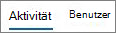

# Admin center 中的 Microsoft 365 報告-Yammer 活動報告Microsoft 365 Reports in the admin center - Yammer activity report

如 Microsoft 365 admin，「**報告**」儀表板會顯示您組織內產品使用狀況的資料。As Microsoft 365 admin, the **Reports** dashboard shows you data on the usage of the products within your organization. 請參閱系統[管理中心的活動報告](activity-reports.md)。Check out [activity reports in the admin center](activity-reports.md). 透過**Yammer 活動報告**，您可以查看使用 yammer 發佈的獨特使用者人數，例如或讀取郵件，以及整個組織產生的活動數量，以瞭解您的組織對 yammer 的參與程度。With the **Yammer Activity report**, you can understand the level of engagement of your organization with Yammer by looking at the number of unique users using Yammer to post, like or read a message and the amount of activity generated across the organization. 
  
> [!NOTE]
> 您必須是 Microsoft 365 中的全域系統管理員、全域讀取者或報告讀取器、Exchange、SharePoint、小組服務、小組通訊或商務用 Skype 系統管理員，才能查看報告。You must be a global administrator, global reader or reports reader in Microsoft 365 or an Exchange, SharePoint, Teams Service, Teams Communications, or Skype for Business administrator to see reports. 
 
## 如何取得 Yammer 活動報告How to get to the Yammer activity report

1. 在系統管理中心中，移至 **[報告]** \> <a href="https://go.microsoft.com/fwlink/p/?linkid=2074756" target="_blank">[使用量]</a> 頁面。In the admin center, go to the **Reports** \> <a href="https://go.microsoft.com/fwlink/p/?linkid=2074756" target="_blank">Usage</a> page.

    
2. 從 [**選取報告**] 下拉式清單中，選取 [ **Yammer** \> **活動**]。From the **Select a report** drop-down, select **Yammer** \> **Activity**.
  
## 解讀 Yammer 活動報告Interpret the Yammer activity report

您可以查看 [活動] 和 [使用者] 圖表以了解使用者的 Yammer 活動。You can get a view into your user's Yammer activity by looking at the Activity and Users charts.
  

  
活動報告中包含下列資訊。The activity report contains the following information.
  
- 使用 [日] 索引標籤，查看過去7天、30天、90天或180天的**Yammer 活動**報告趨勢。Use the day tabs to view the **Yammer activity** report trends over the last 7 days, 30 days, 90 days, or 180 days. 不過，如果您選取報告中的特定一天，表格會顯示從目前日期的28天內的資料（並非報告產生的日期）。However, if you select a particular day in the report, the table will show data for up to 28 days from the current date (not the date the report was generated). 
    
- 每份報告都具有報告產生時的日期。Each report has a date for when the report was generated. 報告反映出的資料通常會有 24 至 48 小時的延遲 (自活動時間起算)。The reports usually reflect a 24 to 48 hour latency from time of activity.
    
- 您可以查看 [**活動**] 圖表，以瞭解組織中的 Yammer 活動的數量趨勢。You can view the **Activity** chart to understand the trend of the amount of Yammer activity going on in your organization. 您可以了解張貼訊息、閱讀訊息及對訊息按讚的個別數據。You can understand the split of messages posted, read, or liked. 
    
    
  
  - 在 [**活動**] 圖表上，Y 軸是已張貼、讀取或贊的郵件活動計數。On the **Activity** chart, the Y axis is the count of activity of the messages posted, read, or liked. 
    
- 您可以查看 [**使用者**] 圖表，以瞭解正在產生 Yammer 活動之唯一使用者的數量趨勢。You can view the **User** chart to understand the trend of the amount of unique users who are generating the Yammer activities. 您可以查看使用者張貼、閱讀或對 Yammer 訊息按讚的趨勢。You can look at the trend of users posting, reading, or liking Yammer messages. 
    
    
  
  - 在 [**使用者**] 活動圖表中，Y 軸是使用者張貼、讀取或贊 Yammer 訊息。On the **Users** activity chart, the Y axis is the user posting, reading, or liking Yammer messages. 
    
  - 這兩份圖表的 X 軸都代表該特定報告的已選取日期範圍。The X axis on both charts is the selected date range for this specific report.
    
- 您可以選取圖例中的專案，以篩選您在圖表上看到的數列。You can filter the series you see on the chart by selecting an item in the legend. 例如，在 [**活動**] 圖表上，選取 [**已張貼**]、[已**閱讀**] 或 [**贊**]，只查看與各項相關的資訊。For example, on the **Activity** chart, select **Posted**, **Read**, or **Liked** to see only the info related to each one. 
    
    
  
    變更此選取項目並不會變更格線表格中的資訊。Changing this selection doesn't change the info in the grid table.
    
- 圖表底下的表格顯示每個使用者層級的 Yammer 活動明細。The table under the graph shows you a breakdown of the Yammer activities at the per-user level.
    
    您可以使用功能表來篩選和排序資料。You can use the menu to filter and sort the data.
    
    
  
    您也可以新增和移除欄位。You can also add and remove columns. 可用的欄位如下︰The available columns are:
    
  - [使用者**名稱**] 是使用者的電子郵件地址。**Username** is the email address of the user. 您可以顯示實際的名稱，也可以讓此欄位匿名。You can display the actual email address or make this field anonymous. 
    
    這個格線會顯示使用 Microsoft 365 帳戶登入 Yammer 的使用者，或使用單一登入登入網路的使用者。This grid shows users who logged into Yammer using the Microsoft 365 account or who logged into the network using single sign-on.
    
  - [**顯示名稱**] 是使用者的完整名稱。**Display name** is the full name of the user. 您可以顯示實際的名稱，也可以讓此欄位匿名。You can display the actual email address or make this field anonymous. 
    
  - **使用者狀態**為三個值之一：已啟動、已刪除或已暫停。**User state** is one of three values: Activated, Deleted, or Suspended. 
    
    這些報告顯示作用中、已停權及已刪除的使用者。報告不會反映出擱置中使用者，因為擱置中的使用者不能張貼訊息、閱讀訊息或對訊息按讚。These reports show data for active, suspended, and deleted users. They do not reflect pending users, because pending users cannot post, read, or like a message.
    
  - **[狀態變更日期（UTC）** ] 是在 Yammer 中變更使用者狀態的日期。**State change date (UTC)** is the date on which the user's state was changed in Yammer. 
    
  - [**上次活動日期（UTC）** ] 是指使用者投遞、讀取或贊郵件的最後日期。**Last activity date (UTC)** refers to the last date that the user posted, read, or liked a message. 
    
  - **已發佈**是使用者在您指定的期間內投遞的郵件數目。**Posted** is the number of messages the user posted during the time period you specified. 
    
  - **Read**是使用者在您指定的時段內讀取的交談數目。**Read** is the number of conversations that the user read during the time period you specified. 
    
  - **贊**是使用者在您指定的期間內按贊的郵件數目。**Liked** is the number of messages that the user liked during the time period you specified. 
    
  - 「已**指派產品**」是指派給此使用者的產品。**Product assigned** is the products that are assigned to this user. 
    
    如果貴組織的原則防止您檢視可識別之使用者資訊的報告，您可以變更所有這類報告的隱私權設定。If your organization's policies prevents you from viewing reports where user information is identifiable, you can change the privacy setting for all these reports. 請參閱[Microsoft 365 系統管理中心的活動報告中](activity-reports.md)的 [**我要如何隱藏使用者層級詳細資料？** ] 區段。Check out the **How do I hide user level details?** section in [Activity reports in the Microsoft 365 admin center](activity-reports.md).
    
- 您也可以選取 [**匯出**] 連結，將報告資料匯出至 Excel .csv 檔案。You can also export the report data into an Excel .csv file, by selecting the **Export** link. 這會匯出所有使用者的資料，並可讓您進行簡單的排序和篩選，以便進一步分析。This exports data of all users and enables you to do simple sorting and filtering for further analysis. 如果您的使用者少於 2000 個，您可以直接在報告中的表格內進行排序和篩選。If you have less than 2000 users, you can sort and filter within the table in the report itself. 如果您的使用者多於 2000 個，則需要匯出資料才能進行排序和篩選。If you have more than 2000 users, in order to filter and sort, you will need to export the data. 
    
## 這些報告中有哪些資料？What data is in these reports?

- **所有用戶端**這些報告會匯總所有用戶端上的資料，包括在瀏覽器中或在 iOS 或 Android 應用程式上使用 Yammer。**All clients** These reports aggregate data across all clients, including using Yammer in a browser or on an iOS or Android app. 
    
- **無外部網路資料**這些報告中不包含外部網路資料。**No external network data** External network data is not included in these reports. 
    
- **啟用的網路**這些報告會顯示屬於 Microsoft 365 訂閱之 Yammer 網路的資料。**Activated networks** These reports show data for the Yammer network that is part of your Microsoft 365 subscription. 圖表會匯總登入 Yammer 網路之所有使用者的使用狀況，不論他們使用的是 Microsoft 365 或 Yammer 登入。The chart aggregates usage of all users who logged into the Yammer network, irrespective of whether they used Microsoft 365 or Yammer to log in. 
    

