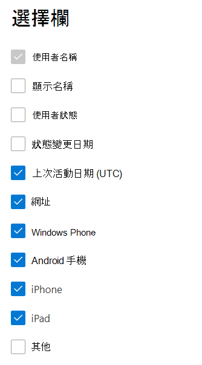

# Microsoft 365系統管理中心報告-Yammer 裝置使用方式報告Microsoft 365 Reports in the admin center - Yammer device usage report

[Microsoft 365 **報告**] 儀表板會顯示您組織中產品的活動概況。The Microsoft 365 **Reports** dashboard shows you the activity overview across the products in your organization. 此功能可讓您深入了解個別產品層級報表，更加深入解析各產品內的活動。It enables you to drill in to individual product level reports to give you more granular insight about the activities within each product. 請參閱[報告概觀主題](activity-reports.md)。Check out [the Reports overview topic](activity-reports.md).
  
Yammer 裝置使用量報告提供您的使用者在哪些裝置上使用 Yammer 的資訊。您可以依裝置類型檢視每日使用者數量和使用者數量。您可以在所選時間範圍內檢視這兩者。您也可以檢視每個使用者的詳細資料。The Yammer device usage reports give you information about which devices your users are using Yammer on. You can view the number of daily users by device type, and number of users by device type. You can view both over a selected time period. You can also view details per user.
  
> [!NOTE]
> 您必須是全域系統管理員、全域讀取者或報告讀取者 Microsoft 365 或 Exchange、SharePoint、Teams 服務、Teams 通訊或商務用 Skype 管理員查看報告。You must be a global administrator, global reader or reports reader in Microsoft 365 or an Exchange, SharePoint, Teams Service, Teams Communications, or Skype for Business administrator to see reports.  
 
## 如何取得 Yammer 裝置使用量報告？How do I get to the Yammer device usage report?

1. 在系統管理中心中，移至 **[報告]** \> <a href="https://go.microsoft.com/fwlink/p/?linkid=2074756" target="_blank">[使用量]</a> 頁面。In the admin center, go to the **Reports** \> <a href="https://go.microsoft.com/fwlink/p/?linkid=2074756" target="_blank">Usage</a> page. 
2. 在 [儀表板] 主頁上，按一下 [Yammer 卡片上的 [ **View more** ] 按鈕。From the dashboard homepage, click on the **View more** button on the Yammer card.
  
## 解讀 Yammer 裝置使用方式報告Interpret the Yammer device usage report

您可以選擇 [**裝置使用狀況**] 索引標籤，在 OneDrive 報告中查看使用狀況。You can view the usage in the OneDrive report by choosing the **Device usage** tab. 

選取 **[選擇欄位** ]，以新增或移除報告中的欄。Select **Choose columns** to add or remove columns from the report.    

您也可以選取 [**匯出**] 連結，將報表資料匯出至 Excel .csv 檔案。You can also export the report data into an Excel .csv file by selecting the **Export** link. 這會匯出所有使用者的資料，並可讓您進行簡單的排序和篩選，以便進一步分析。This exports data of all users and enables you to do simple sorting and filtering for further analysis. 如果您的使用者少於 2000 個，您可以直接在報告中的表格內進行排序和篩選。If you have less than 2000 users, you can sort and filter within the table in the report itself. 如果您的使用者多於 2000 個，則需要匯出資料才能進行排序和篩選。If you have more than 2000 users, in order to filter and sort, you will need to export the data. 
  
|項目Item|描述Description|
|:-----|:-----|
|**計量****Metric**|**定義****Definition**|
|使用者名稱Username    |使用者的電子郵件地址。The email address of the user. 您可以顯示實際的名稱，也可以讓此欄位匿名。You can display the actual email address or make this field anonymous. 這個格線會顯示使用 Microsoft 365 帳戶登入 Yammer 的使用者，或使用單一登入登入網路的使用者。This grid shows users who logged into Yammer using the Microsoft 365 account or who logged into the network using single sign-on.   |
|顯示名稱Display name    |使用者的完整名稱。The full name of the user. 您可以顯示實際的名稱，也可以讓此欄位匿名。You can display the actual email address or make this field anonymous.    |
|使用者狀態User state    |三個值之一： [作用中]、[已刪除] 或 [已擱置]。One of three values: Active, Deleted, or Suspended. 這些報告顯示作用中、已停權及已刪除的使用者。These reports show data for active, suspended, and deleted users. 報告不會反映出擱置中使用者，因為擱置中的使用者不能張貼訊息、閱讀訊息或對訊息按讚。They do not reflect pending users, because pending users cannot post, read, or like a message.     |
|狀態變更日期 (UTC) State change date (UTC)    |在 Yammer 中變更使用者狀態的日期。The date on which the user's state was changed in Yammer.    |
|上次活動日期 (UTC) Last activity date (UTC)    |使用者參與 Yammer 活動的最後一個日期 (UTC) 。The last date (UTC) that the user participated in an Yammer activity.    |
|網頁版Web    |會指出使用者是否已在網頁上使用 Yammer。Indicates if the user has used Yammer on the web.    |
|Windows 電話Windows phone    | 會指出使用者是否已在 Windows 電話上使用 Yammer。Indicates if the user has used Yammer on a Windows phone.    |
|Android 手機Android phone    |會指出使用者是否已在 Android 手機上使用 Yammer。Indicates if the user has used Yammer on an Android phone.  |
|Iphoneiphone   | 會指出使用者是否已在 iPhone 上使用 Yammer。Indicates if the user has used Yammer on an iPhone.    |
|Ipadipad    |會指出使用者是否已在 iPad 上使用 Yammer。Indicates if the user has used Yammer on an iPad.  |
|其他other    |會指出使用者是否已在另一個裝置上使用 Yammer，但先前並未列出。Indicates if the user has used Yammer on another device, not listed previously.  |
|||