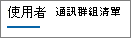

# Admin center 中的 Microsoft 365 報告-Yammer 裝置使用方式報告

Microsoft 365**報告**儀表板會向您顯示組織中各產品的活動概況。 此功能可讓您深入了解個別產品層級報表，更加深入解析各產品內的活動。 請參閱[報告概觀主題](activity-reports.md)。
  
Yammer 裝置使用量報告提供您的使用者在哪些裝置上使用 Yammer 的資訊。您可以依裝置類型檢視每日使用者數量和使用者數量。您可以在所選時間範圍內檢視這兩者。您也可以檢視每個使用者的詳細資料。
  
> [!NOTE]
> 您必須是 Microsoft 365 中的全域系統管理員、全域讀取者或報告讀取器、Exchange、SharePoint、小組服務、小組通訊或商務用 Skype 系統管理員，才能查看報告。 
  
## 如何取得 Yammer 裝置使用量報告？

1. 在系統管理中心中，移至 **[報告]** \> <a href="https://go.microsoft.com/fwlink/p/?linkid=2074756" target="_blank">[使用量]</a> 頁面。

    
2. 從 [**選取報告**] 下拉式清單中，選取 [ **Yammer** \> **裝置使用狀況**]。
  
## 解讀 Yammer 活動報告

您可以查看 [**使用者**] 和 [**通訊**群組] 圖表，以瞭解使用者的 Yammer 裝置使用狀況。 
  
裝置使用量報告中包含下列資訊。
  
- 使用 [日] 索引標籤，查看過去7天、30天、90天或180天的**Yammer 裝置使用狀況**活動報告趨勢。 不過，如果您選取報告中的特定一天，表格會顯示從目前日期的28天內的資料（並非報告產生的日期）。 
    
- 每份報告都具有報告產生時的日期。 報告反映出的資料通常會有 24 至 48 小時的延遲 (自活動時間起算)。
    
- 您可以查看 [**使用者**] 圖表，依裝置類型查看每日使用者數目。  
  
- 您可以透過裝置類型查看**分配**圖表以查看使用者數目。  
  
- 圖表底下的 [**詳細資料**] 表格顯示每個使用者層級的 Yammer 裝置使用量明細。 
    
    您也可以新增和移除欄位。 可用的欄位如下︰
    
  - [使用者**名稱**] 是使用者的電子郵件地址。 您可以顯示實際的名稱，也可以讓此欄位匿名。 
    
    這個格線會顯示使用 Microsoft 365 帳戶登入 Yammer 的使用者，或使用單一登入登入網路的使用者。
    
  - [**顯示名稱**] 是使用者的完整名稱。 您可以顯示實際的名稱，也可以讓此欄位匿名。 
    
  - **使用者狀態**是三個值之一： [作用中]、[已刪除] 或 [已擱置]。 
    
    這些報告顯示作用中、已停權及已刪除的使用者。報告不會反映出擱置中使用者，因為擱置中的使用者不能張貼訊息、閱讀訊息或對訊息按讚。
    
  - **Web**會指出使用者是否已在網頁上使用 Yammer。 
    
  - **Windows phone**會指出使用者是否已在 Windows phone 上使用 Yammer 
    
  - **Android 手機**會指出使用者是否已在 Android 手機上使用 Yammer。 
    
  - **iphone**會指出使用者是否已在 iPhone 上使用 Yammer。 
    
  - **ipad**會指出使用者是否已在 iPad 上使用 Yammer。 
    
  - **其他**表示使用者是否已在另一個裝置上使用 Yammer，但先前並未列出。 
    
    如果貴組織的原則防止您檢視可識別之使用者資訊的報告，您可以變更所有這類報告的隱私權設定。 請參閱[Microsoft 365 系統管理中心的活動報告中](activity-reports.md)的 [**我要如何隱藏使用者層級詳細資料？** ] 區段。
    
- 您也可以選取 [**匯出**] 連結，將報告資料匯出至 Excel .csv 檔案。 這會匯出所有使用者的資料，並可讓您進行簡單的排序和篩選，以便進一步分析。 如果您的使用者少於 2000 個，您可以直接在報告中的表格內進行排序和篩選。 如果您的使用者多於 2000 個，則需要匯出資料才能進行排序和篩選。 
    

