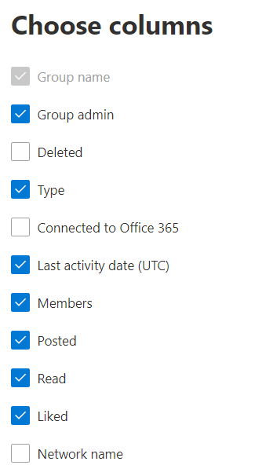

# Admin center 中的 Microsoft 365 報告-Yammer 群組活動報告

Microsoft 365 **報告** 儀表板會向您顯示組織中各產品的活動概況。 此功能可讓您深入了解個別產品層級報表，更加深入解析各產品內的活動。 請參閱[報告概觀主題](activity-reports.md)。 在 Yammer 群組活動報告中，您能夠深入了解組織中的 Yammer 群組活動情形，並查看已建立和使用中的 Yammer 群組數量。
  
> [!NOTE]
> 您必須是 Microsoft 365 中的全域系統管理員、全域讀取者或報告讀取器、Exchange、SharePoint、小組服務、小組通訊或商務用 Skype 系統管理員，才能查看報告。  
 
## 如何到達 Yammer 群組活動報告？

1. 在系統管理中心中，移至 **[報告]** \> <a href="https://go.microsoft.com/fwlink/p/?linkid=2074756" target="_blank">[使用量]</a> 頁面。 
2. 在 [儀表板] 主頁上，按一下 Yammer 卡片上的 [ **View more** ] 按鈕。

  
## 解讀 Yammer 群組活動報告

您可以選擇 [ **群組活動** ] 索引標籤，以查看 Yammer 報告中的 [群組] 活動。 

選取 **[選擇欄位** ]，以新增或移除報告中的欄。    

您也可以選取 [ **匯出** ] 連結，將報告資料匯出至 Excel .csv 檔案。 這會匯出所有使用者的資料，並可讓您進行簡單的排序和篩選，以便進一步分析。 如果您的使用者少於 2000 個，您可以直接在報告中的表格內進行排序和篩選。 如果您的使用者多於 2000 個，則需要匯出資料才能進行排序和篩選。 
  
|項目|描述|
|:-----|:-----|
|**計量**|**定義**|
|群組名稱    |群組的名稱。   |
|群組管理員    |群組管理員或擁有者的名稱。    |
|刪除    |已刪除 Yammer 群組的數目。 如果群組已刪除，但報告期間此群組有活動，那麼它會出現在格線中並被標幟為 True。    |
|類型    |群組的類型為 public 或 private。   |
|連接到 Office 365    |會指出 Yammer 群組是否也是 Microsoft 365 群組。   |
|上次活動日期 (UTC)     | 最近一天已閱讀郵件、已由群組傳送或贊的日期。    |
|成員    | 群組中的成員數目。    |
|張貼    |在報告期間內，在 Yammer 群組中張貼的郵件數目。  |
|讀取    |在報告期間，Yammer 群組中讀取的交談數目。    |
|喜歡    |在報告期間，Yammer 群組中所贊的郵件數目。  |
|網路名稱    |群組所屬之網路的完整名稱。 |
|||