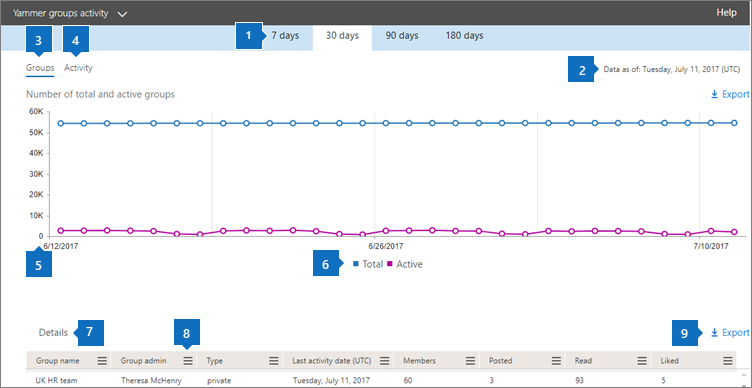

# Admin center 中的 Microsoft 365 報告-Yammer 群組活動報告Microsoft 365 Reports in the admin center - Yammer groups activity report

Microsoft 365**報告**儀表板會向您顯示組織中各產品的活動概況。The Microsoft 365 **Reports** dashboard shows you the activity overview across the products in your organization. 此功能可讓您深入了解個別產品層級報表，更加深入解析各產品內的活動。It enables you to drill in to individual product level reports to give you more granular insight about the activities within each product. 請參閱[報告概觀主題](activity-reports.md)。Check out [the Reports overview topic](activity-reports.md). 在 Yammer 群組活動報告中，您能夠深入了解組織中的 Yammer 群組活動情形，並查看已建立和使用中的 Yammer 群組數量。In the Yammer groups activity report, you can gain insights into the activity of Yammer groups in your organization and see how many Yammer groups are being created and used.
  
> [!NOTE]
> 您必須是 Microsoft 365 中的全域系統管理員、全域讀取者或報告讀取器、Exchange、SharePoint、小組服務、小組通訊或商務用 Skype 系統管理員，才能查看報告。You must be a global administrator, global reader or reports reader in Microsoft 365 or an Exchange, SharePoint, Teams Service, Teams Communications, or Skype for Business administrator to see reports.  

## 如何查看 Yammer 群組活動報告How to get to the Yammer groups activity report

1. 在系統管理中心中，移至 **[報告]** \> <a href="https://go.microsoft.com/fwlink/p/?linkid=2074756" target="_blank">[使用量]</a> 頁面。In the admin center, go to the **Reports** \> <a href="https://go.microsoft.com/fwlink/p/?linkid=2074756" target="_blank">Usage</a> page.

    
2. 從 [**選取報告**] 下拉式清單中，選取 [ **Yammer** \> **群組活動**]。From the **Select a report** drop-down, select **Yammer** \> **Groups activity**.
  
## 解讀 Yammer 群組活動報告Interpret the Yammer groups activity report

您可以查看 [**群組**] 和 [**活動**] 圖表，以查看 Yammer 群組的活動。You can get a view into Yammer groups activity by looking at the **Groups** and **Activity** charts. 
  
|||
|:-----|:-----|
|1.1.    |您可以針對過去7天、30天、90天或180天的趨勢，查看**Yammer 群組活動**報告。The **Yammer groups activity** report can be viewed for trends over the last 7 days, 30 days, 90 days, or 180 days. 不過，如果您在報告中選取某一天，表格（7）將會從目前的日期顯示最多28天的資料（不是報告產生的日期）。However, if you select a particular day in the report, the table (7) will show data for up to 28 days from the current date (not the date the report was generated).    |
|2.2.    |每個報告中的資料通常會涵蓋過去24到48小時。The data in each report usually covers up to the last 24 to 48 hours.   |
|3.3.    |[**群組**] 視圖會顯示已存在的群組總數，以及已執行的「小組交談」活動數目。The **Groups** view shows a total number of groups that existed , and how many performed group conversation activity.    |
|4.4.    |[**活動**] 視圖會顯示您在群組中張貼、讀取和贊的「Yammer」郵件數目。The **Activity** view shows you the number Yammer messages posted, read, and liked in groups.    |
|5.5.    | 在 [**群組**] 圖表上，Y 軸是總或使用中群組的計數。On the **Groups** chart, the Y axis is the count of total or active groups.     在 [**活動**] 圖表上，Y 軸是 Yammer 群組的指定活動計數。On the **Activity** chart, the Y axis is the count of specified activity for Yammer groups.     這三個圖表上的 X 軸都代表該特定報告的已選取日期範圍。The X axis on all three charts is the selected date range for the specific report.    |
|6.6.    |您可以選取圖例中的專案，以篩選您在圖表上看到的數列。You can filter the series you see on the chart by selecting an item in the legend. 例如，在 [**群組**] 圖表中，選取 [**總計** **] 或 [使用中的**總數] 和 [作用中圖示]，  以查看只與各項相關的資訊。  For example, on the **Groups** chart, select **Total** or **Active**   to see only the info related to each one. 變更此選取項目並不會變更格線資料表中的資訊。Changing this selection doesn't change the info in the grid table.    |
|7.7.    | 所顯示的群組清單是在最長報告時間範圍 (180 天) 內的所有現有 (未被刪除的) 群組。活動的數量 (收到的訊息數) 會因日期選取範圍而有所不同。  The list of groups to show is determined by the set of all groups that existed (weren't deleted) across the widest (180-day) reporting time frame. The activity count (messages received) will vary according to the date selection.    附注：您可能不會在欄中看到下列清單中的所有專案，直到您新增這些專案為止。NOTE: You might not see all the items in the list below in the columns until you add them. **組名**是群組的名稱。**Group name** is the name of the group.    **群組管理員**是群組管理員或擁有者的名稱。**Group admin** is the name of the group administrator, or owner.    **Deleted**是已刪除的 Yammer 群組數目。**Deleted** is the number of deleted Yammer groups. 如果群組已刪除，但報告期間此群組有活動，那麼它會出現在格線中並被標幟為 True。If the group is deleted, but had activity in the reporting period it will show up in the grid with this flag set to true.    **Type**是 group、public 或 private 的類型。**Type** is the type of group, public or private.    **連接到 Office 365**會指出 Yammer 群組是否也是 Microsoft 365 群組。**Connected to Office 365** indicates whether the Yammer group is also an Microsoft 365 group.    [**上次活動日期**] 是指由群組讀取、張貼或贊郵件的最近日期。**Last activity date** is the latest date a message was read, posted or liked by the group.    **Members**是群組中的成員數目。**Members** is the number of members in the group.    「**張貼**」是在報表期間的 Yammer 群組中張貼的郵件數目。**Posted** is the number of messages posted in the Yammer group over the reporting period.    **Read**是在報告期間，Yammer 群組中讀取之交談的數目。**Read** is the number of conversations read in the Yammer group over the reporting period.    「**贊**」是透過報告期間的 Yammer 群組中所贊的郵件數目。**Liked** is the number of messages liked in the Yammer group over the reporting period.     如果貴組織的原則防止您檢視可識別之使用者資訊的報告，您可以變更所有這類報告的隱私權設定。If your organization's policies prevents you from viewing reports where user information is identifiable, you can change the privacy setting for all these reports. 請參閱[Microsoft 365 系統管理中心的活動報告中](activity-reports.md)的 [**我要如何隱藏使用者層級詳細資料？** ] 區段。Check out the **How do I hide user level details?** section in [Activity reports in the Microsoft 365 admin center](activity-reports.md).    |
|8.8.    |選取 [**欄**]，以新增或移除報告中的欄。Select **Columns** to add or remove columns from the report.    |
|9.9.    |您也可以選取 [**匯出**] 連結，將報告資料匯出至 Excel .csv 檔案。You can also export the report data into an Excel .csv file, by selecting the **Export** link. 這會匯出所有使用者的資料，並可讓您進行簡單的排序和篩選，以便進一步分析。This exports data of all users and enables you to do simple sorting and filtering for further analysis. 如果您的使用者少於 2000 個，您可以直接在報告中的表格內進行排序和篩選。If you have less than 2000 users, you can sort and filter within the table in the report itself. 如果您的使用者多於 2000 個，則需要匯出資料才能進行排序和篩選。If you have more than 2000 users, in order to filter and sort, you will need to export the data.    |
|||
   

