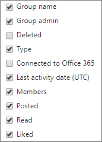

# Admin center 中的 Office 365 報告-Yammer 群組活動報告

「Office 365**報告**」儀表板會顯示您組織中產品的活動概況。 此功能可讓您深入了解個別產品層級報表，更加深入解析各產品內的活動。 請參閱[報告概觀主題](activity-reports.md)。 在 Yammer 群組活動報告中，您能夠深入了解組織中的 Yammer 群組活動情形，並查看已建立和使用中的 Yammer 群組數量。
  
> [!NOTE]
> 您必須是 Microsoft 365 中的全域系統管理員、全域讀取者或報告讀取器、Exchange、SharePoint、小組服務、小組通訊或商務用 Skype 系統管理員，才能查看報告。  

## 如何查看 Yammer 群組活動報告

1. 在系統管理中心中，移至 **[報告]** \> <a href="https://go.microsoft.com/fwlink/p/?linkid=2074756" target="_blank">[使用量]</a> 頁面。

    
2. 從 [**選取報告**] 下拉式清單中，選取 [ **Yammer** \> **群組活動**]。
  
## 解讀 Yammer 群組活動報告

您可以查看 [**群組**] 和 [**活動**] 圖表，以查看 Yammer 群組的活動。 
  
|||
|:-----|:-----|
|1.    |您可以針對過去7天、30天、90天或180天的趨勢，查看**Yammer 群組活動**報告。 不過，如果您在報告中選取某一天，表格（7）將會從目前的日期顯示最多28天的資料（不是報告產生的日期）。    |
|2.    |每個報告中的資料通常會涵蓋過去24到48小時。   |
|3.    |[**群組**] 視圖會顯示已存在的群組總數，以及已執行的「小組交談」活動數目。    |
|4.    |[**活動**] 視圖會顯示您在群組中張貼、讀取和贊的「Yammer」郵件數目。    |
|5.    | 在 [**群組**] 圖表上，Y 軸是總或使用中群組的計數。     在 [**活動**] 圖表上，Y 軸是 Yammer 群組的指定活動計數。     這三個圖表上的 X 軸都代表該特定報告的已選取日期範圍。    |
|6.    |您可以選取圖例中的專案，以篩選您在圖表上看到的數列。 例如，在 [**群組**] 圖表中，選取 [**總計** **] 或 [使用中的**  ![總數] 和 [作用中圖示](../../media/8eebd496-5955-4419-8d53-5f3ba1ad1c88.png) ]，以查看只與各項相關的資訊。 變更此選取項目並不會變更格線資料表中的資訊。    |
|7.    | 所顯示的群組清單是在最長報告時間範圍 (180 天) 內的所有現有 (未被刪除的) 群組。活動的數量 (收到的訊息數) 會因日期選取範圍而有所不同。    附注：您可能不會在欄中看到下列清單中的所有專案，直到您新增這些專案為止。 **組名**是群組的名稱。    **群組管理員**是群組管理員或擁有者的名稱。    **Deleted**是已刪除的 Yammer 群組數目。 如果群組已刪除，但報告期間此群組有活動，那麼它會出現在格線中並被標幟為 True。    **Type**是 group、public 或 private 的類型。    **連接到 Office 365**會指出 Yammer 群組是否也是 Office 365 群組。    [**上次活動日期**] 是指由群組讀取、張貼或贊郵件的最近日期。    **Members**是群組中的成員數目。    「**張貼**」是在報表期間的 Yammer 群組中張貼的郵件數目。    **Read**是在報告期間，Yammer 群組中讀取之交談的數目。    「**贊**」是透過報告期間的 Yammer 群組中所贊的郵件數目。     如果貴組織的原則防止您檢視可識別之使用者資訊的報告，您可以變更所有這類報告的隱私權設定。 請參閱[Microsoft 365 系統管理中心的活動報告中](activity-reports.md)的 [**我要如何隱藏使用者層級詳細資料？** ] 區段。    |
|8.    |選取 [**欄**]，以新增或移除報告中的欄。    |
|9.    |您也可以選取 [**匯出**] 連結，將報告資料匯出至 Excel .csv 檔案。 這會匯出所有使用者的資料，並可讓您進行簡單的排序和篩選，以便進一步分析。 如果您的使用者少於 2000 個，您可以直接在報告中的表格內進行排序和篩選。 如果您的使用者多於 2000 個，則需要匯出資料才能進行排序和篩選。    |
|||
   

