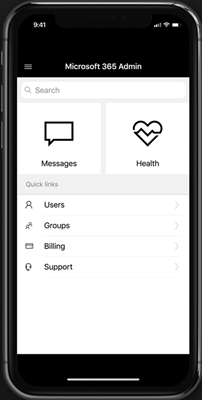

# 有關 Microsoft 365 admin 行動應用程式

您是系統管理員隨時隨地通常是？ 然後嗎？ 請查看[Microsoft 365 Admin app](https://go.microsoft.com/fwlink/?LinkID=627216)。 您可以使用該應用程式來管理線上組織從手機或平板電腦。 從 Apple Store 和 Google Play，您可以取得應用程式。   

系統管理應用程式是具備豐富功能的應用程式，具有超過 80 個功能，可協助您管理貴組織，當您不能取得的電腦。 以下是只是一些您可以從應用程式執行的工作清單：

- 取得服務健康狀況，並變更通知
- 建立服務要求
- 重設使用者的密碼
- 指派授權
- 新增或移除群組成員資格
- 新增使用者 

因此，如果您是負責一個以上的線上組織的人員，登入多個組織的 emc 和之間快速切換。 
  
> [!IMPORTANT]
> 如果您無法在 iOS 或 Android 上使用 Admin 行動應用程式，電子郵件給我們在[feedback365@microsoft.com](mailto:feedback365@microsoft.com)讓我們知道。 
  
## 下載 Admin 行動應用程式

[Microsoft 365 Admin 行動應用程式](https://go.microsoft.com/fwlink/?LinkID=627216)。
  
觀看有關安裝 admin 行動應用程式。  

> [!VIDEO https://www.microsoft.com/videoplayer/embed/05c1d439-9ec2-415f-9178-250f64dec64c] 

如果您覺得這段影片很有幫助，請查看[適用於小型企業和 Microsoft 365 新手的完整訓練系列](https://support.office.com/article/6ab4bbcd-79cf-4000-a0bd-d42ce4d12816)。

 
## 常見問題集

以下提供與該 App 相關的部分常見問題集解答。
  
### 使用此 App 的先決條件為何？

您必須具有有效的 Office 365 商務版或 Microsoft 365 商務版訂閱與系統管理員權限登入並使用該應用程式。 Admin 行動應用程式不是電子郵件用戶端。 它是豐富的系統管理應用程式和超過 80 個功能可以協助您支援您的組織時您隨時隨地。
  
### 我可以使用該應用程式與 「 我的 Office 365 家用版訂閱嗎？

否，應用程式只適用於 Office 365 for business 和 Microsoft 365 商務版訂閱。 
  
### 此 App 能夠在組織啟用目錄同步處理的情況下正常運作嗎？

是的但是具有較少功能。 您將能夠登入並檢視服務的詳細資訊，但是大部分的使用者管理功能將會是唯讀屬性。 您無法新增、 編輯或刪除使用者。 不過，您可以將授權指派給您組織中的使用者，並取得通知。
  
### 此 App 支援哪些語言？

應用程式支援 web 式 Microsoft 365 系統管理中心支援的所有 39 語言。 
  
### 為什麼即使讀取了新郵件，主畫面中的郵件磚仍會顯示數字？

數字代表的是上週的總郵件數，不是未讀取的郵件數。
  
### 如何與組織的其他人員共用服務事件與郵件？

如果您選取特定的服務事件或訊息，[共用] 選項將會位於右上角。 目前支援電子郵件共用。
  
### 我的 App 無法正常運作。 我該如何疑難排解 App 不正常的行為？

您可以嘗試一些常見的行動應用程式疑難排解步驟︰
  
1. 關閉並重新開啟 App。
    
2. 解除安裝並重新安裝 App。

3. 如果還是沒有用，您可以在[feedback365@microsoft.com](mailto:feedback365@microsoft.com)讓我們知道電子郵件給我們。
    
### 如果仍無法解決我的問題該怎麼辦？

[Feedback365@microsoft.com](mailto:feedback365@microsoft.com)回報應用程式有問題的電子郵件。 或者您可以提供本文底部的意見反應。 
  
## 另請參閱

[Microsoft 365 商務版訓練影片](https://support.office.com/article/6ab4bbcd-79cf-4000-a0bd-d42ce4d12816)
