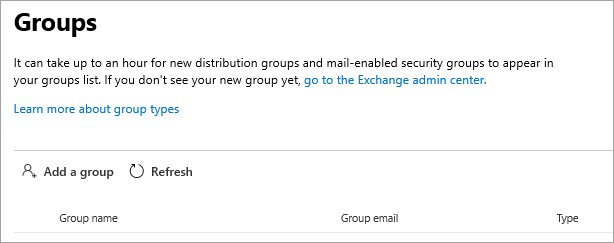

<!-- The following is just placeholder text from Madhura's mail. We need to add images/examples of each -->

# 如何在 Microsoft 365 系統管理中心取得協助How to get help in the Microsoft 365 admin center

如果您是系統管理員， [admin.microsoft.com](https://admin.microsoft.com) 是您開始進行管理，並充分利用您的 microsoft 365 訂閱。If you're an admin, [admin.microsoft.com](https://admin.microsoft.com) is your go-to place to manage and make the most of your Microsoft 365 subscription. 在某些情況下，您可能不會發現正確的工作、在工作流程上 embarking 之前需要更多內容，或者根本不會確定動作的範圍和影響為系統管理員。為了涵蓋這些情形，我們會以下列方式在整個 Microsoft 365 系統管理中心中提供新式協助和智慧協助：Sometimes you might not find the right task, need more context before embarking on a task flow, or simply might not be sure of the scope and impact of your actions as an admin. To cover those situations, we provide modern help and intelligent assistance throughout the Microsoft 365 admin center in these ways:

* **整合式協助** -系統管理中心的說明**Integrated help** - help in the admin center

* **智慧協助** -由 AI 供電的自我協助**Intelligent assistance** - self-help powered by AI

* 網頁上的 **指南和文章**-綜合性內容**Guides and articles** - comprehensive content on the web

## 整合說明Integrated help

協助已整合到整個系統管理中心，所以當您需要時，也是如此。Help is integrated throughout the admin center, so it's right there when you need it. 在許多頁面的頂端，您會看到內嵌解說文字，可提供手頭工作的資訊一覽，以及可讓您快速尋找官方檔以取得更深入瞭解的文章連結。At the top of many pages, you'll find inline help text that provides an informational overview of the task at hand, as well as links to articles that let you quickly find official documentation for more in-depth learning.

## 由 AI 進行的新式自助支援Modern self-help powered by AI

若要以人工智慧的方式開啟新式自助體驗，請選取 [Microsoft 365 系統管理中心] 中的 [ **需要協助** ] 按鈕。To open our modern self-help experience that’s powered by artificial intelligence, select the **Need Help** button in the Microsoft 365 admin center. 例如，如果您搜尋「驗證我的網域」，您將會收到步驟，再加上我們認為會協助您的一些文章。For example, if you search for "verify my domain", you'll get the steps plus a few articles that we think will help you. 我們使用電腦學習來呈現最接近的解決方案，以協助其他系統管理員輸入類似的查詢。We use machine learning to surface the closest solution that has helped other admins who have entered similar queries.

或者，如果您不太瞭解如何在特定情況下進行某項操作，請使用支援助理。Or, for those times when you don't quite know how to get something done in your specific situation, use the Support Assistant. 目前，此體驗只適用于英文。Currently, this experience is available only in English. 若要開啟支援助理，只需使用 [ **需要協助** ] 窗格上方的 [切換]。To turn on Support Assistant, just use the toggle at the top of the **Need Help** pane. 支援助理提供會話式介面來協助您。The Support Assistant provides a conversational interface to help you. 在您輸入查詢後，chatbot 會詢問您明確的問題，讓您瞭解特定狀況的正確答案。After you enter your query, the chatbot asks clarifying questions to get you to the right answer for your specific situation. 請將它想像為您的虛擬協助者，以探索解決方案及完成工作。Think of it as your virtual helper to discover solutions and complete tasks.

當然，有些問題的答案是人工的最佳答案。Of course, sometimes questions are best answered by humans. 如果我們的現代自助服務沒有答案，您可以選擇與我們的支援代理商聯繫。If our modern self-help doesn't have the answer, you always have the option to contact our support agents.

## 輔助線和文章Guides and articles

此外，如果您要尋找全面的部署指南、快速逐步程式或 PowerShell Cmdlet，請參閱網頁。Additionally, if you're looking for comprehensive deployment guides, quick step-by-step procedures, or PowerShell cmdlets, look us up on the web. 我們經常更新內容，並嘗試為您提供最新資訊。We update content frequently and try to provide you with the latest information. 請參閱 [Microsoft 365 檔](../../index.yml) 網站上的文章和指南。Check out our articles and guides on the [Microsoft 365 Documentation](../../index.yml) site.