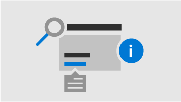

<!-- The following is just placeholder text from Madhura's mail. We need to add images/examples of each -->

# 如何在 Microsoft 365 系統管理中心中取得說明

如果您是系統管理員， [admin.microsoft.com](https://admin.microsoft.com)是您移到準備就緒可以管理並進行最多的 Microsoft 365 訂閱。 有時候您可能不尋找正確的任務，需要更多的內容之前背著工作流程，或只是可能無法確定的範圍和影響您的動作為系統管理員。若要涵蓋這些情況下，我們提供新式說明與整個 Microsoft 365 系統管理中心，在這種方式中的智慧型協助：
 

<ul class="panelContent cardsW">
    <li>
        

            

                

                    <a href="what-is-help.md#integrated-help">
                        

                            

                                
                            

                        

                        

                            <h3>整合式的說明</h3>
                            
在系統管理中心內的說明

                        

                    </a>
                

            

        

    </li>
    <li>
        

            

                

                    <a href="what-is-help.md#modern-self-help-powered-by-ai">
                        

                            

                                
                            

                        

                        

                            <h3>智慧型協助</h3>
                            
由 AI 提供自助支援

                        

                    </a>
                

            

        

    </li>
    <li>
        

            

                

                    <a href="what-is-help.md#guides-and-articles">
                        

                            

                                
                            

                        

                        

                            <h3>輔助線和文章</h3>
                            
在 web 上的完整內容

                        

                    </a>
                

            

        

    </li>
</ul>

## 整合式的說明
說明整合整個系統管理中心中，因此該處是在需要時。 在多個頁面頂端，您會發現內嵌說明文字，概略資訊性工作片時，也可讓您快速的文章連結找到更多的深入學習官方文件。

## 新式自助由 AI 入門 http://dev.office.com/getting-started/office365apis

在 Microsoft 365 系統管理中心中選取 「 需要協助 」 按鈕會開啟由人工地智慧提供我們新式自助體驗。 例如，如果您要搜尋的*驗證我的網域*，您會看到步驟加上一些我們認為的文章可協助您。 我們會使用機器學習呈現已發現的協助來輸入類似的查詢的其他系統管理員是最接近解決方案。

或者，當您相當不知道如何取得發生在特定情況中完成這些時間，對於使用支援小幫手。 這種經驗是目前僅提供英文版本。 只要使用切換 「 需要協助 「] 窗格的頂端，以將它開啟。 支援小幫手提供口語介面取得說明。 輸入您的查詢，並 chatbot 會要求釐清 < 的問題，以取得您在特定情況的是正確的答案。 請將它視為虛擬協助專家來探索解決方案及完成的工作。

當然，有時會最佳回答問題人類。 如果我們新式自助沒有回應，您可以隨時連絡我們支援專員尋求協助的選項。

## 輔助線和文章

此外，如果您正在尋找詳盡部署指南，快速的逐步程序或 PowerShell cmdlet，查閱我們在網頁上。 我們經常更新內容，並嘗試為您提供最新的資訊。 嗎？ 請查看我們的文章和輔助線，在[Microsoft 365 文件](https://docs.microsoft.com/microsoft-365/)的網站。