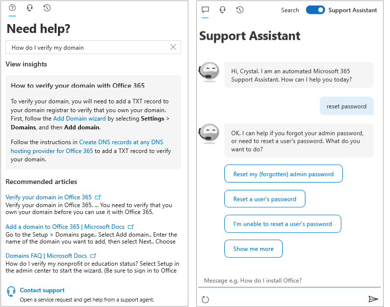

<!-- The following is just placeholder text from Madhura's mail. We need to add images/examples of each -->

# 如何在 Microsoft 365 系統管理中心取得協助

如果您是系統管理員， [admin.microsoft.com](https://admin.microsoft.com) 是您開始進行管理，並充分利用您的 microsoft 365 訂閱。 在某些情況下，您可能不會發現正確的工作、在工作流程上 embarking 之前需要更多內容，或者根本不會確定動作的範圍和影響為系統管理員。為了涵蓋這些情形，我們會以下列方式在整個 Microsoft 365 系統管理中心中提供新式協助和智慧協助：

* **整合式協助** -系統管理中心的說明

* **智慧協助** -由 AI 供電的自我協助

* 網頁上的 **指南和文章**-綜合性內容

## 整合說明

協助已整合到整個系統管理中心，所以當您需要時，也是如此。 在許多頁面的頂端，您會看到內嵌解說文字，可提供手頭工作的資訊一覽，以及可讓您快速尋找官方檔以取得更深入瞭解的文章連結。

## 由 AI 進行的新式自助支援

若要以人工智慧的方式開啟新式自助體驗，請選取 [Microsoft 365 系統管理中心] 中的 [ **需要協助** ] 按鈕。 例如，如果您搜尋「驗證我的網域」，您將會收到步驟，再加上我們認為會協助您的一些文章。 我們使用電腦學習來呈現最接近的解決方案，以協助其他系統管理員輸入類似的查詢。

或者，如果您不太瞭解如何在特定情況下進行某項操作，請使用支援助理。 目前，此體驗只適用于英文。 若要開啟支援助理，只需使用 [ **需要協助** ] 窗格上方的 [切換]。 支援助理提供會話式介面來協助您。 在您輸入查詢後，chatbot 會詢問您明確的問題，讓您瞭解特定狀況的正確答案。 請將它想像為您的虛擬協助者，以探索解決方案及完成工作。

當然，有些問題的答案是人工的最佳答案。 如果我們的現代自助服務沒有答案，您可以選擇與我們的支援代理商聯繫。

## 輔助線和文章

此外，如果您要尋找全面的部署指南、快速逐步程式或 PowerShell Cmdlet，請參閱網頁。 我們經常更新內容，並嘗試為您提供最新資訊。 請參閱 [Microsoft 365 檔](../../index.yml) 網站上的文章和指南。