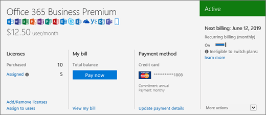

# 我有何種訂閱？What subscription do I have?

如果您是系統管理員，可以前往系統管理中心確認您的組織有哪些訂閱。If you're an admin, you can verify which subscriptions your organization has by going to the admin center.
  
 **不是系統管理員？****Not an admin?** 請參閱 [我有哪些 Microsoft 365 的商務版產品或授權？](https://support.microsoft.com/office/f8ab5e25-bf3f-4a47-b264-174b1ee925fd)See [What Microsoft 365 for business product or license do I have?](https://support.microsoft.com/office/f8ab5e25-bf3f-4a47-b264-174b1ee925fd)

::: moniker range="o365-worldwide"

1. 在系統管理中心，移至 [帳單 **]** \> [您的產品 <a href="https://go.microsoft.com/fwlink/p/?linkid=842054" target="_blank">]</a> 頁面。In the admin center, go to the **Billing** \> <a href="https://go.microsoft.com/fwlink/p/?linkid=842054" target="_blank">Your products</a> page.
2. 在 [ **產品** ] 索引標籤上，您會看到所有的訂閱。On the **Products** tab, you see all your subscriptions. 每個訂閱行都包含授權、訂閱狀態和帳單的相關資訊。Each subscription line includes information about licenses, subscription status, and billing.
3. 如果您想要變更出現在清單中的欄，請選取 **[選擇欄**]。If you want to change the columns that appear in the list, select **Choose columns**. 變更 [欄的選取範圍]，然後選取 [ **儲存**]。Change the selection of columns, then select **Save**.
4. 若要查看單一訂閱的詳細資訊，請選取該訂閱。To see more details for a single subscription, select that subscription.

::: moniker-end
  
::: moniker range="o365-germany"

1. 在系統管理中心中，移至 [**帳單** \> <a href="https://go.microsoft.com/fwlink/p/?linkid=847745" target="_blank">訂閱</a>] 頁面。  In the admin center, go to the **Billing** \>  <a href="https://go.microsoft.com/fwlink/p/?linkid=847745" target="_blank">Subscriptions</a> page.

2. 如果您只有一個訂閱，它會顯示在 [ **訂閱** ] 頁面上，以及訂閱名稱、訂閱資訊及其狀態。If you have only one subscription, it will be displayed on the **Subscriptions** page, along with the subscription name, information about the subscription, and its status. 在下列螢幕擷取畫面中，您可以看到我有 Microsoft 365 應用程式商務版訂閱。In the following screenshot, you can see that I have an Microsoft 365 Apps for business subscription.

    
  
3. 如果您有多個訂閱，您會看到訂閱詳細資訊旁有一欄，列出已購買的訂閱和所有試用版訂閱。根據預設，系統會自動選取清單頂端列出的訂閱，並顯示該訂閱的詳細資訊。If you have multiple subscriptions, you'll see a column next to the detailed subscription information that lists the subscriptions that have been purchased, as well as any trial subscriptions. By default, the subscription at the top of the list is automatically selected, and the detailed information for that subscription is shown.

    如果您有多個訂閱，請選擇您要查看詳細資訊的訂閱。If you have multiple subscriptions, choose the one for which you want to see detailed information. 系統會使用該訂閱的相關資訊來更新訂閱卡。The subscription card will update with information about that subscription.

    ![系統管理中心的 [訂閱] 頁面，顯示以其狀態群組的多個訂閱清單。](../../media/548ab8e9-bf9c-46d1-8c7c-ef5b631f3faa.png)
  
    > [!NOTE]
    > 如果您有訂閱已到期或停用，系統就會依據訂閱的目前狀態列出。If you have subscriptions that have expired or have been disabled, they'll be listed based on their current state.

::: moniker-end

::: moniker range="o365-21vianet"

1. 在系統管理中心中，移至 [**帳單** \> <a href="https://go.microsoft.com/fwlink/p/?linkid=850626" target="_blank">訂閱</a>] 頁面。  In the admin center, go to the **Billing** \>  <a href="https://go.microsoft.com/fwlink/p/?linkid=850626" target="_blank">Subscriptions</a> page.

2. 如果您只有一個訂閱，它會顯示在 [ **訂閱** ] 頁面上，以及訂閱名稱、訂閱資訊及其狀態。If you have only one subscription, it will be displayed on the **Subscriptions** page, along with the subscription name, information about the subscription, and its status. 在下列螢幕擷取畫面中，您可以看到我有 Microsoft 365 應用程式商務版訂閱。In the following screenshot, you can see that I have an Microsoft 365 Apps for business subscription.

    
  
3. 如果您有多個訂閱，您會看到訂閱詳細資訊旁有一欄，列出已購買的訂閱和所有試用版訂閱。根據預設，系統會自動選取清單頂端列出的訂閱，並顯示該訂閱的詳細資訊。If you have multiple subscriptions, you'll see a column next to the detailed subscription information that lists the subscriptions that have been purchased, as well as any trial subscriptions. By default, the subscription at the top of the list is automatically selected, and the detailed information for that subscription is shown.

    如果您有多個訂閱，請選擇您要查看詳細資訊的訂閱。If you have multiple subscriptions, choose the one for which you want to see detailed information. 系統會使用該訂閱的相關資訊來更新訂閱卡。The subscription card will update with information about that subscription.

    ![系統管理中心的 [訂閱] 頁面，顯示以其狀態群組的多個訂閱清單。](../../media/548ab8e9-bf9c-46d1-8c7c-ef5b631f3faa.png)
  
    > [!NOTE]
    > 如果您有訂閱已到期或停用，系統就會依據訂閱的目前狀態列出。If you have subscriptions that have expired or have been disabled, they'll be listed based on their current state.

::: moniker-end

## 相關文章Related articles
  
[訂閱及計費Subscriptions and billing](../../commerce/index.yml)