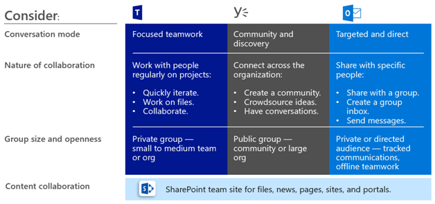

# Office 365 群組中的控管規劃

Office 365 群組具有一組豐富的工具來實作您的組織可能需要任何控管功能。 本文將引導到提出正確的問題來判斷其需求的控管，以及如何符合其根據其組織設定檔的 IT 專業人員。

## 為什麼 Office 365 群組？

我們知道，組織目前正在使用各種工具組。 沒有使用小組聊天，傳送電子郵件，並透過企業社交連線在整個組織 executives 的開發人員小組。 多個共同作業工具都在使用，因為每個群組都是唯一的而且有其專屬功能的需求和。 時其他人將 live 主要在聊天中，部分將會使用僅電子郵件。 

如果使用者覺得提供 IT 工具不符合其需求，它們可能會下載支援其案例其最愛的消費者應用程式。 雖然此程序可讓使用者快速上手，它會導致令人沮喪的使用者經驗整個組織內的多個登入、 與困難共用] 中，沒有單一位置檢視內容。 此概念稱為 「 陰影 IT 」，並會造成重大的風險，組織。 它可減少統一管理使用者存取、 確保安全性和服務法務遵循需求的能力。

Office 365 群組讓使用者，並藉由許多共同作業所需的工具提供在單一步驟減少陰影 IT 的風險。 Office 365 群組可讓您選擇一群人與您想要共同作業，並輕鬆地設定這些人共用的資源集合。 以手動方式將權限指派給資源是件事的過去時自動加入至群組的成員所需的權限授與所有群組所提供的資產。

## 技術架構

有三種支援的 Office 365 群組的主要的溝通形式。 群組可以建立這些體驗內，及使用跨 Office 365 套件：
- [Outlook](https://support.office.com/article/learn-about-office-365-groups-b565caa1-5c40-40ef-9915-60fdb2d97fa2)： 透過電子郵件與共用的群組收件匣和行事曆的共同作業
- [Microsoft Teams](https://support.office.com/article/learn-about-office-365-groups-b565caa1-5c40-40ef-9915-60fdb2d97fa2)： 您可以在其中有各種不同的主題，周圍的非正式、 即時交談常設聊天室型的 workspace 依特定的子群組
- [Yammer](https://support.office.com/article/learn-about-office-365-groups-b565caa1-5c40-40ef-9915-60fdb2d97fa2)： 企業社交體驗進行共同作業

> [!NOTE]
> 建立新的群組，透過其他團隊合作應用程式-SharePoint，例如 Planner 或資料流-將建立的群組與 Outlook 通訊形式能夠連線至 Microsoft Teams。

根據所在群組建立時，特定資源所佈建自動，例如：
- [收件匣](https://support.office.com/article/have-a-group-conversation-in-outlook-a0482e24-a769-4e39-a5ba-a7c56e828b22)-您成員之間的電子郵件交談的。 此收件匣有電子郵件地址，而且可以設定為接受來自人員群組和外即使您的組織，如同傳統的通訊群組清單的郵件。
 - [行事曆](https://support.office.com/article/schedule-a-meeting-on-a-group-calendar-in-outlook-0cf1ad68-1034-4306-b367-d75e9818376a)– 的排程與群組相關的事件
- [SharePoint 小組網站](https://support.office.com/article/what-is-a-sharepoint-team-site-75545757-36c3-46a7-beed-0aaa74f0401e)-資訊、 連結和內容與您的群組相關的集中存放庫
- [SharePoint 文件庫](https://support.office.com/article/share-group-files-749bc73b-90c9-4760-9b6f-9aa1cf01b403)– 中央位置，以讓群組來儲存與共用檔案
- [OneNote 筆記本](https://support.office.com/article/get-started-with-onenote-e768fafa-8f9b-4eac-8600-65aa10b2fe97)– 收集想法、 參考資料，以及資訊
- [會議規劃](https://support.office.com/article/microsoft-planner-help-4a9a13c6-3adf-4a60-a6fc-15c0b15e16fc)– 用來指派及管理群組成員之間的專案任務
- [Yammer 群組](https://support.office.com/article/Learn-about-Office-365-groups-b565caa1-5c40-40ef-9915-60fdb2d97fa2)-有對話和共用一般位置資訊
- Microsoft Teams – 在 Office 365 中的交談形式的工作區

若要深入了解更多有關哪些資源建立的每個群組，請造訪[了解 Office 365 群組](https://support.office.com/article/learn-about-office-365-groups-b565caa1-5c40-40ef-9915-60fdb2d97fa2)。

> [!NOTE]
> 透過 Yammer 或小組建立新的 Office 365 群組時，群組不是顯示在 Outlook 或通訊錄中，因為這些使用者之間的主要通訊動作會在其各自的用戶端。

> [!IMPORTANT]
> 建立新的 Yammer 群組時，Office 365 群組不會建立群組信箱或行事曆資源。 因此，Yammer 群組無法連線至 Microsoft Teams。 請參閱[Yammer 與群組](https://docs.microsoft.com/yammer/manage-yammer-groups/yammer-and-office-365-groups)

## 要從何處開始交談
有多個位置進行 Office 365 內的對話。 了解要從何處開始交談，可協助組織定義的策略來進行通訊。

- Teams： 聊天型工作區 （高速度共同作業） – 內部迴圈
   - 內建與您處理每日的人員的共同作業
  - 將資訊放在單一經驗中的使用者後
  - 新增索引標籤、 連接器和 bot
  - 即時聊天、 音訊/視訊會議記錄會議。

- Yammer： 跨組織 （企業社交） – 外層迴圈連線
  - 做法-交互功能群組的人員共用共同興趣或專業知識，但不是一定正在一起在日常的社群
  - 領導連線，學習社群，以角色為基礎的社群

- Outlook 群組： 新式 DL （電子郵件型共同作業）
  - 無所不在目標的通訊
  - 將通訊群組清單升級至 Office 365 群組-[為什麼應該升級？](https://support.office.com/article/why-you-should-upgrade-your-distribution-lists-to-groups-in-outlook-7fb3d880-593b-4909-aafa-950dd50ce188)

- SharePoint – 核心內容共同作業體驗適用於所有 Office 365 群組
  - 每個群組都取得連線的 SharePoint 小組網站
  - 共用內容、 建立自訂的頁面及製作最新消息
  - [Connect](https://docs.microsoft.com/sharepoint/dev/features/groupify/groupify-overview)現有 SharePoint 小組網站到新的 Office 365 群組

##  管理及管理 Office 365 規模

Office 365 群組具有一組豐富的工具來實作您的組織可能需要任何控管功能。 下節說明功能、 建議最佳做法，並提供相關指導，以要求權限的問題，以決定治理規範，以及如何符合這些需求。

**本章節中**：
- [控制能建立 Office 365 群組](https://docs.microsoft.com/office365/admin/create-groups/plan-for-groups-governance#control-who-can-create-office-365-groups)
- [虛刪除和還原群組](https://docs.microsoft.com/office365/admin/create-groups/plan-for-groups-governance#group-soft-delete-and-restore)
- [群組命名原則](https://docs.microsoft.com/office365/admin/create-groups/plan-for-groups-governance#group-naming-policy)
- [群組到期原則](https://docs.microsoft.com/office365/admin/create-groups/plan-for-groups-governance#group-expiration-policy)
- [群組的來賓存取](https://docs.microsoft.com/office365/admin/create-groups/plan-for-groups-governance#group-guest-access)
- [群組原則 & 資訊保護](https://docs.microsoft.com/office365/admin/create-groups/plan-for-groups-governance#group-policies--information-protection)
- [升級傳統的共同作業工具](https://docs.microsoft.com/office365/admin/create-groups/plan-for-groups-governance#upgrade-traditional-collaboration-tools)
- [報告群組](https://docs.microsoft.com/office365/admin/create-groups/plan-for-groups-governance#groups-reporting)

### 控制能建立 Office 365 群組
從多個端點的使用者可以建立群組包括 Outlook、 SharePoint、 Microsoft Teams 和其他環境。

> [!Tip]
>- 我們強烈建議考慮自助讓群組擁有者。
>- 文件並進行通訊操作要求一個群組。
>- 回顧誰可以建立群組，在您的雲端作業過程期間。
>- 請考慮使用動態成員資格設定來控制群組建立安全性群組的成員。
>- 評估的詛案例可管理透過動態成員資格，並允許自助服務的其餘部分。

有三種主要的模型的群組中佈建： 開啟、 IT led 或控制。 下表說明每個模型的優點。

| Model          | 優點                                                   |
| -------------- | ------------------------------------------------------------ |
| 開啟 [（預設值） | 使用者可以建立自己的群組，視需要而不必等待，或麻煩 IT。 |
| IT led         | 使用者要求從群組 IT。 IT 可以引導其選取符合其需求的最佳共同作業工具。 |
| 控制     | 限制為特定人員、 小組或服務建立群組。 若要深入了解，請參閱[管理誰能建立 Office 365 群組](https://support.office.com/article/manage-who-can-create-office-365-groups-4c46c8cb-17d0-44b5-9776-005fced8e618)。 |

您的組織可能必須實作嚴格控制誰可以建立群組上的特定需求。 使用下表來協助決定哪一個佈建的模型適合您的組織。

|         |         |         |
|---------|---------|---------|
||決策點|<ul><li>哪一個佈建的模型適合您組織的需求？</li><li>您的組織需要限制系統管理員建立的群組？</li><li>您的組織需要限制安全性群組成員的群組建立嗎？</li><li>您的組織是否需要一些群組，以建立動態地根據使用者屬性，例如部門？</li></ul>|
||後續步驟|<ul><li>文件群組和小組建立您的組織的需求。</li><li>規劃如何實作這些需求，作為您群組首度發行的一部分。</li><li>通訊及發佈您的原則，以通知使用者他們可以預期的行為</li><li>若要實作動態成員資格適用的方案。</li></ul>|

> [!Important]
> 限制群組及小組建立可以降低使用者生產力，因為許多 Office 365 服務都需要群組會建立的服務才會運作。 若要深入了解，請參閱[控制誰能建立 Office 365 群組？](https://docs.microsoft.com/office365/admin/create-groups/manage-creation-of-groups?view=o365-worldwide%23why-control-who-creates-office-365-groups)

#### *資源*
- [管理誰能建立 Office 365 群組](https://docs.microsoft.com/office365/admin/create-groups/manage-creation-of-groups?view=o365-worldwide)
- [填入群組以動態方式根據物件的屬性](https://docs.microsoft.com/azure/active-directory/active-directory-accessmanagement-groups-with-advanced-rules)
- [如何變更針對 Outlook，Office 365 群組的預設設定為公用或私人](https://support.office.com/article/office-365-groups-in-outlook-private-by-default-36236e39-26d3-420b-b0ac-8072d2d2bedc)
- [與小組成員資格同步處理的安全性群組](https://techcommunity.microsoft.com/t5/Microsoft-Teams-Blog/Syncing-Security-Groups-with-team-membership/ba-p/241959)

### 虛刪除和還原群組
如果您刪除了某個 Office 365 群組，根據預設，它會保留 30 天。此 30 天期間稱為「虛刪除」，因為您仍可還原該群組。30 天之後，該群組和關聯的內容將會被永久刪除，而且無法還原。

> [!Tip]
>- 傳達您的使用者的還原程序。
>- 訓練您的服務台小組。
>- 追蹤即將來臨的群組，將會刪除使用 PowerShell 指令碼。

|         |         |         |
|---------|---------|---------|
||決策點|<ul><li>您是否需要封存長期存放區的某些資產？</li><li>您是否為您的組織有特定保留需求？</li></ul>|
||後續步驟|<ul><li>通訊並發佈刪除並還原原則，以通知使用者他們可以預期的行為 </li><li> 記錄您的組織需求來監視已刪除的群組。</li><li>若要實作這些需求一部分您群組首度發行計劃。</li></ul>|

> [!Important]
>在「虛刪除」期間，如果使用者嘗試存取網站，則會看到 403 禁止訊息。 在此期間之後，如果使用者嘗試存取網站，則會看到 404 找不到訊息。

#### *資源*
- [還原已刪除的 Office 365 群組](https://support.office.com/article/Restore-a-deleted-Office-365-Group-b7c66b59-657a-4e1a-8aa0-8163b1f4eb54?ui=en-US&rs=en-001&ad=US)
- [還原已刪除的 Office 365 群組在 Azure Active Directory](https://docs.microsoft.com/azure/active-directory/users-groups-roles/groups-restore-deleted)
- [使用 Remove-UnifiedGroup Cmdlet 來刪除群組](https://technet.microsoft.com/library/mt238270%28v=exchg.160%29.aspx)

### 群組命名原則
命名原則可協助您和您的使用者識別群組成員資格、 地理區域的函式或建立群組的人員。 命名原則也有助於分類在通訊錄中的群組。 您可以使用原則來封鎖特定字詞，防止正在使用中群組的名稱和別名。

> [!Tip]
> - 使用短字串為後置詞。
> - 與值使用的屬性。
> - 不會太創意，總計的名稱的長度上限為 264 字元。
> - 上傳您的組織特定封鎖的文字若要限制使用量。

|         |         |         |
|---------|---------|---------|
||決策點|<ul><li>您的組織需要特定的命名慣例為群組？</li><li>您的組織需要的命名慣例跨所有的工作負載？</li><li>您的組織是否有您想要防止使用者使用的特定字詞？</li></ul>|
||後續步驟|<ul><li>文件的命名群組貴組織的需求。 </li><li> 若要實作這些需求一部分您群組首度發行計劃。</li><li> 通訊，並發佈命名的原則和標準來通知使用者。</li></ul>|

> [!Important]
>命名原則會套用至跨所有群組工作負載 （例如 Outlook、 Microsoft Teams、 SharePoint、 規劃、 Yammer、 等等） 所建立的群組。 它會套用到的群組名稱和群組的別名。 它會取得套用當使用者建立的群組和群組名稱或別名時為編輯現有的群組。

#### *資源*
- [Office 365 群組命名原則](https://docs.microsoft.com/office365/admin/create-groups/groups-naming-policy)
- [強制執行 Azure Active Directory 中的 Office 365 群組命名原則](https://go.microsoft.com/fwlink/?linkid=868340)
- [設定群組設定 azure Active Directory cmdlet](https://go.microsoft.com/fwlink/?linkid=868341)
- [群組命名的預覽功能](https://portal.azure.com/#blade/Microsoft_AAD_IAM/GroupsManagementMenuBlade/NamingPolicy)

### 群組到期原則
系統管理員可以指定將刪除的到期時間和抵達陣列結尾的這段時間內，且不會被更新，任何群組。 建立群組，或依日期它上次更新時，會開始進行到期時間。 群組擁有者將會自動傳送一封電子郵件，讓他們能更新群組的另一個到期間隔到期之前。

一旦您設定將過期群組：
- 群組擁有者會收到通知來為接近到期日更新群組
- 刪除任何不會被更新的群組
- 任何已刪除的群組可以在 30 天內還原由群組擁有者或系統管理員

> [!Tip]
> - 最初試驗與特定的群組。
> - 選擇 [非使用中 Microsoft 365 系統管理中心中的 [活動] 報告為基礎的群組。
> - 群組擁有人溝通續約程序。
> - 上架服務支援小組。
> - 請確定有多個擁有者群組，並設定孤立的群組的電子郵件。

|         |         |         |
|---------|---------|---------|
||決策點|<ul><li>您的組織是否需要指定小組的到期日？</li><li>決定策略以因應孤立的群組？</li></ul>|
||後續步驟|<ul><li>文件的群組到期、 資料保留和封存貴組織的需求。</li><li>若要實作這些需求一部分您群組首度發行計劃。</li><li>規劃如何實作自訂的工作報告上有單一的擁有者或 ownerless 的群組。 </li></ul>|

> [!Important]
>當您變更的到期原則時，此服務會重新計算每個群組的到期日。 它一律會開始算起群組時已建立，且然後將套用的新的到期原則。

#### *資源*
- [Office 365 群組到期原則](https://support.office.com/article/Office-365-Group-Expiration-Policy-8d253fe5-0e09-4b3c-8b5e-f48def064733?ui=en-US&rs=en-US&ad=US)
- [設定 Office 365 群組的到期原則](https://docs.microsoft.com/azure/active-directory/users-groups-roles/groups-lifecycle)

### 群組的來賓存取
系統管理員可以控制是否要允許來賓存取 Office 365 群組的整個組織或個別的 Office 365 群組。 他們也可以控制誰能允許將來賓新增至群組。
>[!Tip]
>- 啟用租用戶層級的來賓存取。 如有需要封鎖特定的群組。
>- 控管使用允許/封鎖來賓網域，來賓邀請者 」 角色，存取檢閱，使用規定。
>- 透過稽核記錄來追蹤來賓使用者活動。

|         |         |         |
|---------|---------|---------|
||決策點|<ul><li>您需要限制能夠將來賓加入至每個群組為基礎的 teams 嗎？</li><li> 您的組織需要呈現的法律或法規遵循相關免責聲明嗎？</li><li>您的組織是否有需要減少管理逾越標頭的新增和移除使用者？</li><li>您的組織是否預期來賓/外部存取的稽核控制項？</li></ul>|
||後續步驟|<ul><li>文件來賓/外部存取的需求特定包括保留期間，然後找到分類群組。</li><li>文件的群組將會需要使用規定和存取檢閱組織的需求。 </li><li>執行評論有效率地管理內部及來賓使用者的群組成員資格。</li></ul>|

#### *資源*
- [Office 365 群組中管理來賓存取](https://docs.microsoft.com/office365/admin/create-groups/manage-guest-access-in-groups)
- [在 Office 365 群組的來賓存取](https://support.office.com/article/Guest-access-in-Office-365-Groups-bfc7a840-868f-4fd6-a390-f347bf51aff6)
- [Office 365 群組-系統管理說明中的來賓存取](https://support.office.com/article/Guest-access-to-Office-365-groups-Admin-Help-7c713d74-a144-4eab-92e7-d50df526ff96)
- [Azure AD 存取權檢閱](https://docs.microsoft.com/azure/active-directory/active-directory-azure-ad-controls-perform-access-review)
- [Azure Active Directory 字詞的使用功能](https://docs.microsoft.com/azure/active-directory/active-directory-tou)
- [Google 同盟](https://docs.microsoft.com/azure/active-directory/b2b/google-federation)
- [授權 Microsoft Teams 中的來賓存取](https://docs.microsoft.com/microsoftteams/teams-dependencies)

### 群組原則 & 資訊保護
Office 365 群組為基礎的 Office 365 進階安全性與合規性功能，並支援 [分類]、 稽核和報告，合規性內容搜尋、 e-探索、 Legal Hold 和保留原則。
>[!Tip]
>- 設定分類、 使用指導方針與對齊您的組織需求的標籤。
>- 保留原則可以定義獨立的標籤。
>- 稽核群組活動： 建立、 刪除、 等等。
>- 管理群組的隱私權和根據分類的來賓存取權。

|         |         |         |
|---------|---------|---------|
||決策點|<ul><li>您的組織是否有需要傳達給所有使用者的特定需求？</li><li>您的組織需要所有內容的分類嗎？</li><li>您的組織是否需要保留特定的一段時間的內容？</li><li>您的組織是否需要特定的資料保留原則是 ap plied 群組？</li><li>您的組織是否預計需要封存非使用中的群組，以保留內容的能力？</li><li>群組建立者需要能夠將組織專屬分類指派給小組嗎？</li></ul>|
||後續步驟|<ul><li>群組記錄您的組織使用指導方針</li><li>文件的分類貴組織的需求。</li><li>決定要強制執行原則根據分類例如敏感度，保留的來賓存取</li><li>定義您的組織以及哪些保護設定要關聯的敏感度標籤。</li><li>定義哪些使用者和群組看到這些標籤的控制項標籤原則。</li><li>設定[群組敏感度標籤預覽](https://docs.microsoft.com/microsoft-365/compliance/sensitivity-labels-teams-groups-sites)並啟動來分類您的組織中的群組。</li><li>規劃如何實作這些需求，作為您群組首度發行的一部分。</li></ul>|

#### *資源*
- [連結至您的 Office 365 群組使用指導方針](https://docs.microsoft.com/office365/enterprise/manage-office-365-groups-with-powershell#link-to-your-office-365-groups-usage-guidelines)
- [在您的組織中建立 Office 群組的分類](https://docs.microsoft.com/office365/enterprise/manage-office-365-groups-with-powershell#create-classifications-for-office-groups-in-your-organization)
- [設定群組設定](https://docs.microsoft.com/azure/active-directory/active-directory-accessmanagement-groups-settings-cmdlets)
- [保留原則概觀](https://docs.microsoft.com/office365/securitycompliance/retention-policies)
- [敏感度標籤概觀](https://docs.microsoft.com/Office365/SecurityCompliance/sensitivity-labels)
- [標籤概觀](https://docs.microsoft.com/office365/securitycompliance/labels)
- [搜尋稽核記錄](https://docs.microsoft.com/office365/securitycompliance/search-the-audit-log-in-security-and-compliance)
- [建立或移除就地合法持有](https://docs.microsoft.com/exchange/security-and-compliance/create-or-remove-in-place-holds)
- [建立保留原則](https://docs.microsoft.com/office365/securitycompliance/retention-policies)
- [在 Office 365 安全性與合規性中心執行內容搜尋](https://docs.microsoft.com/Office365/SecurityCompliance/content-search)
- [使用 PowerShell 大量建立及發佈保留標籤](https://docs.microsoft.com/office365/securitycompliance/bulk-create-publish-labels-using-powershell)

### 升級傳統的共同作業工具
年的組織有倚賴通訊群組來進行通訊及共同作業與公司內外的人員的群組。 現在，不過，在 Outlook 中的 Office 365 群組提供進行共同作業功能更強大的解決方案。 此外，能夠連線至現有的 SharePoint 的 Office 365 群組網站是重要如果您想要現代化該網站。

>[!Tip]
>- 輕鬆地將所有合格的通訊群組清單升級以秒為單位，透過 Exchange 系統管理中心中，或使用 PowerShell cmdlet。
>- 連線至新的 Office 365 群組的現有的 SharePoint 小組網站。

|         |         |         |
|---------|---------|---------|
||決策點|<ul><li>您的組織是否有[不合格](https://docs.microsoft.com/office365/admin/manage/upgrade-distribution-lists#how-do-i-check-which-dls-are-eligible-for-upgrade)的升級通訊群組清單？<li>決定哪種類型的群組最佳的通訊群組清單移轉至嗎？</li></ul>|
||後續步驟|<ul><li>識別哪些通訊群組清單就是候選升級至 Office 365 群組。</li><li>分析現有的 SharePoint 小組網站，以查看哪些網站已準備好要群組連接。</li><li>可讓公司內其他小組知道您升級您的通訊群組，以及哪些步驟所需進行成功 ！</li></ul>|

#### *資源*
- [升級通訊群組清單 (DL) 至在 Outlook 中的群組](https://aka.ms/whyupgradedls)：
- [為什麼您應該升級您 DL 至在 Outlook 中的群組](https://aka.ms/whyupgradedls)
- 透過 Exchange 系統管理中心或[PowerShell 指令碼](https://support.office.com/article/Migrate-distribution-lists-to-Office-365-Groups-Admin-help-787d7a75-e201-46f3-a242-f698162ff09f?ui=en-US&rs=en-US&ad=US)透過按一次升級
- [將通訊群組清單移轉到 Office 365 群組-系統管理說明](https://docs.microsoft.com/office365/admin/manage/upgrade-distribution-lists)
- [將現有的 SharePoint 網站連線至 Office 365 群組：](https://docs.microsoft.com/sharepoint/dev/transform/modernize-connect-to-office365-group)
- [分析並使用掃描程式資料](https://docs.microsoft.com/sharepoint/dev/transform/modernize-connect-to-office365-group-scanner)
- [SharePoint 服務現代化掃描程式](https://github.com/SharePoint/sp-dev-modernization/tree/master/Tools/SharePoint.Modernization)（位在 GitHub 上的工具）

### 報告群組
Office 365 [報告] 儀表板會顯示組織中各個 Office 365 產品的活動概觀。 此功能可讓您深入了解個別產品層級報表，更加深入解析各產品內的活動。
> [!TIP]
>- 您可以使用群組活動報告，若要深入了解 Office 365 群組活動情形貴組織中，請參閱多少群組是要建立及使用。
>-Office 365 群組報表可檢視的趨勢，過去 7 天、 30 天、 前 90 天或 180 天。
>- 監視群組活動跨群組信箱交談，群組網站/檔案活動，周圍包括外部成員計數的群組成員資格的詳細資訊。
>- 請監視定期聯繫作用中的群組，以了解使用情況與內部擴大這些群組擁有者。
>- 利用 Power BI 內容套件的其他觀點。

|         |         |         |
|---------|---------|---------|
||決策點|<ul><li>您的組織是否需要定期報告來了解 Office 365 群組的使用方式？<li>您的組織需要報告都有外部的成員的所有群組？</li></ul>|
||後續步驟|<ul><li>文件的定期檢閱群組活動報告的貴組織的需求。</li></ul>|

#### *資源*
- [在系統管理中心的 office 365 報告](https://support.office.com/article/Office-365-Reports-in-the-admin-center-Office-365-groups-a27f1a99-3557-4f85-9560-a28e3d822a40)
- [Office 365 採用內容套件](https://support.office.com/article/Office-365-Adoption-Content-Pack-77ff780d-ab19-4553-adea-09cb65ad0f1f)
- [Azure AD 內容套件](https://docs.microsoft.com/azure/active-directory/active-directory-reporting-power-bi-content-pack-how-to)
- [Microsoft Graph 群組活動 API](https://developer.microsoft.com/graph/docs/api-reference/v1.0/resources/office_365_groups_activity_reports)
- [Office 365 群組報表 （統一的群組）](https://gallery.technet.microsoft.com/office/Office-365-Groups-Report-7e3e161b)
- [在 Azure Active Directory 入口網站中的稽核活動報告](https://docs.microsoft.com/azure/active-directory/reports-monitoring/concept-audit-logs)
- [Microsoft Graph-使用透過 [delta 查詢，以追蹤的變更](https://docs.microsoft.com/graph/delta-query-overview)

## 快速入門根據您的雲端採用作業過程

Office 365 群組提供一組豐富的控管您的組織可能需要的功能。 為相關指導，以了解最佳作法，要求權限的問題，以決定治理規範，以及如何符合這些需求，請考慮下列組織設定檔。

**請考慮下列組織設定檔：**
- Small Business 變更名稱伺服器以設定 Office 365
- 中型企業
- 管制或 Enterprise

### 小型企業
請考慮已部署與 Office 365 組織，至少有 Exchange Online 和 SharePoint Online 授權包含商務基本版和商務進階版計劃，企業版 E1、 E3 和 E5 方案與任何 Azure Active Director 進階版授權。

| 階段 | 說明 |
| --------------- | ------------------------------------------------------------ |
| 指引 |<ul><li>請考慮自助服務的佈建模型</li><li> Outlook & SharePoint 網站中的群組是[私人預設](https://techcommunity.microsoft.com/t5/Office-365-Groups/Groups-in-Outlook-and-Group-connected-team-sites-are-now-private/m-p/186395)。</li><li> 升級現有的通訊群組清單 (Dl) 接著一個可以是其中一個或大量透過 PowerShell，可以建立群組。 請參閱[升級至 Office 365 群組的通訊群組清單](https://support.office.com/article/Upgrade-distribution-lists-to-Office-365-Groups-in-Outlook-787D7A75-E201-46F3-A242-F698162FF09F)。</li><li> 啟用來賓存取，但使用允許/封鎖來賓網域，進而管理。</li><li> 使用群組報告來深入了解使用者如何使用群組上的情形。</li><li> 請考慮為方法，讓所有人發揮單一小組共同作業的一部分，才能建立的全組織小組 Microsoft Teams。 </li></ul>|
| 後續步驟      |<ul><li>請考慮使用[網站設計與網站指令碼](https://docs.microsoft.com/sharepoint/dev/declarative-customization/site-design-overview)來定義的預設設計控制項使用[JSON 結構描述參考](https://docs.microsoft.com/sharepoint/dev/declarative-customization/site-design-json-schema)內定義的動作。</li><li>檢閱[報告群組](https://support.office.com/article/Office-365-Reports-in-the-admin-center-Office-365-groups-a27f1a99-3557-4f85-9560-a28e3d822a40)</li><li>追蹤總群組和非使用中/主動群組</li><li>追蹤 Exchange 和 SharePoint 儲存空間</li><li>檢視群組活動跨群組信箱交談、 群組網站/檔案活動等。</li></ul> |

### 中型企業
除了上述建議，請考慮下列適用於中小型企業已部署 Office 365 具有至少企業版 E3/E5 與 Azure Active Directory 進階版 P1 授權。

| 階段 | 說明 |
| --------------- | ------------------------------------------------------------ |
| 指引 |<ul><li>決定開啟] 或 [IT led 佈建模式。</li><li> 請考慮建立特定群組繫結至[動態成員資格規則](https://docs.microsoft.com/azure/active-directory/users-groups-roles/groups-dynamic-membership)根據像部門的 Azure AD 屬性</li><li> 定義例如高度機密]，您組織內的分類機密文件 （預設值）、 一般。</li><li>  定義保留等敏感度分類為基礎的原則。</li><li> SharePoint 是每個 Office 365 群組的內容服務。 請考慮設計和[部署 SharePoint Online 三種保護層級的網站](https://docs.microsoft.com/office365/enterprise/deploy-sharepoint-online-sites-for-three-tiers-of-protection)（比較基準 」、 敏感性及高度機密）。 如需這三種保護層級的詳細資訊，請參閱[保護 SharePoint Online 網站與檔案](https://docs.microsoft.com/office365/enterprise/secure-sharepoint-online-sites-and-files)。</li><li> 根據預設，公用和私人群組都會列在 GAL 中。 決定您想要顯示在 GAL 中的群組，特別是外部 Microsoft Teams 所建立的群組。  若要隱藏特定群組使用[Set-unifiedgroup](https://technet.microsoft.com/library/mt238274(v=exchg.160).aspx) cmdlet 的 「 HiddenFromAddressListsEnabled 」 或 「 HidefromExchangeClients 」 </li></ul> |
| 後續步驟      |<ul><li>定義[使用指導方針](https://docs.microsoft.com/azure/active-directory/active-directory-accessmanagement-groups-settings-cmdlets)，教育使用者有關最佳作法，協助保護其群組有效，並教育其內容的內部政策上。 例如，了解分類、 原則和程序。 </li><li>定義群組生命週期期間，必須更新的群組，或將被刪除的到期原則。</li><li>請考慮建立下列的自訂工作來實作原則根據分類。</li><li>設定隱私權為私人。</li><li>停用外部的成員資格/共用。 </li><li>電子郵件通知與[沒有擁有者](https://support.office.com/article/Assign-a-new-owner-to-an-orphaned-group-86bb3db6-8857-45d1-95c8-f6d540e45732)群組的群組成員。</li><li>強制執行擁有權原則 （最小 2 擁有者）。</li><li> 定義保留原則的分類為基礎的群組。 </li><li>保留原則的概觀。</li><li>使用 Powershell 來分類及[Set-retentioncompliancepolicy](https://docs.microsoft.com/powershell/module/exchange/policy-and-compliance-retention/set-retentioncompliancepolicy?view=exchange-ps)識別群組。</li><li>請考慮使用網站設計與網站指令碼來定義控制項使用[JSON 結構描述參考](https://docs.microsoft.com/sharepoint/dev/declarative-customization/site-design-json-schema)內定義的動作。</li><li>請考慮建置[使用網站設計簡單的網站目錄](https://docs.microsoft.com/sharepoint/dev/declarative-customization/site-design-trigger-flow-tutorial)和 Microsoft Flow。 每當使用此網站設計中建立網站後，網站的詳細資料會擷取並寫入清單。 </li></ul>|

### 管制或 Enterprise
除了上述建議，請考慮高管制或大型輸入-prises 例如政府、 金融服務或已部署 Office 365 具有至少企業版 E3/E5 與 Azure Active Directory 進階版 P1/P2 授權醫療保健下列項目。

| 階段 | 說明 |
| --------------- | ------------------------------------------------------------ |
| 指引 |<ul><li> 定義分類為基礎的群組相關聯的 SharePoint 網站的資料控管的原則。</li><li>[使用 Office 365 標籤與 DLP 保護 SharePoint Online 檔案](https://docs.microsoft.com/office365/enterprise/protect-sharepoint-online-files-with-office-365-labels-and-dlp)。</li><li>[使用 Azure 資訊保護保護 SharePoint Online 檔案](https://docs.microsoft.com/office365/enterprise/protect-sharepoint-online-files-with-azure-information-protection)。</li><li> 佈建區域中的群組網站繫結至使用者的慣用資料位置 （[地理](https://docs.microsoft.com/office365/enterprise/multi-geo-capabilities-in-onedrive-and-sharepoint-online-in-office-365)）。</li><li> 成員資格檢閱的群組與外部 （[存取檢閱](https://docs.microsoft.com/azure/active-directory/active-directory-azure-ad-controls-access-reviews-overview)） 的成員。</li><li>之前取得 access 確保員工的法律的來賓使用者，請參閱相關免責聲明或規範需求。 （[使用規定](https://docs.microsoft.com/azure/active-directory/governance/active-directory-tou)）。</li><li>識別並報告上有特定的[分類，也有外部使用者](https://techcommunity.microsoft.com/t5/Office-365-Groups/Sample-Powershell-to-identify-groups-with-HBI-classification-and/m-p/215561)的 Office 365 群組。</li><li>必須使用 （使用 HiddenGroup MembershipEnabled 參數）[新增 UnifiedGroup](https://technet.microsoft.com/library/mt219359(v=exchg.160).aspx)指令程式上建立群組建立秘密群組成員資格需要為隱藏的地方。</li><li>定義組織的[敏感度標籤](https://docs.microsoft.com/Office365/SecurityCompliance/sensitivity-labels)來[限制使用加密的內容的存取權](https://docs.microsoft.com/Office365/SecurityCompliance/encryption-sensitivity-labels)，並發佈至特定的 Office 365 群組。</li><li>防止洩漏至組織之外執行使用[敏感度標籤使用 Windows 資訊保護](https://docs.microsoft.com/windows/security/information-protection/windows-information-protection/how-wip-works-with-labels?branch=vsts17546553)Windows 裝置上的敏感內容。 |
| 後續步驟      | <ul><li> 使用設計站台及站台指令碼來定義當建立新網站時，發生的預設[動作](https://developer.microsoft.com/office/blogs/site-scripts-site-designs-summer-2018-update/)。 例如，可以[設定外部共用設定](https://github.com/SharePoint/sp-dev-site-scripts/tree/master/samples/site-apply-external-sharing-setting)後或[觸發程序來呼叫函式 Azure Microsoft Flow](https://github.com/SharePoint/sp-dev-site-scripts/tree/master/samples/site-azure-function)以套用原本就不支援的組態。 </li><li> 文件需求，以[使用 Office 365 標籤與 DLP 保護 SharePoint Online 檔案](https://docs.microsoft.com/office365/enterprise/protect-sharepoint-online-files-with-office-365-labels-and-dlp)至 Office 365 群組相關聯的網站。</li><li>連線至 Office 365 群組的組織需求來[保護 SharePoint Online 網站與檔案](https://docs.microsoft.com/office365/securitycompliance/secure-sharepoint-online-sites-and-files)的文件。 </li><li>若要將[敏感度標籤](https://docs.microsoft.com/Office365/SecurityCompliance/sensitivity-labels)發佈到特定使用者或群組來保護內容的文件組織需求。</li></ul> |

## 群組管理功能規劃檢查清單

可以透過 Azure Active Directory 管理群組相關的控制項。 若要深入了解設定群組設定，請參閱[設定群組設定 Azure Active Directory 指令程式](https://docs.microsoft.com/azure/active-directory/users-groups-roles/groups-settings-cmdlets)。

使用下表來判斷您想要部署您的組織需求的功能。 它可協助您決定您需要讓您可以繼續進行規劃的授權。

| **功能**      | **詳細資料**                                    | **所需的 azure AD Premium 授權** | **決策** |
| ------------------- | ---------------------------------------------- | ------------------------------------- | ------------ |
| 群組命名原則 | 使用前置詞尾碼型，自訂封鎖的文字。 | P1                                    |      TBD     |
| 群組分類 | 指派到 teams 的分類。 | P1                                    |   TBD        |
| 群組的來賓存取 | 允許或防止來賓新增至群組。 | 否                                    |  TBD        |
| 建立群組 | 限制系統管理員的小組建立。 | 否                                    |   TBD        |
| 建立群組 | 限制小組建立安全性群組成員。 | P1                                    |     TBD      |
| 群組使用指導方針 | 群組使用方式指導方針進行分類，將可以看見所有的群組建立端點上設定的連結。 | P1                                    |   TBD        |
| 隱藏的成員資格 | 隱藏從使用者的 Office 365 群組的成員不是群組的成員 | 否                                    |   TBD        |
| 到期原則 | 藉由設定到期原則來管理 Office 365 群組的生命週期。 | P1                                    |  TBD        |
| 群組活動報告 | 深入了解您組織中的 Office 365 群組活動情形，請參閱 Office 365 群組數是要建立及使用。 | 否                                    |    TBD       |
| 保留原則 | 保留或刪除在特定時間期間內的資料，藉由設定 Office 365 群組安全性 & 規範中心的保留原則。 **附註：** 使用此功能需要授權的 Office 365 企業版 E3 或以上。 | 否                                    |    TBD       |
| 資料外洩防護原則 | 跨 Office 365 連線的群組網站識別敏感資訊並防止意外共用。 **附註：** 使用此功能需要授權的 Office 365 企業版 E3 或以上。 | 否                                    |     TBD      |
| 封存與還原 | 當不再使用，但您想要保留其周圍的參照，或在未來重新啟用封存小組。 | 否                                    |   TBD        |
| 存取評論 | 執行評論有效率地管理內部及來賓使用者的群組成員資格 | P2                                    |   TBD       |
| 使用規定 | 簡單的方法，組織可呈現給使用者的資訊。 這份簡報可確保使用者看到的法律或法規遵循相關免責聲明。 | P1                                    |         TBD  |

