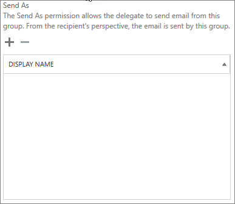
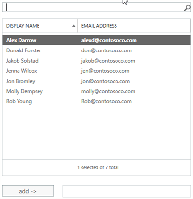

# 允許成員傳送為 」 或 「 代理群組傳送

做為群組，或代表群組已授與**傳送為**」 或 **「 代理傳送者 」** 權限的 Office 365 群組的成員現在可以傳送電子郵件。 本主題說明如何為系統管理員可以設定這些權限。
  
例如，如果謝良屬於**訓練**的 Office 365 群組擁有 「**傳送為**權限] 群組中，如果曾經傳送一封電子郵件做為群組，它看起來像**訓練**群組傳送電子郵件。 
  
**代理傳送者 」** 權限可讓 Office 365 群組代理傳送電子郵件使用者。 例如，如果 Alex Wilber 屬於**Marketing** Office 365 群組，具有**代理傳送者 」** 權限並傳送一封電子郵件做為群組、 電子郵件看起來就由**代表行銷 Alex Wilber**所傳送。

> [!IMPORTANT]
> 您可以指定的使用者，但不能兩者同時設定**傳送為**」 或 **「 代理傳送者 」** 。 如果您設定兩者，它會預設**為**傳送。

> [!TIP]
> 簽出以從群組電子郵件中[傳送電子郵件從或是代表 Office 365 群組](https://support.office.com/article/0f4964af-aec6-484b-a65c-0434df8cdb6b.aspx)了解如何使用 Outlook 和 outlook 網頁版傳送的步驟。
    
## 允許傳送電子郵件做為群組的成員

本節說明如何允許使用者傳送電子郵件做為群組中[的 Exchange 系統管理中心](https://go.microsoft.com/fwlink/p/?linkid=2059104)(EAC) 中 Exchange Online。
  
1. 在<a href="https://go.microsoft.com/fwlink/p/?linkid=2059104" target="_blank">Exchange 系統管理中心</a>中，前往 [**收件者** \> **群組**。
    
2. 選取 [**編輯**  上您想要允許使用者傳送為群組。 
    
3. 選取 [**群組委派**]。
    
4. 在 [以下列**傳送**] 區段中，選取 [**+** 新增您想要傳送做為群組的使用者登入。 
    
    
  
5. 輸入要搜尋或挑選清單中的使用者。 選取 [**確定**] 和 [**儲存**]。
    
    
  
## 允許成員代理群組傳送電子郵件

本節說明如何允許使用者傳送代表群組的電子郵件在 Exchange 系統管理中心 (EAC) 中 Exchange Online。
  
1. 在<a href="https://go.microsoft.com/fwlink/p/?linkid=2059104" target="_blank">Exchange 系統管理中心</a>中，前往 [**收件者** \> **群組**。
    
2. 選取 [**編輯**上您想要允許使用者傳送為群組。 
    
3. 選取 [**群組委派**]。
    
4. 在代理傳送者] 區段中，選取 [**+** 以新增您想要傳送做為群組的使用者登入。 
    
    
  
5. 輸入要搜尋或挑選清單中的使用者。 選取 [**確定**] 和 [**儲存**]。
    
    

## 相關文章

[深入了解 Office 365 群組](https://support.office.com/article/3f780e8e-61aa-4287-830d-ff6209cbc192.aspx)

[Add-recipientpermission](https://go.microsoft.com/fwlink/p/?LinkId=723960)

[Set-unifiedgroup](https://go.microsoft.com/fwlink/p/?LinkId=616189)
