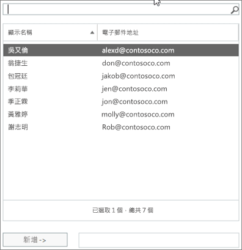
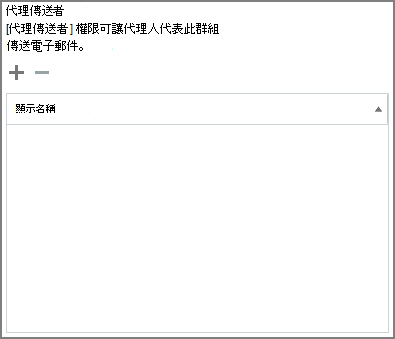

# 允許成員傳送為或代表群組傳送

「以「**代理傳送**」或「**代理傳送**者」許可權授與之 Microsoft 365 群組的成員可以傳送電子郵件給群組，或代表群組傳送電子郵件。 本主題說明管理員如何設定這些許可權。
  
例如，如果 Megan Bowen 是**訓練**Microsoft 365 群組的一部分，且具有群組的 [以該群組**傳送**] 許可權，則當她傳送電子郵件做為群組時，它看起來就像是**訓練**群組傳送電子郵件。 
  
「**代理傳送**者」許可權可讓使用者代表 Microsoft 365 群組傳送電子郵件。 例如，如果 Alex Wilber 是**行銷**Microsoft 365 群組的一部分，且具有「**代理傳送**者」許可權並傳送電子郵件做為群組，則電子郵件看起來就像是由**Alex Wilber 代表 Marketing**所傳送。

> [!IMPORTANT]
> 您可以為特定使用者設定「**傳送為**」或「**傳送代理**」，但不能同時為這兩者。 如果您同時設定兩者，則預設會**傳送為**。

> [!TIP]
> 請參閱[代表 Microsoft 365 群組傳送電子郵件](https://support.office.com/article/0f4964af-aec6-484b-a65c-0434df8cdb6b.aspx)，以瞭解如何使用 Outlook 和 outlook 網頁版以從群組傳送電子郵件。
    
## 允許成員以群組形式傳送電子郵件

本節說明如何允許使用者在 exchange Online 中以[exchange 系統管理中心](https://go.microsoft.com/fwlink/p/?linkid=2059104)（EAC）中的群組形式傳送電子郵件。
  
1. 在<a href="https://go.microsoft.com/fwlink/p/?linkid=2059104" target="_blank">Exchange 系統管理中心</a>中，**移至** \> [收件者**群組**]。
    
2. 在您要允許使用者](../../media/0cfcb590-dc51-4b4f-9276-bb2ce300d87e.png)傳送的群組上，選取 [**編輯**![編輯群組圖示]。   
    
3. 選取 [**群組委派**]。
    
4. 在 [**傳送方式**] 區段中， **+** 選取要新增為群組傳送之使用者的符號。 
    
    
  
5. 若要從清單中搜尋或挑選使用者的類型。 選取 **[確定]** 並**儲存**。
    
    
  
## 允許成員代表群組傳送電子郵件

本節說明如何允許使用者代表 exchange 系統管理中心（EAC）中的群組傳送電子郵件，在 Exchange Online 中。
  
1. 在<a href="https://go.microsoft.com/fwlink/p/?linkid=2059104" target="_blank">Exchange 系統管理中心</a>中，**移至** \> [收件者**群組**]。
    
2. 在您要允許使用者](../../media/0cfcb590-dc51-4b4f-9276-bb2ce300d87e.png)傳送的群組上，選取 [**編輯** ![編輯群組圖示]。 
    
3. 選取 [**群組委派**]。
    
4. 在 [代理傳送者] 區段中， **+** 選取要新增為群組傳送之使用者的符號。 
    
    
  
5. 若要從清單中搜尋或挑選使用者的類型。 選取 **[確定]** 並**儲存**。
    
    

## 相關文章

[深入瞭解 Microsoft 365 群組](https://support.office.com/article/learn-about-office-365-groups-b565caa1-5c40-40ef-9915-60fdb2d97fa2)

[Add-RecipientPermission](https://go.microsoft.com/fwlink/p/?LinkId=723960)

[Set-UnifiedGroup](https://go.microsoft.com/fwlink/p/?LinkId=616189)
