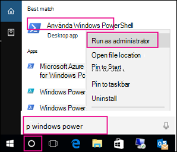
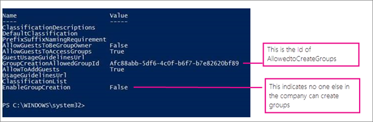

# <a name="manage-who-can-create-office-365-groups"></a><span data-ttu-id="252a4-103">管理能建立 Office 365 群組的使用者</span><span class="sxs-lookup"><span data-stu-id="252a4-103">Manage who can create Office 365 Groups</span></span>

  
<span data-ttu-id="252a4-104">因為它是很容易建立 Office 365 群組的使用者，您不許多與其建立代表其他人的要求。</span><span class="sxs-lookup"><span data-stu-id="252a4-104">Because it's so easy for users to create Office 365 Groups, you aren't inundated with requests to create them on behalf of other people.</span></span> <span data-ttu-id="252a4-105">根據您的業務，不過，您可能想要控制誰可以建立群組的能力。</span><span class="sxs-lookup"><span data-stu-id="252a4-105">Depending on your business, however, you might want to control who has the ability to create groups.</span></span>
  
<span data-ttu-id="252a4-106">本文說明如何停用建立群組 **，使用群組的所有 Office 365 服務中**的功能：</span><span class="sxs-lookup"><span data-stu-id="252a4-106">This article explains how to disable the ability to create groups **in all Office 365 services that use groups**:</span></span> 
  
- <span data-ttu-id="252a4-107">Outlook</span><span class="sxs-lookup"><span data-stu-id="252a4-107">Outlook</span></span>
    
- <span data-ttu-id="252a4-108">SharePoint</span><span class="sxs-lookup"><span data-stu-id="252a4-108">SharePoint</span></span>
    
- <span data-ttu-id="252a4-109">Yammer</span><span class="sxs-lookup"><span data-stu-id="252a4-109">Yammer</span></span>
    
- <span data-ttu-id="252a4-110">Microsoft Teams</span><span class="sxs-lookup"><span data-stu-id="252a4-110">Microsoft Teams</span></span>

- <span data-ttu-id="252a4-111">Microsoft Stream</span><span class="sxs-lookup"><span data-stu-id="252a4-111">Microsoft Stream</span></span>
    
- <span data-ttu-id="252a4-112">StaffHub</span><span class="sxs-lookup"><span data-stu-id="252a4-112">StaffHub</span></span>
    
- <span data-ttu-id="252a4-113">Planner</span><span class="sxs-lookup"><span data-stu-id="252a4-113">Planner</span></span>
    
- <span data-ttu-id="252a4-114">PowerBI</span><span class="sxs-lookup"><span data-stu-id="252a4-114">PowerBI</span></span>

- <span data-ttu-id="252a4-115">藍圖</span><span class="sxs-lookup"><span data-stu-id="252a4-115">Roadmap</span></span>
    
<span data-ttu-id="252a4-116">您可以限制 Office 365 群組建立特定的安全性群組的成員。</span><span class="sxs-lookup"><span data-stu-id="252a4-116">You can restrict Office 365 Group creation to the members of a particular security group.</span></span> <span data-ttu-id="252a4-117">若要設定此，您可以使用 Windows PowerShell。</span><span class="sxs-lookup"><span data-stu-id="252a4-117">To configure this, you use Windows PowerShell.</span></span> <span data-ttu-id="252a4-118">本文會引導您所需的步驟。</span><span class="sxs-lookup"><span data-stu-id="252a4-118">This article walks you through the needed steps.</span></span>
  
<span data-ttu-id="252a4-119">本文中的步驟，將不會阻止特定角色的成員建立群組。</span><span class="sxs-lookup"><span data-stu-id="252a4-119">The steps in this article won't prevent members of certain roles from creating Groups.</span></span> <span data-ttu-id="252a4-120">Office 365 全域系統管理員可以透過任何方法，例如 Microsoft 365 系統管理中心、 規劃、 microsoft Teams、 Exchange 和 SharePoint Online 中建立群組。</span><span class="sxs-lookup"><span data-stu-id="252a4-120">Office 365 Global admins can create Groups via any means, such as the Microsoft 365 admin center, Planner, Teams, Exchange, and SharePoint Online.</span></span> <span data-ttu-id="252a4-121">其他角色可以建立透過有限表示，以下列出的群組。</span><span class="sxs-lookup"><span data-stu-id="252a4-121">Other roles can create Groups via limited means, listed below.</span></span>
        
  - <span data-ttu-id="252a4-122">Exchange 系統管理員： Exchange 系統管理中心，Azure AD</span><span class="sxs-lookup"><span data-stu-id="252a4-122">Exchange Administrator: Exchange Admin center, Azure AD</span></span>
    
  - <span data-ttu-id="252a4-123">合作夥伴第 1 層支援： Microsoft 365 系統管理中心、 Exchange 系統管理中心中，Azure AD</span><span class="sxs-lookup"><span data-stu-id="252a4-123">Partner Tier 1 Support: Microsoft 365 Admin center, Exchange Admin center, Azure AD</span></span>
    
  - <span data-ttu-id="252a4-124">合作夥伴第 2 層支援： Microsoft 365 系統管理中心、 Exchange 系統管理中心中，Azure AD</span><span class="sxs-lookup"><span data-stu-id="252a4-124">Partner Tier 2 Support: Microsoft 365 Admin center, Exchange Admin center, Azure AD</span></span>
    
  - <span data-ttu-id="252a4-125">目錄作者： Azure AD</span><span class="sxs-lookup"><span data-stu-id="252a4-125">Directory Writers: Azure AD</span></span>

  - <span data-ttu-id="252a4-126">SharePoint 系統管理員： SharePoint 系統管理中心內，Azure AD</span><span class="sxs-lookup"><span data-stu-id="252a4-126">SharePoint Administrator: SharePoint Admin center, Azure AD</span></span>
  
  - <span data-ttu-id="252a4-127">Teams 服務系統管理員： Teams 系統管理中心，Azure AD</span><span class="sxs-lookup"><span data-stu-id="252a4-127">Teams Service Administrator: Teams Admin center, Azure AD</span></span>
  
  - <span data-ttu-id="252a4-128">使用者管理系統管理員： Microsoft 365 系統管理中心，Yammer，Azure AD</span><span class="sxs-lookup"><span data-stu-id="252a4-128">User Management Administrator: Microsoft 365 Admin center, Yammer, Azure AD</span></span>
     
<span data-ttu-id="252a4-129">如果您是上述角色成員，即可為受限的使用者建立 Office 365 群組，然後將指派使用者為群組的擁有者。</span><span class="sxs-lookup"><span data-stu-id="252a4-129">If you're a member of one of these roles, you can create Office 365 Groups for restricted users, and then assign the user as the owner of the group.</span></span> <span data-ttu-id="252a4-130">將此角色的使用者都能建立連線的群組中 Yammer，不論可能會禁止建立任何 PowerShell 設定。</span><span class="sxs-lookup"><span data-stu-id="252a4-130">Users that have this role are able to create connected groups in Yammer, regardless of any PowerShell settings that might prevent creation.</span></span>

## <a name="licensing-requirements"></a><span data-ttu-id="252a4-131">授權需求</span><span class="sxs-lookup"><span data-stu-id="252a4-131">Licensing requirements</span></span>

<span data-ttu-id="252a4-132">若要管理誰能建立群組，下列人員會需要 Azure AD Premium 授權或指派給他們的 Azure AD 基本教育授權：</span><span class="sxs-lookup"><span data-stu-id="252a4-132">To manage who creates Groups, the following people need Azure AD Premium licenses or Azure AD Basic EDU licenses assigned to them:</span></span>

- <span data-ttu-id="252a4-133">系統管理員設定這些群組建立設定</span><span class="sxs-lookup"><span data-stu-id="252a4-133">The admin who configures these group creation settings</span></span>
- <span data-ttu-id="252a4-134">可以建立群組的 [安全性] 群組成員</span><span class="sxs-lookup"><span data-stu-id="252a4-134">The members of the security group who are allowed to create Groups</span></span>

<span data-ttu-id="252a4-135">下列人員不需要指派給他們的 Azure AD Premium 或 Azure AD 基本教育授權：</span><span class="sxs-lookup"><span data-stu-id="252a4-135">The following people don't need Azure AD Premium or Azure AD Basic EDU licenses assigned to them:</span></span>

- <span data-ttu-id="252a4-136">人員誰是 Office 365 群組的成員，以及沒有建立其他群組的能力。</span><span class="sxs-lookup"><span data-stu-id="252a4-136">People who are members of Office 365 groups and who don't have the ability to create other groups.</span></span>

## <a name="step-1-create-a-security-group-for-users-who-need-to-create-office-365-groups"></a><span data-ttu-id="252a4-137">步驟 1：為需要建立 Office 365 群組的使用者建立安全性群組</span><span class="sxs-lookup"><span data-stu-id="252a4-137">Step 1: Create a security group for users who need to create Office 365 Groups</span></span>

<span data-ttu-id="252a4-138">在您的組織中只能有一個安全性群組可用來控制誰是能夠建立群組。</span><span class="sxs-lookup"><span data-stu-id="252a4-138">Only one security group in your organization can be used to control who is able to create Groups.</span></span> <span data-ttu-id="252a4-139">不過，您可以以巢狀方式內嵌其他安全性群組，做為此群組的成員。</span><span class="sxs-lookup"><span data-stu-id="252a4-139">But, you can nest other security groups as members of this group.</span></span> <span data-ttu-id="252a4-140">例如，名為「Allow Group Creation」的群組即為指定的安全性群組，而名為「Microsoft Planner Users and Exchange Online Users」的群組則屬於該群組成員。</span><span class="sxs-lookup"><span data-stu-id="252a4-140">For example, the group named Allow Group Creation is the designated security group, and the groups named Microsoft Planner Users and Exchange Online Users are members of that group.</span></span>

<span data-ttu-id="252a4-141">在上面所列的角色的系統管理員不需要是此群組的成員： 它們會保留其能夠建立群組。</span><span class="sxs-lookup"><span data-stu-id="252a4-141">Admins in the roles listed above do not need to be members of this group: they retain their ability to create groups.</span></span>

> [!IMPORTANT]
> <span data-ttu-id="252a4-142">請務必使用**安全性群組**來限制誰可以建立群組。</span><span class="sxs-lookup"><span data-stu-id="252a4-142">Be sure to use a **security group** to restrict who can create groups.</span></span> <span data-ttu-id="252a4-143">如果您嘗試使用 Office 365 群組，則成員將因 SharePoint 的安全性群組檢查而無法在當中建立群組。</span><span class="sxs-lookup"><span data-stu-id="252a4-143">If you try to use an Office 365 Group, members won't be able to create a group from SharePoint because it checks for a security group.</span></span> 
    
1. <span data-ttu-id="252a4-144">在系統管理中心，移至 [**群組** \> <a href="https://go.microsoft.com/fwlink/p/?linkid=2052855" target="_blank">群組</a>] 頁面。</span><span class="sxs-lookup"><span data-stu-id="252a4-144">In the admin center, go to the **Groups** \> <a href="https://go.microsoft.com/fwlink/p/?linkid=2052855" target="_blank">Groups</a> page.</span></span>

2. <span data-ttu-id="252a4-145">按一下 [**新增群組**]。</span><span class="sxs-lookup"><span data-stu-id="252a4-145">Click on **Add a Group**.</span></span>

3. <span data-ttu-id="252a4-146">做為群組類型，請選擇 [**安全性**]。</span><span class="sxs-lookup"><span data-stu-id="252a4-146">Choose **Security** as the group type.</span></span> <span data-ttu-id="252a4-147">請記下群組名稱！</span><span class="sxs-lookup"><span data-stu-id="252a4-147">Remember the name of the group!</span></span> <span data-ttu-id="252a4-148">以便後續步驟使用。</span><span class="sxs-lookup"><span data-stu-id="252a4-148">You'll need it later.</span></span>
  
4. <span data-ttu-id="252a4-149">完成 [安全性] 群組中，新增人員或其他安全性群組您想要能夠貴組織中建立群組的設定</span><span class="sxs-lookup"><span data-stu-id="252a4-149">Finish setting up the security group, adding people or other security groups who you want to be able to create Groups in your org.</span></span>
    
<span data-ttu-id="252a4-150">如需詳細指示，請參閱[建立、 編輯或刪除安全性群組在 Microsoft 365 系統管理中心](../email/create-edit-or-delete-a-security-group.md)。</span><span class="sxs-lookup"><span data-stu-id="252a4-150">For detailed instructions, see [Create, edit, or delete a security group in the Microsoft 365 admin center](../email/create-edit-or-delete-a-security-group.md).</span></span>
  
## <a name="step-2-install-the-preview-version-of-the-azure-active-directory-powershell-for-graph"></a><span data-ttu-id="252a4-151">步驟 2： 安裝預覽版的 Azure Active Directory PowerShell 的圖表</span><span class="sxs-lookup"><span data-stu-id="252a4-151">Step 2: Install the preview version of the Azure Active Directory PowerShell for Graph</span></span>

<span data-ttu-id="252a4-152">這些程序需要 Azure Active Directory PowerShell 的預覽版本的圖表。</span><span class="sxs-lookup"><span data-stu-id="252a4-152">These procedures require the preview version of the Azure Active Directory PowerShell for Graph.</span></span> <span data-ttu-id="252a4-153">GA 版本將無法運作。</span><span class="sxs-lookup"><span data-stu-id="252a4-153">The GA version will not work.</span></span>


> [!IMPORTANT]
> <span data-ttu-id="252a4-154">您無法在同一部電腦上安裝預覽版和 GA 版本，在同一時間。</span><span class="sxs-lookup"><span data-stu-id="252a4-154">You cannot install both the preview and GA versions on the same computer at the same time.</span></span> <span data-ttu-id="252a4-155">您可以在 Windows 10、 Windows Server 2016 上安裝此模組。</span><span class="sxs-lookup"><span data-stu-id="252a4-155">You can install the module on Windows 10, Windows Server 2016.</span></span>

  
<span data-ttu-id="252a4-156">As a best practice, we recommend  *always*  staying current: uninstall the old AzureADPreview or old AzureAD version and get the latest one.</span><span class="sxs-lookup"><span data-stu-id="252a4-156">As a best practice, we recommend  *always*  staying current: uninstall the old AzureADPreview or old AzureAD version and get the latest one.</span></span> 
  
1. <span data-ttu-id="252a4-157">在搜尋列中，輸入 Windows PowerShell。</span><span class="sxs-lookup"><span data-stu-id="252a4-157">In your search bar, type Windows PowerShell.</span></span>
    
2. <span data-ttu-id="252a4-158">在**Windows PowerShell**上按一下滑鼠右鍵，然後選取 [**以管理員身分執行**。</span><span class="sxs-lookup"><span data-stu-id="252a4-158">Right-click on **Windows PowerShell** and select **Run as Administrator**.</span></span>
    
    
    
3. <span data-ttu-id="252a4-160">使用[Set-executionpolicy](https://docs.microsoft.com/powershell/module/microsoft.powershell.security/set-executionpolicy)RemoteSigned 之中設定原則。</span><span class="sxs-lookup"><span data-stu-id="252a4-160">Set the policy to RemoteSigned by using [Set-ExecutionPolicy](https://docs.microsoft.com/powershell/module/microsoft.powershell.security/set-executionpolicy).</span></span>
    
    ```
    Set-ExecutionPolicy RemoteSigned
    ```
  
4. <span data-ttu-id="252a4-161">檢查已安裝的模組：</span><span class="sxs-lookup"><span data-stu-id="252a4-161">Check installed module:</span></span>
    
    ```
    Get-InstalledModule -Name "AzureAD*"
    ```

5. <span data-ttu-id="252a4-162">若要解除安裝舊版 AzureADPreview 或 AzureAD，請執行此命令：</span><span class="sxs-lookup"><span data-stu-id="252a4-162">To uninstall a previous version of AzureADPreview or AzureAD, run this command:</span></span>
  
    ```
    Uninstall-Module AzureADPreview
    ```

    <span data-ttu-id="252a4-163">或</span><span class="sxs-lookup"><span data-stu-id="252a4-163">or</span></span>
  
    ```
    Uninstall-Module AzureAD
    ```

6. <span data-ttu-id="252a4-164">To install the latest version of AzureADPreview, run this command:</span><span class="sxs-lookup"><span data-stu-id="252a4-164">To install the latest version of AzureADPreview, run this command:</span></span>
  
    ```
    Install-Module AzureADPreview
    ```

    <span data-ttu-id="252a4-165">At the message about an untrusted repository, type **Y**. It will take a minute or so for the new module to install. </span><span class="sxs-lookup"><span data-stu-id="252a4-165">At the message about an untrusted repository, type **Y**. It will take a minute or so for the new module to install.</span></span>

<span data-ttu-id="252a4-166">離開的 PowerShell 中的步驟 3 中，開啟下方的視窗。</span><span class="sxs-lookup"><span data-stu-id="252a4-166">Leave the PowerShell window open for Step 3, below.</span></span>
  
## <a name="step-3-run-powershell-commands"></a><span data-ttu-id="252a4-167">步驟 3： 執行 PowerShell 命令</span><span class="sxs-lookup"><span data-stu-id="252a4-167">Step 3: Run PowerShell commands</span></span>

<span data-ttu-id="252a4-168">將下列指令碼複製到文字編輯器，例如 [記事本] 或[Windows PowerShell ISE](https://docs.microsoft.com/powershell/scripting/components/ise/introducing-the-windows-powershell-ise)。</span><span class="sxs-lookup"><span data-stu-id="252a4-168">Copy the script below into a text editor, such as Notepad, or the [Windows PowerShell ISE](https://docs.microsoft.com/powershell/scripting/components/ise/introducing-the-windows-powershell-ise).</span></span>

<span data-ttu-id="252a4-169">取代*\<SecurityGroupName\>* 您建立的 [安全性] 群組的名稱。</span><span class="sxs-lookup"><span data-stu-id="252a4-169">Replace *\<SecurityGroupName\>* with the name of the security group that you created.</span></span> <span data-ttu-id="252a4-170">例如：</span><span class="sxs-lookup"><span data-stu-id="252a4-170">For example:</span></span>

`$GroupName = "Group Creators"`

<span data-ttu-id="252a4-171">將檔案儲存為 GroupCreators.ps1。</span><span class="sxs-lookup"><span data-stu-id="252a4-171">Save the file as GroupCreators.ps1.</span></span> 

<span data-ttu-id="252a4-172">在 PowerShell 視窗中，瀏覽至您儲存檔案的所在位置 (型別 」 CD <FileLocation>")。</span><span class="sxs-lookup"><span data-stu-id="252a4-172">In the PowerShell window, navigate to the location where you saved the file (type "CD <FileLocation>").</span></span>

<span data-ttu-id="252a4-173">執行指令碼中輸入：</span><span class="sxs-lookup"><span data-stu-id="252a4-173">Run the script by typing:</span></span>

`.\GroupCreators.ps1`

<span data-ttu-id="252a4-174">並[使用您系統管理員帳戶登入](https://docs.microsoft.com/office365/enterprise/powershell/connect-to-office-365-powershell#step-2-connect-to-azure-ad-for-your-office-365-subscription)提示時。</span><span class="sxs-lookup"><span data-stu-id="252a4-174">and [sign in with your administrator account](https://docs.microsoft.com/office365/enterprise/powershell/connect-to-office-365-powershell#step-2-connect-to-azure-ad-for-your-office-365-subscription) when prompted.</span></span>

```PowerShell
$GroupName = "<SecurityGroupName>"
$AllowGroupCreation = "False"

Connect-AzureAD

$settingsObjectID = (Get-AzureADDirectorySetting | Where-object -Property Displayname -Value "Group.Unified" -EQ).id
if(!$settingsObjectID)
{
      $template = Get-AzureADDirectorySettingTemplate | Where-object {$_.displayname -eq "group.unified"}
    $settingsCopy = $template.CreateDirectorySetting()
    New-AzureADDirectorySetting -DirectorySetting $settingsCopy
    $settingsObjectID = (Get-AzureADDirectorySetting | Where-object -Property Displayname -Value "Group.Unified" -EQ).id
}

$settingsCopy = Get-AzureADDirectorySetting -Id $settingsObjectID
$settingsCopy["EnableGroupCreation"] = $AllowGroupCreation

if($GroupName)
{
    $settingsCopy["GroupCreationAllowedGroupId"] = (Get-AzureADGroup -SearchString $GroupName).objectid
}
 else {
$settingsCopy["GroupCreationAllowedGroupId"] = $GroupName
}
Set-AzureADDirectorySetting -Id $settingsObjectID -DirectorySetting $settingsCopy

(Get-AzureADDirectorySetting -Id $settingsObjectID).Values
```

<span data-ttu-id="252a4-175">指令碼的最後一行會顯示更新的設定：</span><span class="sxs-lookup"><span data-stu-id="252a4-175">The last line of the script will display the updated settings:</span></span>



<span data-ttu-id="252a4-177">如果在未來您想要變更所用的 [安全性] 群組，您可以重新執行指令碼以新的 [安全性] 群組的名稱。</span><span class="sxs-lookup"><span data-stu-id="252a4-177">If in the future you want to change which security group is used, you can rerun the script with the name of the new security group.</span></span>

<span data-ttu-id="252a4-178">如果您想要關閉群組建立限制，並再次允許建立群組的所有使用者，將 $GroupName 設定為 「 」 為"True"$AllowGroupCreation 並重新執行指令碼。</span><span class="sxs-lookup"><span data-stu-id="252a4-178">If you want to turn off the group creation restriction and again allow all users to create groups, set $GroupName to "" and $AllowGroupCreation to "True" and rerun the script.</span></span>
    
## <a name="step-4-verify-that-it-works"></a><span data-ttu-id="252a4-179">步驟 4： 確認其運作方式</span><span class="sxs-lookup"><span data-stu-id="252a4-179">Step 4: Verify that it works</span></span>

1. <span data-ttu-id="252a4-180">請使用不具備群組建立能力的使用者帳戶登入 Office 365。</span><span class="sxs-lookup"><span data-stu-id="252a4-180">Sign in to Office 365 with a user account of someone who should NOT have the ability to create groups.</span></span> <span data-ttu-id="252a4-181">也就是說，它們不為您建立的 [安全性] 群組的成員或系統管理員。</span><span class="sxs-lookup"><span data-stu-id="252a4-181">That is, they are not a member of the security group you created or an administrator.</span></span>
    
2. <span data-ttu-id="252a4-182">選取 [ **planner]** 磚。</span><span class="sxs-lookup"><span data-stu-id="252a4-182">Select the **Planner** tile.</span></span> 
    
3. <span data-ttu-id="252a4-183">在 Planner 中，選取 [建立計劃的左方導覽中的**新方案**。</span><span class="sxs-lookup"><span data-stu-id="252a4-183">In Planner, select **New Plan** in the left navigation to create a plan.</span></span> 
  
4. <span data-ttu-id="252a4-184">您應該取得規劃及群組建立已停用郵件。</span><span class="sxs-lookup"><span data-stu-id="252a4-184">You should get a message that plan and group creation is disabled.</span></span>

<span data-ttu-id="252a4-185">重試相同的程序的 [安全性] 群組的成員。</span><span class="sxs-lookup"><span data-stu-id="252a4-185">Try the same procedure again with a member of the security group.</span></span>

> [!NOTE]
> <span data-ttu-id="252a4-186">如果 [安全性] 群組的成員不能建立群組，請檢查它們不在透過其[OWA 信箱原則](https://go.microsoft.com/fwlink/?linkid=852135)遭到封鎖。</span><span class="sxs-lookup"><span data-stu-id="252a4-186">If members of the security group aren't able to create groups, check that they aren't being blocked through their [OWA mailbox policy](https://go.microsoft.com/fwlink/?linkid=852135).</span></span>
    
## <a name="related-articles"></a><span data-ttu-id="252a4-187">相關文章</span><span class="sxs-lookup"><span data-stu-id="252a4-187">Related articles</span></span>

[<span data-ttu-id="252a4-188">開始使用 Office 365 PowerShell</span><span class="sxs-lookup"><span data-stu-id="252a4-188">Getting started with Office 365 PowerShell</span></span>](https://go.microsoft.com/fwlink/p/?LinkId=808033)

[<span data-ttu-id="252a4-189">設定 Azure Active Directory 中的自助群組管理</span><span class="sxs-lookup"><span data-stu-id="252a4-189">Set up self-service group management in Azure Active Directory</span></span>](https://docs.microsoft.com/azure/active-directory/users-groups-roles/groups-self-service-management)

[<span data-ttu-id="252a4-190">Set-ExecutionPolicy</span><span class="sxs-lookup"><span data-stu-id="252a4-190">Set-ExecutionPolicy</span></span>](https://docs.microsoft.com/powershell/module/microsoft.powershell.security/set-executionpolicy)

[<span data-ttu-id="252a4-191">設定群組設定 azure Active Directory cmdlet</span><span class="sxs-lookup"><span data-stu-id="252a4-191">Azure Active Directory cmdlets for configuring group settings</span></span>](https://docs.microsoft.com/azure/active-directory/users-groups-roles/groups-settings-cmdlets)
