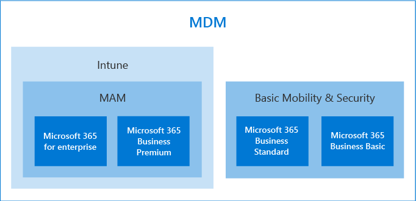

# 保護裝置和應用程式資料的選項Options for protecting your devices and app data

您可以使用數種方式來保護組織中的裝置及資料與 Microsoft 365 for business 及 enterprise。You have several ways to secure your organizations devices and data on them with Microsoft 365 for business and enterprise. 您可以使用下列獨立方案：You can use the following stand-alone plans:

- Intune (Microsoft 端點管理的一部分) Intune (a part of Microsoft Endpoint Management)
- Azure Active Directory Premium 方案。Azure Active Directory Premium plans.
- 基本行動及安全性 (包含在大多數 Microsoft 365 for business 和 enterprise 方案中) 或使用包含一些或所有先前獨立方案的訂閱。Basic Mobility and Security (included in most Microsoft 365 for business and enterprise plans) Or use the subscriptions that include some, or all of the previous standalone plans.

- Microsoft 365 商務版特優訂閱，包含300使用者的小型企業安全性和威脅防護。A Microsoft 365 Business Premium subscription, which includes security and threat protection for small business under 300 users.
- 包含高級安全性和威脅防護的 Microsoft 365 企業版方案。Microsoft 365 Enterprise plans that include advanced security and threat protection.

## 裝置管理選項Device management options

- **基本行動性和安全性** 是透過大多數 microsoft 365 方案提供，也是 Microsoft 365 business Standard 和 Microsoft 365 business Basic 唯一提供的內建選擇。**Basic Mobility and Security** is offered with most Microsoft 365 plans, and is the only built-in choice offered for Microsoft 365 Business Standard and Microsoft 365 Business Basic. 如需詳細資訊，請參閱 [基本行動性和安全性的可用性](../basic-mobility-security/choose-between-basic-mobility-and-security-and-intune.md#availability-of-basic-mobility-and-security-and-intune)。For more information, see [availability of Basic Mobility and Security](../basic-mobility-security/choose-between-basic-mobility-and-security-and-intune.md#availability-of-basic-mobility-and-security-and-intune). 

    如果您有 Microsoft 365 Business Basic 或 Microsoft 365 Business Standard，您也可以購買 Intune （如果您的組織有更複雜的安全性需求）。If you have either Microsoft 365 Business Basic or Microsoft 365 Business Standard, you can also purchase Intune if your organization has more complex security needs.
 
- **Microsoft Intune** 是一套獨立的方案，也包含一些 Microsoft 365 for business 或 enterprise plan。**Microsoft Intune** is a stand-alone plan that is also included with some Microsoft 365 for business or enterprise plans. 如果您有 Intune 做為獨立或訂閱的一部分，它會提供微調裝置和應用程式資料管理的能力。If you have Intune either as a stand-alone or a part of your subscription, it provides ability to fine-tune your device and app-data management. 如需 Microsoft 365 可用性的相關資訊，請參閱 [Intune 的可用性](../basic-mobility-security/choose-between-basic-mobility-and-security-and-intune.md#availability-of-basic-mobility-and-security-and-intune)。For more information on availability with Microsoft 365, see [availability of Intune](../basic-mobility-security/choose-between-basic-mobility-and-security-and-intune.md#availability-of-basic-mobility-and-security-and-intune).

    Microsoft Intune 是一種雲端式服務，其重點在於行動裝置管理 (MDM) 和行動應用程式管理 (MAM) 。Microsoft Intune is a cloud-based service that focuses on mobile device management (MDM) and mobile application management (MAM). 您可以控制組織裝置的使用方式，包括行動電話、平板電腦和可擕式電腦。You control how your organization’s devices are used, including mobile phones, tablets, and laptops. 您也可以設定特定原則來控制應用程式。You can also configure specific policies to control applications. 如需詳細資訊，請參閱 [Microsoft Intune 檔](https://docs.microsoft.com/mem/intune/)。For more information, see [Microsoft Intune documentation](https://docs.microsoft.com/mem/intune/).

- **Azure Active Directory (AD) 優質** 方案是獨立的方案，也就是一些 Microsoft 365 for business 和 enterprise 方案隨附的獨立方案。**Azure Active Directory (AD) Premium** plans are standalone plans that also come with some of the Microsoft 365 for business and enterprise plans. 如需詳細資訊，請參閱 [AZURE AD 定價](https://azure.microsoft.com/pricing/details/active-directory/)。For more information, see [Azure AD pricing](https://azure.microsoft.com/pricing/details/active-directory/).

     Azure AD Premium P1 和 Azure AD Premium P2 可讓您設定條件式存取功能、自我服務密碼重設等。如需有關高級方案功能的詳細資訊，請參閱 [AZURE AD 定價](https://azure.microsoft.com/pricing/details/active-directory/) 頁面。Azure AD Premium P1 and Azure AD Premium P2 allow you to set conditional access features, self-service password reset, etc. For more information on the capabilities of the Premium plans, see [Azure AD pricing](https://azure.microsoft.com/pricing/details/active-directory/) page.
- **Microsoft 365 商務版 premium** 包含 Intune 和 Azure Active Directory Premium P1 和 Office 365 高級威脅防護。**Microsoft 365 Business Premium** includes Intune and Azure Active Directory Premium P1 and Office 365 Advanced Threat Protection. 
 
    Microsoft 365 商務版特優提供一組原則範本，用以保護您的裝置及應用程式資料。Microsoft 365 Business Premium offers a set of policy templates for securing your devices and app data. 它可為300使用者下的大部分公司提供良好的安全性和威脅防護層級。It offers a good level of security and threat protection for most businesses under 300 users. 如需詳細資訊，請參閱 [在安裝精靈中設定 Microsoft 365 商務版特優](../../business/set-up.md)功能、 [安全的 Windows 10 電腦](../../business/secure-win-10-pcs.md)，以及 [Microsoft 365 商務版的安全性和合規性功能](../../business/security-features.md)。For more information, see [set up Microsoft 365 Business Premium in the setup wizard](../../business/set-up.md), [secure Windows 10 computers](../../business/secure-win-10-pcs.md),  and [Microsoft 365 Business Premium security and compliance features](../../business/security-features.md).

- **適用于企業訂閱的 microsoft 365** 包括 microsoft Intune 和 E5 也包含 Azure AD premium 方案1和2。**Microsoft 365 for enterprise** subscriptions include Microsoft Intune and E5 also includes the Azure AD premium plans 1 and 2.

    Microsoft 365 E5 可提供所有 Microsoft 365 訂閱的最高安全性和威脅防護等級。Microsoft 365 E5 offers the highest level of security and threat protection of all the Microsoft 365 subscriptions. 如需詳細資訊，請參閱 [Microsoft 365 for enterprise 一覽](../../enterprise/microsoft-365-overview.md)。For more information, see [Microsoft 365 for enterprise overview](../../enterprise/microsoft-365-overview.md).
