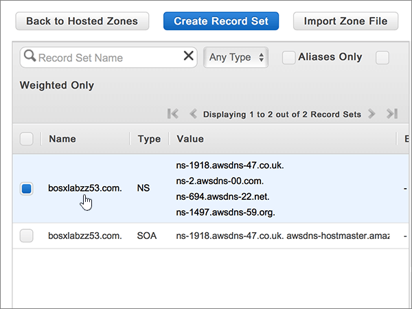
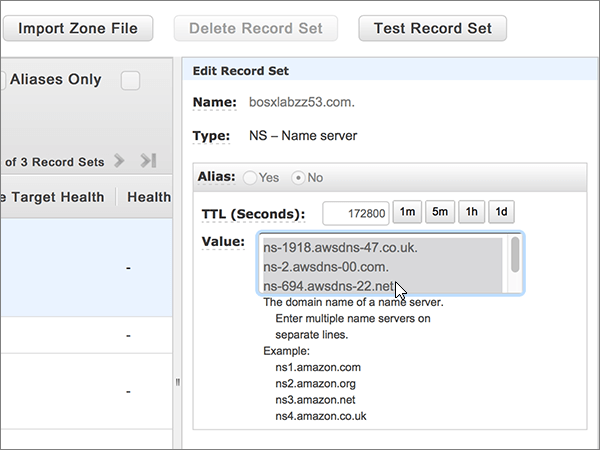

# 變更名稱伺服器以使用 Amazon Web Services (AWS) 設定 Office 365

 若您找不到所需功能，請**[檢查網域常見問題集](../setup/domains-faq.md)**。 
  
如果您希望讓 Office 365 來管理您的 Office 365 DNS 記錄，請遵循下列指示。(如果您想要的話，可以[在 AWS 管理所有的 Office 365 DNS 記錄](create-dns-records-at-aws.md)。)
  
    
## 新增 TXT 記錄以供驗證

在您將自己的網域用於 Office 365 之前，我們必須先確認您擁有該網域。如果您能在自己的網域註冊機構登入自己的帳戶並能建立 DNS 記錄，Office 365 就能確信您擁有該網域。
  
> [!NOTE]
> 這筆記錄只會用於驗證您擁有自己的網域，不會影響其他項目。您可以選擇稍後再刪除記錄。 
  
1. 首先請用[這個連結](https://console.aws.amazon.com/route53/home)移至 AWS 上您的網域頁面。系統會提示您先登入。
    
2. 在 [**資源**] 頁面上，選取 [**託管區域**]。
    
3. 在 [**託管區域**] 頁面上，在**網域名稱**] 欄中，選取您想要編輯的網域名稱。 
    
4. 選取 [**建立記錄集**。
    
5. In the **Create Record Set** area, in the boxes for the new record, type or copy and paste the values from the following table. 
    
    (Choose the **Type** and **Routing Policy** values from the drop-down lists.) 
    
    > [!TIP]
    > The quotation marks required by the onscreen instructions are supplied automatically. You don't need to type them manually. 
  
|||||||
|:-----|:-----|:-----|:-----|:-----|:-----|
|**Name**   |**Type**   |**Alias**   |**TTL (Seconds)**   |**值**   |**Routing Policy**   |
|（此欄位請保留空白）    |TXT - Text    |否    |300    |MS=ms *XXXXXXXX*   **附註：** 這是範例。 Use your specific **Destination or Points to Address** value here, from the table in Office 365. [How do I find this?](../get-help-with-domains/information-for-dns-records.md)     |簡易   |
   
6. 選取 [建立]****。
    
7. 繼續進行之前，請先稍候幾分鐘，好讓您剛剛建立的記錄能在網際網路上更新。
    
Now that you've added the record at your domain registrar's site, you'll go back to Office 365 and request Office 365 to look for the record.
  
When Office 365 finds the correct TXT record, your domain is verified.
  
1. 在系統管理中心，移至 [**設定** \> <a href="https://go.microsoft.com/fwlink/p/?linkid=834818" target="_blank">網域</a>] 頁面。

    
2. 在 [**網域**] 頁面上，選取您要驗證的網域。 
    
3. 在 [**安裝**] 頁面上，選取 [**啟動安裝程式**。
    
4. 在 [**驗證網域**] 頁面上，選取 [**驗證**]。
    
> [!NOTE]
> Typically it takes about 15 minutes for DNS changes to take effect. However, it can occasionally take longer for a change you've made to update across the Internet's DNS system. 如果您遇到與郵件流程或其他問題新增 DNS 記錄之後，請參閱[尋找並修正新增網域或 Office 365 中的 DNS 記錄之後所發生的問題](../get-help-with-domains/find-and-fix-issues.md)。 
  
## 變更您網域的名稱伺服器 (NS) 記錄

如要完成網域設定以用於 Office 365，請在您的網域註冊機構更改網域的 NS 記錄，使它指向 Office 365 主要和次要名稱伺服器。這樣就會設定並讓 Office 365 為您更新網域的 DNS 記錄。我們會新增所有記錄，好讓電子郵件、商務用 Skype Online 和您的公用網站都能使用您的網域，為您做好一切準備。
  
> [!CAUTION]
> 當您變更網域的 NS 記錄以指向 Office 365 名稱伺服器時，所有目前與您網域相關聯的服務都會受到影響。例如，在您完成這項變更之後，凡是傳送到您的網域 (例如 rob@ *your_domain*  .com) 的電子郵件都將開始傳送到 Office 365。 
  
> [!IMPORTANT]
>  下列程序將告訴您如何從清單中，刪除任何其他不想要的名稱以及 how to： 新增如果他們沒有 」 列出正確的名稱伺服器。 當您完成在此區段中，應該會列出的唯一名稱伺服器的步驟 > 是這四個: > ns1.bdm.microsoftonline.com > ns2.bdm.microsoftonline.com > ns3.bdm.microsoftonline.com > ns4.bdm.microsoftonline.com 
  
1. 首先請用[這個連結](https://console.aws.amazon.com/route53/home)移至 AWS 上您的網域頁面。 系統會提示您先登入。
    
2. 在 [**資源**] 頁面上，選取 [**託管區域**]。
    
3. 在 [**託管區域**] 頁面上，在**網域名稱**] 欄中，選取您想要編輯的網域名稱。 
    
4. 選取**名稱伺服器**記錄集。 
    
    
  
5. **NS-名稱伺服器**記錄中**的值**] 方塊中設定，刪除所有名稱伺服器選取全部，然後按鍵盤上的**Delete**鍵。 
    
    > [!CAUTION]
    > Follow these steps only if you have existing nameservers other than the four correct nameservers. (也就是刪除只是任何目前的名稱*未*命名為**ns1.bdm.microsoftonline.com**、 **ns2.bdm.microsoftonline.com**、 **ns3.bdm.microsoftonline.com**或**ns4.bdm.microsoftonline.com**。) 
  
    
  
6. 在 [ **TTL （秒）：** ] 區域中，選取 [ **1h]** （1 小時）。 
    
    ![選取一小時 1h]](../media/c70070e1-4bde-41a7-b271-9d22c475edf6.png)
  
7. 仍在**NS-名稱伺服器**記錄設定，請在 [**值**] 方塊中，輸入或複製貼上下表中，**第一行**值，然後按**Enter**鍵上您的鍵盤並輸入或複製並貼上的下一個**行**值。 
    
    > [!IMPORTANT]
    > 每個名稱伺服器值，*必須*是自己 [**值**] 方塊內的個別行上，如下圖所示。 
  
|||
|:-----|:-----|
|**第一行**   |ns1.bdm.microsoftonline.com。    **This value MUST end with a period (.)**   |
|**第二行**   |ns2.bdm.microsoftonline.com。    **This value MUST end with a period (.)**   |
|**第三行**   |ns3.bdm.microsoftonline.com。    **This value MUST end with a period (.)**   |
|**第四行**   |ns4.bdm.microsoftonline.com。    **This value MUST end with a period (.)**   |
   
   ![鍵入或貼上值] 方塊中的第一個行值](../media/b63f41e0-51ef-4ab2-a4b8-ee7380e5ab35.png)
  
8. 選取 [**儲存記錄集**。
    
    
  
> [!NOTE]
> 您的名稱伺服器記錄更新可能需要數小時的時間，才能更新到整個網際網路的 DNS 系統。接著，您的 Office 365 電子郵件和其他服務就能搭配您的網域順利運作。 
