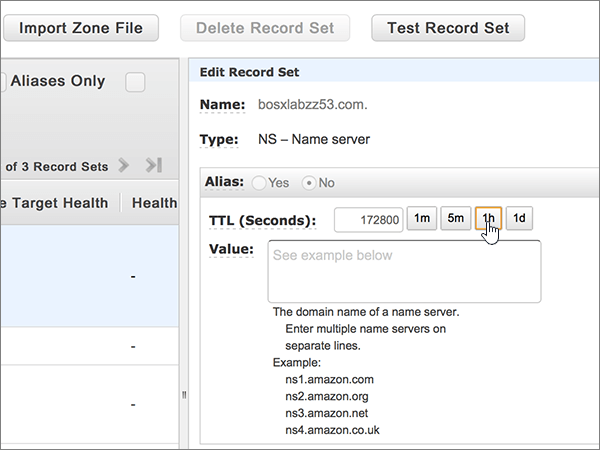

# 變更名稱伺服器以使用 Amazon Web Services (AWS) 設定 Office 365Change nameservers to set up Office 365 with Amazon Web Services (AWS)

 若您找不到所需功能，請**[檢查網域常見問題集](../setup/domains-faq.md)**。**[Check the Domains FAQ](../setup/domains-faq.md)** if you don't find what you're looking for. 
  
如果您希望讓 Office 365 來管理您的 Office 365 DNS 記錄，請遵循下列指示。(如果您想要的話，可以[在 AWS 管理所有的 Office 365 DNS 記錄](create-dns-records-at-aws.md)。)Follow these instructions if you want Office 365 to manage your Office 365 DNS records for you. (If you prefer, you can [manage all your Office 365 DNS records at AWS](create-dns-records-at-aws.md).)
  
    
## 新增 TXT 記錄以供驗證Add a TXT record for verification

在您將自己的網域用於 Office 365 之前，我們必須先確認您擁有該網域。如果您能在自己的網域註冊機構登入自己的帳戶並能建立 DNS 記錄，Office 365 就能確信您擁有該網域。Before you use your domain with Office 365, we have to make sure that you own it. Your ability to log in to your account at your domain registrar and create the DNS record proves to Office 365 that you own the domain.
  
> [!NOTE]
> 這筆記錄只會用於驗證您擁有自己的網域，不會影響其他項目。您可以選擇稍後再刪除記錄。This record is used only to verify that you own your domain; it doesn't affect anything else. You can delete it later, if you like. 
  
1. 首先請用[這個連結](https://console.aws.amazon.com/route53/home)移至 AWS 上您的網域頁面。系統會提示您先登入。To get started, go to your domains page at AWS by using [this link](https://console.aws.amazon.com/route53/home). You'll be prompted to log in first.
    
2. 在 [**資源**] 頁面上，選取 [**主控區域**]。On the **Resources** page, select **Hosted Zones**.
    
3. 在 [**主控區域**] 頁面上的 [**功能變數名稱**] 欄中，選取您要編輯的網功能變數名稱稱。On the **Hosted Zones** page, in the **Domain Name** column, select the name of the domain that you want to edit. 
    
4. 選取 [**建立記錄集**]。Select **Create Record Set**.
    
5. In the **Create Record Set** area, in the boxes for the new record, type or copy and paste the values from the following table.In the **Create Record Set** area, in the boxes for the new record, type or copy and paste the values from the following table. 
    
    (Choose the **Type** and **Routing Policy** values from the drop-down lists.)(Choose the **Type** and **Routing Policy** values from the drop-down lists.) 
    
    > [!TIP]
    > The quotation marks required by the onscreen instructions are supplied automatically. You don't need to type them manually.The quotation marks required by the onscreen instructions are supplied automatically. You don't need to type them manually. 
  
|||||||
|:-----|:-----|:-----|:-----|:-----|:-----|
|**名稱****Name**   |**Type****Type**   |**Alias****Alias**   |**TTL (Seconds)****TTL (Seconds)**   |**值****Value**   |**Routing Policy****Routing Policy**   |
|（將此欄位保留空白）(Leave this field empty)    |TXT - TextTXT - Text    |否No    |300300    |MS=ms *XXXXXXXX*MS=ms *XXXXXXXX*   **附註：** 這是範例。**Note:** This is an example. 在這裡請使用您自己的 [目的地或指向位址] 值，請參閱 Office 365 表格。Use your specific **Destination or Points to Address** value here, from the table in Office 365. [如何找到呢？How do I find this?](../get-help-with-domains/information-for-dns-records.md)     |簡易Simple   |
   
6. 選取 [建立]\*\*\*\*。Select **Create**.
    
7. 繼續進行之前，請先稍候幾分鐘，好讓您剛剛建立的記錄能在網際網路上更新。Wait a few minutes before you continue, so that the record you just created can update across the Internet.
    
現在您已在網域註冊機構網站新增記錄，請返回 Office 365 並要求 Office 365 尋找該記錄。Now that you've added the record at your domain registrar's site, you'll go back to Office 365 and request Office 365 to look for the record.
  
在 Office 365 找到正確的 TXT 記錄後，您的網域就完成驗證了。When Office 365 finds the correct TXT record, your domain is verified.
  
1. 在系統管理中心中，移至 **[設定]** \> <a href="https://go.microsoft.com/fwlink/p/?linkid=834818" target="_blank">[網域]</a> 頁面。In the admin center, go to the **Settings** \> <a href="https://go.microsoft.com/fwlink/p/?linkid=834818" target="_blank">Domains</a> page.

    
2. 在 **[網域]** 頁面上，選取您要驗證的網域。On the **Domains** page, select the domain that you are verifying. 
    
3. 在 **[設定]** 頁面上，選取 **[開始設定]**。On the **Setup** page, select **Start setup**.
    
4. 在 [驗證網域]\*\*\*\* 頁面上，選取 [驗證]\*\*\*\*。On the **Verify domain** page, select **Verify**.
    
> [!NOTE]
> Typically it takes about 15 minutes for DNS changes to take effect.Typically it takes about 15 minutes for DNS changes to take effect. 而如果您所做的變更要在整個網際網路 DNS 系統中生效，有時可能需要更久的時間。However, it can occasionally take longer for a change you've made to update across the Internet's DNS system. 在您新增 DNS 記錄後，如有郵件流程或其他方面的問題，請參閱[尋找並修正在 Office 365 中新增網域或 DNS 記錄之後所發生的問題](../get-help-with-domains/find-and-fix-issues.md)。If you're having trouble with mail flow or other issues after adding DNS records, see [Find and fix issues after adding your domain or DNS records in Office 365](../get-help-with-domains/find-and-fix-issues.md). 
  
## 變更您網域的名稱伺服器 (NS) 記錄Change your domain's nameserver (NS) records

如要完成網域設定以用於 Office 365，請在您的網域註冊機構更改網域的 NS 記錄，使它指向 Office 365 主要和次要名稱伺服器。這樣就會設定並讓 Office 365 為您更新網域的 DNS 記錄。我們會新增所有記錄，好讓電子郵件、商務用 Skype Online 和您的公用網站都能使用您的網域，為您做好一切準備。To complete setting up your domain with Office 365, you change your domain's NS records at your domain registrar to point to the Office 365 primary and secondary name servers. This sets up Office 365 to update the domain's DNS records for you. We'll add all records so that email, Skype for Business Online, and your public website work with your domain, and you'll be all set.
  
> [!CAUTION]
> 當您變更網域的 NS 記錄以指向 Office 365 名稱伺服器時，所有目前與您網域相關聯的服務都會受到影響。例如，在您完成這項變更之後，凡是傳送到您的網域 (例如 rob@ *your_domain*  .com) 的電子郵件都將開始傳送到 Office 365。When you change your domain's NS records to point to the Office 365 name servers, all the services that are currently associated with your domain are affected. For example, all email sent to your domain (like rob@ *your_domain*  .com) will start coming to Office 365 after you make this change. 
  
> [!IMPORTANT]
>  下列程式將告訴您如何刪除清單中的任何其他、不想要的名稱伺服器，以及如何新增正確的名稱伺服器（如果尚未列出）。The following procedure will show you how to delete any other, unwanted nameservers from the list, and also how to add the correct nameservers if they are not already listed. > 完成本節中的步驟之後，應該會列出的唯一名稱伺服器為下列四種： > ns1.bdm.microsoftonline.com > ns2.bdm.microsoftonline.com > ns3.bdm.microsoftonline.com > ns4.bdm.microsoftonline.com>  When you have completed the steps in this section, the only nameservers that should be listed are these four: >  ns1.bdm.microsoftonline.com >  ns2.bdm.microsoftonline.com >  ns3.bdm.microsoftonline.com >  ns4.bdm.microsoftonline.com 
  
1. 首先請用[這個連結](https://console.aws.amazon.com/route53/home)移至 AWS 上您的網域頁面。To get started, go to your domains page at AWS by using [this link](https://console.aws.amazon.com/route53/home). 系統會提示您先登入。You'll be prompted to log in first.
    
2. 在 [**資源**] 頁面上，選取 [**主控區域**]。On the **Resources** page, select **Hosted Zones**.
    
3. 在 [**主控區域**] 頁面上的 [**功能變數名稱**] 欄中，選取您要編輯的網功能變數名稱稱。On the **Hosted Zones** page, in the **Domain Name** column, select the name of the domain that you want to edit. 
    
4. 選取 [**名稱**伺服器] 記錄集。Select the **Nameserver** record set. 
    
    
  
5. 在 [**值**] 方塊的 [ **NS-名稱伺服器**] 記錄集中，選取所有的名稱伺服器，然後按下鍵盤上的**delete**鍵來刪除所有。In the **NS - Name server** record set in the **Value** box, delete all of the nameservers by selecting them all and then pressing the **Delete** key on your keyboard. 
    
    > [!CAUTION]
    > Follow these steps only if you have existing nameservers other than the four correct nameservers.Follow these steps only if you have existing nameservers other than the four correct nameservers. （也就是說，只刪除所有*未*命名為**ns1.bdm.microsoftonline.com**、 **ns2.bdm.microsoftonline.com**、 **ns3.bdm.microsoftonline.com**或**ns4.bdm.microsoftonline.com**的目前名稱伺服器。）(That is, delete only any current nameservers that are  *not*  named **ns1.bdm.microsoftonline.com**, **ns2.bdm.microsoftonline.com**, **ns3.bdm.microsoftonline.com**, or **ns4.bdm.microsoftonline.com**.) 
  
    
  
6. 在 [ **TTL （秒）：** ] 區域中，選取 [ **1H** （1小時）]。In the **TTL (Seconds):** area, select **1h** (1 Hour). 
    
    
  
7. 仍在**NS 名稱伺服器**記錄集中的 [**值**] 方塊中，輸入或複製並貼上下表中的**第一個行**值，然後按下鍵盤上的**Enter**鍵，然後輸入或複製並貼上下**一行**的值。Still in the **NS - Name server** record set, in the **Value** box, type or copy and paste the **First line** value from the following table, then press the **Enter** key on your keyboard and type or copy and paste the next **line** value. 
    
    > [!IMPORTANT]
    > 每個名稱伺服器值都*必須*在 [**值**] 方塊中各自的個別行上，如下圖所示。Each nameserver value  *must*  be on its own separate line within the **Value** box, as shown in the following illustration. 
  
|||
|:-----|:-----|
|**第一行****First line**   |ns1.bdm.microsoftonline.com。ns1.bdm.microsoftonline.com.    **This value MUST end with a period (.)****This value MUST end with a period (.)**   |
|**第二行****Second line**   |ns2.bdm.microsoftonline.com。ns2.bdm.microsoftonline.com.    **This value MUST end with a period (.)****This value MUST end with a period (.)**   |
|**第三行****Third line**   |ns3.bdm.microsoftonline.com。ns3.bdm.microsoftonline.com.    **This value MUST end with a period (.)****This value MUST end with a period (.)**   |
|**第四行****Fourth line**   |ns4.bdm.microsoftonline.com。ns4.bdm.microsoftonline.com.    **This value MUST end with a period (.)****This value MUST end with a period (.)**   |
   
   ![在 [值] 方塊中，輸入或貼上第一個行的值](../../media/b63f41e0-51ef-4ab2-a4b8-ee7380e5ab35.png)
  
8. 選取 [**儲存記錄集**]。Select **Save Record Set**.
    
    
  
> [!NOTE]
> 您的名稱伺服器記錄更新可能需要數小時的時間，才能更新到整個網際網路的 DNS 系統。接著，您的 Office 365 電子郵件和其他服務就能搭配您的網域順利運作。Your nameserver record updates may take up to several hours to update across the Internet's DNS system. Then your Office 365 email and other services will be all set to work with your domain. 
