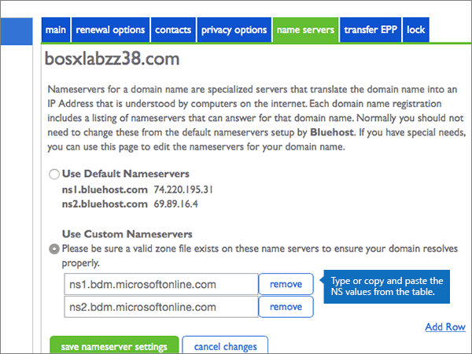

# 使用 Bluehost 變更名稱伺服器以設定 Office 365Change nameservers to set up Office 365 with Bluehost

 若您找不到所需功能，請**[檢查網域常見問題集](../setup/domains-faq.md)**。**[Check the Domains FAQ](../setup/domains-faq.md)** if you don't find what you're looking for. 
  
如果您希望 Office 365 為您管理 Office 365 DNS 記錄，請按照下列指示進行。(您可視需要[在 Bluehost 管理所有 Office 365 DNS 記錄](create-dns-records-at-bluehost.md)。)Follow these instructions if you want Office 365 to manage your Office 365 DNS records for you. (If you prefer, you can [manage all your Office 365 DNS records at Bluehost](create-dns-records-at-bluehost.md).)
  
## 新增 TXT 記錄以供驗證Add a TXT record for verification

在您將自己的網域用於 Office 365 之前，我們必須先確認您擁有該網域。如果您能在自己的網域註冊機構登入自己的帳戶並能建立 DNS 記錄，Office 365 就能確信您擁有該網域。Before you use your domain with Office 365, we have to make sure that you own it. Your ability to log in to your account at your domain registrar and create the DNS record proves to Office 365 that you own the domain.
  
> [!NOTE]
> 這筆記錄只會用於驗證您擁有自己的網域，不會影響其他項目。您可以選擇稍後再刪除記錄。This record is used only to verify that you own your domain; it doesn't affect anything else. You can delete it later, if you like. 
  
1. 首先請用[這個連結](https://my.bluehost.com/cgi/dm)移至 Bluehost 上您的網域頁面。To get started, go to your domains page at Bluehost by using [this link](https://my.bluehost.com/cgi/dm). You'll be prompted to log in first.You'll be prompted to log in first.
    
2. 在 [**網域**] 頁面上，在 [**網域**] 區域中，尋找您要變更，網域列，然後選取該網域的核取方塊。On the **domains** page, in the **domain** area, find the row for the domain that you're changing, and then select the check box for that domain. 
    
    (You may have to scroll down.)(You may have to scroll down.) 
    
3. 在**domain_name**區域中，在 [ **DNS 區域編輯器**] 列中，選取 [**管理 DNS 記錄**]。In the **domain_name** area, on the **DNS Zone Editor** row, select **Manage DNS records**.
    
4. On the **DNS Zone Editor** page, in the Add DNS Record area, in the boxes for the new record, type or copy and paste the values from the following table.On the **DNS Zone Editor** page, in the Add DNS Record area, in the boxes for the new record, type or copy and paste the values from the following table. 
    
    (Choose the **Type** value from the drop-down list.)(Choose the **Type** value from the drop-down list.) 
    
|||||
|:-----|:-----|:-----|:-----|
|**Host Record****Host Record**   |**TTL****TTL**   |**類型****Type**   |**TXT Value****TXT Value**   |
|@    |1440014400    |TXTTXT    |MS=ms *XXXXXXXX*MS=ms *XXXXXXXX*   **附註：** 這是範例。**Note:** This is an example. Use your specific **Destination or Points to Address** value here, from the table in Office 365.Use your specific **Destination or Points to Address** value here, from the table in Office 365. [How do I find this?How do I find this?](../get-help-with-domains/information-for-dns-records.md)   |

   
5. 選取 [**新增記錄**]。Select **add record**.
    
6. 繼續進行之前，請先稍候幾分鐘，好讓您剛剛建立的記錄能在網際網路上更新。Wait a few minutes before you continue, so that the record you just created can update across the Internet.
    
Now that you've added the record at your domain registrar's site, you'll go back to Office 365 and request Office 365 to look for the record.Now that you've added the record at your domain registrar's site, you'll go back to Office 365 and request Office 365 to look for the record.
  
When Office 365 finds the correct TXT record, your domain is verified.When Office 365 finds the correct TXT record, your domain is verified.
  
1. 在系統管理中心，移至 [**設定** \> <a href="https://go.microsoft.com/fwlink/p/?linkid=834818" target="_blank">網域</a>] 頁面。In the admin center, go to the **Settings** \> <a href="https://go.microsoft.com/fwlink/p/?linkid=834818" target="_blank">Domains</a> page.

    
2. 在 [**網域**] 頁面上，選取您要驗證的網域。On the **Domains** page, select the domain that you are verifying. 
    
3. 在 [**安裝**] 頁面上，選取 [**啟動安裝程式**。On the **Setup** page, select **Start setup**.
    
4. 在 [**驗證網域**] 頁面上，選取 [**驗證**]。On the **Verify domain** page, select **Verify**.
    
> [!NOTE]
> Typically it takes about 15 minutes for DNS changes to take effect.Typically it takes about 15 minutes for DNS changes to take effect. However, it can occasionally take longer for a change you've made to update across the Internet's DNS system.However, it can occasionally take longer for a change you've made to update across the Internet's DNS system. 如果您遇到與郵件流程或其他問題新增 DNS 記錄之後，請參閱[尋找並修正新增網域或 Office 365 中的 DNS 記錄之後所發生的問題](../get-help-with-domains/find-and-fix-issues.md)。If you're having trouble with mail flow or other issues after adding DNS records, see [Find and fix issues after adding your domain or DNS records in Office 365](../get-help-with-domains/find-and-fix-issues.md). 
  
## 變更您網域的名稱伺服器 (NS) 記錄Change your domain's nameserver (NS) records

如要完成網域設定以用於 Office 365，請在您的網域註冊機構更改網域的 NS 記錄，使它指向 Office 365 主要和次要名稱伺服器。這樣就會設定並讓 Office 365 為您更新網域的 DNS 記錄。我們會新增所有記錄，好讓電子郵件、商務用 Skype Online 和您的公用網站都能使用您的網域，為您做好一切準備。To complete setting up your domain with Office 365, you change your domain's NS records at your domain registrar to point to the Office 365 primary and secondary name servers. This sets up Office 365 to update the domain's DNS records for you. We'll add all records so that email, Skype for Business Online, and your public website work with your domain, and you'll be all set.
  
> [!CAUTION]
> 當您變更網域的 NS 記錄以指向 Office 365 名稱伺服器時，所有目前與您網域相關聯的服務都會受到影響。例如，在您完成這項變更之後，凡是傳送到您的網域 (例如 rob@ *your_domain*  .com) 的電子郵件都將開始傳送到 Office 365。When you change your domain's NS records to point to the Office 365 name servers, all the services that are currently associated with your domain are affected. For example, all email sent to your domain (like rob@ *your_domain*  .com) will start coming to Office 365 after you make this change. 
  
> [!IMPORTANT]
>  下列程序將告訴您如何從清單中，刪除任何其他不想要的名稱以及 how to： 新增如果他們沒有 」 列出正確的名稱伺服器。The following procedure will show you how to delete any other, unwanted nameservers from the list, and also how to add the correct nameservers if they are not already listed. 當您完成在此區段中，應該會列出的唯一名稱伺服器的步驟 > 是這四個: > ns1.bdm.microsoftonline.com > ns2.bdm.microsoftonline.com > ns3.bdm.microsoftonline.com > ns4.bdm.microsoftonline.com>  When you have completed the steps in this section, the only nameservers that should be listed are these four: >  ns1.bdm.microsoftonline.com >  ns2.bdm.microsoftonline.com >  ns3.bdm.microsoftonline.com >  ns4.bdm.microsoftonline.com 
  
1. 首先請用[這個連結](https://my.bluehost.com/cgi/dm)移至 Bluehost 上您的網域頁面。To get started, go to your domains page at Bluehost by using [this link](https://my.bluehost.com/cgi/dm). You'll be prompted to log in first.You'll be prompted to log in first.
    
2. 在 [**網域**] 頁面的**domain_name**區域中，選取您網域的核取方塊，然後選取**名稱伺服器**。On the **domains** page, in the **domain_name** area, select the checkbox for your domain, and then select **name servers**.
    
    
  
3. 在**domain_name**區域中，選取 [**使用自訂名稱伺服器**。In the **domain_name** area, select **Use Custom Nameservers**.
    
    
  
4. 請根據現在顯示頁面上是否列出名稱伺服器，來選擇下列兩個程序其中一項繼續︰Depending on whether or not there are already nameservers listed on the page that is displayed now, continue to one of the two following procedures:
    
  - 如果有**無**列 」 名稱伺服器，[如果有列出名稱伺服器](#if-there-are-no-nameservers-already-listed)。If there are **NO** nameservers already listed, [If there are NO nameservers already listed](#if-there-are-no-nameservers-already-listed).
    
  - 如果**是**那里 」 列出名稱伺服器，[如果有列出名稱伺服器](#if-there-are-nameservers-already-listed)。If there **ARE** nameservers already listed, [If there ARE nameservers already listed](#if-there-are-nameservers-already-listed).
    
### 如果列表上「沒有」名稱伺服器If there are NO nameservers already listed

1. 在 [**使用自訂名稱伺服器**] 區段中，輸入或複製並貼上下表中的值。In the **Use Custom Nameservers** section, type or copy and paste the values from the following table. 
    
|||
|:-----|:-----|
|**第一個空白列****First empty row**   |ns1.bdm.microsoftonline.comns1.bdm.microsoftonline.com    |
|**第二個空白列****Second empty row**   |ns2.bdm.microsoftonline.comns2.bdm.microsoftonline.com    |
   
   
  
2. 選取 [**新增資料列**。Select **Add Row**.
    
    
  
3. 仍在**使用自訂名稱伺服器**] 區段中，輸入或複製並貼上下表第一列中的值到新的空白列。Still in the **Use Custom Nameservers** section, type or copy and paste the values from the first row of the following table into the new empty row. 
    
|||
|:-----|:-----|
|**第三個空白列****Third empty row**   |ns3.bdm.microsoftonline.comns3.bdm.microsoftonline.com    |
|**第四個空白列****Fourth empty row**   |ns4.bdm.microsoftonline.comns4.bdm.microsoftonline.com    |
   
    
  
4. 若要新增第四筆名稱伺服器記錄，再選取 [**新增資料列**，並使用上述表格的最後一列中的值建立記錄。To add the fourth Nameserver record, select **Add Row** again, and create a record using the values from the last row of the above table. 
    
5. 選取 [**儲存名稱伺服器設定**]。Select **save nameserver settings**.
    
    
  
> [!NOTE]
> 您的名稱伺服器記錄更新可能需要數小時的時間，才能更新到整個網際網路的 DNS 系統。接著，您的 Office 365 電子郵件和其他服務就能搭配您的網域順利運作。Your nameserver record updates may take up to several hours to update across the Internet's DNS system. Then your Office 365 email and other services will be all set to work with your domain. 
  
### 如果列表上「有」名稱伺服器If there ARE nameservers already listed

> [!CAUTION]
> Follow these steps only if you have existing nameservers other than the four correct nameservers.Follow these steps only if you have existing nameservers other than the four correct nameservers. (也就是刪除只是任何目前的名稱*未*命名為**ns1.bdm.microsoftonline.com**、 **ns2.bdm.microsoftonline.com**、 **ns3.bdm.microsoftonline.com**或**ns4.bdm.microsoftonline.com**。)(That is, delete only any current nameservers that are  *not*  named **ns1.bdm.microsoftonline.com**, **ns2.bdm.microsoftonline.com**, **ns3.bdm.microsoftonline.com**, or **ns4.bdm.microsoftonline.com**.) 
  
1. 如果沒有列出任何其他名稱伺服器，則選取它，然後按鍵盤上的**Delete**鍵逐一刪除。If there are any other name servers listed, delete each of them by selecting it and then pressing the **Delete** key on your keyboard. 
    
    
  
2. 同樣在 [**使用自訂名稱伺服器**] 區段中，輸入或複製並貼上下表中的值。Still in the **Use Custom Nameservers** section, type or copy and paste the values from the following table. 
    
|||
|:-----|:-----|
|**第一個空白列****First empty row**   |ns1.bdm.microsoftonline.comns1.bdm.microsoftonline.com    |
|**第二個空白列****Second empty row**   |ns2.bdm.microsoftonline.comns2.bdm.microsoftonline.com    |
   
   
  
3. 選取 [**新增資料列**。Select **Add Row**.
    
    
  
4. 仍在**使用自訂名稱伺服器**] 區段中，輸入或複製並貼上下表第一列中的值到新的空白列。Still in the **Use Custom Nameservers** section, type or copy and paste the values from the first row of the following table into the new empty row. 
    
|||
|:-----|:-----|
|**第三個空白列****Third empty row**   |ns3.bdm.microsoftonline.comns3.bdm.microsoftonline.com    |
|**第四個空白列****Fourth empty row**   |ns4.bdm.microsoftonline.comns4.bdm.microsoftonline.com    |
   
   
  
5. 若要新增第四筆名稱伺服器記錄，再選取 [**新增資料列**，並使用上述表格的最後一列中的值建立記錄。To add the fourth Nameserver record, select **Add Row** again, and create a record using the values from the last row of the above table. 
    
6. 選取 [**儲存名稱伺服器設定**]。Select **save nameserver settings**.
    
    
  
> [!NOTE]
> 您的名稱伺服器記錄更新可能需要數小時的時間，才能更新到整個網際網路的 DNS 系統。接著，您的 Office 365 電子郵件和其他服務就能搭配您的網域順利運作。Your nameserver record updates may take up to several hours to update across the Internet's DNS system. Then your Office 365 email and other services will be all set to work with your domain. 
  
