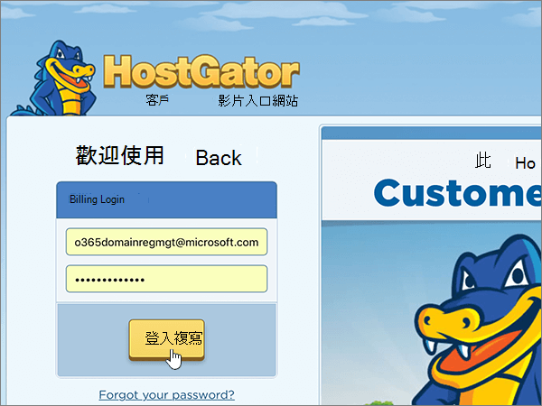
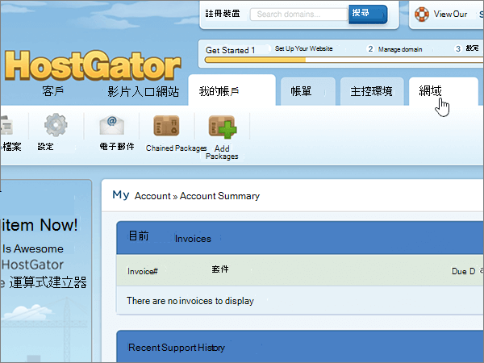
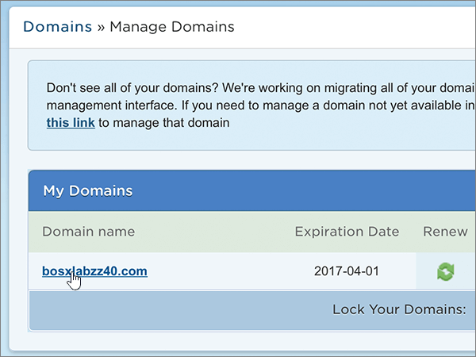

# 使用 Hostgator 變更名稱伺服器以設定 Microsoft 365

 若您找不到所需內容，請**[查看網域常見問題集](../setup/domains-faq.md)**。
  
如果您想讓 Microsoft 為您管理您的 DNS 記錄，請遵循下列指示。  (如果您願意，您可以 [在 Hostgator 管理所有的 MICROSOFT DNS 記錄](create-dns-records-at-hostgator.md)。 ) 
  
    
## 將您的網域指向您的代管帳戶。

> [!IMPORTANT]
> 您必須先執行此程式，再執行下一節中的 **程式，新增 TXT 記錄以進行驗證**。
  
請遵循下列步驟，建立您的網域和代管帳戶的關聯。
  
1. 首先請用[這個連結](https://portal.hostgator.com/domain/manage)移至 Hostgator 上您的客戶入口網站頁面。系統會提示您先登入。
    
    
  
2. 選取 [ **網域** ] 索引標籤。
    
    
  
3. 在 [ **管理網域** ] 頁面上的 [ **我的網域** ] 區域中，選取您要更新的網域。
    
    
  
4. 在 [ **網域概述** ] 頁面的 [ **名稱伺服器** ] 區域中，選取 [ **變更**]。
    
    
  
5. 在您網域的 [ **名稱伺服器** ] 頁面上，于 [ **選取主控帳戶** ] 下拉式清單中，選擇與您的網域相關聯的 **主控帳戶** 。
    
    
  
6. 選取 [ **儲存名稱伺服器**]。
    
    
  
## 新增 TXT 記錄以供驗證

> [!IMPORTANT]
> 在執行此程式之前，您必須先執行本文第一節中的 [程式，將您的網域指向您的託管帳戶。](#point-your-domain-to-your-hosting-account)。
  
在您將自己的網域用於 Microsoft 之前，我們必須先確認您擁有該網域。如果您能在自己的網域註冊機構登入自己的帳戶並能建立 DNS 記錄，Microsoft 就能確信您擁有該網域。
  
> [!NOTE]
> 這筆記錄只會用於驗證您擁有自己的網域，不會影響其他項目。您可以選擇稍後再刪除記錄。
  
1. 若要開始使用，請移至您位於 Hostgator 的 cPanel 頁面。系統會提示您先登入。
    
    (每個 Hostgator 代管的帳戶都有一個唯一的 cPanel 位址。您的 cPanel 位址看起來應該像這樣：https://YourSiteAddress:secure-port-number。您從 Hostgator 收到的註冊電子郵件會指出該位址。)
    
    > [!IMPORTANT]
    > To have a cPanel associated with your domain, you need a hosting account with Hostgator. 若要開始使用，您可以從 Hostgator 購買主控帳戶，也可以 [變更您網域的名稱伺服器 (NS) 記錄](#change-your-domains-nameserver-ns-records) ，以指向 Microsoft。 
  
2. 在 [ **控制台** ] 頁面的 [ **網域** ] 區域中，選取 [ **高級 DNS 區域編輯器**]。
    
    (您可能需要向下捲動。) 
    
3. On the **Advanced DNS Zone Editor** page, in the **Add a Record** area, in the boxes for the new record, type or copy and paste the values from the following table. 
    
    (從下拉式清單中選擇 [Type] (類型) 值。) 
    
|||||
|:-----|:-----|:-----|:-----|
|**Name**   |**TTL**   |**類型**   |**TXT Data**   |
|使用您的  *domain_name*  。 (for example, fourthcoffee.com.)    **此值必須以英文句點 (.) 結尾。**   |1     |TXT    |MS=ms *XXXXXXXX*    **附註：** 這是範例。 在這裡請使用您自己來自表格的 **[目的地或指向位址]** 值。 [如何找到呢？](../get-help-with-domains/information-for-dns-records.md)        |
   
4. 選取 [ **新增記錄**]。
    
5. 繼續進行之前，請先稍候幾分鐘，好讓您剛剛建立的記錄能在網際網路上更新。
    
現在，您已在網域註冊機構的網站上新增記錄，您會回到 Microsoft 並要求搜尋該記錄。
  
在 Microsoft 找到正確的 TXT 記錄後，您的網域就完成驗證了。
  
1. 在系統管理中心中，移至 **[設定]** \> <a href="https://go.microsoft.com/fwlink/p/?linkid=834818" target="_blank">[網域]</a> 頁面。

    
2. 在 **[網域]** 頁面上，選取您要驗證的網域。 
    
3. 在 **[設定]** 頁面上，選取 **[開始設定]**。
    
4. 在 **[驗證網域]** 頁面上，選取 **[驗證]**。
    
> [!NOTE]
> Typically it takes about 15 minutes for DNS changes to take effect. 然而有時可能需要更久的時間，您所做的變更才能在整個網際網路的 DNS 系統中生效。 在您新增 DNS 記錄後，如有郵件流程或其他方面的問題，請參閱[尋找並修正新增網域或 DNS 記錄之後所發生的問題](../get-help-with-domains/find-and-fix-issues.md)。 
  
## 變更您網域的名稱伺服器 (NS) 記錄

若要使用 Microsoft 設定您的網域，請在您的網域註冊機構變更網域的 NS 記錄，以指向 Microsoft 主要和次要名稱伺服器。 這會將 Microsoft 設定為您為您更新網域的 DNS 記錄。 我們會新增所有記錄，好讓電子郵件、商務用 Skype Online 和您的公用網站都能使用您的網域，為您做好一切準備。
  
> [!CAUTION]
> 當您將網域的 NS 記錄變更為指向 Microsoft 名稱伺服器時，所有目前與您網域相關聯的服務都會受到影響。 例如，所有傳送至您網域的電子郵件 (例如 rob@ *your_domain*  .com) 會在您進行此變更之後，從 Microsoft 開始。
  
> [!IMPORTANT]
> 下列程式將告訴您如何刪除清單中的任何其他、不想要的名稱伺服器，以及如何新增正確的名稱伺服器（如果尚未列出）。 當您完成本節中的步驟之後，應該會列出的唯一名稱伺服器為下列四種：  **ns1.bdm.microsoftonline.com**、 **ns2.bdm.microsoftonline.com**、 **ns3.bdm.microsoftonline.com**和 **ns4.bdm.microsoftonline.com**。
  
1. 首先請用[這個連結](https://portal.hostgator.com/domain/manage)移至 Hostgator 上您的客戶入口網站頁面。系統會提示您先登入。
    
    
  
2. 選取 [ **網域** ] 索引標籤。 
    
    
  
3. 在 [ **管理網域** ] 頁面上的 [ **我的網域** ] 區域中，選取您要更新的網域。 
    
    
  
4. 在 [ **網域一覽** ] 頁面的 [ **名稱伺服器** ] 區域中，選取 [ **變更**]。
    
    
  
5. 在您網域的 [ **名稱伺服器** ] 頁面上，于 [ **選取主控帳戶** ] 下拉式清單中，選擇與您的網域相關聯的 **主控帳戶** 。 
    
    
  
6. 選取 [ **手動設定我的名稱伺服器**]。
    
    
  
7.   **警告**：只有當現有的名稱伺服器不是四個正確的名稱伺服器時，才遵循這些步驟。  (也就是說，只刪除所有  *未*  命名為 **ns1.bdm.microsoftonline.com**、 **ns2.bdm.microsoftonline.com**、 **ns3.bdm.microsoftonline.com**或 **ns4.bdm.microsoftonline.com**的目前名稱伺服器。 ) 
  
        在您網域的 [名稱伺服器] 頁面上，在名稱伺服器清單中，選取清單中的每個名稱伺服器，然後按鍵盤上的**delete**鍵，以刪除清單中的每個**名稱伺服器**。 
    
   
  
8. 同樣在名稱伺服器清單中，輸入或複製並貼上下表中的前兩個值。
    
|||
|:-----|:-----|
|**Name Server 1: (名稱伺服器 1:)**   |ns1.bdm.microsoftonline.com    |
|**名稱伺服器2：**   |ns2.bdm.microsoftonline.com    |
|**名稱伺服器3：**   |ns3.bdm.microsoftonline.com    |
|**名稱伺服器4：**   |ns4.bdm.microsoftonline.com    |
   
   
  
9. 新增其他名稱伺服器的值。
    
    選取 [ ** (+) ** 新增]，然後在記錄的方塊中輸入或複製並貼上表格中下一列的值。 
    
    重複這個程序，直到四筆名稱伺服器記錄全部建立完畢。
    
    
  
10. 選取 [ **儲存名稱伺服器**]。
    
    
  
> [!NOTE]
> 您的名稱伺服器記錄更新可能需要數小時的時間，才能更新到整個網際網路的 DNS 系統。 然後，您的 Microsoft 電子郵件和其他服務將全部設定為與您的網域搭配使用。
