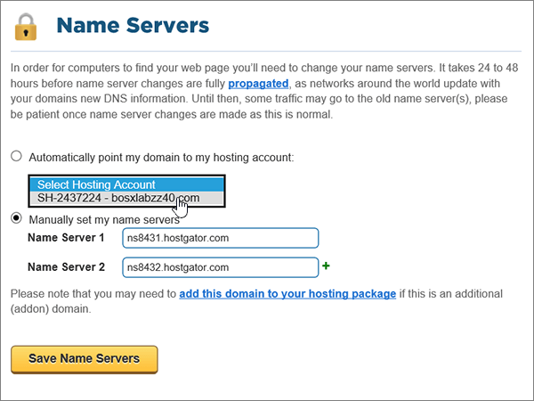

# 使用 Hostgator 變更名稱伺服器以設定 Microsoft 365Change nameservers to set up Microsoft 365 with Hostgator

 若您找不到所需內容，請**[查看網域常見問題集](../setup/domains-faq.md)**。**[Check the Domains FAQ](../setup/domains-faq.md)** if you don't find what you're looking for.
  
如果您想讓 Microsoft 為您管理您的 DNS 記錄，請遵循下列指示。Follow these instructions if you want Microsoft to manage your DNS records for you.  (如果您願意，您可以 [在 Hostgator 管理所有的 MICROSOFT DNS 記錄](create-dns-records-at-hostgator.md)。 ) (If you prefer, you can [manage all your Microsoft DNS records at Hostgator](create-dns-records-at-hostgator.md).)
  
    
## 將您的網域指向您的代管帳戶。Point your domain to your hosting account.

> [!IMPORTANT]
> 您必須先執行此程式，再執行下一節中的 **程式，新增 TXT 記錄以進行驗證**。You must perform this procedure before you perform the procedure in the following section, **Add a TXT record for verification**.
  
請遵循下列步驟，建立您的網域和代管帳戶的關聯。Follow these steps to associate your domain and hosting accounts.
  
1. 首先請用[這個連結](https://portal.hostgator.com/domain/manage)移至 Hostgator 上您的客戶入口網站頁面。系統會提示您先登入。To get started, go to your customer portal page at Hostgator by using [this link](https://portal.hostgator.com/domain/manage). You'll be prompted to log in.
    
    
  
2. 選取 [ **網域** ] 索引標籤。Select the **Domains** tab.
    
    
  
3. 在 [ **管理網域** ] 頁面上的 [ **我的網域** ] 區域中，選取您要更新的網域。On the **Manage Domains** page, in the **My Domains** area, select the domain you want to update.
    
    
  
4. 在 [ **網域概述** ] 頁面的 [ **名稱伺服器** ] 區域中，選取 [ **變更**]。On the **Domains Overview** page, in the **Name Servers** area, select **Change**.
    
    
  
5. 在您網域的 [ **名稱伺服器** ] 頁面上，于 [ **選取主控帳戶** ] 下拉式清單中，選擇與您的網域相關聯的 **主控帳戶** 。On the **Name Servers** page for your domain, in the **Select Hosting Account** drop-down list, choose the **hosting account** that is associated with your domain.
    
    
  
6. 選取 [ **儲存名稱伺服器**]。Select **Save Name Servers**.
    
    
  
## 新增 TXT 記錄以供驗證Add a TXT record for verification

> [!IMPORTANT]
> 在執行此程式之前，您必須先執行本文第一節中的 [程式，將您的網域指向您的託管帳戶。](#point-your-domain-to-your-hosting-account)。Before you perform this procedure, you must first perform the procedure in the first section of this article, [Point your domain to your hosting account.](#point-your-domain-to-your-hosting-account).
  
在您將自己的網域用於 Microsoft 之前，我們必須先確認您擁有該網域。如果您能在自己的網域註冊機構登入自己的帳戶並能建立 DNS 記錄，Microsoft 就能確信您擁有該網域。Before you use your domain with Microsoft, we have to make sure that you own it. Your ability to log in to your account at your domain registrar and create the DNS record proves to Microsoft that you own the domain.
  
> [!NOTE]
> 這筆記錄只會用於驗證您擁有自己的網域，不會影響其他項目。您可以選擇稍後再刪除記錄。This record is used only to verify that you own your domain; it doesn't affect anything else. You can delete it later, if you like.
  
1. 若要開始使用，請移至您位於 Hostgator 的 cPanel 頁面。系統會提示您先登入。To get started, go to your cPanel page at Hostgator. You'll be prompted to log in first.
    
    (每個 Hostgator 代管的帳戶都有一個唯一的 cPanel 位址。您的 cPanel 位址看起來應該像這樣：https://YourSiteAddress:secure-port-number。您從 Hostgator 收到的註冊電子郵件會指出該位址。)(Each hosted account at Hostgator is assigned a unique cPanel address. Your cPanel address should look like this: https://YourSiteAddress:secure-port-number. The sign-up email you received from Hostgator will specify that address.)
    
    > [!IMPORTANT]
    > To have a cPanel associated with your domain, you need a hosting account with Hostgator.To have a cPanel associated with your domain, you need a hosting account with Hostgator. 若要開始使用，您可以從 Hostgator 購買主控帳戶，也可以 [變更您網域的名稱伺服器 (NS) 記錄](#change-your-domains-nameserver-ns-records) ，以指向 Microsoft。To get started, you can either purchase a hosting account from Hostgator or [change your domain's nameserver (NS) records](#change-your-domains-nameserver-ns-records) to point to Microsoft. 
  
2. 在 [ **控制台** ] 頁面的 [ **網域** ] 區域中，選取 [ **高級 DNS 區域編輯器**]。On the **Control Panel** page, in the **Domains** area, select **Advanced DNS Zone Editor**.
    
    (您可能需要向下捲動。)(You may have to scroll down.) 
    
3. On the **Advanced DNS Zone Editor** page, in the **Add a Record** area, in the boxes for the new record, type or copy and paste the values from the following table.On the **Advanced DNS Zone Editor** page, in the **Add a Record** area, in the boxes for the new record, type or copy and paste the values from the following table. 
    
    (從下拉式清單中選擇 [Type] (類型) 值。)(Choose the **Type** value from the drop-down list.) 
    
|||||
|:-----|:-----|:-----|:-----|
|**Name****Name**   |**TTL****TTL**   |**類型****Type**   |**TXT Data****TXT Data**   |
|使用您的  *domain_name*  。Use your  *domain_name*  . (for example, fourthcoffee.com.)(for example, fourthcoffee.com.)    **此值必須以英文句點 (.) 結尾。****This value MUST end with a period (.)**   |1 1    |TXTTXT    |MS=ms *XXXXXXXX*MS=ms *XXXXXXXX*    **附註：** 這是範例。**Note:** This is an example. 在這裡請使用您自己來自表格的 **[目的地或指向位址]** 值。Use your specific **Destination or Points to Address** value here, from the table. [如何找到呢？How do I find this?](../get-help-with-domains/information-for-dns-records.md)        |
   
4. 選取 [ **新增記錄**]。Select **Add Record**.
    
5. 繼續進行之前，請先稍候幾分鐘，好讓您剛剛建立的記錄能在網際網路上更新。Wait a few minutes before you continue, so that the record you just created can update across the Internet.
    
現在，您已在網域註冊機構的網站上新增記錄，您會回到 Microsoft 並要求搜尋該記錄。Now that you've added the record at your domain registrar's site, you'll go back to Microsoft and request a search for the record.
  
在 Microsoft 找到正確的 TXT 記錄後，您的網域就完成驗證了。When Microsoft finds the correct TXT record, your domain is verified.
  
1. 在系統管理中心中，移至 **[設定]** \> <a href="https://go.microsoft.com/fwlink/p/?linkid=834818" target="_blank">[網域]</a> 頁面。In the admin center, go to the **Settings** \> <a href="https://go.microsoft.com/fwlink/p/?linkid=834818" target="_blank">Domains</a> page.

    
2. 在 **[網域]** 頁面上，選取您要驗證的網域。On the **Domains** page, select the domain that you are verifying. 
    
3. 在 **[設定]** 頁面上，選取 **[開始設定]**。On the **Setup** page, select **Start setup**.
    
4. 在 **[驗證網域]** 頁面上，選取 **[驗證]**。On the **Verify domain** page, select **Verify**.
    
> [!NOTE]
> Typically it takes about 15 minutes for DNS changes to take effect.Typically it takes about 15 minutes for DNS changes to take effect. 然而有時可能需要更久的時間，您所做的變更才能在整個網際網路的 DNS 系統中生效。However, it can occasionally take longer for a change you've made to update across the Internet's DNS system. 在您新增 DNS 記錄後，如有郵件流程或其他方面的問題，請參閱[尋找並修正新增網域或 DNS 記錄之後所發生的問題](../get-help-with-domains/find-and-fix-issues.md)。If you're having trouble with mail flow or other issues after adding DNS records, see [Find and fix issues after adding your domain or DNS records](../get-help-with-domains/find-and-fix-issues.md). 
  
## 變更您網域的名稱伺服器 (NS) 記錄Change your domain's nameserver (NS) records

若要使用 Microsoft 設定您的網域，請在您的網域註冊機構變更網域的 NS 記錄，以指向 Microsoft 主要和次要名稱伺服器。To complete setting up your domain with Microsoft, you change your domain's NS records at your domain registrar to point to the Microsoft primary and secondary name servers. 這會將 Microsoft 設定為您為您更新網域的 DNS 記錄。This sets up Microsoft to update the domain's DNS records for you. 我們會新增所有記錄，好讓電子郵件、商務用 Skype Online 和您的公用網站都能使用您的網域，為您做好一切準備。We'll add all records so that email, Skype for Business Online, and your public website work with your domain, and you'll be all set.
  
> [!CAUTION]
> 當您將網域的 NS 記錄變更為指向 Microsoft 名稱伺服器時，所有目前與您網域相關聯的服務都會受到影響。When you change your domain's NS records to point to the Microsoft name servers, all the services that are currently associated with your domain are affected. 例如，所有傳送至您網域的電子郵件 (例如 rob@ *your_domain*  .com) 會在您進行此變更之後，從 Microsoft 開始。For example, all email sent to your domain (like rob@ *your_domain*  .com) will start coming to Microsoft after you make this change.
  
> [!IMPORTANT]
> 下列程式將告訴您如何刪除清單中的任何其他、不想要的名稱伺服器，以及如何新增正確的名稱伺服器（如果尚未列出）。The following procedure will show you how to delete any other, unwanted nameservers from the list, and also how to add the correct nameservers if they are not already listed. 當您完成本節中的步驟之後，應該會列出的唯一名稱伺服器為下列四種：  **ns1.bdm.microsoftonline.com**、 **ns2.bdm.microsoftonline.com**、 **ns3.bdm.microsoftonline.com**和 **ns4.bdm.microsoftonline.com**。When you have completed the steps in this section, the only nameservers that should be listed are these four:  **ns1.bdm.microsoftonline.com**, **ns2.bdm.microsoftonline.com**, **ns3.bdm.microsoftonline.com**, and **ns4.bdm.microsoftonline.com**.
  
1. 首先請用[這個連結](https://portal.hostgator.com/domain/manage)移至 Hostgator 上您的客戶入口網站頁面。系統會提示您先登入。To get started, go to your customer portal page at Hostgator by using [this link](https://portal.hostgator.com/domain/manage). You'll be prompted to log in.
    
    
  
2. 選取 [ **網域** ] 索引標籤。Select the **Domains** tab. 
    
    
  
3. 在 [ **管理網域** ] 頁面上的 [ **我的網域** ] 區域中，選取您要更新的網域。On the **Manage Domains** page, in the **My Domains** area, select the domain you want to update. 
    
    
  
4. 在 [ **網域一覽** ] 頁面的 [ **名稱伺服器** ] 區域中，選取 [ **變更**]。On the **Domain Overview** page, in the **Name Servers** area, select **Change**.
    
    
  
5. 在您網域的 [ **名稱伺服器** ] 頁面上，于 [ **選取主控帳戶** ] 下拉式清單中，選擇與您的網域相關聯的 **主控帳戶** 。On the **Name Servers** page for your domain, in the **Select Hosting Account** drop-down list, choose the **hosting account** that is associated with your domain. 
    
    
  
6. 選取 [ **手動設定我的名稱伺服器**]。Select **Manually set my name servers**.
    
    
  
7.   **警告**：只有當現有的名稱伺服器不是四個正確的名稱伺服器時，才遵循這些步驟。**CAUTION**: Follow these steps only if you have existing nameservers other than the four correct nameservers.  (也就是說，只刪除所有  *未*  命名為 **ns1.bdm.microsoftonline.com**、 **ns2.bdm.microsoftonline.com**、 **ns3.bdm.microsoftonline.com**或 **ns4.bdm.microsoftonline.com**的目前名稱伺服器。 ) (That is, delete only any current nameservers that are  *not*  named **ns1.bdm.microsoftonline.com**, **ns2.bdm.microsoftonline.com**, **ns3.bdm.microsoftonline.com**, or **ns4.bdm.microsoftonline.com**.)
  
        在您網域的 [名稱伺服器] 頁面上，在名稱伺服器清單中，選取清單中的每個名稱伺服器，然後按鍵盤上的**delete**鍵，以刪除清單中的每個**名稱伺服器**。Still on the **Name Servers** page for your domain, in the list of nameservers, delete each nameserver in the list by selecting it and then pressing the **Delete** key on your keyboard. 
    
   
  
8. 同樣在名稱伺服器清單中，輸入或複製並貼上下表中的前兩個值。Still in the list of nameservers, type or copy and paste the first two values from the following table.
    
|||
|:-----|:-----|
|**Name Server 1: (名稱伺服器 1:)****Name Server 1:**   |ns1.bdm.microsoftonline.comns1.bdm.microsoftonline.com    |
|**名稱伺服器2：****Name Server 2:**   |ns2.bdm.microsoftonline.comns2.bdm.microsoftonline.com    |
|**名稱伺服器3：****Name Server 3:**   |ns3.bdm.microsoftonline.comns3.bdm.microsoftonline.com    |
|**名稱伺服器4：****Name Server 4:**   |ns4.bdm.microsoftonline.comns4.bdm.microsoftonline.com    |
   
   
  
9. 新增其他名稱伺服器的值。Add the other nameserver values.
    
    選取 [ \*\* (+) \*\* 新增]，然後在記錄的方塊中輸入或複製並貼上表格中下一列的值。Select **(+)** add, and then type or copy and paste the value from the next row of the table into the box for the record. 
    
    重複這個程序，直到四筆名稱伺服器記錄全部建立完畢。Repeat this process until you have created all four nameserver records.
    
    
  
10. 選取 [ **儲存名稱伺服器**]。Select **Save Name Servers**.
    
    
  
> [!NOTE]
> 您的名稱伺服器記錄更新可能需要數小時的時間，才能更新到整個網際網路的 DNS 系統。Your nameserver record updates may take up to several hours to update across the Internet's DNS system. 然後，您的 Microsoft 電子郵件和其他服務將全部設定為與您的網域搭配使用。Then your Microsoft email and other services will be all set to work with your domain.
