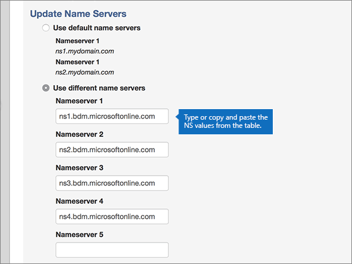

# 使用 MyDomain 變更名稱伺服器以設定 Office 365

 若您找不到所需功能，請**[檢查網域常見問題集](../setup/domains-faq.md)**。
  
如果您希望讓 Office 365 來管理您的 Office 365 DNS 記錄，請遵循下列指示。(如果您想要的話，可以[在 MyDomain 管理所有的 Office 365 DNS 記錄](create-dns-records-at-mydomain.md)。)
  
## 新增 TXT 記錄以供驗證

在您將自己的網域用於 Office 365 之前，我們必須先確認您擁有該網域。如果您能在自己的網域註冊機構登入自己的帳戶並能建立 DNS 記錄，Office 365 就能確信您擁有該網域。
  
> [!NOTE]
> 這筆記錄只會用於驗證您擁有自己的網域，不會影響其他項目。您可以選擇稍後再刪除記錄。 
  
1. 首先，請用[此連結](https://www.mydomain.com/controlpanel)移至您在 MyDomain 的網域頁面。系統會提示您先登入。
    
2. 在 **[我的最愛]** 區段中，選取 [**網域中央**]。
    
3. 在**網域**中，選取您想要編輯的網域名稱。
    
4. 在 [**概觀**] 列中，選取 [ **DNS**]。
    
5. From the **Modify** drop-down list, choose **TXT/SPF Record**.
    
6. Under **Content**, in the box for the new record, type or copy and paste the value from the following table.
    
||
|:-----|
|**Content (內容)**   |
|MS=ms *XXXXXXXX*    **附註**： 這是範例。 Use your specific **Destination or Points to Address** value here, from the table in Office 365. [How do I find this?](../get-help-with-domains/information-for-dns-records.md)          |
   
7. 選取 **[新增]**。
    
8. 繼續進行之前，請先稍候幾分鐘，好讓您剛剛建立的記錄能在網際網路上更新。
    
Now that you've added the record at your domain registrar's site, you'll go back to Office 365 and request Office 365 to look for the record.
  
When Office 365 finds the correct TXT record, your domain is verified.
  
1. 在系統管理中心，移至 [**設定** \> <a href="https://go.microsoft.com/fwlink/p/?linkid=834818" target="_blank">網域</a>] 頁面。

    
2. 在 [**網域**] 頁面上，選取您要驗證的網域。 
    
3. 在 [**安裝**] 頁面上，選取 [**啟動安裝程式**。
    
4. 在 [**驗證網域**] 頁面上，選取 [**驗證**]。
    
> [!NOTE]
> Typically it takes about 15 minutes for DNS changes to take effect. However, it can occasionally take longer for a change you've made to update across the Internet's DNS system. 如果您遇到與郵件流程或其他問題新增 DNS 記錄之後，請參閱[尋找並修正新增網域或 Office 365 中的 DNS 記錄之後所發生的問題](../get-help-with-domains/find-and-fix-issues.md)。 
  
## 變更您網域的名稱伺服器 (NS) 記錄

如要完成網域設定以用於 Office 365，請在您的網域註冊機構更改網域的 NS 記錄，使它指向 Office 365 主要和次要名稱伺服器。這樣就會設定並讓 Office 365 為您更新網域的 DNS 記錄。我們會新增所有記錄，好讓電子郵件、商務用 Skype Online 和您的公用網站都能使用您的網域，為您做好一切準備。
  
> [!CAUTION]
> 當您變更網域的 NS 記錄以指向 Office 365 名稱伺服器時，所有目前與您網域相關聯的服務都會受到影響。 例如，所有的電子郵件傳送至您的網域 (例如 rob @ *your_domain。* com) 都會開始送往 Office 365 之後進行這項變更。 
  
> [!IMPORTANT]
> The following procedure will show you how to delete any other, unwanted nameservers from the list, and also how to add the correct nameservers if they are not already in the list.   When you have completed the steps in this section, the only nameservers that should be listed are these four:
  
1. 首先，請用[此連結](https://www.mydomain.com/controlpanel)移至您在 MyDomain 的網域頁面。 系統會提示您先登入。
    
2. 在 **[我的最愛]** 區段中，選取 [**網域中央**]。
    
3. 在**網域**中，選取您想要編輯的網域名稱。
    
4. 在 [**概觀**] 列中，選取 [**名稱**]。
    
    
  
5. 在 [**更新名稱伺服器**] 區段中，選取 [**使用不同的名稱伺服器**。
    
    
  
6. 請根據是否已經現在顯示頁面上列出名稱伺服器，繼續進行下列其中一個兩個程序。
    
### 如果列表上「有」正確的名稱伺服器

- 如果列表上有正確的名稱伺服器，您可以跳過此步驟。
    
    
  
### 如果列表上「沒有」正確的名稱伺服器

> [!CAUTION]
> Follow these steps only if you have existing nameservers other than the four correct nameservers. (也就是刪除只是任何目前的名稱*未*命名為**ns1.bdm.microsoftonline.com**、 **ns2.bdm.microsoftonline.com**、 **ns3.bdm.microsoftonline.com**或**ns4.bdm.microsoftonline.com**。) 
  
1. 選取中的每個項目來刪除現有名稱伺服器**Nameserver:** 欄位，並在鍵盤上按**Delete**鍵。 
    
    
  
2. 選取 [**新增其他**兩次，以新增兩個新的名稱伺服器列。 
    
    
  
3. 在記錄的方塊中，輸入或複製並貼上下表中名稱伺服器的值。
    
|||
|:-----|:-----|
|**Nameserver 1 (名稱伺服器 1)**   |ns1.bdm.microsoftonline.com    |
|**Nameserver 2 (名稱伺服器 2)**   |ns2.bdm.microsoftonline.com    |
|**Nameserver 3 (名稱伺服器 3)**   |ns3.bdm.microsoftonline.com    |
|**Nameserver 4 (名稱伺服器 4)**   |ns4.bdm.microsoftonline.com    |
   
   
  
4. 選取 **[儲存]**。
    
    
  
> [!NOTE]
> 您的名稱伺服器記錄更新可能需要數小時的時間，才能更新到整個網際網路的 DNS 系統。接著，您的 Office 365 電子郵件和其他服務就能搭配您的網域順利運作。 
