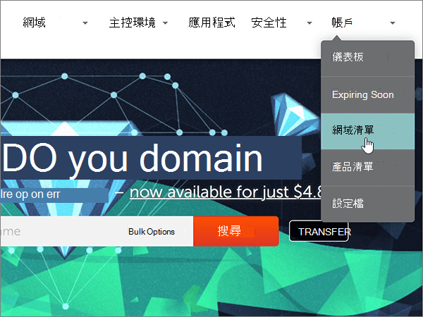

# 使用 Namecheap 變更名稱伺服器以設定 Microsoft

 若您找不到所需內容，請 **[查看網域常見問題集](../setup/domains-faq.yml)**。
  
如果您想讓 Microsoft 為您管理您的 DNS 記錄，請遵循下列指示。  (如果您願意，您可以 [在 Namecheap 管理所有的 MICROSOFT DNS 記錄](create-dns-records-at-namecheap.md)。 ) 
  
    
## 新增 TXT 記錄以供驗證

1. 若要開始使用，請移至您的網域頁面 Namecheap，方法是使用 [此連結](https://www.namecheap.com/myaccount/login.aspx?ReturnUrl=%2f)。 系統會提示您登入並繼續。
    
    
  
2. 在 [ **登陸** ] 頁面的 [ **帳戶**] 下，從下拉式清單中選擇 [ **網域清單** ]。 
    
    
  
3. 在 [ **網域清單** ] 頁面上，尋找您要編輯的網功能變數名稱稱，然後選取 [ **管理**]。
    
    
  
4. 選取 [ **ADVANCED DNS**]。
    
    
  
5. 在 [ **主機記錄** ] 區段中，選取 [ **新增記錄**]。
    
    
  
6. 在 [ **類型** ] 下拉式清單中，選取 [ **TXT 記錄**]。
    
    > [!NOTE]
    > 當您選取 [**新增記錄**] 時，會自動顯示 [**類型**] 下拉式清單。
  
    
  
7. 在新記錄的方塊中，輸入或複製並貼上下表中的值。
    
     (從下拉式清單中選取 [ **TTL** ] 值。 )  
    
|**類型**|**主機**|**Value** (值)|**TTL**|
|:-----|:-----|:-----|:-----|
|TXT    |@    |MS=ms *XXXXXXXX*    **請注意**：這是一個範例。 在這裡請使用您自己來自表格的 **[目的地或指向位址]** 值。           [如何找到呢？](../get-help-with-domains/information-for-dns-records.md)          |30分鐘    |
   
   
  
8. 選取 [ **儲存變更** ] (核取記號) 控制項。 
    
    
  
9. 繼續進行之前，請先稍候幾分鐘，好讓您剛剛建立的記錄能在網際網路上更新。
    
現在，您已在網域註冊機構的網站上新增記錄，您會回到 Microsoft 並要求搜尋該記錄。
  
在 Microsoft 找到正確的 TXT 記錄後，您的網域就完成驗證了。
  
1. 在系統管理中心中，移至 **[設定]** \> <a href="https://go.microsoft.com/fwlink/p/?linkid=834818" target="_blank">[網域]</a> 頁面。

    
2. 在 **[網域]** 頁面上，選取您要驗證的網域。 
    
    
  
3. 在 **[設定]** 頁面上，選取 **[開始設定]**。
    
    
  
4. 在 **[驗證網域]** 頁面上，選取 **[驗證]**。
    
    
  
> [!NOTE]
>  DNS 變更生效通常約需 15 分鐘的時間。而如果您所做的變更要在整個網際網路 DNS 系統中生效，有時可能需要更久的時間。在您新增 DNS 記錄後，如有郵件流程或其他方面的問題，請參閱[變更網域名稱或 DNS 記錄之後所發生問題的疑難排解](../get-help-with-domains/find-and-fix-issues.md)。 
  
## 變更您網域的名稱伺服器 (NS) 記錄

若要使用 Microsoft 設定您的網域，請在您的網域註冊機構變更網域的 NS 記錄，以指向 Microsoft 主要和次要名稱伺服器。 這會將 Microsoft 設定為您為您更新網域的 DNS 記錄。 我們會新增所有記錄，好讓電子郵件、商務用 Skype Online 和您的公用網站都能使用您的網域，為您做好一切準備。
  
> [!CAUTION]
> 當您將網域的 NS 記錄變更為指向 Microsoft 名稱伺服器時，所有目前與您網域相關聯的服務都會受到影響。 例如，所有傳送至您網域的電子郵件 (例如 rob@ *your_domain*  .com) 會在您進行此變更之後，從 Microsoft 開始。 
  
> [!IMPORTANT]
>  When you have completed the steps in this section, the  *only*  nameservers that should be listed are these four: >  ns1.bdm.microsoftonline.com >  ns2.bdm.microsoftonline.com >  ns3.bdm.microsoftonline.com >  ns4.bdm.microsoftonline.com >  The following procedure will show you how to delete any other, unwanted nameservers from the list, and also how to add the  *correct*  nameservers if they are not already in the list. 
  
1. 若要開始使用，請移至您的網域頁面 Namecheap，方法是使用 [此連結](https://www.namecheap.com/myaccount/login.aspx?ReturnUrl=%2f)。 系統會提示您登入並繼續。
    
    
  
2. 在 [ **登陸** ] 頁面的 [ **帳戶**] 下，從下拉式清單中選擇 [ **網域清單** ]。 
    
    
  
3. 在 [ **網域清單** ] 頁面上，尋找您要編輯的網功能變數名稱稱，然後選取 [ **管理**]。
    
    
  
4. 選取 [ **網域**]。
    
    
  
5. 找到 [**名稱伺服器**] 區段，然後從 [ **Namecheap 預設**] 下拉式清單中選取 [**自訂**]。 
    
    
  
6. 請根據現在顯示頁面上是否列出名稱伺服器，繼續執行下列兩個程式中的其中一項。
    
### 如果列表上「沒有」名稱伺服器

1. 選取 [ **新增** 名稱伺服器] 兩次，以新增兩個新列。
    
    
  
2. 在 [名稱伺服器 **] 方塊中** ，輸入或複製並貼上下清單格中的值。
    
|||
|:-----|:-----|
|**Nameserver 1 (名稱伺服器 1)**   |ns1.bdm.microsoftonline.com    |
|**Nameserver 2 (名稱伺服器 2)**   |ns2.bdm.microsoftonline.com    |
|**Nameserver 3 (名稱伺服器 3)**   |ns3.bdm.microsoftonline.com    |
|**Nameserver 4 (名稱伺服器 4)**   |ns4.bdm.microsoftonline.com    |
   
   
  
3. 選取 [ **儲存** (] 核取記號) 控制項。 
    
    
  
> [!NOTE]
> Your nameserver record updates may take up to several hours to update across the Internet's DNS system. 然後，您的 Microsoft 電子郵件和其他服務將全部設定為與您的網域搭配使用。 
  
### 如果列表上「有」名稱伺服器

> [!CAUTION]
> Follow these steps  *only*  if you have existing nameservers other than the four  *correct*  nameservers.  (也就是說，  *只*  刪除所有  *未*  命名為 **ns1.bdm.microsoftonline.com**、 **ns2.bdm.microsoftonline.com**、 **ns3.bdm.microsoftonline.com** 或 **ns4.bdm.microsoftonline.com** 的目前名稱伺服器。 )  
  
1. 如果名稱 **伺服器方塊中** 列出任何其他名稱伺服器，請選取它，然後按鍵盤上的 **delete** 鍵，逐一刪除。 
    
    
  
2. 選取 [ **新增** 名稱伺服器] 兩次，以新增兩個新列。 
    
    
  
3. 在 [名稱伺服器 **] 方塊中** ，輸入或複製並貼上下清單格中的值。
 
    
|||
|:-----|:-----|
|**Name server 1 (名稱伺服器 1)**   |ns1.bdm.microsoftonline.com    |
|**Name Server 2 (名稱伺服器 2)**   |ns2.bdm.microsoftonline.com    |
|**Nameserver 3 (名稱伺服器 3)**   |ns3.bdm.microsoftonline.com    |
|**Nameserver 4 (名稱伺服器 4)**   |ns4.bdm.microsoftonline.com    |
   
   
  
4. 選取 [ **儲存** (] 核取記號) 控制項。 
    
    
  
> [!NOTE]
> Your nameserver record updates may take up to several hours to update across the Internet's DNS system. 然後，您的 Microsoft 電子郵件和其他服務將全部設定為與您的網域搭配使用。
