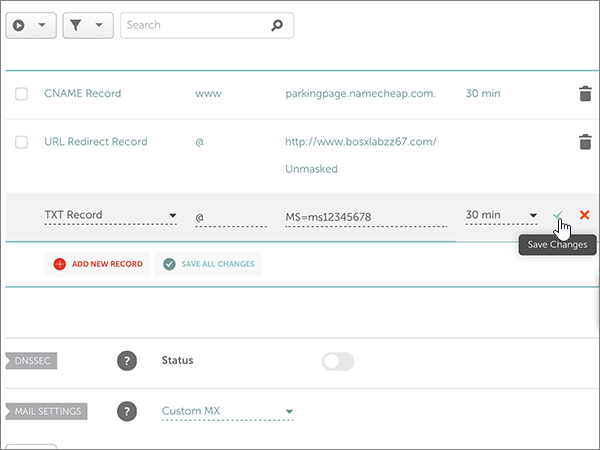

# 變更名稱伺服器以設定 Office 365 使用 NamecheapChange nameservers to set up Office 365 with Namecheap

 若您找不到所需內容，請**[查看網域常見問題集](../setup/domains-faq.md)**。**[Check the Domains FAQ](../setup/domains-faq.md)** if you don't find what you're looking for.
  
如果您希望讓 Office 365 來管理您的 Office 365 DNS 記錄，請遵循下列指示。Follow these instructions if you want Office 365 to manage your Office 365 DNS records for you. （如果您想要的話，您可以[管理在 Namecheap 所有 Office 365 DNS 記錄](create-dns-records-at-namecheap.md)。）(If you prefer, you can [manage all your Office 365 DNS records at Namecheap](create-dns-records-at-namecheap.md).)
  
    
## 新增 TXT 記錄以供驗證Add a TXT record for verification

1. 若要開始，使用[這個連結](https://www.namecheap.com/myaccount/login.aspx?ReturnUrl=%2f)移至您在 Namecheap 的網域頁面。To get started, go to your domains page at Namecheap by using [this link](https://www.namecheap.com/myaccount/login.aspx?ReturnUrl=%2f). 系統會提示您登入，並繼續。You'll be prompted to Sign in and Continue.
    
    
  
2. 在**登陸**頁面上，在 [**帳戶**] 下，從下拉式清單中選擇**網域清單**。On the **Landing** page, under **Account**, choose **Domain List** from the drop-down list. 
    
    
  
3. 在 [**網域清單**] 頁面上，尋找您想要編輯的網域名稱，然後選取**管理**。On the **Domain List** page, find the name of the domain that you want to edit, and then select **Manage**.
    
    
  
4. 選取 [**進階 DNS**]。Select **Advanced DNS**.
    
    
  
5. 在 [**主機記錄**] 區段中，選取 [**新增新的記錄**。In the **HOST RECORDS** section, select **ADD NEW RECORD**.
    
    
  
6. 在 [**類型**下拉式清單，選取 [ **TXT 記錄**]。In the **Type** drop-down, select **TXT Record**.
    
    > [!NOTE]
    > 當您選取 [**新增新的記錄**會自動出現**類型**下拉式清單。The **Type** drop-down automatically appears when you select **ADD NEW RECORD**.
  
    
  
7. 在新記錄的方塊中，輸入或複製並貼上下表中的值。In the boxes for the new record, type or copy and paste the values from the following table.
    
    （從下拉式清單選擇 [ **TTL** ] 值）。(Choose the **TTL** value from the drop-down list.) 
    
|**類型****Type**|**主機****Host**|**Value** (值)**Value**|**TTL****TTL**|
|:-----|:-----|:-----|:-----|
|TXTTXT    |@    |MS=ms *XXXXXXXX*MS=ms *XXXXXXXX*    **附註**： 這是範例。**Note**: This is an example. 在這裡請使用您自己的 **[目的地或指向位址]** 值，請參閱 Office 365 表格。Use your specific **Destination or Points to Address** value here, from the table in Office 365.           [如何找到呢？How do I find this?](../get-help-with-domains/information-for-dns-records.md)          |30 分鐘30 min    |
   
   
  
8. 選取**儲存的變更**（核取記號） 的控制項。Select the **Save Changes** (check mark) control. 
    
    
  
9. 繼續進行之前，請先稍候幾分鐘，好讓您剛剛建立的記錄能在網際網路上更新。Wait a few minutes before you continue, so that the record you just created can update across the Internet.
    
現在您已在網域註冊機構網站新增記錄，請返回 Office 365 並要求 Office 365 尋找該記錄。Now that you've added the record at your domain registrar's site, you'll go back to Office 365 and request Office 365 to look for the record.
  
在 Office 365 找到正確的 TXT 記錄後，您的網域就完成驗證了。When Office 365 finds the correct TXT record, your domain is verified.
  
1. 在系統管理中心中，移至 **[設定]** \> <a href="https://go.microsoft.com/fwlink/p/?linkid=834818" target="_blank">[網域]</a> 頁面。In the admin center, go to the **Settings** \> <a href="https://go.microsoft.com/fwlink/p/?linkid=834818" target="_blank">Domains</a> page.

    
2. 在 **[網域]** 頁面上，選取您要驗證的網域。On the **Domains** page, select the domain that you are verifying. 
    
    
  
3. 在 **[設定]** 頁面上，選取 **[開始設定]**。On the **Setup** page, select **Start setup**.
    
    
  
4. 在 **[驗證網域]** 頁面上，選取 **[驗證]**。On the **Verify domain** page, select **Verify**.
    
    
  
> [!NOTE]
>  DNS 變更生效通常約需 15 分鐘的時間。而如果您所做的變更要在整個網際網路 DNS 系統中生效，有時可能需要更久的時間。在您新增 DNS 記錄後，如有郵件流程或其他方面的問題，請參閱[變更網域名稱或 DNS 記錄之後所發生問題的疑難排解](../get-help-with-domains/find-and-fix-issues.md)。Typically it takes about 15 minutes for DNS changes to take effect. However, it can occasionally take longer for a change you've made to update across the Internet's DNS system. If you're having trouble with mail flow or other issues after adding DNS records, see [Troubleshoot issues after changing your domain name or DNS records](../get-help-with-domains/find-and-fix-issues.md). 
  
## 變更您網域的名稱伺服器 (NS) 記錄Change your domain's nameserver (NS) records

如要完成網域設定以用於 Office 365，請在您的網域註冊機構更改網域的 NS 記錄，使它指向 Office 365 主要和次要名稱伺服器。這樣就會設定並讓 Office 365 為您更新網域的 DNS 記錄。我們會新增所有記錄，好讓電子郵件、商務用 Skype Online 和您的公用網站都能使用您的網域，為您做好一切準備。To complete setting up your domain with Office 365, you change your domain's NS records at your domain registrar to point to the Office 365 primary and secondary name servers. This sets up Office 365 to update the domain's DNS records for you. We'll add all records so that email, Skype for Business Online, and your public website work with your domain, and you'll be all set.
  
> [!CAUTION]
> 當您變更網域的 NS 記錄以指向 Office 365 名稱伺服器時，所有目前與您網域相關聯的服務都會受到影響。例如，在您完成這項變更之後，凡是傳送到您的網域 (例如 rob@ *your_domain*  .com) 的電子郵件都將開始傳送到 Office 365。When you change your domain's NS records to point to the Office 365 name servers, all the services that are currently associated with your domain are affected. For example, all email sent to your domain (like rob@ *your_domain*  .com) will start coming to Office 365 after you make this change. 
  
> [!IMPORTANT]
>  When you have completed the steps in this section, the  *only*  nameservers that should be listed are these four: >  ns1.bdm.microsoftonline.com >  ns2.bdm.microsoftonline.com >  ns3.bdm.microsoftonline.com >  ns4.bdm.microsoftonline.com >  The following procedure will show you how to delete any other, unwanted nameservers from the list, and also how to add the  *correct*  nameservers if they are not already in the list.When you have completed the steps in this section, the  *only*  nameservers that should be listed are these four: >  ns1.bdm.microsoftonline.com >  ns2.bdm.microsoftonline.com >  ns3.bdm.microsoftonline.com >  ns4.bdm.microsoftonline.com >  The following procedure will show you how to delete any other, unwanted nameservers from the list, and also how to add the  *correct*  nameservers if they are not already in the list. 
  
1. 若要開始，使用[這個連結](https://www.namecheap.com/myaccount/login.aspx?ReturnUrl=%2f)移至您在 Namecheap 的網域頁面。To get started, go to your domains page at Namecheap by using [this link](https://www.namecheap.com/myaccount/login.aspx?ReturnUrl=%2f). 系統會提示您登入，並繼續。You'll be prompted to Sign in and Continue.
    
    
  
2. 在**登陸**頁面上，在 [**帳戶**] 下，從下拉式清單中選擇**網域清單**。On the **Landing** page, under **Account**, choose **Domain List** from the drop-down list. 
    
    
  
3. 在 [**網域清單**] 頁面上，尋找您想要編輯的網域名稱，然後選取**管理**。On the **Domain List** page, find the name of the domain that you want to edit, and then select **Manage**.
    
    
  
4. 選取 [**網域**]。Select **Domain**.
    
    
  
5. 尋找 [**名稱**] 區段中，並再從**Namecheap 預設**下拉式清單中選取 [**自訂**。Find the **NAMESERVERS** section, and then select **Custom** from the **Namecheap Default** drop-down list. 
    
    
  
6. 請根據是否已經現在顯示頁面上列出名稱伺服器，繼續進行下列其中一個兩個程序。Depending on whether or not there are already nameservers listed on the page that is displayed now, continue to one of the two following procedures.
    
### 如果列表上「沒有」名稱伺服器If there are NO nameservers already listed

1. 選取 [**新增名稱伺服器**兩次，以新增兩個新列。Select **ADD NAMESERVER** twice to add two new rows.
    
    
  
2. 在 [**名稱**] 方塊中，輸入或複製並貼上下表中的值。In the **Nameserver** boxes, type or copy and paste the values from the following table.
    
|||
|:-----|:-----|
|**Nameserver 1 (名稱伺服器 1)****Nameserver 1**   |ns1.bdm.microsoftonline.comns1.bdm.microsoftonline.com    |
|**Nameserver 2 (名稱伺服器 2)****Nameserver 2**   |ns2.bdm.microsoftonline.comns2.bdm.microsoftonline.com    |
|**Nameserver 3 (名稱伺服器 3)****Nameserver 3**   |ns3.bdm.microsoftonline.comns3.bdm.microsoftonline.com    |
|**Nameserver 4 (名稱伺服器 4)****Nameserver 4**   |ns4.bdm.microsoftonline.comns4.bdm.microsoftonline.com    |
   
   
  
3. 選取**儲存**（核取記號） 的控制項。Select the **Save** (check mark) control. 
    
    
  
> [!NOTE]
> 您的名稱伺服器記錄更新可能需要數小時的時間，才能更新到整個網際網路的 DNS 系統。接著，您的 Office 365 電子郵件和其他服務就能搭配您的網域順利運作。Your nameserver record updates may take up to several hours to update across the Internet's DNS system. Then your Office 365 email and other services will be all set to work with your domain. 
  
### 如果列表上「有」名稱伺服器If there ARE nameservers already listed

> [!CAUTION]
> Follow these steps  *only*  if you have existing nameservers other than the four  *correct*  nameservers.Follow these steps  *only*  if you have existing nameservers other than the four  *correct*  nameservers. (也就是*只*刪除任何目前的名稱伺服器，*未*命名為**ns1.bdm.microsoftonline.com**、 **ns2.bdm.microsoftonline.com**、 **ns3.bdm.microsoftonline.com**或**ns4.bdm.microsoftonline.com**。)(That is, delete  *only*  any current nameservers that are  *not*  named **ns1.bdm.microsoftonline.com**, **ns2.bdm.microsoftonline.com**, **ns3.bdm.microsoftonline.com**, or **ns4.bdm.microsoftonline.com**.) 
  
1. 如果有任何其他名稱伺服器列在 [**名稱**] 方塊中，刪除每個選取它，然後按鍵盤上的**Delete**鍵。If there are any other nameservers listed in the **Nameserver** boxes, delete each one by selecting it and then pressing the **Delete** key on your keyboard. 
    
    
  
2. 選取 [**新增名稱伺服器**兩次，以新增兩個新列。Select **ADD NAMESERVER** twice to add two new rows. 
    
    
  
3. 在 [**名稱**] 方塊中，輸入或複製並貼上下表中的值。In the **Nameserver** boxes, type or copy and paste the values from the following table.
 
    
|||
|:-----|:-----|
|**Name server 1 (名稱伺服器 1)****Name Server 1**   |ns1.bdm.microsoftonline.comns1.bdm.microsoftonline.com    |
|**Name Server 2 (名稱伺服器 2)****Name Server 2**   |ns2.bdm.microsoftonline.comns2.bdm.microsoftonline.com    |
|**Nameserver 3 (名稱伺服器 3)****Nameserver 3**   |ns3.bdm.microsoftonline.comns3.bdm.microsoftonline.com    |
|**Nameserver 4 (名稱伺服器 4)****Nameserver 4**   |ns4.bdm.microsoftonline.comns4.bdm.microsoftonline.com    |
   
   
  
4. 選取**儲存**（核取記號） 的控制項。Select the **Save** (check mark) control. 
    
    
  
> [!NOTE]
> 您的名稱伺服器記錄更新可能需要數小時的時間，才能更新到整個網際網路的 DNS 系統。接著，您的 Office 365 電子郵件和其他服務就能搭配您的網域順利運作。Your nameserver record updates may take up to several hours to update across the Internet's DNS system. Then your Office 365 email and other services will be all set to work with your domain.
