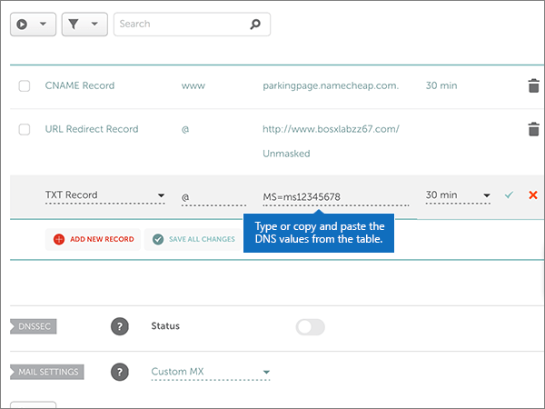
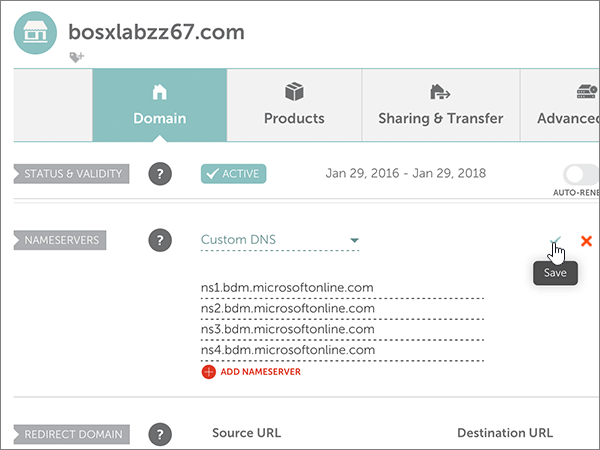

# 使用 Namecheap 變更名稱伺服器以設定 MicrosoftChange nameservers to set up Microsoft with Namecheap

 若您找不到所需內容，請**[查看網域常見問題集](../setup/domains-faq.md)**。**[Check the Domains FAQ](../setup/domains-faq.md)** if you don't find what you're looking for.
  
如果您想讓 Microsoft 為您管理您的 DNS 記錄，請遵循下列指示。Follow these instructions if you want Microsoft to manage your DNS records for you.  (如果您願意，您可以 [在 Namecheap 管理所有的 MICROSOFT DNS 記錄](create-dns-records-at-namecheap.md)。 ) (If you prefer, you can [manage all your Microsoft DNS records at Namecheap](create-dns-records-at-namecheap.md).)
  
    
## 新增 TXT 記錄以供驗證Add a TXT record for verification

1. 若要開始使用，請移至您的網域頁面 Namecheap，方法是使用 [此連結](https://www.namecheap.com/myaccount/login.aspx?ReturnUrl=%2f)。To get started, go to your domains page at Namecheap by using [this link](https://www.namecheap.com/myaccount/login.aspx?ReturnUrl=%2f). 系統會提示您登入並繼續。You'll be prompted to Sign in and Continue.
    
    
  
2. 在 [ **登陸** ] 頁面的 [ **帳戶**] 下，從下拉式清單中選擇 [ **網域清單** ]。On the **Landing** page, under **Account**, choose **Domain List** from the drop-down list. 
    
    
  
3. 在 [ **網域清單** ] 頁面上，尋找您要編輯的網功能變數名稱稱，然後選取 [ **管理**]。On the **Domain List** page, find the name of the domain that you want to edit, and then select **Manage**.
    
    
  
4. 選取 [ **ADVANCED DNS**]。Select **Advanced DNS**.
    
    
  
5. 在 [ **主機記錄** ] 區段中，選取 [ **新增記錄**]。In the **HOST RECORDS** section, select **ADD NEW RECORD**.
    
    
  
6. 在 [ **類型** ] 下拉式清單中，選取 [ **TXT 記錄**]。In the **Type** drop-down, select **TXT Record**.
    
    > [!NOTE]
    > 當您選取 [**新增記錄**] 時，會自動顯示 [**類型**] 下拉式清單。The **Type** drop-down automatically appears when you select **ADD NEW RECORD**.
  
    
  
7. 在新記錄的方塊中，輸入或複製並貼上下表中的值。In the boxes for the new record, type or copy and paste the values from the following table.
    
     (從下拉式清單中選取 [ **TTL** ] 值。 ) (Choose the **TTL** value from the drop-down list.) 
    
|**類型****Type**|**主機****Host**|**Value** (值)**Value**|**TTL****TTL**|
|:-----|:-----|:-----|:-----|
|TXTTXT    |@    |MS=ms *XXXXXXXX*MS=ms *XXXXXXXX*    **請注意**：這是一個範例。**Note**: This is an example. 在這裡請使用您自己來自表格的 **[目的地或指向位址]** 值。Use your specific **Destination or Points to Address** value here, from the table.           [如何找到呢？How do I find this?](../get-help-with-domains/information-for-dns-records.md)          |30分鐘30 min    |
   
   
  
8. 選取 [ **儲存變更** ] (核取記號) 控制項。Select the **Save Changes** (check mark) control. 
    
    
  
9. 繼續進行之前，請先稍候幾分鐘，好讓您剛剛建立的記錄能在網際網路上更新。Wait a few minutes before you continue, so that the record you just created can update across the Internet.
    
現在，您已在網域註冊機構的網站上新增記錄，您會回到 Microsoft 並要求搜尋該記錄。Now that you've added the record at your domain registrar's site, you'll go back to Microsoft and request a search for the record.
  
在 Microsoft 找到正確的 TXT 記錄後，您的網域就完成驗證了。When Microsoft finds the correct TXT record, your domain is verified.
  
1. 在系統管理中心中，移至 **[設定]** \> <a href="https://go.microsoft.com/fwlink/p/?linkid=834818" target="_blank">[網域]</a> 頁面。In the admin center, go to the **Settings** \> <a href="https://go.microsoft.com/fwlink/p/?linkid=834818" target="_blank">Domains</a> page.

    
2. 在 **[網域]** 頁面上，選取您要驗證的網域。On the **Domains** page, select the domain that you are verifying. 
    
    
  
3. 在 **[設定]** 頁面上，選取 **[開始設定]**。On the **Setup** page, select **Start setup**.
    
    
  
4. 在 **[驗證網域]** 頁面上，選取 **[驗證]**。On the **Verify domain** page, select **Verify**.
    
    
  
> [!NOTE]
>  DNS 變更生效通常約需 15 分鐘的時間。而如果您所做的變更要在整個網際網路 DNS 系統中生效，有時可能需要更久的時間。在您新增 DNS 記錄後，如有郵件流程或其他方面的問題，請參閱[變更網域名稱或 DNS 記錄之後所發生問題的疑難排解](../get-help-with-domains/find-and-fix-issues.md)。Typically it takes about 15 minutes for DNS changes to take effect. However, it can occasionally take longer for a change you've made to update across the Internet's DNS system. If you're having trouble with mail flow or other issues after adding DNS records, see [Troubleshoot issues after changing your domain name or DNS records](../get-help-with-domains/find-and-fix-issues.md). 
  
## 變更您網域的名稱伺服器 (NS) 記錄Change your domain's nameserver (NS) records

若要使用 Microsoft 設定您的網域，請在您的網域註冊機構變更網域的 NS 記錄，以指向 Microsoft 主要和次要名稱伺服器。To complete setting up your domain with Microsoft, you change your domain's NS records at your domain registrar to point to the Microsoft primary and secondary name servers. 這會將 Microsoft 設定為您為您更新網域的 DNS 記錄。This sets up Microsoft to update the domain's DNS records for you. 我們會新增所有記錄，好讓電子郵件、商務用 Skype Online 和您的公用網站都能使用您的網域，為您做好一切準備。We'll add all records so that email, Skype for Business Online, and your public website work with your domain, and you'll be all set.
  
> [!CAUTION]
> 當您將網域的 NS 記錄變更為指向 Microsoft 名稱伺服器時，所有目前與您網域相關聯的服務都會受到影響。When you change your domain's NS records to point to the Microsoft name servers, all the services that are currently associated with your domain are affected. 例如，所有傳送至您網域的電子郵件 (例如 rob@ *your_domain*  .com) 會在您進行此變更之後，從 Microsoft 開始。For example, all email sent to your domain (like rob@ *your_domain*  .com) will start coming to Microsoft after you make this change. 
  
> [!IMPORTANT]
>  When you have completed the steps in this section, the  *only*  nameservers that should be listed are these four: >  ns1.bdm.microsoftonline.com >  ns2.bdm.microsoftonline.com >  ns3.bdm.microsoftonline.com >  ns4.bdm.microsoftonline.com >  The following procedure will show you how to delete any other, unwanted nameservers from the list, and also how to add the  *correct*  nameservers if they are not already in the list.When you have completed the steps in this section, the  *only*  nameservers that should be listed are these four: >  ns1.bdm.microsoftonline.com >  ns2.bdm.microsoftonline.com >  ns3.bdm.microsoftonline.com >  ns4.bdm.microsoftonline.com >  The following procedure will show you how to delete any other, unwanted nameservers from the list, and also how to add the  *correct*  nameservers if they are not already in the list. 
  
1. 若要開始使用，請移至您的網域頁面 Namecheap，方法是使用 [此連結](https://www.namecheap.com/myaccount/login.aspx?ReturnUrl=%2f)。To get started, go to your domains page at Namecheap by using [this link](https://www.namecheap.com/myaccount/login.aspx?ReturnUrl=%2f). 系統會提示您登入並繼續。You'll be prompted to Sign in and Continue.
    
    
  
2. 在 [ **登陸** ] 頁面的 [ **帳戶**] 下，從下拉式清單中選擇 [ **網域清單** ]。On the **Landing** page, under **Account**, choose **Domain List** from the drop-down list. 
    
    
  
3. 在 [ **網域清單** ] 頁面上，尋找您要編輯的網功能變數名稱稱，然後選取 [ **管理**]。On the **Domain List** page, find the name of the domain that you want to edit, and then select **Manage**.
    
    
  
4. 選取 [ **網域**]。Select **Domain**.
    
    
  
5. 找到 [**名稱伺服器**] 區段，然後從 [ **Namecheap 預設**] 下拉式清單中選取 [**自訂**]。Find the **NAMESERVERS** section, and then select **Custom** from the **Namecheap Default** drop-down list. 
    
    
  
6. 請根據現在顯示頁面上是否列出名稱伺服器，繼續執行下列兩個程式中的其中一項。Depending on whether or not there are already nameservers listed on the page that is displayed now, continue to one of the two following procedures.
    
### 如果列表上「沒有」名稱伺服器If there are NO nameservers already listed

1. 選取 [ **新增** 名稱伺服器] 兩次，以新增兩個新列。Select **ADD NAMESERVER** twice to add two new rows.
    
    
  
2. 在 [名稱伺服器 **] 方塊中** ，輸入或複製並貼上下清單格中的值。In the **Nameserver** boxes, type or copy and paste the values from the following table.
    
|||
|:-----|:-----|
|**Nameserver 1 (名稱伺服器 1)****Nameserver 1**   |ns1.bdm.microsoftonline.comns1.bdm.microsoftonline.com    |
|**Nameserver 2 (名稱伺服器 2)****Nameserver 2**   |ns2.bdm.microsoftonline.comns2.bdm.microsoftonline.com    |
|**Nameserver 3 (名稱伺服器 3)****Nameserver 3**   |ns3.bdm.microsoftonline.comns3.bdm.microsoftonline.com    |
|**Nameserver 4 (名稱伺服器 4)****Nameserver 4**   |ns4.bdm.microsoftonline.comns4.bdm.microsoftonline.com    |
   
   
  
3. 選取 [ **儲存** (] 核取記號) 控制項。Select the **Save** (check mark) control. 
    
    
  
> [!NOTE]
> Your nameserver record updates may take up to several hours to update across the Internet's DNS system.Your nameserver record updates may take up to several hours to update across the Internet's DNS system. 然後，您的 Microsoft 電子郵件和其他服務將全部設定為與您的網域搭配使用。Then your Microsoft email and other services will be all set to work with your domain. 
  
### 如果列表上「有」名稱伺服器If there ARE nameservers already listed

> [!CAUTION]
> Follow these steps  *only*  if you have existing nameservers other than the four  *correct*  nameservers.Follow these steps  *only*  if you have existing nameservers other than the four  *correct*  nameservers.  (也就是說，  *只*  刪除所有  *未*  命名為 **ns1.bdm.microsoftonline.com**、 **ns2.bdm.microsoftonline.com**、 **ns3.bdm.microsoftonline.com**或 **ns4.bdm.microsoftonline.com**的目前名稱伺服器。 ) (That is, delete  *only*  any current nameservers that are  *not*  named **ns1.bdm.microsoftonline.com**, **ns2.bdm.microsoftonline.com**, **ns3.bdm.microsoftonline.com**, or **ns4.bdm.microsoftonline.com**.) 
  
1. 如果名稱 **伺服器方塊中** 列出任何其他名稱伺服器，請選取它，然後按鍵盤上的 **delete** 鍵，逐一刪除。If there are any other nameservers listed in the **Nameserver** boxes, delete each one by selecting it and then pressing the **Delete** key on your keyboard. 
    
    
  
2. 選取 [ **新增** 名稱伺服器] 兩次，以新增兩個新列。Select **ADD NAMESERVER** twice to add two new rows. 
    
    
  
3. 在 [名稱伺服器 **] 方塊中** ，輸入或複製並貼上下清單格中的值。In the **Nameserver** boxes, type or copy and paste the values from the following table.
 
    
|||
|:-----|:-----|
|**Name server 1 (名稱伺服器 1)****Name Server 1**   |ns1.bdm.microsoftonline.comns1.bdm.microsoftonline.com    |
|**Name Server 2 (名稱伺服器 2)****Name Server 2**   |ns2.bdm.microsoftonline.comns2.bdm.microsoftonline.com    |
|**Nameserver 3 (名稱伺服器 3)****Nameserver 3**   |ns3.bdm.microsoftonline.comns3.bdm.microsoftonline.com    |
|**Nameserver 4 (名稱伺服器 4)****Nameserver 4**   |ns4.bdm.microsoftonline.comns4.bdm.microsoftonline.com    |
   
   
  
4. 選取 [ **儲存** (] 核取記號) 控制項。Select the **Save** (check mark) control. 
    
    
  
> [!NOTE]
> Your nameserver record updates may take up to several hours to update across the Internet's DNS system.Your nameserver record updates may take up to several hours to update across the Internet's DNS system. 然後，您的 Microsoft 電子郵件和其他服務將全部設定為與您的網域搭配使用。Then your Microsoft email and other services will be all set to work with your domain.
