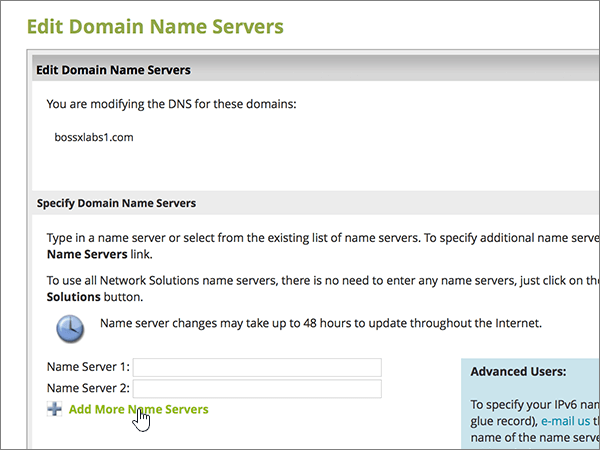

# 使用網路解決方案變更名稱伺服器以設定 MicrosoftChange nameservers to set up Microsoft with Network Solutions

 若您找不到所需內容，請 **[查看網域常見問題集](../setup/domains-faq.yml)**。**[Check the Domains FAQ](../setup/domains-faq.yml)** if you don't find what you're looking for.
  
如果您想讓 Microsoft 為您管理您的 DNS 記錄，請遵循下列指示。Follow these instructions if you want Microsoft to manage your DNS records for you.  (如果您願意，您可以 [在 [網路解決方案] 中管理所有的 MICROSOFT DNS 記錄](create-dns-records-at-network-solutions.md)。 ) (If you prefer, you can [manage all your Microsoft DNS records at Network Solutions](create-dns-records-at-network-solutions.md).)
  
    
## 在 Network Solutions 新增 TXT 記錄以驗證您擁有該網域Add a TXT record at Network Solutions to verify that you own the domain

在您將自己的網域用於 Microsoft 之前，我們必須先確認您擁有該網域。如果您能在自己的網域註冊機構登入自己的帳戶並能建立 DNS 記錄，Microsoft 就能確信您擁有該網域。Before you use your domain with Microsoft, we have to make sure that you own it. Your ability to log in to your account at your domain registrar and create the DNS record proves to Microsoft that you own the domain.
  
> [!NOTE]
> 這筆記錄只會用於驗證您擁有自己的網域，不會影響其他項目。您可以選擇稍後再刪除記錄。This record is used only to verify that you own your domain; it doesn't affect anything else. You can delete it later, if you like. 
  
請依照下列步驟操作或[觀看影片 (從 0:47 處開始)](https://support.microsoft.com/office/69b092e3-c026-4d19-a7d0-16cdb2d8b261)。Follow the steps below or [watch the video (start at 0:47)](https://support.microsoft.com/office/69b092e3-c026-4d19-a7d0-16cdb2d8b261).
  
1. 首先請用[這個連結](https://www.networksolutions.com/manage-it)移至 Network Solutions 上您的網域頁面。系統會提示您先登入。To get started, go to your domains page at Network Solutions by using [this link](https://www.networksolutions.com/manage-it). You'll be prompted to log in.
    
    > [!IMPORTANT]
    > 在您選取 [**登** 入] 按鈕之前，請先在 [**登入：** ] 下拉式清單中選擇 [**管理我的功能變數名稱**]。Before you select the **Login** button, first choose **Manage My Domain Names** in the **Log In to:** drop-down list.
  
    ![選擇 [管理我的網域名稱]，然後登入 Network Solutions](../../media/fda7d4a1-9445-4086-be9c-87c6983ef2aa.png)
  
2. 選取您要修改之網域名稱旁的核取方塊。Select the check box next to the name of the domain that you are modifying.
    
    
  
3. 選取 [ **編輯 DNS**]。Select **Edit DNS**.
    
    ![選取 [編輯 DNS]](../../media/9d7c269f-48d1-442c-9d7b-63bd384a36a9.png)
  
4. 選取 [ **管理 ADVANCED DNS 記錄**]。Select **Manage Advanced DNS Records**.
    
    (您可能需要向下捲動。)(You may have to scroll down.)
    
    ![選取 [管理 Advanced DNS 記錄]](../../media/fd2956d6-eec3-47ea-b60a-266bab14f51f.png)
  
5. 向下 **(TXT 記錄)** ] 區段中向下滾動至文字，然後選取 [ **編輯 TXT 記錄**]。Scroll down to the **Text (TXT Records)** section, and then select **Edit TXT Records**.
    
    ![選取 [編輯 TXT 記錄]](../../media/240a01d6-750a-4da6-8554-641b571e4b71.png)
  
6. In the boxes for the new record, type or copy and paste the values in the following table.In the boxes for the new record, type or copy and paste the values in the following table.
    
|**Host****Host**|**TTL****TTL**|**Text****Text**|
|:-----|:-----|:-----|
|@    (The system will change this value to **@ (None)** when you save the record.)(The system will change this value to **@ (None)** when you save the record.)    |36003600    |MS=ms *XXXXXXXX*MS=ms *XXXXXXXX*    **請注意**：這是一個範例。**Note**: This is an example. 在這裡請使用您自己的 [目的地或指向位址] 值，請參閱 Microsoft 365 表格。Use your specific **Destination or Points to Address** value here, from the table in Microsoft 365.           [如何找到呢？How do I find this?](../get-help-with-domains/information-for-dns-records.md)
   
    
   
  
7. 選取 [ **繼續**]。Select **Continue**.
    
    ![選取 [繼續]](../../media/89e7fb38-b4d9-4949-a1bb-d0dd10b361e0.png)
  
8. 選取 [ **儲存變更**]。Select **Save Changes**.
    
    ![選取 [儲存變更]](../../media/bd4d7cd0-c8a3-497a-b080-cfd5a5c60dc5.png)
  
9. 繼續進行之前，請先稍候幾分鐘，好讓您剛剛建立的記錄能在網際網路上更新。Wait a few minutes before you continue, so that the record you just created can update across the Internet.
    
現在您已在網域註冊機構網站新增記錄，請返回 Microsoft 365 並要求 Microsoft 365 尋找該記錄。Now that you've added the record at your domain registrar's site, you'll go back to Microsoft 365 and request Microsoft 365 to look for the record.
  
在 Microsoft 找到正確的 TXT 記錄後，您的網域就完成驗證了。When Microsoft finds the correct TXT record, your domain is verified.
  
1. 在 Microsoft 系統管理中心中，移至 **[設定]** \> <a href="https://go.microsoft.com/fwlink/p/?linkid=834818" target="_blank">[網域]</a> 頁面。In the Microsoft admin center, go to the **Settings** \> <a href="https://go.microsoft.com/fwlink/p/?linkid=834818" target="_blank">Domains</a> page.

    
2. 在 **[網域]** 頁面上，選取您要驗證的網域。On the **Domains** page, select the domain that you are verifying. 
    
    
  
3. 在 **[設定]** 頁面上，選取 **[開始設定]**。On the **Setup** page, select **Start setup**.
    
    
  
4. 在 **[驗證網域]** 頁面上，選取 **[驗證]**。On the **Verify domain** page, select **Verify**.
    
    
  
> [!NOTE]
>  DNS 變更生效通常約需 15 分鐘的時間。而如果您所做的變更要在整個網際網路 DNS 系統中生效，有時可能需要更久的時間。在您新增 DNS 記錄後，如有郵件流程或其他方面的問題，請參閱[變更網域名稱或 DNS 記錄之後所發生問題的疑難排解](../get-help-with-domains/find-and-fix-issues.md)。Typically it takes about 15 minutes for DNS changes to take effect. However, it can occasionally take longer for a change you've made to update across the Internet's DNS system. If you're having trouble with mail flow or other issues after adding DNS records, see [Troubleshoot issues after changing your domain name or DNS records](../get-help-with-domains/find-and-fix-issues.md). 
  
## 變更您網域的名稱伺服器 (NS) 記錄Change your domain's nameserver (NS) records

若要使用 Microsoft 設定您的網域，請在您的網域註冊機構變更網域的 NS 記錄，以指向 Microsoft 主要和次要名稱伺服器。To complete setting up your domain with Microsoft, you change your domain's NS records at your domain registrar to point to the Microsoft primary and secondary name servers. 這會將 Microsoft 設定為您為您更新網域的 DNS 記錄。This sets up Microsoft to update the domain's DNS records for you. 我們會新增所有記錄，好讓電子郵件、商務用 Skype Online 和您的公用網站都能使用您的網域，為您做好一切準備。We'll add all records so that email, Skype for Business Online, and your public website work with your domain, and you'll be all set.
  
> [!CAUTION]
> 當您將網域的 NS 記錄變更為指向 Microsoft 名稱伺服器時，所有目前與您網域相關聯的服務都會受到影響。When you change your domain's NS records to point to the Microsoft name servers, all the services that are currently associated with your domain are affected. 例如，所有傳送至您網域的電子郵件 (例如 rob@ *your_domain*  .com) 會在您進行此變更之後，從 Microsoft 開始。For example, all email sent to your domain (like rob@ *your_domain*  .com) will start coming to Microsoft after you make this change.
  
準備好變更您的 NS 記錄，讓 Microsoft 能夠設定您的網域？Ready to change your NS records so Microsoft can set up your domain? 請依照下列步驟操作或[觀看影片 (從 2:23 處開始)](https://support.microsoft.com/office/69b092e3-c026-4d19-a7d0-16cdb2d8b261)。Follow the steps below or [watch the video (start at 2:23)](https://support.microsoft.com/office/69b092e3-c026-4d19-a7d0-16cdb2d8b261).
  
> [!IMPORTANT]
>  當您完成本節中的步驟之後，應該會列出的  *唯一*  名稱伺服器為下列四種： **ns1.bdm.microsoftonline.com**、 **ns2.bdm.microsoftonline.com**、 **ns3.bdm.microsoftonline.com** 和 **ns4.bdm.microsoftonline.com**。When you have completed the steps in this section, the  *only*  nameservers that should be listed are these four: **ns1.bdm.microsoftonline.com**, **ns2.bdm.microsoftonline.com**, **ns3.bdm.microsoftonline.com**, and **ns4.bdm.microsoftonline.com**. The following procedure will show you how to delete any other, unwanted nameservers from the list, and also how to add the  *correct*  nameservers if they are not already in the list.The following procedure will show you how to delete any other, unwanted nameservers from the list, and also how to add the  *correct*  nameservers if they are not already in the list. 
  
1. 首先請用[這個連結](https://www.networksolutions.com/manage-it)移至 Network Solutions 上您的網域頁面。To get started, go to your domains page at Network Solutions by using [this link](https://www.networksolutions.com/manage-it). 系統會提示您先登入。You'll be prompted to log in.
    
    > [!IMPORTANT]
    > 在您選取 [**登** 入] 按鈕之前，請先在 [**登入：** ] 下拉式清單中選擇 [**管理我的功能變數名稱**]。Before you select the **Login** button, first choose **Manage My Domain Names** in the **Log In to:** drop-down list. 
  
    ![選擇 [管理我的網域名稱]，然後登入 Network Solutions](../../media/fda7d4a1-9445-4086-be9c-87c6983ef2aa.png)
  
2. 選取您要修改之網域名稱旁的核取方塊。Select the check box next to the name of the domain that you are modifying.
    
    
  
3. 選取 [ **編輯 DNS**]。Select **Edit DNS**.
    
    ![選取 [編輯 DNS]](../../media/9d7c269f-48d1-442c-9d7b-63bd384a36a9.png)
  
4. 選取 [ **移動 DNS**]。Select **Move DNS**.
    
    
  
5. 請根據現在顯示頁面上是否列出名稱伺服器，來選擇下列兩個程序其中一項繼續︰Depending on whether or not there are already nameservers listed on the page that is displayed now, continue to one of the two following procedures:
    
  - 如果沒有列出 **任何** 名稱伺服器， [則未列出任何名稱伺服器](#if-there-are-no-nameservers-already-listed)。If there are **NO** nameservers already listed, [If there are NO nameservers already listed](#if-there-are-no-nameservers-already-listed).
    
  - 如果已 **列出名稱伺服器，** 如果已 [列出名稱伺服器](#if-there-are-nameservers-already-listed)。If there **ARE** nameservers already listed, [If there ARE nameservers already listed](#if-there-are-nameservers-already-listed).
    
### 如果列表上「沒有」名稱伺服器If there are NO nameservers already listed

1. 在 [ **網域** ] 頁面上，選取 [ **指定功能變數名稱伺服器** ] 區段中的 [ **新增更多名稱伺服器**]。On the **Domains** page, in the **Specify Domain Name Servers** section, select **Add More Name Servers**.
    
    
  
2. 在 [ **功能變數名稱** ] 頁面上，輸入或複製並貼上下表中名稱伺服器的值。On the **Domain Names** page, type or copy and paste the nameserver values from the following table. 
    
|||
|:-----|:-----|
|**Name server 1 (名稱伺服器 1)****Name Server 1**   |ns1.bdm.microsoftonline.comns1.bdm.microsoftonline.com    |
|**Name Server 2 (名稱伺服器 2)****Name Server 2**   |ns2.bdm.microsoftonline.comns2.bdm.microsoftonline.com    |
|**Name Server 2 (名稱伺服器 2)****Name Server 2**   |ns3.bdm.microsoftonline.comns3.bdm.microsoftonline.com    |
|**Name Server 2 (名稱伺服器 2)****Name Server 2**   |ns4.bdm.microsoftonline.comns4.bdm.microsoftonline.com    |
   
    

  
3. 選取 [ **移動 DNS**]。Select **Move DNS**.
    
    
  
4. 選取 [ **儲存變更**]。Select **Save Changes**.
    
    
  
> [!NOTE]
> 您的名稱伺服器記錄更新可能需要數小時的時間，才能更新到整個網際網路的 DNS 系統。Your nameserver record updates may take up to several hours to update across the Internet's DNS system. 然後，您的 Microsoft 電子郵件和其他服務將全部設定為與您的網域搭配使用。Then your Microsoft email and other services will be all set to work with your domain. 
  
### 如果列表上「有」名稱伺服器If there ARE nameservers already listed

> [!CAUTION]
> Follow these steps  *only*  if you have existing nameservers other than the four  *correct*  nameservers.Follow these steps  *only*  if you have existing nameservers other than the four  *correct*  nameservers.  (也就是說，  *只*  刪除所有  *未*  命名為 **ns1.bdm.microsoftonline.com**、 **ns2.bdm.microsoftonline.com**、 **ns3.bdm.microsoftonline.com** 或 **ns4.bdm.microsoftonline.com** 的目前名稱伺服器。 ) (That is, delete  *only*  any current nameservers that are  *not*  named **ns1.bdm.microsoftonline.com**, **ns2.bdm.microsoftonline.com**, **ns3.bdm.microsoftonline.com**, or **ns4.bdm.microsoftonline.com**.)
  
1. 如果有列出任何其他名稱伺服器，請選取它，然後按鍵盤上的 **delete** 鍵，逐一刪除。If there are any other nameservers listed, delete each one by selecting it and then pressing the **Delete** key on your keyboard.
    
    
  
2. 選取 [ **新增更多名稱伺服器**]。Select **Add More Name Servers**.
    
    
  
3. 在 [ **功能變數名稱** ] 頁面上，輸入或複製並貼上下表中名稱伺服器的值。On the **Domain Names** page, type or copy and paste the nameserver values from the following table. 
    
|||
|:-----|:-----|
|**Name server 1 (名稱伺服器 1)****Name Server 1**   |ns1.bdm.microsoftonline.comns1.bdm.microsoftonline.com    |
|**Name Server 2 (名稱伺服器 2)****Name Server 2**   |ns2.bdm.microsoftonline.comns2.bdm.microsoftonline.com    |
|**Name Server 3 (名稱伺服器 3)****Name Server 3**   |ns3.bdm.microsoftonline.comns3.bdm.microsoftonline.com    |
|**Name Server 4 (名稱伺服器 4)****Name Server 4**   |ns4.bdm.microsoftonline.comns4.bdm.microsoftonline.com    |
   
    

  
4. 選取 [ **移動 DNS**]。Select **Move DNS**.
    
    
  
5. 選取 [ **儲存變更]。**Select **Save Changes.**
    
    
  
> [!NOTE]
> 您的名稱伺服器記錄更新可能需要數小時的時間，才能更新到整個網際網路的 DNS 系統。Your nameserver record updates may take up to several hours to update across the Internet's DNS system. 然後，您的 Microsoft 電子郵件和其他服務將全部設定為與您的網域搭配使用。Then your Microsoft email and other services will be all set to work with your domain.
