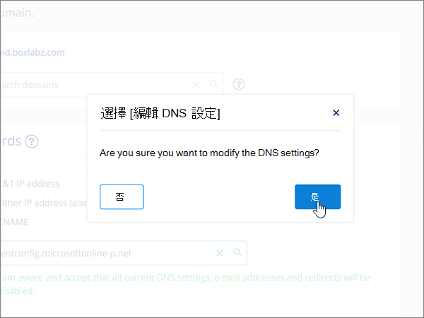

# 在 1&1 IONOS 為 Microsoft 建立 DNS 記錄Create DNS records at 1&1 IONOS for Microsoft

 若您找不到所需內容，請**[查看網域常見問題集](../setup/domains-faq.md)**。**[Check the Domains FAQ](../setup/domains-faq.md)** if you don't find what you're looking for. 
  
> [!CAUTION]
> 請注意，1&1 IONOS 不允許網域同時具有 MX 記錄和最上層自動探索 CNAME 記錄。Note that 1&1 IONOS doesn't allow a domain to have both an MX record and a top-level Autodiscover CNAME record. 這會限制您可為 Microsoft 設定 Exchange Online 的方式。This limits the ways in which you can configure Exchange Online for Microsoft. 有一種解決方法，但只有在您已具備在 1&1 IONOS 建立子域的經驗時，**才**建議使用此方法。There is a workaround, but we recommend employing it **only** if you already have experience with creating subdomains at 1&1 IONOS. > 如果此[服務限制](https://docs.microsoft.com/microsoft-365/admin/setup/domains-faq)您選擇在 1&1 IONOS 管理您自己的 Microsoft DNS 記錄，請遵循本文中的步驟來驗證您的網域，並設定電子郵件、商務用 Skype Online 等的 DNS 記錄。> If despite this [service limitation](https://docs.microsoft.com/microsoft-365/admin/setup/domains-faq) you choose to manage your own Microsoft DNS records at 1&1 IONOS, follow the steps in this article to verify your domain and to set up DNS records for email, Skype for Business Online, and so on. 
  
在 1&1 IONOS 新增這些記錄之後，您的網域就會設定為與 Microsoft 服務搭配使用。After you add these records at 1&1 IONOS, your domain will be set up to work with Microsoft services.
  
  
> [!NOTE]
> Typically it takes about 15 minutes for DNS changes to take effect.Typically it takes about 15 minutes for DNS changes to take effect. 然而有時可能需要更久的時間，您所做的變更才能在整個網際網路的 DNS 系統中生效。However, it can occasionally take longer for a change you've made to update across the Internet's DNS system. 在您新增 DNS 記錄後，如有郵件流程或其他方面的問題，請參閱[尋找並修正新增網域或 DNS 記錄之後所發生的問題](../get-help-with-domains/find-and-fix-issues.md)。If you're having trouble with mail flow or other issues after adding DNS records, see [Find and fix issues after adding your domain or DNS records](../get-help-with-domains/find-and-fix-issues.md). 
  
## 新增 TXT 記錄以供驗證Add a TXT record for verification

在您將自己的網域用於 Microsoft 之前，我們必須先確認您擁有該網域。如果您能在自己的網域註冊機構登入自己的帳戶並能建立 DNS 記錄，Microsoft 就能確信您擁有該網域。Before you use your domain with Microsoft, we have to make sure that you own it. Your ability to log in to your account at your domain registrar and create the DNS record proves to Microsoft that you own the domain.
  
> [!NOTE]
> 這筆記錄只會用於驗證您擁有自己的網域，不會影響其他項目。您可以選擇稍後再刪除記錄。This record is used only to verify that you own your domain; it doesn't affect anything else. You can delete it later, if you like. 
  
請依照下列步驟操作或[觀看影片 (從 0:42 處開始)](https://docs.microsoft.com/microsoft-365/admin/dns/create-dns-records-at-1-1-internet)。Follow the steps below or [watch the video (start at 0:42)](https://docs.microsoft.com/microsoft-365/admin/dns/create-dns-records-at-1-1-internet).
  
1. 若要開始使用，請移至您的網域頁面，1&1 IONOS，方法是使用[此連結](https://my.1and1.com/)。To get started, go to your domains page at 1&1 IONOS by using [this link](https://my.1and1.com/). You'll be prompted to log in.You'll be prompted to log in.
    
2. 選取 [**管理網域**]。Select **Manage domains**.
    
3. 在 [**網域中心**] 頁面上，找到您要更新的網域，然後選取該網域的 [**面板**] （ **v**）控制。On the **Domain Center** page, find the domain that you want to update, and then select the **Panel** ( **v**) control for that domain.
    
4. 在 [**網域設定**] 區域中，選取 [**編輯 DNS 設定**]。In the **Domain Settings** area, select **Edit DNS Settings**.
    
5. 在 [ **TXT 和 SRV 記錄**] 區段中，選取 [**新增記錄**]。In the **TXT and SRV Records** section, select **Add Record**.
    
6. In the **Add Record** area, in the boxes for the new record, type or copy and paste the values from the following table.In the **Add Record** area, in the boxes for the new record, type or copy and paste the values from the following table. 
    
    (Choose the **Type** value from the drop-down list.)(Choose the **Type** value from the drop-down list.) 
    
    ||||
    |:-----|:-----|:-----|
    |**類型****Type**   |**Prefix****Prefix**   |**Name Value****Name Value**   |
    |TXTTXT    |（將此欄位保留空白）(Leave this field blank)    |MS=ms *XXXXXXXX*MS=ms *XXXXXXXX*    請注意：這是一個範例。NOTE: This is an example. 在這裡請使用您自己來自表格的 **[目的地或指向位址]** 值。Use your specific **Destination or Points to Address** value here, from the table. [如何找到呢？How do I find this?](../get-help-with-domains/information-for-dns-records.md)          |
   
7. 選取 [儲存]\*\*\*\*。Select **Save**.
    
8. 再次選取 [**儲存**]。Select **Save** again. 
    
9. 在 [**編輯 DNS 設定**] 對話方塊中，選取 **[是]**。In the **Edit DNS Settings** dialog box, select **Yes**.
    
10. 繼續進行之前，請先稍候幾分鐘，好讓您剛剛建立的記錄能在網際網路上更新。Wait a few minutes before you continue, so that the record you just created can update across the Internet.
    
現在您已在網域註冊機構網站新增記錄，請返回 Microsoft 365 並要求 Microsoft 365 尋找該記錄。Now that you've added the record at your domain registrar's site, you'll go back to Microsoft 365 and request Microsoft 365 to look for the record.
  
在 Microsoft 找到正確的 TXT 記錄後，您的網域就完成驗證了。When Microsoft finds the correct TXT record, your domain is verified.
  
1. 在 Microsoft 系統管理中心中，移至 **[設定]** \> <a href="https://go.microsoft.com/fwlink/p/?linkid=834818" target="_blank">[網域]</a> 頁面。In the Microsoft admin center, go to the **Settings** \> <a href="https://go.microsoft.com/fwlink/p/?linkid=834818" target="_blank">Domains</a> page.

    
2. 在 **[網域]** 頁面上，選取您要驗證的網域。On the **Domains** page, select the domain that you are verifying. 
    
3. 在 **[設定]** 頁面上，選取 **[開始設定]**。On the **Setup** page, select **Start setup**.
    
4. 在 **[驗證網域]** 頁面上，選取 **[驗證]**。On the **Verify domain** page, select **Verify**.
    
> [!NOTE]
> Typically it takes about 15 minutes for DNS changes to take effect.Typically it takes about 15 minutes for DNS changes to take effect. 然而有時可能需要更久的時間，您所做的變更才能在整個網際網路的 DNS 系統中生效。However, it can occasionally take longer for a change you've made to update across the Internet's DNS system. 在您新增 DNS 記錄後，如有郵件流程或其他方面的問題，請參閱[尋找並修正新增網域或 DNS 記錄之後所發生的問題](../get-help-with-domains/find-and-fix-issues.md)。If you're having trouble with mail flow or other issues after adding DNS records, see [Find and fix issues after adding your domain or DNS records](../get-help-with-domains/find-and-fix-issues.md). 
  
## 新增 MX 記錄，以將寄往您網域的電子郵件轉至 MicrosoftAdd an MX record so email for your domain will come to Microsoft

請依照下列步驟操作或[觀看影片 (從 3:22 處開始)](https://docs.microsoft.com/microsoft-365/admin/dns/create-dns-records-at-1-1-internet)。Follow the steps below or [watch the video (start at 3:22)](https://docs.microsoft.com/microsoft-365/admin/dns/create-dns-records-at-1-1-internet).
  
> [!NOTE]
> 如果您已登錄1und1.de，請[在這裡登入](https://go.microsoft.com/fwlink/?linkid=859152)。If you've registered with 1und1.de, [sign in here](https://go.microsoft.com/fwlink/?linkid=859152). 
  
1. 若要開始使用，請移至您的網域頁面，1&1 IONOS，方法是使用[此連結](https://my.1and1.com/)。To get started, go to your domains page at 1&1 IONOS by using [this link](https://my.1and1.com/). You'll be prompted to log in.You'll be prompted to log in.
    
2. 選取 [**管理網域**]。Select **Manage domains**.
    
3. 在 [**網域中心**] 頁面上，找到您要更新的網域，然後選取該網域的 [**面板**] （ **v**）控制。On the **Domain Center** page, find the domain that you want to update, and then select the **Panel** ( **v**) control for that domain.
    
4. 在 [**網域設定**] 區域中，選取 [**編輯 DNS 設定**]。In the **Domain Settings** area, select **Edit DNS Settings**.
    
5. 在 [ **MX 記錄**] 區段的 [**郵件交換器（MX 記錄）** ] 區域中，選取 [**其他郵件伺服器**]。In the **MX Records** section, in the **Mail Exchanger (MX Record)** area, select **Other mail server**. (You may have to scroll down.)(You may have to scroll down.)   
  
6. 如果已列出任何 MX 記錄，請選取該記錄，然後按下鍵盤上的**delete**鍵，以刪除每一筆記錄。If there are any MX records already listed, delete each of them by selecting the record and then pressing the **Delete** key on your keyboard. (如果未列出 MX 記錄，請繼續下一個步驟)。(If there are no MX records already listed, continue to the next step.)  
  
7. 在 [ **MX 1** ] 記錄的方塊中，輸入或複製並貼上下表中的值。In the boxes for the **MX 1** record, type or copy and paste the values from the following table. 
    
    |**MX 1****MX 1**|**優先順序****Priority**|
    |:-----|:-----|
    | *\<domain-key\>*。 mail.protection.outlook.com*\<domain-key\>*  .mail.protection.outlook.com     附注：請 \<domain-key\> 從您的 Microsoft 帳戶取得。NOTE: Get your \<domain-key\> from your Microsoft account. [How do I find this?How do I find this?](../get-help-with-domains/information-for-dns-records.md)          |10 10    如需關於優先順序的詳細資訊，請參閱[什麼是 MX 優先順序？](https://docs.microsoft.com/microsoft-365/admin/setup/domains-faq)For more information about priority, see [What is MX priority?](https://docs.microsoft.com/microsoft-365/admin/setup/domains-faq)   | 
    
     
  
8. 選取 [儲存]\*\*\*\*。Select **Save**. (You may have to scroll down.)(You may have to scroll down.) 
  
9. 在 [**編輯 DNS 設定**] 對話方塊中，選取 **[是]**。In the **Edit DNS Settings** dialog box, select **Yes**. ![在 [編輯 DNS 設定] 對話方塊中選取 [是]](../../media/920cc95f-fedf-4da2-94a4-9cb41ed49bcf.png)
  
## 新增 Microsoft 所需的六筆 CNAME 記錄Add the six CNAME records that are required for Microsoft

1&1 IONOS 需要一種方法，讓您可以使用 MX 記錄，以及 Microsoft 電子郵件服務所需的 CNAME 記錄。1&1 IONOS requires a workaround so that you can use an MX record together with the CNAME records that are required for Microsoft email services. 此項變通方法需要您在 1&1 IONOS，建立一組子域，並將它們指派給 CNAME 記錄。This workaround requires you to create a set of subdomains at 1&1 IONOS, and to assign them to CNAME records.
  
> [!IMPORTANT]
> 請確認您至少有兩個可用的子網域，才能開始進行此程序。Make sure that you have at least two available subdomains before starting this procedure. 只有在您已有在 1&1 IONOS 建立子域的經驗時，才建議使用此解決方案。We recommend this solution only if you already have experience with creating subdomains at 1&1 IONOS. 
  
### 基本 CNAME 記錄Basic CNAME records

請按照下列步驟操作或[觀看影片 (從 3:57 處開始)](https://docs.microsoft.com/microsoft-365/admin/dns/create-dns-records-at-1-1-internet)。Follow the steps below or [watch the video (start at 3:57)](https://docs.microsoft.com/microsoft-365/admin/dns/create-dns-records-at-1-1-internet).
  
> [!NOTE]
> 如果您已登錄1und1.de，請[在這裡登入](https://go.microsoft.com/fwlink/?linkid=859152)。If you've registered with 1und1.de, [sign in here](https://go.microsoft.com/fwlink/?linkid=859152). 
  
1. 若要開始使用，請移至您的網域頁面，1&1 IONOS，方法是使用[此連結](https://my.1and1.com/)。To get started, go to your domains page at 1&1 IONOS by using [this link](https://my.1and1.com/). You'll be prompted to log in.You'll be prompted to log in.
    
2. 選取 [**管理網域**]。Select **Manage domains**.
    
3. 在 [**網域中心**] 頁面上，尋找您要更新的網域，然後選取 [**管理子域**]。On the **Domain Center** page, find the domain that you want to update, and then select **Manage Subdomains**.   現在您會建立兩個子域，並為每個子域設定一個**別名**值。Now you'll create two subdomains and set an **Alias** value for each. （這是必要的，因為 1&1 IONOS 只支援一個最上層 CNAME 記錄，但 Microsoft 需要多個 CNAME 記錄。）(This is required because 1&1 IONOS supports only one top-level CNAME record, but Microsoft requires several CNAME records.) 首先，建立自動探索子網域。First, you'll create the Autodiscover subdomain.
    
4. 在 [**子域一覽**] 區段中，選取 [**建立子域**]。In the **Subdomain Overview** section, select **Create Subdomain**.
    
    
  
5. 在 [**建立**新子域的子域] 方塊中，輸入或複製並貼上下清單格中的 [**建立子域**] 值。In the **Create Subdomain** box for the new subdomain, type or copy and paste only the **Create Subdomain** value from the following table. （您將在稍後的步驟中新增**別名**值。）(You'll add the **Alias** value in a later step.)

    |**建立子網域****Create Subdomain**|**Alias****Alias**|
    |:-----|:-----|
    |autodiscoverautodiscover    |autodiscover.outlook.comautodiscover.outlook.com   | 

    
  
6. 選取 [**建立子域**]。Select **Create Subdomain**. 
  
7. 在 [**子域一覽**] 區段中，找出您剛剛建立的**自動**探索子域，然後選取該子域的 [**面板] （v）** 控制。In the **Subdomain Overview** section, locate the **autodiscover** subdomain that you just created, and then select the **Panel (v)** control for that subdomain.  
  
8. 在 [**子域設定**] 區域中，選取 [**編輯 DNS 設定**]。In the **Subdomain Settings** area, select **Edit DNS Settings**.  
  
9. 在 [ **A/AAAA 記錄（IP 位址）** ] 區段的 [ **IP 位址（A 記錄）** ] 區域中，選取 [ **CNAME**]。In the **A/AAAA Records (IP Addresses)** section, in the **IP address (A Record)** area, select **CNAME**. 
  
10. 在 [**別名：** ] 方塊中，只輸入或複製並貼上下清單格中的**別名**值。In the **Alias:** box, type or copy and paste only the **Alias** value from the following table.  
    
    |**建立子網域****Create Subdomain**|**Alias****Alias**|
    |:-----|:-----|
    |autodiscoverautodiscover    |autodiscover.outlook.comautodiscover.outlook.com   |

    
  
11. 選取 [**我的感知**免責聲明] 的核取方塊。Select the check box for the **I am aware** disclaimer. 
  
12. 選取 [儲存]\*\*\*\*。Select **Save**. 
  
  
### 額外 CNAME 記錄Additional CNAME records

下列程序中產生的額外 CNAME 記錄會啟用商務用 Skype Online 服務。您會採用與您已經建立兩筆 CNAME 記錄時所採用的相同步驟。The additional CNAME records created in the following procedure enable Skype for Business Online services. You will employ the same steps that you used to create the two CNAME records you have already created.
  
1. 建立第三個子網域 (Lyncdiscover)。Create the third subdomain (Lyncdiscover). 在 [**子域一覽**] 區段中，選取 [**建立子域**]。On the **Subdomain Overview** section, select **Create Subdomain**.
    
2. 在 [**建立**新子域的子域] 方塊中，輸入或複製並貼上下清單格中的 [**建立子域**] 值。In the **Create Subdomain** box for the new subdomain, type or copy and paste only the **Create Subdomain** value from the following table. （您將在稍後的步驟中新增**別名**值。）(You'll add the **Alias** value in a later step.)  
    
    |**建立子網域****Create Subdomain**|**Alias****Alias**|
    |:-----|:-----|
    |lyncdiscoverlyncdiscover   |webdir.online.lync.comwebdir.online.lync.com  |
   
3. 選取 [**建立子域**]。Select **Create Subdomain**.
    
4. 在 [**網域中心**] 頁面上，選取 [**管理子域**]。On the **Domain Center** page, select **Manage Subdomains**.
    
5. 在 [**子域一覽**] 區段中，尋找您剛才建立的**lyncdiscover**子域，然後選取該子域的 [**面板] （v）** 控制。In the **Subdomain Overview** section, find the **lyncdiscover** subdomain that you just created, and then select the **Panel (v)** control for that subdomain.  在 [**子域設定**] 區域中，選取 [**編輯 DNS 設定**]。In the **Subdomain Settings** area, select **Edit DNS Settings**.
    
6. 在 [ **A/AAAA 記錄（IP 位址）** ] 區段的 [ **IP 位址（A 記錄）** ] 區域中，選取 [ **CNAME**]。In the **A/AAAA Records (IP Addresses)** section, in the **IP address (A Record)** area, select **CNAME**.
    
7. 在 [**別名：** ] 方塊中，只輸入或複製並貼上下清單格中的**別名**值。In the **Alias:** box, type or copy and paste only the **Alias** value from the following table.  
    
    |**建立子網域****Create Subdomain**|**Alias****Alias**|
    |:-----|:-----|
    |lyncdiscoverlyncdiscover    |webdir.online.lync.comwebdir.online.lync.com    |
   
8. 選取 [**我的感知**免責聲明] 的核取方塊，然後選取 [**儲存**]。Select the check box for the **I am aware** disclaimer, and then select **Save**.
    
9. 在 [**編輯 DNS 設定**] 對話方塊中，選取 **[是]**。In the **Edit DNS Settings** dialog box, select **Yes**.
    
10. 建立第四個子網域 (SIP)：Create the fourth subdomain (SIP):  在 [**子域一覽**] 區段中，選取 [**建立子域**]。In the **Subdomain Overview** section, select **Create Subdomain**.
    
11. 在 [**建立**新子域的子域] 方塊中，輸入或複製並貼上下清單格中的 [**建立子域**] 值。In the **Create Subdomain** box for the new subdomain, type or copy and paste only the **Create Subdomain** value from the following table. （您將在稍後的步驟中新增**別名**值。）(You'll add the **Alias** value in a later step.)  
    
    |**建立子網域****Create Subdomain**|**Alias****Alias**|
    |:-----|:-----|
    |sipsip    |sipdir.online.lync.comsipdir.online.lync.com    |
   
12. 選取 [**建立子域**]。Select **Create Subdomain**.
    
13. 在 [**網域中心**] 頁面上，選取 [**管理子域**]。On the **Domain Center** page, select **Manage Subdomains**.
    
14. 在 [**子域一覽**] 區段中，尋找您剛才建立的**sip**子域，然後為該子域選取**面板（v）** 控制。In the **Subdomain Overview** section, find the **sip** subdomain that you just created, and then select the **Panel (v)** control for that subdomain.  在 [**子域設定**] 區域中，選取 [**編輯 DNS 設定**]。In the **Subdomain Settings** area, select **Edit DNS Settings**.
    
15. 在 [ **A/AAAA 記錄（IP 位址）** ] 區段的 [ **IP 位址（A 記錄）** ] 區域中，選取 [ **CNAME**]。In the **A/AAAA Records (IP Addresses)** section, in the **IP address (A Record)** area, select **CNAME**.
    
16. 在 [**別名：** ] 方塊中，只輸入或複製並貼上下清單格中的**別名**值。In the **Alias:** box, type or copy and paste only the **Alias** value from the following table. 
    
    |**建立子網域****Create Subdomain**|**Alias****Alias**|
    |:-----|:-----|
    |sipsip    |sipdir.online.lync.comsipdir.online.lync.com    |
   
17. 選取 [**我的感知**免責聲明] 的核取方塊，然後選取 [**儲存**]。Select the check box for the **I am aware** disclaimer, and then select **Save**.
    
18. 在 [**編輯 DNS 設定**] 對話方塊中，選取 **[是]**。In the **Edit DNS Settings** dialog box, select **Yes**.
    
### MDM 所需的 CNAME 記錄CNAME records needed for MDM

> [!IMPORTANT]
> 請按照您針對其他四筆 CNAME 記錄所進行的程序執行，但提供下表的值。Follow the procedure that you used for the other four CNAME records, but supply the values from the following table. 
  
|**建立子網域****Create Subdomain**|**Alias****Alias**|
|:-----|:-----|
|enterpriseregistrationenterpriseregistration    |enterpriseregistration.windows.netenterpriseregistration.windows.net    |
|enterpriseenrollmententerpriseenrollment    |enterpriseenrollment-s.manage.microsoft.comenterpriseenrollment-s.manage.microsoft.com    |
   
## 新增 SPF 的 TXT 記錄以協助防範垃圾郵件Add a TXT record for SPF to help prevent email spam

> [!IMPORTANT]
> 網域的 SPF 不得擁有一個以上的 TXT 記錄。You cannot have more than one TXT record for SPF for a domain. 如果您的網域具有多筆 SPF 記錄，您將收到電子郵件錯誤，以及傳送及垃圾郵件分類問題。If your domain has more than one SPF record, you'll get email errors, as well as delivery and spam classification issues. 如果網域已經有 SPF 記錄，請勿為 Microsoft 建立一個新的記錄。If you already have an SPF record for your domain, don't create a new one for Microsoft. 請改為將必要的 Microsoft 值新增至目前的記錄，讓您擁有包含這兩組值的*單一*SPF 記錄。Instead, add the required Microsoft values to the current record so that you have a  *single*  SPF record that includes both sets of values. 需要範例？Need examples? 請參閱這些 [Microsoft 的外部網域名稱系統記錄](https://docs.microsoft.com/office365/enterprise/external-domain-name-system-records)。Check out these [External Domain Name System records for Microsoft](https://docs.microsoft.com/office365/enterprise/external-domain-name-system-records). 若要驗證您的 SPF 記錄，您可以使用其中一種[spf 驗證工具](../setup/domains-faq.md)。To validate your SPF record, you can use one of these[SPF validation tools](../setup/domains-faq.md). 
  
請依照下列步驟操作或[觀看影片 (從 5:09 處開始)](https://docs.microsoft.com/microsoft-365/admin/dns/create-dns-records-at-1-1-internet)。Follow the steps below or [watch the video (start at 5:09)](https://docs.microsoft.com/microsoft-365/admin/dns/create-dns-records-at-1-1-internet).
  
> [!NOTE]
> 如果您已登錄1und1.de，請[在這裡登入](https://go.microsoft.com/fwlink/?linkid=859152)。If you've registered with 1und1.de, [sign in here](https://go.microsoft.com/fwlink/?linkid=859152). 
  
1. 若要開始使用，請移至您的網域頁面，1&1 IONOS，方法是使用[此連結](https://my.1and1.com/)。To get started, go to your domains page at 1&1 IONOS by using [this link](https://my.1and1.com/). You'll be prompted to log in.You'll be prompted to log in.
    
2. 選取 [**管理網域**]。Select **Manage domains**.
    
3. 在 [**網域中心**] 頁面上，找到您要更新的網域，然後選取該網域的 [**面板**] （**v**）控制。On the **Domain Center** page, find the domain that you want to update, and then select the **Panel** (**v**) control for that domain.
    
4. 在 [**網域設定**] 區域中，選取 [**編輯 DNS 設定**]。In the **Domain Settings** area, select **Edit DNS Settings**.
    
5. 在 [ **TXT 和 SRV 記錄**] 區段中，選取 [**新增記錄**]。In the **TXT and SRV Records** section, select **Add Record**.  (You may have to scroll down.)(You may have to scroll down.)
    
6. In the **Add Record** area, in the boxes for the new record, type or copy and paste the values from the following table.In the **Add Record** area, in the boxes for the new record, type or copy and paste the values from the following table.  (Choose the **Type** value from the drop-down list.)(Choose the **Type** value from the drop-down list.)  
    
    |**類型****Type**|**Prefix****Prefix**|**Name Value****Name Value**|
    |:-----|:-----|:-----|
    |TXTTXT    |(Leave this field empty.)(Leave this field empty.)    |v=spf1 include:spf.protection.outlook.com -allv=spf1 include:spf.protection.outlook.com -all    **附註：** 建議您複製並貼上這個項目，好讓所有的間距保持正確。**Note:** We recommend copying and pasting this entry, so that all of the spacing stays correct.           | 
    
    
  
7. 選取 [儲存]\*\*\*\*。Select **Save**. 
  
8. 選取 [儲存]\*\*\*\*。Select **Save**. 
  
9. 在 [**編輯 DNS 設定**] 對話方塊中，選取 **[是]**。In the **Edit DNS Settings** dialog box, select **Yes**. ![在 [編輯 DNS 設定] 對話方塊中選取 [是]](../../media/920cc95f-fedf-4da2-94a4-9cb41ed49bcf.png)
  
## 新增兩筆 Microsoft 所需的 SRV 記錄Add the two SRV records that are required for Microsoft

請依照下列步驟操作或[觀看影片 (從 5:51 處開始)](https://docs.microsoft.com/microsoft-365/admin/dns/create-dns-records-at-1-1-internet)。Follow the steps below or [watch the video (start at 5:51)](https://docs.microsoft.com/microsoft-365/admin/dns/create-dns-records-at-1-1-internet).
  
> [!NOTE]
> 如果您已登錄1und1.de，請[在這裡登入](https://go.microsoft.com/fwlink/?linkid=859152)。If you've registered with 1und1.de, [sign in here](https://go.microsoft.com/fwlink/?linkid=859152). 
  
1. 若要開始使用，請移至您的網域頁面，1&1 IONOS，方法是使用[此連結](https://my.1and1.com/)。To get started, go to your domains page at 1&1 IONOS by using [this link](https://my.1and1.com/). You'll be prompted to log in.You'll be prompted to log in.
    
2. 選取 [**管理網域**]。Select **Manage domains**.
    
3. 在 [**網域中心**] 頁面上，找到您要更新的網域，然後選取該網域的 [**面板**] （ **v**）控制。On the **Domain Center** page, find the domain that you want to update, and then select the **Panel** ( **v**) control for that domain.
    
4. 在 [**網域設定**] 區域中，選取 [**編輯 DNS 設定**]。In the **Domain Settings** area, select **Edit DNS Settings**.
    
5. 在 [ **TXT 和 SRV 記錄**] 區段中，選取 [**新增記錄**]。In the **TXT and SRV Records** section, select **Add Record**.
    
6. 新增兩筆 SRV 記錄中的第一筆。Add the first of the two SRV records. 在 [ **Add Record** ] （新增記錄）區域的新記錄方塊中，輸入或複製並貼上下表中第一列的值。In the **Add Record** area, in the boxes for the new record, type or copy and paste the values from the first row in the following table.  （從下拉式清單中選擇 [**類型**] 和 [ **TTL** ] 值。）(Choose the **Type** and **TTL** values from the drop-down list.) 
    
    |**類型****Type**|**Service** (服務)**Service**|**Protocol** (通訊協定)**Protocol**|**Name****Name**|**Host** (主機)**Host**|**Priority** (優先順序)**Priority**|**Weight** (權數)**Weight**|**Port** (連接埠)**Port**|**TTL****TTL**|
    |:-----|:-----|:-----|:-----|:-----|:-----|:-----|:-----|:-----|
    |SRVSRV    |sipsip    |tlstls    |(Leave this field empty.)(Leave this field empty.)    |sipdir.online.lync.comsipdir.online.lync.com    |100100    |1 1    |443443    |3600 (1 小時)3600 (1 h)    |
    |SRVSRV    |sipfederationtlssipfederationtls    |tcptcp    |(將此欄位保留空白。)(Leave this field empty.)    |sipfed.online.lync.comsipfed.online.lync.com    |100100    |1 1    |50615061    |3600 (1 小時)3600 (1 h)    |  
    
    
  
7. 選取 [儲存]\*\*\*\*。Select **Save**.  
  
8. 選取 [儲存]\*\*\*\*。Select **Save**.  
  
9. 在 [**編輯 DNS 設定**] 對話方塊中，選取 **[是]**。In the **Edit DNS Settings** dialog box, select **Yes**.  ![在 [編輯 DNS 設定] 對話方塊中選取 [是]](../../media/920cc95f-fedf-4da2-94a4-9cb41ed49bcf.png)
  
10. 新增另一筆 SRV 記錄。Add the other SRV record.  在 [ **TXT 和 SRV 記錄**] 區段中，選取 [**新增記錄**]。In the **TXT and SRV Records** section, select **Add Record**.  在 [**新增記錄**] 區域中，使用表格中另一列的值建立記錄，然後再選取 [**新增**]、[**儲存** **] 及 [是]** 以完成記錄。In the **Add Record** area, create a record using the values from the other row in the table, and then again select **Add**, **Save**, and **Yes** to complete the record. 
    
> [!NOTE]
> Typically it takes about 15 minutes for DNS changes to take effect.Typically it takes about 15 minutes for DNS changes to take effect. 然而有時可能需要更久的時間，您所做的變更才能在整個網際網路的 DNS 系統中生效。However, it can occasionally take longer for a change you've made to update across the Internet's DNS system. 在您新增 DNS 記錄後，如有郵件流程或其他方面的問題，請參閱[尋找並修正新增網域或 DNS 記錄之後所發生的問題](../get-help-with-domains/find-and-fix-issues.md)。If you're having trouble with mail flow or other issues after adding DNS records, see [Find and fix issues after adding your domain or DNS records](../get-help-with-domains/find-and-fix-issues.md). 
  
