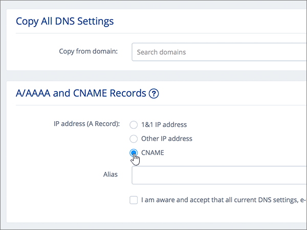
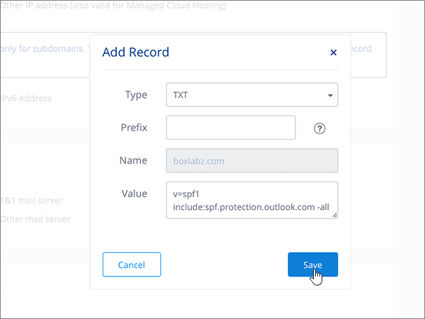

# 在 1 建立 DNS 記錄&1 IONOS 運作的 Office 365Create DNS records at 1&1 IONOS for Office 365

 若您找不到所需功能，請**[檢查網域常見問題集](../setup/domains-faq.md)**。**[Check the Domains FAQ](../setup/domains-faq.md)** if you don't find what you're looking for. 
  
> [!CAUTION]
> 請注意該 1&1 IONOS 不允許網域同時有 MX 記錄和頂層自動探索 CNAME 記錄。Note that 1&1 IONOS doesn't allow a domain to have both an MX record and a top-level Autodiscover CNAME record. 這會限制您可設定 Exchange Online for Office 365 的方式。This limits the ways in which you can configure Exchange Online for Office 365. 沒有因應措施，但建議採用它**僅限**如果您已在 1 建立子網域的經驗&1 IONOS。There is a workaround, but we recommend employing it **only** if you already have experience with creating subdomains at 1&1 IONOS. 如果您選擇此[服務限制](https://support.office.com/article/7ae9a655-041d-4724-aa92-60392ee390c2.aspx)儘管 1 管理自己的 Office 365 DNS 記錄 >&1 IONOS，請依照本文中若要確認您的網域和設定 DNS 記錄的電子郵件、 Skype for Business Online，依此類推。> If despite this [service limitation](https://support.office.com/article/7ae9a655-041d-4724-aa92-60392ee390c2.aspx) you choose to manage your own Office 365 DNS records at 1&1 IONOS, follow the steps in this article to verify your domain and to set up DNS records for email, Skype for Business Online, and so on. 
  
在 1 新增這些記錄之後&1 IONOS，您的網域就會設定為搭配 Office 365 服務。After you add these records at 1&1 IONOS, your domain will be set up to work with Office 365 services.
  
若要了解使用 Office 365 網站的虛擬主機和 DNS，請參閱[搭配 Office 365 使用公用網站](https://support.office.com/article/choose-a-public-website-3325d50e-d131-403c-a278-7f3296fe33a9)。To learn about webhosting and DNS for websites with Office 365, see [Use a public website with Office 365](https://support.office.com/article/choose-a-public-website-3325d50e-d131-403c-a278-7f3296fe33a9).
  
> [!NOTE]
> Typically it takes about 15 minutes for DNS changes to take effect.Typically it takes about 15 minutes for DNS changes to take effect. However, it can occasionally take longer for a change you've made to update across the Internet's DNS system.However, it can occasionally take longer for a change you've made to update across the Internet's DNS system. 如果您遇到與郵件流程或其他問題新增 DNS 記錄之後，請參閱[尋找並修正新增網域或 Office 365 中的 DNS 記錄之後所發生的問題](../get-help-with-domains/find-and-fix-issues.md)。If you're having trouble with mail flow or other issues after adding DNS records, see [Find and fix issues after adding your domain or DNS records in Office 365](../get-help-with-domains/find-and-fix-issues.md). 
  
## 新增 TXT 記錄以供驗證Add a TXT record for verification

在您將自己的網域用於 Office 365 之前，我們必須先確認您擁有該網域。如果您能在自己的網域註冊機構登入自己的帳戶並能建立 DNS 記錄，Office 365 就能確信您擁有該網域。Before you use your domain with Office 365, we have to make sure that you own it. Your ability to log in to your account at your domain registrar and create the DNS record proves to Office 365 that you own the domain.
  
> [!NOTE]
> 這筆記錄只會用於驗證您擁有自己的網域，不會影響其他項目。您可以選擇稍後再刪除記錄。This record is used only to verify that you own your domain; it doesn't affect anything else. You can delete it later, if you like. 
  
請依照下列步驟操作或[觀看影片 (從 0:42 處開始)](https://support.office.com/article/Video-Create-DNS-records-at-1-1-Internet-for-Office-365-543fb112-ecf5-47ae-b096-07f3f942a089?ui=en-US&amp;rs=en-US&amp;ad=US)。Follow the steps below or [watch the video (start at 0:42)](https://support.office.com/article/Video-Create-DNS-records-at-1-1-Internet-for-Office-365-543fb112-ecf5-47ae-b096-07f3f942a089?ui=en-US&amp;rs=en-US&amp;ad=US).
  
1. 若要開始，移至您的網域頁面 1&1 IONOS 藉由使用[此連結](https://my.1and1.com/)。To get started, go to your domains page at 1&1 IONOS by using [this link](https://my.1and1.com/). You'll be prompted to log in.You'll be prompted to log in.
    
2. 選取 [**管理網域**]。Select **Manage domains**.
    
3. 在 [**網域中心**] 頁面上，尋找您要更新的網域，然後選取該網域的**Panel** ( **v**) 控制項。On the **Domain Center** page, find the domain that you want to update, and then select the **Panel** ( **v**) control for that domain.
    
4. 在 [**網域設定**] 區域中，選取 [**編輯 DNS 設定**]。In the **Domain Settings** area, select **Edit DNS Settings**.
    
5. 在 [ **TXT 和 SRV 記錄**] 區段中，選取 [**新增記錄**]。In the **TXT and SRV Records** section, select **Add Record**.
    
6. In the **Add Record** area, in the boxes for the new record, type or copy and paste the values from the following table.In the **Add Record** area, in the boxes for the new record, type or copy and paste the values from the following table. 
    
    (Choose the **Type** value from the drop-down list.)(Choose the **Type** value from the drop-down list.) 
    
    ||||
    |:-----|:-----|:-----|
    |**類型****Type**   |**Prefix****Prefix**   |**Name Value****Name Value**   |
    |TXTTXT    |（將此欄位保留空白）(Leave this field blank)    |MS=ms *XXXXXXXX*MS=ms *XXXXXXXX*    附註： 這是範例。NOTE: This is an example. Use your specific **Destination or Points to Address** value here, from the table in Office 365.Use your specific **Destination or Points to Address** value here, from the table in Office 365. [How do I find this?How do I find this?](../get-help-with-domains/information-for-dns-records.md)          |
   
7. 選取 **[儲存]**。Select **Save**.
    
8. 選取 [**儲存**一次。Select **Save** again. 
    
9. 在 [**編輯 DNS 設定**] 對話方塊中，選取 [**是**]。In the **Edit DNS Settings** dialog box, select **Yes**.
    
10. 繼續進行之前，請先稍候幾分鐘，好讓您剛剛建立的記錄能在網際網路上更新。Wait a few minutes before you continue, so that the record you just created can update across the Internet.
    
Now that you've added the record at your domain registrar's site, you'll go back to Office 365 and request Office 365 to look for the record.Now that you've added the record at your domain registrar's site, you'll go back to Office 365 and request Office 365 to look for the record.
  
When Office 365 finds the correct TXT record, your domain is verified.When Office 365 finds the correct TXT record, your domain is verified.
  
1. 在系統管理中心，移至 [**設定** \> <a href="https://go.microsoft.com/fwlink/p/?linkid=834818" target="_blank">網域</a>] 頁面。In the admin center, go to the **Settings** \> <a href="https://go.microsoft.com/fwlink/p/?linkid=834818" target="_blank">Domains</a> page.

    
2. 在 [**網域**] 頁面上，選取您要驗證的網域。On the **Domains** page, select the domain that you are verifying. 
    
3. 在 [**安裝**] 頁面上，選取 [**啟動安裝程式**。On the **Setup** page, select **Start setup**.
    
4. 在 [**驗證網域**] 頁面上，選取 [**驗證**]。On the **Verify domain** page, select **Verify**.
    
> [!NOTE]
> Typically it takes about 15 minutes for DNS changes to take effect.Typically it takes about 15 minutes for DNS changes to take effect. However, it can occasionally take longer for a change you've made to update across the Internet's DNS system.However, it can occasionally take longer for a change you've made to update across the Internet's DNS system. 如果您遇到與郵件流程或其他問題新增 DNS 記錄之後，請參閱[尋找並修正新增網域或 Office 365 中的 DNS 記錄之後所發生的問題](../get-help-with-domains/find-and-fix-issues.md)。If you're having trouble with mail flow or other issues after adding DNS records, see [Find and fix issues after adding your domain or DNS records in Office 365](../get-help-with-domains/find-and-fix-issues.md). 
  
## 新增 MX 記錄，以將寄往您網域的電子郵件轉至 Office 365Add an MX record so email for your domain will come to Office 365

請依照下列步驟操作或[觀看影片 (從 3:22 處開始)](https://support.office.com/article/Video-Create-DNS-records-at-1-1-Internet-for-Office-365-543fb112-ecf5-47ae-b096-07f3f942a089?ui=en-US&amp;rs=en-US&amp;ad=US)。Follow the steps below or [watch the video (start at 3:22)](https://support.office.com/article/Video-Create-DNS-records-at-1-1-Internet-for-Office-365-543fb112-ecf5-47ae-b096-07f3f942a089?ui=en-US&amp;rs=en-US&amp;ad=US).
  
> [!NOTE]
> 如果您已 1und1.de 註冊，[在此登入](https://go.microsoft.com/fwlink/?linkid=859152)。If you've registered with 1und1.de, [sign in here](https://go.microsoft.com/fwlink/?linkid=859152). 
  
1. 若要開始，移至您的網域頁面 1&1 IONOS 藉由使用[此連結](https://my.1and1.com/)。To get started, go to your domains page at 1&1 IONOS by using [this link](https://my.1and1.com/). You'll be prompted to log in.You'll be prompted to log in.
    
2. 選取 [**管理網域**]。Select **Manage domains**.
    
3. 在 [**網域中心**] 頁面上，尋找您要更新的網域，然後選取該網域的**Panel** ( **v**) 控制項。On the **Domain Center** page, find the domain that you want to update, and then select the **Panel** ( **v**) control for that domain.
    
4. 在 [**網域設定**] 區域中，選取 [**編輯 DNS 設定**]。In the **Domain Settings** area, select **Edit DNS Settings**.
    
5. 在 [ **MX 記錄**] 區段中 \* \* 郵件交換程式 （MX 記錄） \* \*] 區域中，選取**其他郵件伺服器**。In the **MX Records** section, in the \*\* Mail Exchanger (MX Record) \*\* area, select **Other mail server**. (You may have to scroll down.)(You may have to scroll down.)   
  
6. 如果沒有列出任何 MX 記錄，逐一刪除選取的記錄，然後按鍵盤上的**Delete**鍵。If there are any MX records already listed, delete each of them by selecting the record and then pressing the **Delete** key on your keyboard. (如果未列出 MX 記錄，請繼續下一個步驟)。(If there are no MX records already listed, continue to the next step.)  
  
7. 在 [ **MX 1** ] 記錄的方塊，輸入或複製並貼上下表中的值。In the boxes for the **MX 1** record, type or copy and paste the values from the following table. 
    
    |**MX 1****MX 1**|**優先順序****Priority**|
    |:-----|:-----|
    | *\<網域金鑰\>*  .mail.protection.outlook.com*\<domain-key\>*  .mail.protection.outlook.com     附註： 取得您\<網域金鑰\>從您的 Office 365 帳戶。NOTE: Get your \<domain-key\> from your Office 365 account. [How do I find this?How do I find this?](../get-help-with-domains/information-for-dns-records.md)          |10 10    如需關於優先順序的詳細資訊，請參閱[什麼是 MX 優先順序？](https://support.office.com/article/2784cc4d-95be-443d-b5f7-bb5dd867ba83.aspx)For more information about priority, see [What is MX priority?](https://support.office.com/article/2784cc4d-95be-443d-b5f7-bb5dd867ba83.aspx)   | 
    
     
  
8. 選取 **[儲存]**。Select **Save**. (You may have to scroll down.)(You may have to scroll down.) 
  
9. 在 [**編輯 DNS 設定**] 對話方塊中，選取 [**是**]。In the **Edit DNS Settings** dialog box, select **Yes**. ![在 [編輯 DNS 設定] 對話方塊中選取 [是]](../media/920cc95f-fedf-4da2-94a4-9cb41ed49bcf.png)
  
## 新增 Office 365 所需的六筆 CNAME 記錄Add the six CNAME records that are required for Office 365

1&1 IONOS 需要因應措施，以便您可以使用 MX 記錄搭配 CNAME 記錄，所需的 Office 365 電子郵件服務。1&1 IONOS requires a workaround so that you can use an MX record together with the CNAME records that are required for Office 365 email services. 此因應措施要求您建立一組子網域 1&1 IONOS，然後將它們指派給 CNAME 記錄。This workaround requires you to create a set of subdomains at 1&1 IONOS, and to assign them to CNAME records.
  
> [!IMPORTANT]
> 請確認您至少有兩個可用的子網域，才能開始進行此程序。Make sure that you have at least two available subdomains before starting this procedure. 建議您使用此解決方案只有當您已在 1 建立子網域的經驗&1 IONOS。We recommend this solution only if you already have experience with creating subdomains at 1&1 IONOS. 
  
### 基本 CNAME 記錄Basic CNAME records

請按照下列步驟操作或[觀看影片 (從 3:57 處開始)](https://support.office.com/article/Video-Create-DNS-records-at-1-1-Internet-for-Office-365-543fb112-ecf5-47ae-b096-07f3f942a089?ui=en-US&amp;rs=en-US&amp;ad=US)。Follow the steps below or [watch the video (start at 3:57)](https://support.office.com/article/Video-Create-DNS-records-at-1-1-Internet-for-Office-365-543fb112-ecf5-47ae-b096-07f3f942a089?ui=en-US&amp;rs=en-US&amp;ad=US).
  
> [!NOTE]
> 如果您已 1und1.de 註冊，[在此登入](https://go.microsoft.com/fwlink/?linkid=859152)。If you've registered with 1und1.de, [sign in here](https://go.microsoft.com/fwlink/?linkid=859152). 
  
1. 若要開始，移至您的網域頁面 1&1 IONOS 藉由使用[此連結](https://my.1and1.com/)。To get started, go to your domains page at 1&1 IONOS by using [this link](https://my.1and1.com/). You'll be prompted to log in.You'll be prompted to log in.
    
2. 選取 [**管理網域**]。Select **Manage domains**.
    
3. 在 [**網域中心**] 頁面上，尋找您要更新的網域，然後選取**管理子網域**。On the **Domain Center** page, find the domain that you want to update, and then select **Manage Subdomains**.   現在您將建立兩個子網域，並為每個設定**別名**值。Now you'll create two subdomains and set an **Alias** value for each. (這是必要的因為 1&1 IONOS 支援只有一個頂層 CNAME 記錄，但 Office 365 需要多筆 CNAME 記錄。)(This is required because 1&1 IONOS supports only one top-level CNAME record, but Office 365 requires several CNAME records.) 首先，建立自動探索子網域。First, you'll create the Autodiscover subdomain.
    
4. 在 [ **Subdomain Overview** ] 區段中，選取 [ **Create Subdomain**]。In the **Subdomain Overview** section, select **Create Subdomain**.
    
    
  
5. 在 [新的子網域的 [ **Create Subdomain** ] 方塊中，輸入或複製並貼上只**建立子網域**值從下表。In the **Create Subdomain** box for the new subdomain, type or copy and paste only the **Create Subdomain** value from the following table. （您將在後續步驟中新增**別名**值）。(You'll add the **Alias** value in a later step.)

    |**建立子網域****Create Subdomain**|**Alias****Alias**|
    |:-----|:-----|
    |autodiscoverautodiscover    |autodiscover.outlook.comautodiscover.outlook.com   | 

    
  
6. 選取 [**建立子網域**。Select **Create Subdomain**. 
  
7. 在 [ **Subdomain Overview** ] 區段中，尋找您剛才建立的**autodiscover**子網域，然後選擇該子網域的 [ **Panel (v)** 控制項。In the **Subdomain Overview** section, locate the **autodiscover** subdomain that you just created, and then select the **Panel (v)** control for that subdomain.  
  
8. 在**子網域設定**] 區域中，選取 [**編輯 DNS 設定**]。In the **Subdomain Settings** area, select **Edit DNS Settings**.  
  
9. 在 [ **A/aaaa 記錄 （IP 位址）** ] 區段中的**IP 位址 （A 記錄）** 區域中，選取 [ **CNAME**]。In the **A/AAAA Records (IP Addresses)** section, in the **IP address (A Record)** area, select **CNAME**. 
  
10. 在 [**的別名：** 方塊，輸入或複製並貼上使用的**別名**值從下表。In the **Alias:** box, type or copy and paste only the **Alias** value from the following table.  
    
    |**建立子網域****Create Subdomain**|**Alias****Alias**|
    |:-----|:-----|
    |autodiscoverautodiscover    |autodiscover.outlook.comautodiscover.outlook.com   |

    
  
11. 選取**我知道**免責聲明的核取方塊。Select the check box for the **I am aware** disclaimer. 
  
12. 選取 **[儲存]**。Select **Save**. 
  
  
### 額外 CNAME 記錄Additional CNAME records

下列程序中產生的額外 CNAME 記錄會啟用商務用 Skype Online 服務。您會採用與您已經建立兩筆 CNAME 記錄時所採用的相同步驟。The additional CNAME records created in the following procedure enable Skype for Business Online services. You will employ the same steps that you used to create the two CNAME records you have already created.
  
1. 建立第三個子網域 (Lyncdiscover)。Create the third subdomain (Lyncdiscover). 在 [ **Subdomain Overview** ] 區段中，選取 [ **Create Subdomain**]。On the **Subdomain Overview** section, select **Create Subdomain**.
    
2. 在 [新的子網域的 [ **Create Subdomain** ] 方塊中，輸入或複製並貼上只**建立子網域**值從下表。In the **Create Subdomain** box for the new subdomain, type or copy and paste only the **Create Subdomain** value from the following table. （您將在後續步驟中新增**別名**值）。(You'll add the **Alias** value in a later step.)  
    
    |**建立子網域****Create Subdomain**|**Alias****Alias**|
    |:-----|:-----|
    |lyncdiscoverlyncdiscover   |webdir.online.lync.com>webdir.online.lync.com  |
   
3. 選取 [**建立子網域**。Select **Create Subdomain**.
    
4. 在 [**網域中心**] 頁面上，選取 [**管理子網域**。On the **Domain Center** page, select **Manage Subdomains**.
    
5. 在 [ **Subdomain Overview** ] 區段中，尋找您剛才建立的**lyncdiscover**子網域，然後選擇該子網域的 [ **Panel (v)** 控制項。In the **Subdomain Overview** section, find the **lyncdiscover** subdomain that you just created, and then select the **Panel (v)** control for that subdomain.  在**子網域設定**] 區域中，選取 [**編輯 DNS 設定**]。In the **Subdomain Settings** area, select **Edit DNS Settings**.
    
6. 在 [ **A/aaaa 記錄 （IP 位址）** ] 區段中 \* \* IP 位址 （A 記錄） \* \*] 區域中，選取 [ **CNAME**。In the **A/AAAA Records (IP Addresses)** section, in the \*\* IP address (A Record) \*\* area, select **CNAME**.
    
7. 在 [**的別名：** 方塊，輸入或複製並貼上使用的**別名**值從下表。In the **Alias:** box, type or copy and paste only the **Alias** value from the following table.  
    
    |**建立子網域****Create Subdomain**|**Alias****Alias**|
    |:-----|:-----|
    |lyncdiscoverlyncdiscover    |webdir.online.lync.com>webdir.online.lync.com    |
   
8. 選取 [**我已經知道**免責聲明] 核取方塊，然後選取 [**儲存**。Select the check box for the **I am aware** disclaimer, and then select **Save**.
    
9. 在 [**編輯 DNS 設定**] 對話方塊中，選取 [**是**]。In the **Edit DNS Settings** dialog box, select **Yes**.
    
10. 建立第四個子網域 (SIP)：Create the fourth subdomain (SIP):  在 [ **Subdomain Overview** ] 區段中，選取 [ **Create Subdomain**]。In the **Subdomain Overview** section, select **Create Subdomain**.
    
11. 在 [新的子網域的 [ **Create Subdomain** ] 方塊中，輸入或複製並貼上只**建立子網域**值從下表。In the **Create Subdomain** box for the new subdomain, type or copy and paste only the **Create Subdomain** value from the following table. （您將在後續步驟中新增**別名**值）。(You'll add the **Alias** value in a later step.)  
    
    |**建立子網域****Create Subdomain**|**Alias****Alias**|
    |:-----|:-----|
    |sipsip    |sipdir.online.lync.com>sipdir.online.lync.com    |
   
12. 選取 [**建立子網域**。Select **Create Subdomain**.
    
13. 在 [**網域中心**] 頁面上，選取 [**管理子網域**。On the **Domain Center** page, select **Manage Subdomains**.
    
14. 在 [ **Subdomain Overview** ] 區段中，尋找您剛才建立的**sip**子網域，然後選擇該子網域的 [ **Panel (v)** 控制項。In the **Subdomain Overview** section, find the **sip** subdomain that you just created, and then select the **Panel (v)** control for that subdomain.  在**子網域設定**] 區域中，選取 [**編輯 DNS 設定**]。In the **Subdomain Settings** area, select **Edit DNS Settings**.
    
15. 在 [ **A/aaaa 記錄 （IP 位址）** ] 區段中 \* \* IP 位址 （A 記錄） \* \*] 區域中，選取 [ **CNAME**。In the **A/AAAA Records (IP Addresses)** section, in the \*\* IP address (A Record) \*\* area, select **CNAME**.
    
16. 在 [**的別名：** 方塊，輸入或複製並貼上使用的**別名**值從下表。In the **Alias:** box, type or copy and paste only the **Alias** value from the following table. 
    
    |**建立子網域****Create Subdomain**|**Alias****Alias**|
    |:-----|:-----|
    |sipsip    |sipdir.online.lync.com>sipdir.online.lync.com    |
   
17. 選取 [**我已經知道**免責聲明] 核取方塊，然後選取 [**儲存**。Select the check box for the **I am aware** disclaimer, and then select **Save**.
    
18. 在 [**編輯 DNS 設定**] 對話方塊中，選取 [**是**]。In the **Edit DNS Settings** dialog box, select **Yes**.
    
### MDM 所需的 CNAME 記錄CNAME records needed for MDM

> [!IMPORTANT]
> Follow the procedure that you used for the other four CNAME records, but supply the values from the following table.Follow the procedure that you used for the other four CNAME records, but supply the values from the following table. 
  
|**建立子網域****Create Subdomain**|**Alias****Alias**|
|:-----|:-----|
|enterpriseregistrationenterpriseregistration    |enterpriseregistration.windows.net>enterpriseregistration.windows.net    |
|enterpriseenrollmententerpriseenrollment    |enterpriseenrollment-s.manage.microsoft.comenterpriseenrollment-s.manage.microsoft.com    |
   
## 新增 SPF 的 TXT 記錄以協助防範垃圾郵件Add a TXT record for SPF to help prevent email spam

> [!IMPORTANT]
> You cannot have more than one TXT record for SPF for a domain.You cannot have more than one TXT record for SPF for a domain. If your domain has more than one SPF record, you'll get email errors, as well as delivery and spam classification issues.If your domain has more than one SPF record, you'll get email errors, as well as delivery and spam classification issues. If you already have an SPF record for your domain, don't create a new one for Office 365.If you already have an SPF record for your domain, don't create a new one for Office 365. Instead, add the required Office 365 values to the current record so that you have a  *single*  SPF record that includes both sets of values.Instead, add the required Office 365 values to the current record so that you have a  *single*  SPF record that includes both sets of values. Need examples?Need examples? 請查看這些[Office 365 的外部網域名稱系統記錄](https://support.office.com/article/c0531a6f-9e25-4f2d-ad0e-a70bfef09ac0)。Check out these [External Domain Name System records for Office 365](https://support.office.com/article/c0531a6f-9e25-4f2d-ad0e-a70bfef09ac0). 若要驗證您的 SPF 記錄，您可以使用其中一種[SPF 驗證工具](../setup/domains-faq.md)。To validate your SPF record, you can use one of these[SPF validation tools](../setup/domains-faq.md). 
  
請依照下列步驟操作或[觀看影片 (從 5:09 處開始)](https://support.office.com/article/Video-Create-DNS-records-at-1-1-Internet-for-Office-365-543fb112-ecf5-47ae-b096-07f3f942a089?ui=en-US&amp;rs=en-US&amp;ad=US)。Follow the steps below or [watch the video (start at 5:09)](https://support.office.com/article/Video-Create-DNS-records-at-1-1-Internet-for-Office-365-543fb112-ecf5-47ae-b096-07f3f942a089?ui=en-US&amp;rs=en-US&amp;ad=US).
  
> [!NOTE]
> 如果您已 1und1.de 註冊，[在此登入](https://go.microsoft.com/fwlink/?linkid=859152)。If you've registered with 1und1.de, [sign in here](https://go.microsoft.com/fwlink/?linkid=859152). 
  
1. 若要開始，移至您的網域頁面 1&1 IONOS 藉由使用[此連結](https://my.1and1.com/)。To get started, go to your domains page at 1&1 IONOS by using [this link](https://my.1and1.com/). You'll be prompted to log in.You'll be prompted to log in.
    
2. 選取 [**管理網域**]。Select **Manage domains**.
    
3. 在 [**網域中心**] 頁面上，尋找您要更新的網域，然後選取該網域的**Panel** (**v**) 控制項。On the **Domain Center** page, find the domain that you want to update, and then select the **Panel** (**v**) control for that domain.
    
4. 在 [**網域設定**] 區域中，選取 [**編輯 DNS 設定**]。In the **Domain Settings** area, select **Edit DNS Settings**.
    
5. 在 [ **TXT 和 SRV 記錄**] 區段中，選取 [**新增記錄**]。In the **TXT and SRV Records** section, select **Add Record**.  (You may have to scroll down.)(You may have to scroll down.)
    
6. In the **Add Record** area, in the boxes for the new record, type or copy and paste the values from the following table.In the **Add Record** area, in the boxes for the new record, type or copy and paste the values from the following table.  (Choose the **Type** value from the drop-down list.)(Choose the **Type** value from the drop-down list.)  
    
    |**類型****Type**|**Prefix****Prefix**|**Name Value****Name Value**|
    |:-----|:-----|:-----|
    |TXTTXT    |(Leave this field empty.)(Leave this field empty.)    |v=spf1 include:spf.protection.outlook.com -allv=spf1 include:spf.protection.outlook.com -all    **附註：** 建議您複製並貼上這個項目，好讓所有的間距保持正確。**Note:** We recommend copying and pasting this entry, so that all of the spacing stays correct.           | 
    
    
  
7. 選取 **[儲存]**。Select **Save**. 
  
8. 選取 **[儲存]**。Select **Save**. 
  
9. 在 [**編輯 DNS 設定**] 對話方塊中，選取 [**是**]。In the **Edit DNS Settings** dialog box, select **Yes**. ![在 [編輯 DNS 設定] 對話方塊中選取 [是]](../media/920cc95f-fedf-4da2-94a4-9cb41ed49bcf.png)
  
## 新增兩筆 Office 365 所需的 SRV 記錄Add the two SRV records that are required for Office 365

請依照下列步驟操作或[觀看影片 (從 5:51 處開始)](https://support.office.com/article/Video-Create-DNS-records-at-1-1-Internet-for-Office-365-543fb112-ecf5-47ae-b096-07f3f942a089?ui=en-US&amp;rs=en-US&amp;ad=US)。Follow the steps below or [watch the video (start at 5:51)](https://support.office.com/article/Video-Create-DNS-records-at-1-1-Internet-for-Office-365-543fb112-ecf5-47ae-b096-07f3f942a089?ui=en-US&amp;rs=en-US&amp;ad=US).
  
> [!NOTE]
> 如果您已 1und1.de 註冊，[在此登入](https://go.microsoft.com/fwlink/?linkid=859152)。If you've registered with 1und1.de, [sign in here](https://go.microsoft.com/fwlink/?linkid=859152). 
  
1. 若要開始，移至您的網域頁面 1&1 IONOS 藉由使用[此連結](https://my.1and1.com/)。To get started, go to your domains page at 1&1 IONOS by using [this link](https://my.1and1.com/). You'll be prompted to log in.You'll be prompted to log in.
    
2. 選取 [**管理網域**]。Select **Manage domains**.
    
3. 在 [**網域中心**] 頁面上，尋找您要更新的網域，然後選取該網域的**Panel** ( **v**) 控制項。On the **Domain Center** page, find the domain that you want to update, and then select the **Panel** ( **v**) control for that domain.
    
4. 在 [**網域設定**] 區域中，選取 [**編輯 DNS 設定**]。In the **Domain Settings** area, select **Edit DNS Settings**.
    
5. 在 [ **TXT 和 SRV 記錄**] 區段中，選取 [**新增記錄**]。In the **TXT and SRV Records** section, select **Add Record**.
    
6. 新增兩筆 SRV 記錄中的第一筆。Add the first of the two SRV records. 在 [**新增記錄**] 區域中，於新記錄的方塊中輸入或複製並貼下表中第一列的值。In the **Add Record** area, in the boxes for the new record, type or copy and paste the values from the first row in the following table.  （從下拉式清單選擇 [**類型**] 和 [ **TTL**值）。(Choose the **Type** and **TTL** values from the drop-down list.) 
    
    |**類型****Type**|**服務****Service**|**通訊協定****Protocol**|**Name****Name**|**Host (主機)****Host**|**優先順序****Priority**|**Weight****Weight**|**Port****Port**|**TTL****TTL**|
    |:-----|:-----|:-----|:-----|:-----|:-----|:-----|:-----|:-----|
    |SRVSRV    |sipsip    |tlstls    |(Leave this field empty.)(Leave this field empty.)    |sipdir.online.lync.com>sipdir.online.lync.com    |100100    |11    |443443    |3600 (1 小時)3600 (1 h)    |
    |SRVSRV    |sipfederationtlssipfederationtls    |tcptcp    |(將此欄位保留空白。)(Leave this field empty.)    |sipfed.online.lync.com>sipfed.online.lync.com    |100100    |11    |50615061    |3600 (1 小時)3600 (1 h)    |  
    
    
  
7. 選取 **[儲存]**。Select **Save**.  
  
8. 選取 **[儲存]**。Select **Save**.  
  
9. 在 [**編輯 DNS 設定**] 對話方塊中，選取 [**是**]。In the **Edit DNS Settings** dialog box, select **Yes**.  ![在 [編輯 DNS 設定] 對話方塊中選取 [是]](../media/920cc95f-fedf-4da2-94a4-9cb41ed49bcf.png)
  
10. 新增另一筆 SRV 記錄。Add the other SRV record.  在 [ **TXT 和 SRV 記錄**] 區段中，選取 [**新增記錄**]。In the **TXT and SRV Records** section, select **Add Record**.  在 [**新增記錄**] 區域中，在表格中，使用另一列的值建立記錄，然後再次選擇 [ **Add**、**儲存**及 **[是]** 以完成記錄。In the **Add Record** area, create a record using the values from the other row in the table, and then again select **Add**, **Save**, and **Yes** to complete the record. 
    
> [!NOTE]
> Typically it takes about 15 minutes for DNS changes to take effect.Typically it takes about 15 minutes for DNS changes to take effect. However, it can occasionally take longer for a change you've made to update across the Internet's DNS system.However, it can occasionally take longer for a change you've made to update across the Internet's DNS system. 如果您遇到與郵件流程或其他問題新增 DNS 記錄之後，請參閱[尋找並修正新增網域或 Office 365 中的 DNS 記錄之後所發生的問題](../get-help-with-domains/find-and-fix-issues.md)。If you're having trouble with mail flow or other issues after adding DNS records, see [Find and fix issues after adding your domain or DNS records in Office 365](../get-help-with-domains/find-and-fix-issues.md). 
  
