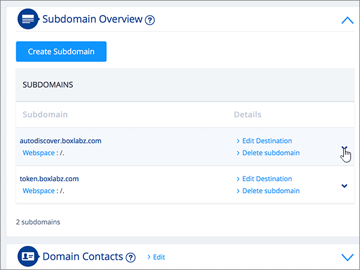

# 在 1&1 IONOS 為 Microsoft 建立 DNS 記錄

 若您找不到所需內容，請**[查看網域常見問題集](../setup/domains-faq.md)**。 
  
> [!CAUTION]
> 請注意，1&1 IONOS 不允許網域同時具有 MX 記錄和最上層自動探索 CNAME 記錄。 這會限制您可為 Microsoft 設定 Exchange Online 的方式。 有一種解決方法，但只有在您已具備在 1&1 IONOS 建立子域的經驗時， **才** 建議使用此方法。 > 如果此 [服務限制](https://docs.microsoft.com/microsoft-365/admin/setup/domains-faq) 您選擇在 1&1 IONOS 管理您自己的 Microsoft DNS 記錄，請遵循本文中的步驟來驗證您的網域，並設定電子郵件、商務用 Skype Online 等的 DNS 記錄。 
  
在 1&1 IONOS 新增這些記錄之後，您的網域就會設定為與 Microsoft 服務搭配使用。
  
  
> [!NOTE]
> Typically it takes about 15 minutes for DNS changes to take effect. 然而有時可能需要更久的時間，您所做的變更才能在整個網際網路的 DNS 系統中生效。 在您新增 DNS 記錄後，如有郵件流程或其他方面的問題，請參閱[尋找並修正新增網域或 DNS 記錄之後所發生的問題](../get-help-with-domains/find-and-fix-issues.md)。 
  
## 新增 TXT 記錄以供驗證

在您將自己的網域用於 Microsoft 之前，我們必須先確認您擁有該網域。如果您能在自己的網域註冊機構登入自己的帳戶並能建立 DNS 記錄，Microsoft 就能確信您擁有該網域。
  
> [!NOTE]
> 這筆記錄只會用於驗證您擁有自己的網域，不會影響其他項目。您可以選擇稍後再刪除記錄。 
  
請依照下列步驟操作或[觀看影片 (從 0:42 處開始)](https://docs.microsoft.com/microsoft-365/admin/dns/create-dns-records-at-1-1-internet)。
  
1. 若要開始使用，請移至您的網域頁面，1&1 IONOS，方法是使用 [此連結](https://my.1and1.com/)。 You'll be prompted to log in.
    
2. 選取 [ **管理網域**]。
    
3. 在 [ **網域中心** ] 頁面上，找到您要更新的網域，然後選取該網域的 [ **面板** ] ( **v**) 控制項。
    
4. 在 [ **網域設定** ] 區域中，選取 [ **編輯 DNS 設定**]。
    
5. 在 [ **TXT 和 SRV 記錄** ] 區段中，選取 [ **新增記錄**]。
    
6. In the **Add Record** area, in the boxes for the new record, type or copy and paste the values from the following table. 
    
    (從下拉式清單中選擇 [Type] (類型) 值。) 
    
    ||||
    |:-----|:-----|:-----|
    |**Type**   |**Prefix**   |**Name Value**   |
    |TXT    | (將此欄位保留空白)     |MS=ms *XXXXXXXX*    請注意：這是一個範例。 在這裡請使用您自己來自表格的 **[目的地或指向位址]** 值。 [如何找到呢？](../get-help-with-domains/information-for-dns-records.md)          |
   
7. 選取 **[儲存]**。
    
8. 再次選取 [ **儲存** ]。 
    
9. 在 [ **編輯 DNS 設定** ] 對話方塊中，選取 **[是]**。
    
10. 繼續進行之前，請先稍候幾分鐘，好讓您剛剛建立的記錄能在網際網路上更新。
    
現在您已在網域註冊機構網站新增記錄，請返回 Microsoft 365 並要求 Microsoft 365 尋找該記錄。
  
在 Microsoft 找到正確的 TXT 記錄後，您的網域就完成驗證了。
  
1. 在 Microsoft 系統管理中心中，移至 **[設定]** \> <a href="https://go.microsoft.com/fwlink/p/?linkid=834818" target="_blank">[網域]</a> 頁面。

    
2. 在 **[網域]** 頁面上，選取您要驗證的網域。 
    
3. 在 **[設定]** 頁面上，選取 **[開始設定]**。
    
4. 在 **[驗證網域]** 頁面上，選取 **[驗證]**。
    
> [!NOTE]
> Typically it takes about 15 minutes for DNS changes to take effect. 然而有時可能需要更久的時間，您所做的變更才能在整個網際網路的 DNS 系統中生效。 在您新增 DNS 記錄後，如有郵件流程或其他方面的問題，請參閱[尋找並修正新增網域或 DNS 記錄之後所發生的問題](../get-help-with-domains/find-and-fix-issues.md)。 
  
## 新增 MX 記錄，以將寄往您網域的電子郵件轉至 Microsoft

請依照下列步驟操作或[觀看影片 (從 3:22 處開始)](https://docs.microsoft.com/microsoft-365/admin/dns/create-dns-records-at-1-1-internet)。
  
> [!NOTE]
> 如果您已登錄1und1.de，請 [在這裡登入](https://go.microsoft.com/fwlink/?linkid=859152)。 
  
1. 若要開始使用，請移至您的網域頁面，1&1 IONOS，方法是使用 [此連結](https://my.1and1.com/)。 You'll be prompted to log in.
    
2. 選取 [ **管理網域**]。
    
3. 在 [ **網域中心** ] 頁面上，找到您要更新的網域，然後選取該網域的 [ **面板** ] ( **v**) 控制項。
    
4. 在 [ **網域設定** ] 區域中，選取 [ **編輯 DNS 設定**]。
    
5. 在 [ **MX 記錄** ] 區段的 [ **郵件交換器 (MX 記錄) ** ] 區域中，選取 [ **其他郵件伺服器**]。 (您可能需要向下捲動。)   
  
6. 如果已列出任何 MX 記錄，請選取該記錄，然後按下鍵盤上的 **delete** 鍵，以刪除每一筆記錄。 (如果未列出 MX 記錄，請繼續下一個步驟)。  
  
7. 在 [ **MX 1** ] 記錄的方塊中，輸入或複製並貼上下表中的值。 
    
    |**MX 1**|**優先順序**|
    |:-----|:-----|
    | *\<domain-key\>*  .mail.protection.outlook.com     附注：請 \<domain-key\> 從您的 Microsoft 帳戶取得。 [How do I find this?](../get-help-with-domains/information-for-dns-records.md)          |10     如需關於優先順序的詳細資訊，請參閱[什麼是 MX 優先順序？](https://docs.microsoft.com/microsoft-365/admin/setup/domains-faq)   | 
    
     
  
8. 選取 **[儲存]**。 (您可能需要向下捲動。) 
  
9. 在 [ **編輯 DNS 設定** ] 對話方塊中，選取 **[是]**。 ![在 [編輯 DNS 設定] 對話方塊中選取 [是]](../../media/920cc95f-fedf-4da2-94a4-9cb41ed49bcf.png)
  
## 新增 Microsoft 所需的六筆 CNAME 記錄

1&1 IONOS 需要一種方法，讓您可以使用 MX 記錄，以及 Microsoft 電子郵件服務所需的 CNAME 記錄。 此項變通方法需要您在 1&1 IONOS，建立一組子域，並將它們指派給 CNAME 記錄。
  
> [!IMPORTANT]
> 請確認您至少有兩個可用的子網域，才能開始進行此程序。 只有在您已有在 1&1 IONOS 建立子域的經驗時，才建議使用此解決方案。 
  
### 基本 CNAME 記錄

請按照下列步驟操作或[觀看影片 (從 3:57 處開始)](https://docs.microsoft.com/microsoft-365/admin/dns/create-dns-records-at-1-1-internet)。
  
> [!NOTE]
> 如果您已登錄1und1.de，請 [在這裡登入](https://go.microsoft.com/fwlink/?linkid=859152)。 
  
1. 若要開始使用，請移至您的網域頁面，1&1 IONOS，方法是使用 [此連結](https://my.1and1.com/)。 You'll be prompted to log in.
    
2. 選取 [ **管理網域**]。
    
3. 在 [ **網域中心** ] 頁面上，尋找您要更新的網域，然後選取 [ **管理子域**]。   現在您會建立兩個子域，並為每個子域設定一個 **別名** 值。  (這麼做是必要的，因為 1&1 IONOS 只支援一個最上層 CNAME 記錄，但 Microsoft 需要數個 CNAME 記錄。 )  首先，建立自動探索子網域。
    
4. 在 [ **子域一覽** ] 區段中，選取 [ **建立子域**]。
    
    
  
5. 在 [ **建立** 新子域的子域] 方塊中，輸入或複製並貼上下清單格中的 [ **建立子域** ] 值。  (您將在稍後的步驟中新增 **別名** 值。 ) 

    |**建立子網域**|**Alias**|
    |:-----|:-----|
    |autodiscover    |autodiscover.outlook.com   | 

    
  
6. 選取 [ **建立子域**]。 
  
7. 在 [ **子域一覽** ] 區段中，找出您剛剛建立的 **自動** 探索子域，然後選取該子域的「 **面板 (v」) ** 控制項。  
  
8. 在 [ **子域設定** ] 區域中，選取 [ **編輯 DNS 設定**]。  
  
9. 在 [ **A/AAAA 記錄 (的 Ip 位址) ** ] 區段的 [ **Ip 位址 (記錄) ** ] 區域中，選取 [ **CNAME**]。 
  
10. 在 [ **別名：** ] 方塊中，只輸入或複製並貼上下清單格中的 **別名** 值。  
    
    |**建立子網域**|**Alias**|
    |:-----|:-----|
    |autodiscover    |autodiscover.outlook.com   |

    
  
11. 選取 [ **我的感知** 免責聲明] 的核取方塊。 
  
12. 選取 **[儲存]**。 
  
  
### 額外 CNAME 記錄

下列程序中產生的額外 CNAME 記錄會啟用商務用 Skype Online 服務。您會採用與您已經建立兩筆 CNAME 記錄時所採用的相同步驟。
  
1. 建立第三個子網域 (Lyncdiscover)。 在 [ **子域一覽** ] 區段中，選取 [ **建立子域**]。
    
2. 在 [ **建立** 新子域的子域] 方塊中，輸入或複製並貼上下清單格中的 [ **建立子域** ] 值。  (您將在稍後的步驟中新增 **別名** 值。 )   
    
    |**建立子網域**|**Alias**|
    |:-----|:-----|
    |lyncdiscover   |webdir.online.lync.com  |
   
3. 選取 [ **建立子域**]。
    
4. 在 [ **網域中心** ] 頁面上，選取 [ **管理子域**]。
    
5. 在 [ **子域一覽** ] 區段中，尋找您剛才建立的 **lyncdiscover** 子域，然後為該子域選取 [ **面板] (v) ** 控制項。  在 [ **子域設定** ] 區域中，選取 [ **編輯 DNS 設定**]。
    
6. 在 [ **A/AAAA 記錄 (的 Ip 位址) ** ] 區段的 [ **Ip 位址 (記錄) ** ] 區域中，選取 [ **CNAME**]。
    
7. 在 [ **別名：** ] 方塊中，只輸入或複製並貼上下清單格中的 **別名** 值。  
    
    |**建立子網域**|**Alias**|
    |:-----|:-----|
    |lyncdiscover    |webdir.online.lync.com    |
   
8. 選取 [ **我的感知** 免責聲明] 的核取方塊，然後選取 [ **儲存**]。
    
9. 在 [ **編輯 DNS 設定** ] 對話方塊中，選取 **[是]**。
    
10. 建立第四個子網域 (SIP)：  在 [ **子域一覽** ] 區段中，選取 [ **建立子域**]。
    
11. 在 [ **建立** 新子域的子域] 方塊中，輸入或複製並貼上下清單格中的 [ **建立子域** ] 值。  (您將在稍後的步驟中新增 **別名** 值。 )   
    
    |**建立子網域**|**Alias**|
    |:-----|:-----|
    |sip    |sipdir.online.lync.com    |
   
12. 選取 [ **建立子域**]。
    
13. 在 [ **網域中心** ] 頁面上，選取 [ **管理子域**]。
    
14. 在 [ **子域一覽** ] 區段中，尋找您剛才建立的 **sip** 子域，然後選取該子域的「 **面板 (v」) ** 控制項。  在 [ **子域設定** ] 區域中，選取 [ **編輯 DNS 設定**]。
    
15. 在 [ **A/AAAA 記錄 (的 Ip 位址) ** ] 區段的 [ **Ip 位址 (記錄) ** ] 區域中，選取 [ **CNAME**]。
    
16. 在 [ **別名：** ] 方塊中，只輸入或複製並貼上下清單格中的 **別名** 值。 
    
    |**建立子網域**|**Alias**|
    |:-----|:-----|
    |sip    |sipdir.online.lync.com    |
   
17. 選取 [ **我的感知** 免責聲明] 的核取方塊，然後選取 [ **儲存**]。
    
18. 在 [ **編輯 DNS 設定** ] 對話方塊中，選取 **[是]**。
    
### MDM 所需的 CNAME 記錄

> [!IMPORTANT]
> 請按照您針對其他四筆 CNAME 記錄所進行的程序執行，但提供下表的值。 
  
|**建立子網域**|**Alias**|
|:-----|:-----|
|enterpriseregistration    |enterpriseregistration.windows.net    |
|enterpriseenrollment    |enterpriseenrollment-s.manage.microsoft.com    |
   
## 新增 SPF 的 TXT 記錄以協助防範垃圾郵件

> [!IMPORTANT]
> 網域的 SPF 不得擁有一個以上的 TXT 記錄。 如果您的網域具有多筆 SPF 記錄，您將收到電子郵件錯誤，以及傳送及垃圾郵件分類問題。 如果網域已經有 SPF 記錄，請勿為 Microsoft 建立一個新的記錄。 請改為將必要的 Microsoft 值新增至目前的記錄，讓您擁有包含這兩組值的  *單一*  SPF 記錄。 需要範例？ 請參閱這些 [Microsoft 的外部網域名稱系統記錄](https://docs.microsoft.com/microsoft-365/enterprise/external-domain-name-system-records)。 若要驗證您的 SPF 記錄，您可以使用其中一種[spf 驗證工具](../setup/domains-faq.md)。 
  
請依照下列步驟操作或[觀看影片 (從 5:09 處開始)](https://docs.microsoft.com/microsoft-365/admin/dns/create-dns-records-at-1-1-internet)。
  
> [!NOTE]
> 如果您已登錄1und1.de，請 [在這裡登入](https://go.microsoft.com/fwlink/?linkid=859152)。 
  
1. 若要開始使用，請移至您的網域頁面，1&1 IONOS，方法是使用 [此連結](https://my.1and1.com/)。 You'll be prompted to log in.
    
2. 選取 [ **管理網域**]。
    
3. 在 [ **網域中心** ] 頁面上，找到您要更新的網域，然後選取該網域的 [ **面板** ] (**v**) 控制項。
    
4. 在 [ **網域設定** ] 區域中，選取 [ **編輯 DNS 設定**]。
    
5. 在 [ **TXT 和 SRV 記錄** ] 區段中，選取 [ **新增記錄**]。  (您可能需要向下捲動。)
    
6. In the **Add Record** area, in the boxes for the new record, type or copy and paste the values from the following table.  (從下拉式清單中選擇 [Type] (類型) 值。)  
    
    |**Type**|**Prefix**|**Name Value**|
    |:-----|:-----|:-----|
    |TXT    |(Leave this field empty.)    |v=spf1 include:spf.protection.outlook.com -all    **注意：** 建議您複製並貼上這個項目，好讓所有的間距保持正確。           | 
    
    
  
7. 選取 **[儲存]**。 
  
8. 選取 **[儲存]**。 
  
9. 在 [ **編輯 DNS 設定** ] 對話方塊中，選取 **[是]**。 ![在 [編輯 DNS 設定] 對話方塊中選取 [是]](../../media/920cc95f-fedf-4da2-94a4-9cb41ed49bcf.png)
  
## 新增兩筆 Microsoft 所需的 SRV 記錄

請依照下列步驟操作或[觀看影片 (從 5:51 處開始)](https://docs.microsoft.com/microsoft-365/admin/dns/create-dns-records-at-1-1-internet)。
  
> [!NOTE]
> 如果您已登錄1und1.de，請 [在這裡登入](https://go.microsoft.com/fwlink/?linkid=859152)。 
  
1. 若要開始使用，請移至您的網域頁面，1&1 IONOS，方法是使用 [此連結](https://my.1and1.com/)。 You'll be prompted to log in.
    
2. 選取 [ **管理網域**]。
    
3. 在 [ **網域中心** ] 頁面上，找到您要更新的網域，然後選取該網域的 [ **面板** ] ( **v**) 控制項。
    
4. 在 [ **網域設定** ] 區域中，選取 [ **編輯 DNS 設定**]。
    
5. 在 [ **TXT 和 SRV 記錄** ] 區段中，選取 [ **新增記錄**]。
    
6. 新增兩筆 SRV 記錄中的第一筆。 在 [ **Add Record** ] （新增記錄）區域的新記錄方塊中，輸入或複製並貼上下表中第一列的值。   (從下拉式清單中選擇 [ **類型** ] 和 [ **TTL** ] 值。 )  
    
    |**Type**|**服務**|**Protocol** (通訊協定)|**名稱**|**Host**|**Priority** (優先順序)|**Weight** (權數)|**Port** (連接埠)|**TTL**|
    |:-----|:-----|:-----|:-----|:-----|:-----|:-----|:-----|:-----|
    |SRV    |sip    |tls    |(將此欄位保留空白。)    |sipdir.online.lync.com    |100    |1     |443    |3600 (1 小時)    |
    |SRV    |sipfederationtls    |tcp    |(將此欄位保留空白。)    |sipfed.online.lync.com    |100    |1     |5061    |3600 (1 小時)    |  
    
    
  
7. 選取 **[儲存]**。  
  
8. 選取 **[儲存]**。  
  
9. 在 [ **編輯 DNS 設定** ] 對話方塊中，選取 **[是]**。  ![在 [編輯 DNS 設定] 對話方塊中選取 [是]](../../media/920cc95f-fedf-4da2-94a4-9cb41ed49bcf.png)
  
10. 新增另一筆 SRV 記錄。  在 [ **TXT 和 SRV 記錄** ] 區段中，選取 [ **新增記錄**]。  在 [ **新增記錄** ] 區域中，使用表格中另一列的值建立記錄，然後再選取 [ **新增**]、[ **儲存** **] 及 [是]** 以完成記錄。 
    
> [!NOTE]
> Typically it takes about 15 minutes for DNS changes to take effect. 然而有時可能需要更久的時間，您所做的變更才能在整個網際網路的 DNS 系統中生效。 在您新增 DNS 記錄後，如有郵件流程或其他方面的問題，請參閱[尋找並修正新增網域或 DNS 記錄之後所發生的問題](../get-help-with-domains/find-and-fix-issues.md)。 
  
