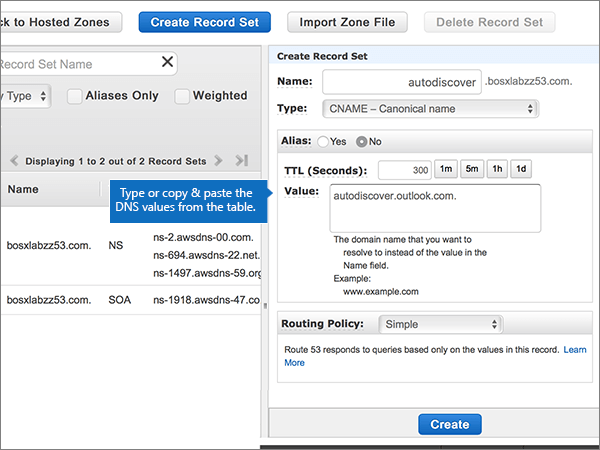
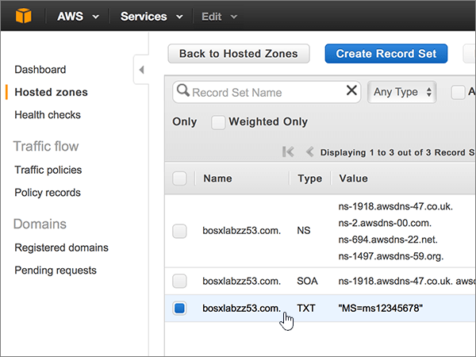

# 在 Amazon Web Services (AWS) 針對 Office 365 建立 DNS 記錄

 若您找不到所需功能，請**[檢查網域常見問題集](../setup/domains-faq.md)**。 
  
如果 AWS 是您 DNS 主機服務提供者，請遵循步驟本篇文章以驗證您的網域和設定 DNS 記錄的電子郵件、 Skype 線上商務，依此類推。
  
在 AWS 新增這些記錄之後，您的網域就會設定為搭配 Office 365 服務使用。
  
若要了解使用 Office 365 網站的虛擬主機和 DNS，請參閱[搭配 Office 365 使用公用網站](https://support.office.com/article/choose-a-public-website-3325d50e-d131-403c-a278-7f3296fe33a9)。
  
> [!NOTE]
> Typically it takes about 15 minutes for DNS changes to take effect. However, it can occasionally take longer for a change you've made to update across the Internet's DNS system. 如果您遇到與郵件流程或其他問題新增 DNS 記錄之後，請參閱[尋找並修正新增網域或 Office 365 中的 DNS 記錄之後所發生的問題](../get-help-with-domains/find-and-fix-issues.md)。 
  
## 新增 TXT 記錄以供驗證

在您將自己的網域用於 Office 365 之前，我們必須先確認您擁有該網域。如果您能在自己的網域註冊機構登入自己的帳戶並能建立 DNS 記錄，Office 365 就能確信您擁有該網域。
  
> [!NOTE]
> 這筆記錄只會用於驗證您擁有自己的網域，不會影響其他項目。您可以選擇稍後再刪除記錄。 
  
1. 首先請用[這個連結](https://console.aws.amazon.com/route53/home)移至 AWS 上您的網域頁面。系統會提示您先登入。
    
2. 在 [**資源**] 頁面上，選取 [**託管區域**]。
    
3. 在 * * 託管區域 * *] 頁面上，在**網域名稱**] 欄中，選取您想要編輯的網域名稱。 
    
4. 選取 [**建立記錄集**。
    
5. In the **Create Record Set** area, in the boxes for the new record, type or copy and paste the values from the following table. 
    
    (Choose the **Type** and **Routing Policy** values from the drop-down lists.) 
    
    > [!TIP]
    > The quotation marks required by the onscreen instructions are supplied automatically. You don't need to type them manually. 
  
    |||||||
    |:-----|:-----|:-----|:-----|:-----|:-----|
    |**Name**   |**Type**   |**Alias**   |**TTL (Seconds)**   |**值**   |**Routing Policy**   |
    |(Leave this field empty.)    |TXT - Text    |否    |300    |MS=ms *XXXXXXXX*   **附註：** 這是範例。 Use your specific **Destination or Points to Address** value here, from the table in Office 365. [How do I find this?](../get-help-with-domains/information-for-dns-records.md)          |簡易    |
   
6. 選取 [建立]****。
    
7. 繼續進行之前，請先稍候幾分鐘，好讓您剛剛建立的記錄能在網際網路上更新。
    
Now that you've added the record at your domain registrar's site, you'll go back to Office 365 and request Office 365 to look for the record.
  
When Office 365 finds the correct TXT record, your domain is verified.
  
1. 在系統管理中心，移至 [**設定** \> <a href="https://go.microsoft.com/fwlink/p/?linkid=834818" target="_blank">網域</a>] 頁面。

    
2. 在 [**網域**] 頁面上，選取您要驗證的網域。 
    
3. 在 [**安裝**] 頁面上，選取 [**啟動安裝程式**。
    
4. 在 [**驗證網域**] 頁面上，選取 [**驗證**]。
    
> [!NOTE]
> Typically it takes about 15 minutes for DNS changes to take effect. However, it can occasionally take longer for a change you've made to update across the Internet's DNS system. 如果您遇到與郵件流程或其他問題新增 DNS 記錄之後，請參閱[尋找並修正新增網域或 Office 365 中的 DNS 記錄之後所發生的問題](../get-help-with-domains/find-and-fix-issues.md)。 
  
## 新增 MX 記錄，以將寄往您網域的電子郵件轉至 Office 365

1. 首先請用[這個連結](https://console.aws.amazon.com/route53/home)移至 AWS 上您的網域頁面。 系統會提示您先登入。
    
2. 在 [**資源**] 頁面上，選取 [**託管區域**]。
    
3. 在 [**託管區域**] 頁面上，在**網域名稱**] 欄中，選取您想要編輯的網域名稱。 
    
4. 選取 [**建立記錄集**。
    
5. In the **Create Record Set** area, in the boxes for the new record, type or copy and paste the values from the following table. 
    
    (Choose the **Type** and **Routing Policy** values from the drop-down lists.) 
    
    |**Name**|**Type**|**Alias**|**TTL (Seconds)**|**值**|**Routing Policy**|
    |:-----|:-----|:-----|:-----|:-----|:-----|
    |(將此欄位保留空白。)    |MX - 郵件交換    |否    |300    |0  *\<網域金鑰\>*  .mail.protection.outlook.com.    0 是指 MX 優先順序值。將它新增到 MX 值的開頭，以空格分隔該值的其餘部分。    **This value MUST end with a period (.)**   **附註：** 取得您\<*網域金鑰*\>從您的 Office 365 帳戶。 [How do I find this?](../get-help-with-domains/information-for-dns-records.md)          |簡易    |
       
    
  
6. 選取 [建立]****。
    
    
  
7. 如果有任何其他的 MX 記錄，請移除它們。
    
    > [!IMPORTANT]
    > AWS 會將 MX 記錄儲存為一組可以包含多個記錄的集合。 **請勿**選取 [**刪除資料錄集**，這將會刪除所有 MX 記錄，包括您剛才新增一個。 請改為依照下列指示操作。 
  
    首先，選取 [MX 記錄設定。
    
    
  
    接下來，在**編輯記錄集**] 區域中，刪除每個過時的 MX 記錄**值**] 方塊中選取項目，然後按鍵盤上的**Delete**鍵。 
    
    
  
8. 選取 [**儲存記錄集**。
    
    
  
## 新增 Office 365 所需的五筆 CNAME 記錄

1. 首先請用[這個連結](https://console.aws.amazon.com/route53/home)移至 AWS 上您的網域頁面。 系統會提示您先登入。
    
2. 在 [**資源**] 頁面上，選取 [**託管區域**]。
    
3. 在 [**託管區域**] 頁面上，在**網域名稱**] 欄中，選取您想要編輯的網域名稱。 
    
4. 選取 [**建立記錄集**。
    
5. 新增第一筆 CNAME 記錄。
    
    在 [**建立記錄集**] 區域中，於新記錄的方塊中輸入或複製並貼下表中第一列的值。 
    
    (Choose the **Type** and **Routing Policy** values from the drop-down lists.) 
    
    |**Name**|**Type**|**Alias**|**TTL (Seconds)**|**值**|**Routing Policy**|
    |:-----|:-----|:-----|:-----|:-----|:-----|
    |autodiscover    |CNAME - 正式名稱    |無    |300    |autodiscover.outlook.com。    **This value MUST end with a period (.)**   |簡單    |
    |sip    |CNAME - 正式名稱    |無    |300    |sipdir.online.lync.com>。    **This value MUST end with a period (.)**   |簡單    |
    |lyncdiscover    |CNAME - 正式名稱    |無    |300    |webdir.online.lync.com>。    **This value MUST end with a period (.)**   |簡易    |
    |enterpriseregistration    |CNAME - 正式名稱    |無    |300    |enterpriseregistration.windows.net>。    **This value MUST end with a period (.)**   |簡單    |
    |enterpriseenrollment    |CNAME - 正式名稱    |否    |300    |enterpriseenrollment-s.manage.microsoft.com。    **This value MUST end with a period (.)**   |簡單    |
   
    
  
6. 選取 [建立]****。
    
    
  
7. 新增其他四筆 CNAME 記錄。
    
    在 [**託管區域**] 頁面上，選取 [**建立記錄集**在表格中，使用 [下一步] 列中的值建立記錄，然後再次選擇 [**建立**] 以完成該筆記錄。 
    
    重複此程序，直到五筆 CNAME 記錄全部建立完畢。
    
## 新增 SPF 的 TXT 記錄以協助防範垃圾郵件

> [!IMPORTANT]
> You cannot have more than one TXT record for SPF for a domain. If your domain has more than one SPF record, you'll get email errors, as well as delivery and spam classification issues. If you already have an SPF record for your domain, don't create a new one for Office 365. Instead, add the required Office 365 values to the current record so that you have a  *single*  SPF record that includes both sets of values. Need examples? 請查看這些[Office 365 的外部網域名稱系統記錄](https://support.office.com/article/c0531a6f-9e25-4f2d-ad0e-a70bfef09ac0)。 若要驗證您的 SPF 記錄，您可以使用其中一種[SPF 驗證工具](../setup/domains-faq.md)。 
  
1. 首先請用[這個連結](https://console.aws.amazon.com/route53/home)移至 AWS 上您的網域頁面。 系統會提示您先登入。
    
2. 在 [**資源**] 頁面上，選取 [**託管區域**]。
    
3. 在 [**託管區域**] 頁面上，在**網域名稱**] 欄中，選取您想要編輯的網域名稱。 
    
4. 選取 [ **TXT**記錄集。 
    
    
  
5. 在 [**編輯記錄集**] 區域中的目前項目結尾處**值：** 方塊針對現有的記錄，按下鍵盤上的 Enter 鍵來建立新的一行;然後在新該行 （在現有的值），輸入或複製並貼上下表中的值。 （您可以查看在圖例中的表格下方範例）。 
    
    |**值：**|
    |:-----|
    |v=spf1 include:spf.protection.outlook.com -all    (系統會自動提供畫面上指示所需的引號。您不需要手動輸入。)    **附註：** 建議您複製並貼上這個項目，好讓所有的間距保持正確。           |
   
    
  
6. 選取 [**儲存記錄集**。
    
    
  
## 新增兩筆 Office 365 所需的 SRV 記錄

1. 首先請用[這個連結](https://console.aws.amazon.com/route53/home)移至 AWS 上您的網域頁面。 系統會提示您先登入。
    
2. 在 [**資源**] 頁面上，選取 [**託管區域**]。
    
3. 在 [**託管區域**] 頁面上，在**網域名稱**] 欄中，選取您想要編輯的網域名稱。 
    
4. 選取 [**建立記錄集**。
    
5. 新增第一筆 SRV 記錄：
    
    在 [**建立記錄集**] 區域中，於新記錄的方塊中輸入或複製並貼下表中第一列的值。 
    
    (Choose the **Type** and **Routing Policy** values from the drop-down lists.) 
    
    |**Name**|**Type**|**Alias**|**TTL (Seconds)**|**值**|**Routing Policy**|
    |:-----|:-----|:-----|:-----|:-----|:-----|
    |_sip._tls|SRV - 服務定位器|無|300|100 1 443 sipdir.online.lync.com>。 **此值必須以英文句點 （.） 結尾。**>  **附註：** 建議您複製並貼上這個項目，好讓所有的間距保持正確。           |簡易|
    |_sipfederationtls._tcp|SRV - 服務定位器|無|300|100 1 5061 sipfed.online.lync.com>。 **This value MUST end with a period (.)**  **附註：** 建議您複製並貼上這個項目，好讓所有的間距保持正確。           |簡單|
   
    
  
6. 選取 [建立]****。
    
    
  
7. 新增另一筆 SRV 記錄：
    
    在 [**託管區域**] 頁面上，選取 [**建立記錄集**在表格中，使用 [下一步] 列中的值建立記錄，然後再次選擇 [**建立**] 以完成該筆記錄。 
    
> [!NOTE]
> Typically it takes about 15 minutes for DNS changes to take effect. However, it can occasionally take longer for a change you've made to update across the Internet's DNS system. 如果您遇到與郵件流程或其他問題新增 DNS 記錄之後，請參閱[尋找並修正新增網域或 Office 365 中的 DNS 記錄之後所發生的問題](../get-help-with-domains/find-and-fix-issues.md)。 
  
