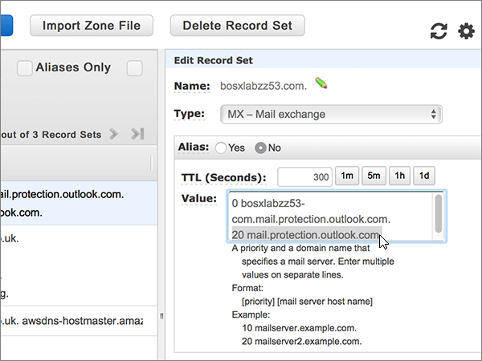
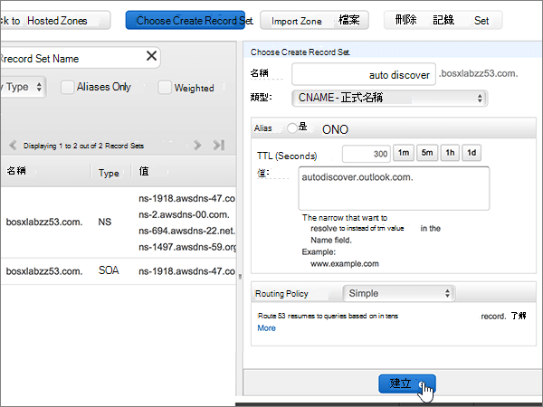
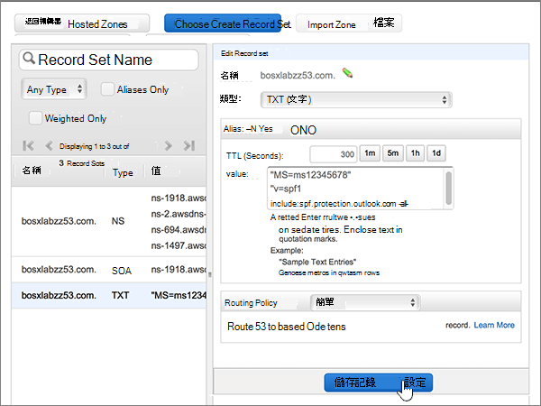
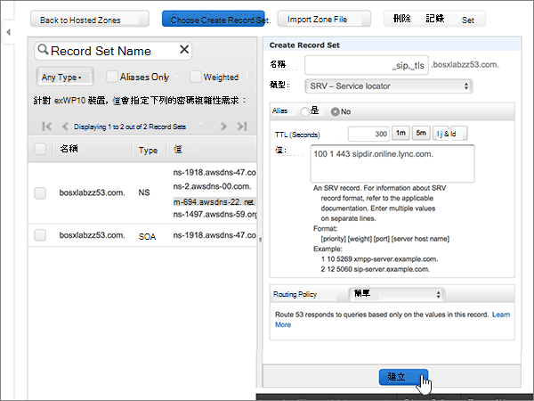

# 在 Microsoft 的 Amazon Web 服務（AWS）上建立 DNS 記錄

 若您找不到所需功能，請**[檢查網域常見問題集](../setup/domains-faq.md)**。 
  
如果 AWS 是您的 DNS 主機服務提供者，請遵循本文中的步驟來驗證您的網域，並設定電子郵件、商務用 Skype Online 等的 DNS 記錄。
  
在 AWS 新增這些記錄之後，您的網域就會設定為與 Microsoft 服務搭配使用。
  

  
> [!NOTE]
> Typically it takes about 15 minutes for DNS changes to take effect. 然而有時可能需要更久的時間，您所做的變更才能在整個網際網路的 DNS 系統中生效。 在您新增 DNS 記錄後，如有郵件流程或其他方面的問題，請參閱[尋找並修正新增網域或 DNS 記錄之後所發生的問題](../get-help-with-domains/find-and-fix-issues.md)。 
  
## 新增 TXT 記錄以供驗證

在您將自己的網域用於 Microsoft 之前，我們必須先確認您擁有該網域。如果您能在自己的網域註冊機構登入自己的帳戶並能建立 DNS 記錄，Microsoft 就能確信您擁有該網域。
  
> [!NOTE]
> 這筆記錄只會用於驗證您擁有自己的網域，不會影響其他項目。您可以選擇稍後再刪除記錄。 
  
1. 首先請用[這個連結](https://console.aws.amazon.com/route53/home)移至 AWS 上您的網域頁面。系統會提示您先登入。
    
2. 在 [**資源**] 頁面上，選取 [**主控區域**]。
    
3. 在 [**主控區域**] 頁面上的 [**功能變數名稱**] 欄中，選取您要編輯的網功能變數名稱稱。 
    
4. 選取 [**建立記錄集**]。
    
5. In the **Create Record Set** area, in the boxes for the new record, type or copy and paste the values from the following table. 
    
    (Choose the **Type** and **Routing Policy** values from the drop-down lists.) 
    
    > [!TIP]
    > The quotation marks required by the onscreen instructions are supplied automatically. You don't need to type them manually. 
  
    |||||||
    |:-----|:-----|:-----|:-----|:-----|:-----|
    |**Name**   |**Type**   |**Alias**   |**TTL (Seconds)**   |**值**   |**Routing Policy**   |
    |(Leave this field empty.)    |TXT - Text    |否    |300    |MS=ms *XXXXXXXX*   **附註：** 這是範例。 在這裡請使用您自己的 [目的地或指向位址]**** 值，請參閱 Microsoft 365 表格。 [如何找到呢？](../get-help-with-domains/information-for-dns-records.md)          |簡易    |
   
6. 選取 [建立]****。
    
7. 繼續進行之前，請先稍候幾分鐘，好讓您剛剛建立的記錄能在網際網路上更新。
    
現在，您已在網域註冊機構的網站上新增記錄，您會回到 Microsoft 並要求搜尋該記錄。
  
在 Microsoft 找到正確的 TXT 記錄後，您的網域就完成驗證了。
  
1. 在 Microsoft 系統管理中心中，移至 [設定]**** \> [網域] 頁面。

    
2. 在 **[網域]** 頁面上，選取您要驗證的網域。 
    
3. 在 **[設定]** 頁面上，選取 **[開始設定]**。
    
4. 在 [驗證網域]**** 頁面上，選取 [驗證]****。
    
> [!NOTE]
> Typically it takes about 15 minutes for DNS changes to take effect. 然而有時可能需要更久的時間，您所做的變更才能在整個網際網路的 DNS 系統中生效。 在您新增 DNS 記錄後，如有郵件流程或其他方面的問題，請參閱[尋找並修正新增網域或 DNS 記錄之後所發生的問題](../get-help-with-domains/find-and-fix-issues.md)。 
  
## 新增 MX 記錄，使您網域的電子郵件將會傳送至 Microsoft 365

1. 首先請用[這個連結](https://console.aws.amazon.com/route53/home)移至 AWS 上您的網域頁面。 系統會提示您先登入。
    
2. 在 [**資源**] 頁面上，選取 [**主控區域**]。
    
3. 在 [**主控區域**] 頁面上的 [**功能變數名稱**] 欄中，選取您要編輯的網功能變數名稱稱。 
    
4. 選取 [**建立記錄集**]。
    
5. In the **Create Record Set** area, in the boxes for the new record, type or copy and paste the values from the following table. 
    
    (Choose the **Type** and **Routing Policy** values from the drop-down lists.) 
    
    |**Name**|**Type**|**Alias**|**TTL (Seconds)**|**值**|**Routing Policy**|
    |:-----|:-----|:-----|:-----|:-----|:-----|
    |(將此欄位保留空白。)    |MX - 郵件交換    |否    |300    |0  *\<網域金鑰\>*  .mail.protection.outlook.com.    0 是指 MX 優先順序值。將它新增到 MX 值的開頭，以空格分隔該值的其餘部分。    **This value MUST end with a period (.)**   **附注：** 從 Microsoft \<365 帳戶取得您的*網域金鑰*\> 。 [How do I find this?](../get-help-with-domains/information-for-dns-records.md)          |簡易    |
       
    
  
6. 選取 [建立]****。
    
    
  
7. 如果有任何其他的 MX 記錄，請移除它們。
    
    > [!IMPORTANT]
    > AWS 會將 MX 記錄儲存為一組可以包含多個記錄的集合。 **不要**選取 [**刪除記錄集**]，因為這會刪除所有的 MX 記錄，包括剛才新增的記錄。 請改為依照下列指示操作。 
  
    首先，選取 MX 記錄集。
    
    
  
    接下來，在 [**編輯記錄集**] 區域中，選取 [**值**] 方塊中的專案，然後按鍵盤上的**delete**鍵，以刪除每個過時的 MX 記錄。 
    
    
  
8. 選取 [**儲存記錄集**]。
    
    
  
## 新增 Microsoft 365 所需的五個 CNAME 記錄

1. 首先請用[這個連結](https://console.aws.amazon.com/route53/home)移至 AWS 上您的網域頁面。 系統會提示您先登入。
    
2. 在 [**資源**] 頁面上，選取 [**主控區域**]。
    
3. 在 [**主控區域**] 頁面上的 [**功能變數名稱**] 欄中，選取您要編輯的網功能變數名稱稱。 
    
4. 選取 [**建立記錄集**]。
    
5. 新增第一筆 CNAME 記錄。
    
    在 [**建立記錄集**] 區域的新記錄方塊中，輸入或複製並貼上下表中第一列的值。 
    
    (Choose the **Type** and **Routing Policy** values from the drop-down lists.) 
    
    |**Name**|**Type**|**Alias**|**TTL (Seconds)**|**值**|**Routing Policy**|
    |:-----|:-----|:-----|:-----|:-----|:-----|
    |autodiscover    |CNAME - 正式名稱    |無    |300    |autodiscover.outlook.com。    **This value MUST end with a period (.)**   |簡單    |
    |sip    |CNAME - 正式名稱    |無    |300    |sipdir.online.lync.com。    **This value MUST end with a period (.)**   |簡單    |
    |lyncdiscover    |CNAME - 正式名稱    |無    |300    |webdir.online.lync.com。    **This value MUST end with a period (.)**   |簡單    |
    |enterpriseregistration    |CNAME - 正式名稱    |無    |300    |enterpriseregistration.windows.net。    **This value MUST end with a period (.)**   |簡易    |
    |enterpriseenrollment    |CNAME - 正式名稱    |無    |300    |enterpriseenrollment-s.manage.microsoft.com。    **This value MUST end with a period (.)**   |簡單    |
   
    
  
6. 選取 [建立]****。
    
    
  
7. 新增其他四筆 CNAME 記錄。
    
    在 [**主控區域**] 頁面中，選取 [**建立記錄集**]，使用表格中下一列的值建立記錄，然後再選取 [**建立**] 以完成記錄。 
    
    重複此程式，直到您已建立全部五筆 CNAME 記錄為止。
    
## 新增 SPF 的 TXT 記錄以協助防範垃圾郵件

> [!IMPORTANT]
> 網域的 SPF 不得擁有一個以上的 TXT 記錄。 如果您的網域具有多筆 SPF 記錄，您將收到電子郵件錯誤，以及傳送及垃圾郵件分類問題。 如果網域已經有 SPF 記錄，請勿為 Microsoft 建立一個新的記錄。 請改為將必要的 Microsoft 值新增至目前的記錄，讓您擁有包含這兩組值的*單一*SPF 記錄。 需要範例？ 請參閱這些 [Microsoft 的外部網域名稱系統記錄](https://support.office.com/article/c0531a6f-9e25-4f2d-ad0e-a70bfef09ac0)。 若要驗證您的 SPF 記錄，您可以使用其中一種[spf 驗證工具](../setup/domains-faq.md)。 
  
1. 首先請用[這個連結](https://console.aws.amazon.com/route53/home)移至 AWS 上您的網域頁面。 系統會提示您先登入。
    
2. 在 [**資源**] 頁面上，選取 [**主控區域**]。
    
3. 在 [**主控區域**] 頁面上的 [**功能變數名稱**] 欄中，選取您要編輯的網功能變數名稱稱。 
    
4. 選取**TXT**記錄集。 
    
    
  
5. 在 [**編輯記錄集**] 區域中，于現有記錄的 [**值：** ] 方塊中的目前專案的結尾，按下鍵盤上的 enter，以建立新行;然後，在該行（現有的值下方）輸入或複製並貼上下清單格中的值。 （您可以在表格下方的圖例中看到範例）。 
    
    |**價值：**|
    |:-----|
    |v=spf1 include:spf.protection.outlook.com -all    (系統會自動提供畫面上指示所需的引號。您不需要手動輸入。)    **注意：** 建議您複製並貼上這個項目，好讓所有的間距保持正確。           |
   
    
  
6. 選取 [**儲存記錄集**]。
    
    
  
## 新增 Microsoft 365 所需的兩筆 SRV 記錄

1. 首先請用[這個連結](https://console.aws.amazon.com/route53/home)移至 AWS 上您的網域頁面。 系統會提示您先登入。
    
2. 在 [**資源**] 頁面上，選取 [**主控區域**]。
    
3. 在 [**主控區域**] 頁面上的 [**功能變數名稱**] 欄中，選取您要編輯的網功能變數名稱稱。 
    
4. 選取 [**建立記錄集**]。
    
5. 新增第一筆 SRV 記錄：
    
    在 [**建立記錄集**] 區域的新記錄方塊中，輸入或複製並貼上下表中第一列的值。 
    
    (Choose the **Type** and **Routing Policy** values from the drop-down lists.) 
    
    |**Name**|**Type**|**Alias**|**TTL (Seconds)**|**值**|**Routing Policy**|
    |:-----|:-----|:-----|:-----|:-----|:-----|
    |_sip。 _tls|SRV - 服務定位器|無|300|100 1 443 sipdir.online.lync.com。 **此值必須以句點（.）結尾**>  **注意：** 建議您複製並貼上這個項目，好讓所有的間距保持正確。           |簡易|
    |_sipfederationtls。 _tcp|SRV - 服務定位器|無|300|100 1 5061 sipfed.online.lync.com。 **This value MUST end with a period (.)**  **注意：** 建議您複製並貼上這個項目，好讓所有的間距保持正確。           |簡單|
   
    
  
6. 選取 [建立]****。
    
    
  
7. 新增另一筆 SRV 記錄：
    
    在 [**主控區域**] 頁面中，選取 [**建立記錄集**]，使用表格中下一列的值建立記錄，然後再選取 [**建立**] 以完成記錄。 
    
> [!NOTE]
> Typically it takes about 15 minutes for DNS changes to take effect. 然而有時可能需要更久的時間，您所做的變更才能在整個網際網路的 DNS 系統中生效。 在您新增 DNS 記錄後，如有郵件流程或其他方面的問題，請參閱[尋找並修正新增網域或 DNS 記錄之後所發生的問題](../get-help-with-domains/find-and-fix-issues.md)。 
  
