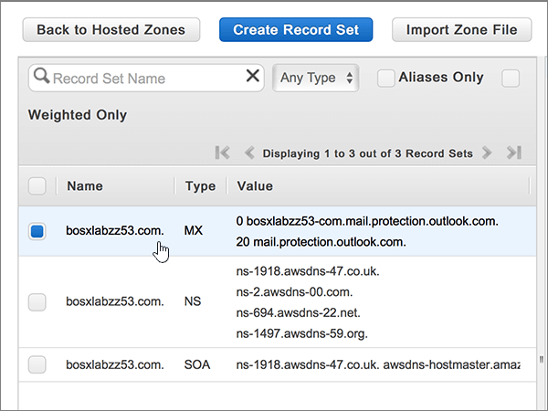

# 在 Amazon Web Services (AWS) 針對 Office 365 建立 DNS 記錄Create DNS records at Amazon Web Services (AWS) for Office 365

 若您找不到所需功能，請**[檢查網域常見問題集](../setup/domains-faq.md)**。**[Check the Domains FAQ](../setup/domains-faq.md)** if you don't find what you're looking for. 
  
如果 AWS 是您的 DNS 主機服務提供者，請遵循本文中的步驟來驗證您的網域，並設定電子郵件、商務用 Skype Online 等的 DNS 記錄。If AWS is your DNS hosting provider, follow the steps in this article to verify your domain and set up DNS records for email, Skype Online for Business, and so on.
  
在 AWS 新增這些記錄之後，您的網域就會設定為搭配 Office 365 服務使用。After you add these records at AWS, your domain will be set up to work with Office 365 services.
  
若要了解使用 Office 365 網站的虛擬主機和 DNS，請參閱[搭配 Office 365 使用公用網站](https://support.office.com/article/choose-a-public-website-3325d50e-d131-403c-a278-7f3296fe33a9)。To learn about webhosting and DNS for websites with Office 365, see [Use a public website with Office 365](https://support.office.com/article/choose-a-public-website-3325d50e-d131-403c-a278-7f3296fe33a9).
  
> [!NOTE]
> Typically it takes about 15 minutes for DNS changes to take effect.Typically it takes about 15 minutes for DNS changes to take effect. 而如果您所做的變更要在整個網際網路 DNS 系統中生效，有時可能需要更久的時間。However, it can occasionally take longer for a change you've made to update across the Internet's DNS system. 在您新增 DNS 記錄後，如有郵件流程或其他方面的問題，請參閱[尋找並修正在 Office 365 中新增網域或 DNS 記錄之後所發生的問題](../get-help-with-domains/find-and-fix-issues.md)。If you're having trouble with mail flow or other issues after adding DNS records, see [Find and fix issues after adding your domain or DNS records in Office 365](../get-help-with-domains/find-and-fix-issues.md). 
  
## 新增 TXT 記錄以供驗證Add a TXT record for verification

在您將自己的網域用於 Office 365 之前，我們必須先確認您擁有該網域。如果您能在自己的網域註冊機構登入自己的帳戶並能建立 DNS 記錄，Office 365 就能確信您擁有該網域。Before you use your domain with Office 365, we have to make sure that you own it. Your ability to log in to your account at your domain registrar and create the DNS record proves to Office 365 that you own the domain.
  
> [!NOTE]
> 這筆記錄只會用於驗證您擁有自己的網域，不會影響其他項目。您可以選擇稍後再刪除記錄。This record is used only to verify that you own your domain; it doesn't affect anything else. You can delete it later, if you like. 
  
1. 首先請用[這個連結](https://console.aws.amazon.com/route53/home)移至 AWS 上您的網域頁面。系統會提示您先登入。To get started, go to your domains page at AWS by using [this link](https://console.aws.amazon.com/route53/home). You'll be prompted to log in first.
    
2. 在 [**資源**] 頁面上，選取 [**主控區域**]。On the **Resources** page, select **Hosted Zones**.
    
3. 在 [主控區域 \* \*] 頁面上的 [**功能變數名稱**] 欄中，選取您要編輯的網功能變數名稱稱。On the \*\* Hosted Zones \*\* page, in the **Domain Name** column, select the name of the domain that you want to edit. 
    
4. 選取 [**建立記錄集**]。Select **Create Record Set**.
    
5. In the **Create Record Set** area, in the boxes for the new record, type or copy and paste the values from the following table.In the **Create Record Set** area, in the boxes for the new record, type or copy and paste the values from the following table. 
    
    (Choose the **Type** and **Routing Policy** values from the drop-down lists.)(Choose the **Type** and **Routing Policy** values from the drop-down lists.) 
    
    > [!TIP]
    > The quotation marks required by the onscreen instructions are supplied automatically. You don't need to type them manually.The quotation marks required by the onscreen instructions are supplied automatically. You don't need to type them manually. 
  
    |||||||
    |:-----|:-----|:-----|:-----|:-----|:-----|
    |**名稱****Name**   |**Type****Type**   |**Alias****Alias**   |**TTL (Seconds)****TTL (Seconds)**   |**值****Value**   |**Routing Policy****Routing Policy**   |
    |(Leave this field empty.)(Leave this field empty.)    |TXT - TextTXT - Text    |否No    |300300    |MS=ms *XXXXXXXX*MS=ms *XXXXXXXX*   **附註：** 這是範例。**Note:** This is an example. 在這裡請使用您自己的 [目的地或指向位址] 值，請參閱 Office 365 表格。Use your specific **Destination or Points to Address** value here, from the table in Office 365. [如何找到呢？How do I find this?](../get-help-with-domains/information-for-dns-records.md)          |簡易Simple    |
   
6. 選取 [建立]\*\*\*\*。Select **Create**.
    
7. 繼續進行之前，請先稍候幾分鐘，好讓您剛剛建立的記錄能在網際網路上更新。Wait a few minutes before you continue, so that the record you just created can update across the Internet.
    
現在您已在網域註冊機構網站新增記錄，請返回 Office 365 並要求 Office 365 尋找該記錄。Now that you've added the record at your domain registrar's site, you'll go back to Office 365 and request Office 365 to look for the record.
  
在 Office 365 找到正確的 TXT 記錄後，您的網域就完成驗證了。When Office 365 finds the correct TXT record, your domain is verified.
  
1. 在系統管理中心中，移至 **[設定]** \> <a href="https://go.microsoft.com/fwlink/p/?linkid=834818" target="_blank">[網域]</a> 頁面。In the admin center, go to the **Settings** \> <a href="https://go.microsoft.com/fwlink/p/?linkid=834818" target="_blank">Domains</a> page.

    
2. 在 **[網域]** 頁面上，選取您要驗證的網域。On the **Domains** page, select the domain that you are verifying. 
    
3. 在 **[設定]** 頁面上，選取 **[開始設定]**。On the **Setup** page, select **Start setup**.
    
4. 在 [驗證網域]\*\*\*\* 頁面上，選取 [驗證]\*\*\*\*。On the **Verify domain** page, select **Verify**.
    
> [!NOTE]
> Typically it takes about 15 minutes for DNS changes to take effect.Typically it takes about 15 minutes for DNS changes to take effect. 而如果您所做的變更要在整個網際網路 DNS 系統中生效，有時可能需要更久的時間。However, it can occasionally take longer for a change you've made to update across the Internet's DNS system. 在您新增 DNS 記錄後，如有郵件流程或其他方面的問題，請參閱[尋找並修正在 Office 365 中新增網域或 DNS 記錄之後所發生的問題](../get-help-with-domains/find-and-fix-issues.md)。If you're having trouble with mail flow or other issues after adding DNS records, see [Find and fix issues after adding your domain or DNS records in Office 365](../get-help-with-domains/find-and-fix-issues.md). 
  
## 新增 MX 記錄，以將寄往您網域的電子郵件轉至 Office 365Add an MX record so email for your domain will come to Office 365

1. 首先請用[這個連結](https://console.aws.amazon.com/route53/home)移至 AWS 上您的網域頁面。To get started, go to your domains page at AWS by using [this link](https://console.aws.amazon.com/route53/home). 系統會提示您先登入。You'll be prompted to log in first.
    
2. 在 [**資源**] 頁面上，選取 [**主控區域**]。On the **Resources** page, select **Hosted Zones**.
    
3. 在 [**主控區域**] 頁面上的 [**功能變數名稱**] 欄中，選取您要編輯的網功能變數名稱稱。On the **Hosted Zones** page, in the **Domain Name** column, select the name of the domain that you want to edit. 
    
4. 選取 [**建立記錄集**]。Select **Create Record Set**.
    
5. In the **Create Record Set** area, in the boxes for the new record, type or copy and paste the values from the following table.In the **Create Record Set** area, in the boxes for the new record, type or copy and paste the values from the following table. 
    
    (Choose the **Type** and **Routing Policy** values from the drop-down lists.)(Choose the **Type** and **Routing Policy** values from the drop-down lists.) 
    
    |**名稱****Name**|**Type****Type**|**Alias****Alias**|**TTL (Seconds)****TTL (Seconds)**|**值****Value**|**Routing Policy****Routing Policy**|
    |:-----|:-----|:-----|:-----|:-----|:-----|
    |(將此欄位保留空白。)(Leave this field empty.)    |MX - 郵件交換MX - Mail exchange    |否No    |300300    |0  *\<網域金鑰\>*  .mail.protection.outlook.com.0  *\<domain-key\>*  .mail.protection.outlook.com.    0 是指 MX 優先順序值。將它新增到 MX 值的開頭，以空格分隔該值的其餘部分。  The 0 is the MX priority value. Add it to the beginning of the MX value, separated from the remainder of the value by a space.    **This value MUST end with a period (.)****This value MUST end with a period (.)**   **注意：** 從您的 Office 365 帳戶取得您的\<*網域金鑰*\>。**Note:** Get your \<*domain-key*\> from your Office 365 account. [How do I find this?How do I find this?](../get-help-with-domains/information-for-dns-records.md)          |簡易Simple    |
       
    
  
6. 選取 [建立]\*\*\*\*。Select **Create**.
    
    
  
7. 如果有任何其他的 MX 記錄，請移除它們。If there are any other MX records, remove them.
    
    > [!IMPORTANT]
    > AWS 會將 MX 記錄儲存為一組可以包含多個記錄的集合。AWS stores MX records as a set that may contain multiple records. **不要**選取 [**刪除記錄集**]，因為這會刪除所有的 MX 記錄，包括剛才新增的記錄。**DO NOT** select **Delete Record Set**, as this will delete all of your MX records, including the one you just added. 請改為依照下列指示操作。Use the following instructions instead. 
  
    首先，選取 MX 記錄集。First, select the MX record set.
    
    
  
    接下來，在 [**編輯記錄集**] 區域中，選取 [**值**] 方塊中的專案，然後按鍵盤上的**delete**鍵，以刪除每個過時的 MX 記錄。Next, in the **Edit Record Set** area, delete each obsolete MX record by selecting the entry in the **Value** box and then pressing the **Delete** key on your keyboard. 
    
    
  
8. 選取 [**儲存記錄集**]。Select **Save Record Set**.
    
    
  
## 新增 Office 365 所需的五個 CNAME 記錄Add the five CNAME records that are required for Office 365

1. 首先請用[這個連結](https://console.aws.amazon.com/route53/home)移至 AWS 上您的網域頁面。To get started, go to your domains page at AWS by using [this link](https://console.aws.amazon.com/route53/home). 系統會提示您先登入。You'll be prompted to log in first.
    
2. 在 [**資源**] 頁面上，選取 [**主控區域**]。On the **Resources** page, select **Hosted Zones**.
    
3. 在 [**主控區域**] 頁面上的 [**功能變數名稱**] 欄中，選取您要編輯的網功能變數名稱稱。On the **Hosted Zones** page, in the **Domain Name** column, select the name of the domain that you want to edit. 
    
4. 選取 [**建立記錄集**]。Select **Create Record Set**.
    
5. 新增第一筆 CNAME 記錄。Add the first CNAME record.
    
    在 [**建立記錄集**] 區域的新記錄方塊中，輸入或複製並貼上下表中第一列的值。In the **Create Record Set** area, in the boxes for the new record, type or copy and paste the values from the first row in the following table. 
    
    (Choose the **Type** and **Routing Policy** values from the drop-down lists.)(Choose the **Type** and **Routing Policy** values from the drop-down lists.) 
    
    |**名稱****Name**|**Type****Type**|**Alias****Alias**|**TTL (Seconds)****TTL (Seconds)**|**值****Value**|**Routing Policy****Routing Policy**|
    |:-----|:-----|:-----|:-----|:-----|:-----|
    |autodiscoverautodiscover    |CNAME - 正式名稱CNAME - Canonical name    |無No    |300300    |autodiscover.outlook.com。autodiscover.outlook.com.    **This value MUST end with a period (.)****This value MUST end with a period (.)**   |簡單Simple    |
    |sipsip    |CNAME - 正式名稱CNAME - Canonical name    |無No    |300300    |sipdir.online.lync.com。sipdir.online.lync.com.    **This value MUST end with a period (.)****This value MUST end with a period (.)**   |簡單Simple    |
    |lyncdiscoverlyncdiscover    |CNAME - 正式名稱CNAME - Canonical name    |無No    |300300    |webdir.online.lync.com。webdir.online.lync.com.    **This value MUST end with a period (.)****This value MUST end with a period (.)**   |簡單Simple    |
    |enterpriseregistrationenterpriseregistration    |CNAME - 正式名稱CNAME - Canonical name    |無No    |300300    |enterpriseregistration.windows.net。enterpriseregistration.windows.net.    **This value MUST end with a period (.)****This value MUST end with a period (.)**   |簡易Simple    |
    |enterpriseenrollmententerpriseenrollment    |CNAME - 正式名稱CNAME - Canonical name    |無No    |300300    |enterpriseenrollment-s.manage.microsoft.com。enterpriseenrollment-s.manage.microsoft.com.    **This value MUST end with a period (.)****This value MUST end with a period (.)**   |簡單Simple    |
   
    
  
6. 選取 [建立]\*\*\*\*。Select **Create**.
    
    
  
7. 新增其他四筆 CNAME 記錄。Add the other four CNAME records.
    
    在 [**主控區域**] 頁面中，選取 [**建立記錄集**]，使用表格中下一列的值建立記錄，然後再選取 [**建立**] 以完成記錄。In the **Hosted Zones** page, select **Create Record Set**, create a record using the values from the next row in the table, and then again select **Create** to complete that record. 
    
    重複此程式，直到您已建立全部五筆 CNAME 記錄為止。Repeat this process until you have created all five CNAME records.
    
## 新增 SPF 的 TXT 記錄以協助防範垃圾郵件Add a TXT record for SPF to help prevent email spam

> [!IMPORTANT]
> 網域的 SPF 不得擁有一個以上的 TXT 記錄。You cannot have more than one TXT record for SPF for a domain. 如果您的網域具有多筆 SPF 記錄，您將收到電子郵件錯誤，以及傳送及垃圾郵件分類問題。If your domain has more than one SPF record, you'll get email errors, as well as delivery and spam classification issues. 如果網域已經有 SPF 記錄，請勿為 Office 365 建立一個新的記錄。If you already have an SPF record for your domain, don't create a new one for Office 365. 而是，請將必要的 Office 365 值新增到目前的記錄，以便擁有包含這兩組值的*單一* SPF 記錄。Instead, add the required Office 365 values to the current record so that you have a  *single*  SPF record that includes both sets of values. 需要範例？Need examples? 請參閱這些 [Office 365 的外部網域名稱系統記錄](https://support.office.com/article/c0531a6f-9e25-4f2d-ad0e-a70bfef09ac0)。Check out these [External Domain Name System records for Office 365](https://support.office.com/article/c0531a6f-9e25-4f2d-ad0e-a70bfef09ac0). 若要驗證您的 SPF 記錄，您可以使用其中一種[spf 驗證工具](../setup/domains-faq.md)。To validate your SPF record, you can use one of these[SPF validation tools](../setup/domains-faq.md). 
  
1. 首先請用[這個連結](https://console.aws.amazon.com/route53/home)移至 AWS 上您的網域頁面。To get started, go to your domains page at AWS by using [this link](https://console.aws.amazon.com/route53/home). 系統會提示您先登入。You'll be prompted to log in first.
    
2. 在 [**資源**] 頁面上，選取 [**主控區域**]。On the **Resources** page, select **Hosted Zones**.
    
3. 在 [**主控區域**] 頁面上的 [**功能變數名稱**] 欄中，選取您要編輯的網功能變數名稱稱。On the **Hosted Zones** page, in the **Domain Name** column, select the name of the domain that you want to edit. 
    
4. 選取**TXT**記錄集。Select the **TXT** record set. 
    
    
  
5. 在 [**編輯記錄集**] 區域中，于現有記錄的 [**值：** ] 方塊中的目前專案的結尾，按下鍵盤上的 enter，以建立新行;然後，在該行（現有的值下方）輸入或複製並貼上下清單格中的值。In the **Edit Record Set** area, at the end of the current entry in the **Value:** box for the existing record, press Enter on your keyboard to create a new line; and then, on that new line (under the existing value), type or copy and paste the value from the following table. （您可以在表格下方的圖例中看到範例）。(You can see an example in the illustration below the table.) 
    
    |**價值：****Value:**|
    |:-----|
    |v=spf1 include:spf.protection.outlook.com -allv=spf1 include:spf.protection.outlook.com -all    (系統會自動提供畫面上指示所需的引號。您不需要手動輸入。)  (The quotation marks required by the onscreen instructions are supplied automatically. You don't need to type them manually.)    **注意：** 建議您複製並貼上這個項目，好讓所有的間距保持正確。**Note:** We recommend copying and pasting this entry, so that all of the spacing stays correct.           |
   
    
  
6. 選取 [**儲存記錄集**]。Select **Save Record Set**.
    
    
  
## 新增兩筆 Office 365 所需的 SRV 記錄Add the two SRV records that are required for Office 365

1. 首先請用[這個連結](https://console.aws.amazon.com/route53/home)移至 AWS 上您的網域頁面。To get started, go to your domains page at AWS by using [this link](https://console.aws.amazon.com/route53/home). 系統會提示您先登入。You'll be prompted to log in first.
    
2. 在 [**資源**] 頁面上，選取 [**主控區域**]。On the **Resources** page, select **Hosted Zones**.
    
3. 在 [**主控區域**] 頁面上的 [**功能變數名稱**] 欄中，選取您要編輯的網功能變數名稱稱。On the **Hosted Zones** page, in the **Domain Name** column, select the name of the domain that you want to edit. 
    
4. 選取 [**建立記錄集**]。Select **Create Record Set**.
    
5. 新增第一筆 SRV 記錄：Add the first SRV record:
    
    在 [**建立記錄集**] 區域的新記錄方塊中，輸入或複製並貼上下表中第一列的值。In the **Create Record Set** area, in the boxes for the new record, type or copy and paste the values from the first row in the following table. 
    
    (Choose the **Type** and **Routing Policy** values from the drop-down lists.)(Choose the **Type** and **Routing Policy** values from the drop-down lists.) 
    
    |**名稱****Name**|**Type****Type**|**Alias****Alias**|**TTL (Seconds)****TTL (Seconds)**|**值****Value**|**Routing Policy****Routing Policy**|
    |:-----|:-----|:-----|:-----|:-----|:-----|
    |_sip。 _tls_sip._tls|SRV - 服務定位器SRV - Service locator|無No|300300|100 1 443 sipdir.online.lync.com。100 1 443 sipdir.online.lync.com. **此值必須以句點（.）結尾**>**This value MUST end with a period (.)**>  **注意：** 建議您複製並貼上這個項目，好讓所有的間距保持正確。**Note:** We recommend copying and pasting this entry, so that all of the spacing stays correct.           |簡易Simple|
    |_sipfederationtls。 _tcp_sipfederationtls._tcp|SRV - 服務定位器SRV - Service locator|無No|300300|100 1 5061 sipfed.online.lync.com。100 1 5061 sipfed.online.lync.com. **This value MUST end with a period (.)****This value MUST end with a period (.)**  **注意：** 建議您複製並貼上這個項目，好讓所有的間距保持正確。**Note:** We recommend copying and pasting this entry, so that all of the spacing stays correct.           |簡單Simple|
   
    
  
6. 選取 [建立]\*\*\*\*。Select **Create**.
    
    
  
7. 新增另一筆 SRV 記錄：To add the other SRV record:
    
    在 [**主控區域**] 頁面中，選取 [**建立記錄集**]，使用表格中下一列的值建立記錄，然後再選取 [**建立**] 以完成記錄。In the **Hosted Zones** page, select **Create Record Set**, create a record using the values from the next row in the table, and then again select **Create** to complete that record. 
    
> [!NOTE]
> Typically it takes about 15 minutes for DNS changes to take effect.Typically it takes about 15 minutes for DNS changes to take effect. 而如果您所做的變更要在整個網際網路 DNS 系統中生效，有時可能需要更久的時間。However, it can occasionally take longer for a change you've made to update across the Internet's DNS system. 在您新增 DNS 記錄後，如有郵件流程或其他方面的問題，請參閱[尋找並修正在 Office 365 中新增網域或 DNS 記錄之後所發生的問題](../get-help-with-domains/find-and-fix-issues.md)。If you're having trouble with mail flow or other issues after adding DNS records, see [Find and fix issues after adding your domain or DNS records in Office 365](../get-help-with-domains/find-and-fix-issues.md). 
  
