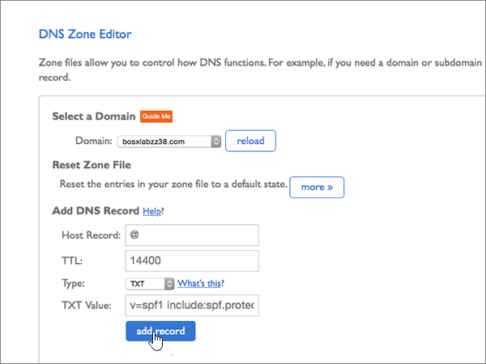

# 在 Bluehost 建立 Office 365 的 DNS 記錄

 若您找不到所需功能，請**[檢查網域常見問題集](../setup/domains-faq.md)**。 
  
如果 Bluehost 是您的 DNS 主機服務提供者，請按照本文所述的步驟驗證網域，並為電子郵件與商務用 Skype Online 等項目設定 DNS 記錄。
  
在 Bluehost 新增這些記錄之後，您的網域就會設定為與 Office 365 服務搭配使用。
  
若要了解使用 Office 365 網站的虛擬主機和 DNS，請參閱[搭配 Office 365 使用公用網站](https://support.office.com/article/choose-a-public-website-3325d50e-d131-403c-a278-7f3296fe33a9)。
  
> [!NOTE]
> Typically it takes about 15 minutes for DNS changes to take effect. However, it can occasionally take longer for a change you've made to update across the Internet's DNS system. 如果您遇到與郵件流程或其他問題新增 DNS 記錄之後，請參閱[尋找並修正新增網域或 Office 365 中的 DNS 記錄之後所發生的問題](../get-help-with-domains/find-and-fix-issues.md)。 
  
## 新增 TXT 記錄以供驗證

在您將自己的網域用於 Office 365 之前，我們必須先確認您擁有該網域。如果您能在自己的網域註冊機構登入自己的帳戶並能建立 DNS 記錄，Office 365 就能確信您擁有該網域。
  
> [!NOTE]
> 這筆記錄只會用於驗證您擁有自己的網域，不會影響其他項目。您可以選擇稍後再刪除記錄。 
  
1. 首先請用[這個連結](https://my.bluehost.com/cgi/dm)移至 Bluehost 上您的網域頁面。 You'll be prompted to log in first.
    
2. 在 [**網域**] 頁面上，在 [**網域**] 區域中，尋找您要變更，網域列，然後選取該網域的核取方塊。 
    
    (You may have to scroll down.)
    
3. 在***domain_name***區域中，在 [ **DNS 區域編輯器**] 列中，選取 [**管理 DNS 記錄**]。
    
4. 在 * * DNS 區域編輯器 * *] 頁面上，在 [ **Add DNS Record** ] 區域中，於新記錄，輸入或複製的方塊中，並貼上下表中的值。 
    
    (Choose the **Type** value from the drop-down list.) 
    
    |||||
    |:-----|:-----|:-----|:-----|
    |**Host Record**   |**TTL**   |**類型**   |**TXT Value**   |
    |@    |14400    |TXT    |MS=ms *XXXXXXXX*    **附註：** 這是範例。 Use your specific **Destination or Points to Address** value here, from the table in Office 365. [How do I find this?](../get-help-with-domains/information-for-dns-records.md)          |
   
5. 選取 [**新增記錄**]。
    
6. 繼續進行之前，請先稍候幾分鐘，好讓您剛剛建立的記錄能在網際網路上更新。
    
Now that you've added the record at your domain registrar's site, you'll go back to Office 365 and request Office 365 to look for the record.
  
When Office 365 finds the correct TXT record, your domain is verified.
  
1. 在系統管理中心，移至 [**設定** \> <a href="https://go.microsoft.com/fwlink/p/?linkid=834818" target="_blank">網域</a>] 頁面。

    
2. 在 [**網域**] 頁面上，選取您要驗證的網域。 
    
3. 在 [**安裝**] 頁面上，選取 [**啟動安裝程式**。
    
4. 在 [**驗證網域**] 頁面上，選取 [**驗證**]。
    
> [!NOTE]
> Typically it takes about 15 minutes for DNS changes to take effect. However, it can occasionally take longer for a change you've made to update across the Internet's DNS system. 如果您遇到與郵件流程或其他問題新增 DNS 記錄之後，請參閱[尋找並修正新增網域或 Office 365 中的 DNS 記錄之後所發生的問題](../get-help-with-domains/find-and-fix-issues.md)。 
  
## 新增 MX 記錄，以將寄往您網域的電子郵件轉至 Office 365

1. 首先請用[這個連結](https://my.bluehost.com/cgi/dm)移至 Bluehost 上您的網域頁面。 You'll be prompted to log in first.
    
2. 在 [**網域**] 頁面上，在 [**網域**] 區域中，尋找您要變更，網域列，然後選取該網域的核取方塊。 
    
    (You may have to scroll down.)
    
3. 在***domain_name***區域中，在 [ **DNS 區域編輯器**] 列中，選取 [**管理 DNS 記錄**]。
    
4. On the **DNS Zone Editor** page, in the **Add DNS Record** area, in the boxes for the new record, type or copy and paste the values from the following table. 
    
    (Choose the **Type** value from the drop-down list.) 
    
    |**Host Record**|**TTL**|**類型**|**Points To**|**優先順序**|
    |:-----|:-----|:-----|:-----|:-----|
    |@    |14400    |MX    | *\<網域金鑰\>*  .mail.protection.outlook.com   **附註：** 取得您\<*網域金鑰*\>從您的 Office 365 帳戶。 [How do I find this?](../get-help-with-domains/information-for-dns-records.md)          |0    如需關於優先順序的詳細資訊，請參閱[什麼是 MX 優先順序？](https://support.office.com/article/2784cc4d-95be-443d-b5f7-bb5dd867ba83.aspx)   |
   
   
  
5. 選取 [**新增記錄**]。
    
    
  
6. 如果 [ **MX （郵件交換程式）** ] 區段中有任何其他 MX 記錄，逐一刪除。 
    
    第一筆 MX 記錄中，選取 [**刪除。**
    
    ![選取 [刪除]，請針對每個其他的 MX 記錄](../media/6be17f54-3f33-47af-a9db-4689141530c2.png)
  
7. 在 [確認] 對話方塊中，選取 **[確定]**。
    
    ![選取 [確定]](../media/a50df7a3-2906-4cc0-87d4-1231ab234230.png)
  
8. 使用相同的程序，刪除所列出的任何其他 MX 記錄。
    
## 新增 Office 365 所需的六筆 CNAME 記錄

1. 首先請用[這個連結](https://my.bluehost.com/cgi/dm)移至 Bluehost 上您的網域頁面。 You'll be prompted to log in first.
    
2. 在 [**網域**] 頁面上，在 [**網域**] 區域中，尋找您要變更，網域列，然後選取該網域的核取方塊。 
    
    (You may have to scroll down.)
    
3. 在***domain_name***區域中，在 [ **DNS 區域編輯器**] 列中，選取 [**管理 DNS 記錄**]。
    
4. 在 [ **A （主機）** 記錄] 區段中，尋找**自動探索**記錄的資料列，然後選取該列中的 [**刪除**。 
    
    > [!IMPORTANT]
    > 您必須刪除現有**自動探索**記錄*之前*新增為 Office 365 所需的**自動探索**記錄。 Bluehost 不允許您同時維護兩個的**自動探索**記錄。 
  
    ![選取 [刪除]](../media/416a447e-3710-4ae7-8bf1-459381af4f6e.png)
  
5. 選取 [確定]****。
    
    ![選取 [確定]](../media/0c8f409d-c39f-4ed2-9c95-9af3e61c2411.png)
  
6. 建立六筆 CNAME 記錄的第一筆。
    
    在 [ **DNS 區域編輯器**] 頁面中**新增 DNS 記錄**] 區域中，於新記錄的方塊中輸入或複製並貼下表中第一列的值。 
    
    (Choose the **Type** value from the drop-down list.) 
    
    |**Host Record**|**TTL**|**類型**|**Points To**|
    |:-----|:-----|:-----|:-----|
    |autodiscover    |14400    |CNAME    |autodiscover.outlook.com    |
    |sip    |14400    |CNAME    |sipdir.online.lync.com>    |
    |lyncdiscover    |14400    |CNAME    |webdir.online.lync.com>    |
    |enterpriseregistration    |14400    |CNAME    |enterpriseregistration.windows.net>    |
    |enterpriseenrollment    |14400    |CNAME    |enterpriseenrollment-s.manage.microsoft.com    |
   
    
  
7. 選取 [**新增記錄**]。
    
    
  
8. 逐一新增其餘五筆 CNAME 記錄。
    
    同樣在 [ **Add DNS Record** ] 區段中，在表格中，使用下一列的值來建立記錄，然後再次選擇 [**新增記錄**以完成該筆記錄。 
    
    重複這個程序，直到六筆 CNAME 記錄全部建立完畢。
    
## 新增 SPF 的 TXT 記錄以協助防範垃圾郵件

> [!IMPORTANT]
> You cannot have more than one TXT record for SPF for a domain. If your domain has more than one SPF record, you'll get email errors, as well as delivery and spam classification issues. If you already have an SPF record for your domain, don't create a new one for Office 365. Instead, add the required Office 365 values to the current record so that you have a  *single*  SPF record that includes both sets of values. Need examples? 請查看這些[Office 365 的外部網域名稱系統記錄](https://support.office.com/article/c0531a6f-9e25-4f2d-ad0e-a70bfef09ac0)。 若要驗證您的 SPF 記錄，您可以使用其中一種[SPF 驗證工具](../setup/domains-faq.md)。 
  
1. 首先請用[這個連結](https://my.bluehost.com/cgi/dm)移至 Bluehost 上您的網域頁面。 You'll be prompted to log in first.
    
2. 在 [**網域**] 頁面上，在 [**網域**] 區域中，尋找您要變更，網域列，然後選取該網域的核取方塊。 
    
    (You may have to scroll down.)
    
3. 在***domain_name***區域中，在 [ **DNS 區域編輯器**] 列中，選取 [**管理 DNS 記錄**]。
    
4. On the **DNS Zone Editor** page, in the **Add DNS Record** area, in the boxes for the new record, type or copy and paste the values from the following table. 
    
    (Choose the **Type** value from the drop-down list.) 
        
    |**Host Record**|**TTL**|**類型**|**TXT Value**|
    |:-----|:-----|:-----|:-----|
    |@    |14400    |TXT    |v=spf1 include:spf.protection.outlook.com -all   **附註：** 建議您複製並貼上這個項目，好讓所有的間距保持正確。           |
   
    
  
5. 選取 [**新增記錄**]。
    
    
  
## 新增兩筆 Office 365 所需的 SRV 記錄

1. 首先請用[這個連結](https://my.bluehost.com/cgi/dm)移至 Bluehost 上您的網域頁面。 You'll be prompted to log in first.
    
2. 在 [**網域**] 頁面上，在 [**網域**] 區域中，尋找您要變更，網域列，然後選取該網域的核取方塊。 
    
    (You may have to scroll down.)
    
3. 在***domain_name***區域中，在 [ **DNS 區域編輯器**] 列中，選取 [**管理 DNS 記錄**]。
    
4. 建立兩筆 SRV 記錄的第一筆。
    
    在 [ **DNS 區域編輯器**] 頁面中**新增 DNS 記錄**] 區域中，於新記錄的方塊中輸入或複製並貼下表中第一列的值。 
    
    (Choose the **Type** value from the drop-down list.) 
    
    |**服務**|**通訊協定**|**Host (主機)**|**TTL**|**類型**|**優先順序**|**Weight**|**Port**|**Points To**|
    |:-----|:-----|:-----|:-----|:-----|:-----|:-----|:-----|:-----|
    |_sip    |_tls    |@    |14400    |SRV    |100    |1    |443    |sipdir.online.lync.com>    |
    |_sipfederationtls    |_tcp    |@    |14400    |SRV    |100    |1    |5061    |sipfed.online.lync.com>    |
   
    
  
5. 選取 [**新增記錄**]。
    
    
  
6. 新增另一筆 SRV 記錄。
    
    同樣在 [ **Add DNS Record** ] 區段中，在表格中，使用另一列的值來建立記錄，然後再次選擇 [**新增記錄**以完成該筆記錄。 
    
> [!NOTE]
> Typically it takes about 15 minutes for DNS changes to take effect. However, it can occasionally take longer for a change you've made to update across the Internet's DNS system. 如果您遇到與郵件流程或其他問題新增 DNS 記錄之後，請參閱[尋找並修正新增網域或 Office 365 中的 DNS 記錄之後所發生的問題](../get-help-with-domains/find-and-fix-issues.md)。 
  

