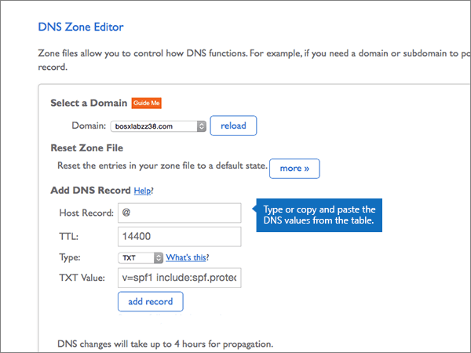

# 在 Bluehost 建立 Microsoft 的 DNS 記錄

 若您找不到所需功能，請**[檢查網域常見問題集](../setup/domains-faq.md)**。 
  
如果 Bluehost 是您的 DNS 主機服務提供者，請按照本文所述的步驟驗證網域，並為電子郵件與商務用 Skype Online 等項目設定 DNS 記錄。
  
在 Bluehost 新增這些記錄之後，您的網域就會設定為與 Microsoft 服務搭配使用。
  
若要了解使用 Microsoft 網站的虛擬主機和 DNS，請參閱[搭配 Microsoft 使用公用網站](https://support.office.com/article/choose-a-public-website-3325d50e-d131-403c-a278-7f3296fe33a9)。
  
> [!NOTE]
> Typically it takes about 15 minutes for DNS changes to take effect. 然而有時可能需要更久的時間，您所做的變更才能在整個網際網路的 DNS 系統中生效。 在您新增 DNS 記錄後，如有郵件流程或其他方面的問題，請參閱[尋找並修正新增網域或 DNS 記錄之後所發生的問題](../get-help-with-domains/find-and-fix-issues.md)。 
  
## 新增 TXT 記錄以供驗證

在您將自己的網域用於 Microsoft 之前，我們必須先確認您擁有該網域。如果您能在自己的網域註冊機構登入自己的帳戶並能建立 DNS 記錄，Microsoft 就能確信您擁有該網域。
  
> [!NOTE]
> 這筆記錄只會用於驗證您擁有自己的網域，不會影響其他項目。您可以選擇稍後再刪除記錄。 
  
1. 首先請用[這個連結](https://my.bluehost.com/cgi/dm)移至 Bluehost 上您的網域頁面。 系統會提示您先登入。
    
2. 在 [**網域**] 頁面的 [**網域**] 區域中，尋找您要變更之網域的列，然後選取該網域的核取方塊。 
    
    (You may have to scroll down.)
    
3. 在 [ ***domain_name*** ] 區域的 [ **DNS 區域編輯器**] 列中，選取 [**管理 DNS 記錄**]。
    
4. On the **DNS Zone Editor** page, in the **Add DNS Record** area, in the boxes for the new record, type or copy and paste the values from the following table. 
    
    (Choose the **Type** value from the drop-down list.) 
    
    |||||
    |:-----|:-----|:-----|:-----|
    |**Host Record**   |**TTL**   |**類型**   |**TXT Value**   |
    |@    |14400    |TXT    |MS=ms *XXXXXXXX*    **附註：** 這是範例。 在這裡請使用您自己來自表格的 [目的地或指向位址]**** 值。 [如何找到呢？](../get-help-with-domains/information-for-dns-records.md)          |
   
5. 選取 [**新增記錄**]。
    
6. 繼續進行之前，請先稍候幾分鐘，好讓您剛剛建立的記錄能在網際網路上更新。
    
現在，您已在網域註冊機構的網站上新增記錄，您會回到 Microsoft 並要求搜尋該記錄。
  
在 Microsoft 找到正確的 TXT 記錄後，您的網域就完成驗證了。
  
1. 在 Microsoft 系統管理中心中，移至 [設定]**** \> [網域] 頁面。

    
2. 在 **[網域]** 頁面上，選取您要驗證的網域。 
    
3. 在 **[設定]** 頁面上，選取 **[開始設定]**。
    
4. 在 [驗證網域]**** 頁面上，選取 [驗證]****。
    
> [!NOTE]
> Typically it takes about 15 minutes for DNS changes to take effect. 然而有時可能需要更久的時間，您所做的變更才能在整個網際網路的 DNS 系統中生效。 在您新增 DNS 記錄後，如有郵件流程或其他方面的問題，請參閱[尋找並修正新增網域或 DNS 記錄之後所發生的問題](../get-help-with-domains/find-and-fix-issues.md)。 
  
## 新增 MX 記錄，以將寄往您網域的電子郵件轉至 Microsoft

1. 首先請用[這個連結](https://my.bluehost.com/cgi/dm)移至 Bluehost 上您的網域頁面。 系統會提示您先登入。
    
2. 在 [**網域**] 頁面的 [**網域**] 區域中，尋找您要變更之網域的列，然後選取該網域的核取方塊。 
    
    (You may have to scroll down.)
    
3. 在 [ ***domain_name*** ] 區域的 [ **DNS 區域編輯器**] 列中，選取 [**管理 DNS 記錄**]。
    
4. On the **DNS Zone Editor** page, in the **Add DNS Record** area, in the boxes for the new record, type or copy and paste the values from the following table. 
    
    (Choose the **Type** value from the drop-down list.) 
    
    |**Host Record**|**TTL**|**類型**|**指向**|**優先順序**|
    |:-----|:-----|:-----|:-----|:-----|
    |@    |14400    |MX    | *\<網域金鑰\>*  .mail.protection.outlook.com   **注意：** 從您的 Microsoft 帳戶取得您的\<*網域金鑰*\>。 [How do I find this?](../get-help-with-domains/information-for-dns-records.md)          |0    如需關於優先順序的詳細資訊，請參閱[什麼是 MX 優先順序？](https://support.office.com/article/2784cc4d-95be-443d-b5f7-bb5dd867ba83.aspx)   |
   
   ![從下拉式清單中選擇 [類型]](../../media/70791420-d83c-4a5d-a46c-5cc3bc67f565.png)
  
5. 選取 [**新增記錄**]。
    
    ![選取 [新增記錄]](../../media/c7ef9733-1665-4dbf-accc-caadf1574abc.png)
  
6. 如果**mx （郵件交換器）** 區段中有任何其他 MX 記錄，請將其刪除。 
    
    若為其他其中一個 MX 記錄，請選取 [**刪除]。**
    
    ![針對每個額外的 MX 記錄選取 [刪除]](../../media/6be17f54-3f33-47af-a9db-4689141530c2.png)
  
7. 在 [確認] 對話方塊中，選取 **[確定**]。
    
    ![選取 [確定]](../../media/a50df7a3-2906-4cc0-87d4-1231ab234230.png)
  
8. 使用相同的程序，刪除所列出的任何其他 MX 記錄。
    
## 新增 Microsoft 所需的六筆 CNAME 記錄

1. 首先請用[這個連結](https://my.bluehost.com/cgi/dm)移至 Bluehost 上您的網域頁面。 系統會提示您先登入。
    
2. 在 [**網域**] 頁面的 [**網域**] 區域中，尋找您要變更之網域的列，然後選取該網域的核取方塊。 
    
    (You may have to scroll down.)
    
3. 在 [ ***domain_name*** ] 區域的 [ **DNS 區域編輯器**] 列中，選取 [**管理 DNS 記錄**]。
    
4. 在 [ **A （主機）** 記錄] 區段中，找到**自動**探索記錄的列，然後針對該列選取 [**刪除**]。 
    
    > [!IMPORTANT]
    > 在新增 Microsoft 所需的**自動**探索記錄之前，您必須*先*刪除現有的**自動**探索記錄。 Bluehost 不允許您同時維護兩個**自動**探索記錄。 
  
    ![選取 [刪除]](../../media/416a447e-3710-4ae7-8bf1-459381af4f6e.png)
  
5. 選取 [確定]****。
    
    ![選取 [確定]](../../media/0c8f409d-c39f-4ed2-9c95-9af3e61c2411.png)
  
6. 建立六筆 CNAME 記錄的第一筆。
    
    在 [ **DNS 區域編輯器**] 頁面的 [**新增 DNS 記錄**] 區域，于新記錄的方塊中，輸入或複製並貼上下表中第一列的值。 
    
    (Choose the **Type** value from the drop-down list.) 
    
    |**Host Record**|**TTL**|**類型**|**指向**|
    |:-----|:-----|:-----|:-----|
    |autodiscover    |14400    |CNAME    |autodiscover.outlook.com    |
    |sip    |14400    |CNAME    |sipdir.online.lync.com    |
    |lyncdiscover    |14400    |CNAME    |webdir.online.lync.com    |
    |enterpriseregistration    |14400    |CNAME    |enterpriseregistration.windows.net    |
    |enterpriseenrollment    |14400    |CNAME    |enterpriseenrollment-s.manage.microsoft.com    |
   
    
  
7. 選取 [**新增記錄**]。
    
    ![選取 [新增記錄]](../../media/c2782250-a9a6-4aee-bb15-f57cb0008587.png)
  
8. 逐一新增其餘五筆 CNAME 記錄。
    
    仍然在 [**新增 DNS 記錄**] 區段中，使用表格中下一列的值來建立記錄，然後再選取 [**新增記錄**] 以完成記錄。 
    
    重複這個程序，直到六筆 CNAME 記錄全部建立完畢。
    
## 新增 SPF 的 TXT 記錄以協助防範垃圾郵件

> [!IMPORTANT]
> 網域的 SPF 不得擁有一個以上的 TXT 記錄。 如果您的網域具有多筆 SPF 記錄，您將收到電子郵件錯誤，以及傳送及垃圾郵件分類問題。 如果網域已經有 SPF 記錄，請勿為 Microsoft 建立一個新的記錄。 請改為將必要的 Microsoft 值新增至目前的記錄，讓您擁有包含這兩組值的*單一*SPF 記錄。 需要範例？ 請參閱這些 [Microsoft 的外部網域名稱系統記錄](https://support.office.com/article/c0531a6f-9e25-4f2d-ad0e-a70bfef09ac0)。 若要驗證您的 SPF 記錄，您可以使用其中一種[spf 驗證工具](../setup/domains-faq.md)。 
  
1. 首先請用[這個連結](https://my.bluehost.com/cgi/dm)移至 Bluehost 上您的網域頁面。 系統會提示您先登入。
    
2. 在 [**網域**] 頁面的 [**網域**] 區域中，尋找您要變更之網域的列，然後選取該網域的核取方塊。 
    
    (You may have to scroll down.)
    
3. 在 [ ***domain_name*** ] 區域的 [ **DNS 區域編輯器**] 列中，選取 [**管理 DNS 記錄**]。
    
4. On the **DNS Zone Editor** page, in the **Add DNS Record** area, in the boxes for the new record, type or copy and paste the values from the following table. 
    
    (Choose the **Type** value from the drop-down list.) 
        
    |**Host Record**|**TTL**|**類型**|**TXT Value**|
    |:-----|:-----|:-----|:-----|
    |@    |14400    |TXT    |v=spf1 include:spf.protection.outlook.com -all   **注意：** 建議您複製並貼上這個項目，好讓所有的間距保持正確。           |
   
    
  
5. 選取 [**新增記錄**]。
    
    ![選取 [新增記錄]](../../media/c050e9a2-2274-4640-8f0f-6752d382df5d.png)
  
## 新增兩筆 Microsoft 所需的 SRV 記錄

1. 首先請用[這個連結](https://my.bluehost.com/cgi/dm)移至 Bluehost 上您的網域頁面。 系統會提示您先登入。
    
2. 在 [**網域**] 頁面的 [**網域**] 區域中，尋找您要變更之網域的列，然後選取該網域的核取方塊。 
    
    (You may have to scroll down.)
    
3. 在 [ ***domain_name*** ] 區域的 [ **DNS 區域編輯器**] 列中，選取 [**管理 DNS 記錄**]。
    
4. 建立兩筆 SRV 記錄的第一筆。
    
    在 [ **DNS 區域編輯器**] 頁面的 [**新增 DNS 記錄**] 區域，于新記錄的方塊中，輸入或複製並貼上下表中第一列的值。 
    
    (Choose the **Type** value from the drop-down list.) 
    
    |**Service** (服務)|**Protocol** (通訊協定)|**Host**|**TTL**|**類型**|**Priority** (優先順序)|**Weight** (權數)|**Port** (連接埠)|**指向**|
    |:-----|:-----|:-----|:-----|:-----|:-----|:-----|:-----|:-----|
    |_sip    |_tls    |@    |14400    |SRV    |100    |1     |443    |sipdir.online.lync.com    |
    |_sipfederationtls    |_tcp    |@    |14400    |SRV    |100    |1     |5061    |sipfed.online.lync.com    |
   
    
  
5. 選取 [**新增記錄**]。
    
    ![選取 [新增記錄]](../../media/0fd6a587-03fd-4bce-8321-b14e6ad21f5c.png)
  
6. 新增另一筆 SRV 記錄。
    
    仍然在 [**新增 DNS 記錄**] 區段中，使用資料表中另一列的值來建立記錄，然後再選取 [**新增記錄**] 以完成記錄。 
    
> [!NOTE]
> Typically it takes about 15 minutes for DNS changes to take effect. 然而有時可能需要更久的時間，您所做的變更才能在整個網際網路的 DNS 系統中生效。 在您新增 DNS 記錄後，如有郵件流程或其他方面的問題，請參閱[尋找並修正新增網域或 DNS 記錄之後所發生的問題](../get-help-with-domains/find-and-fix-issues.md)。 
  

