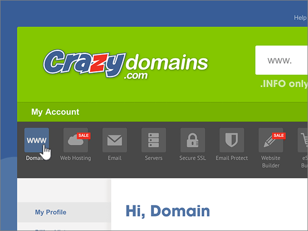
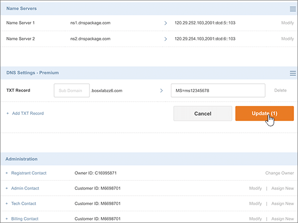
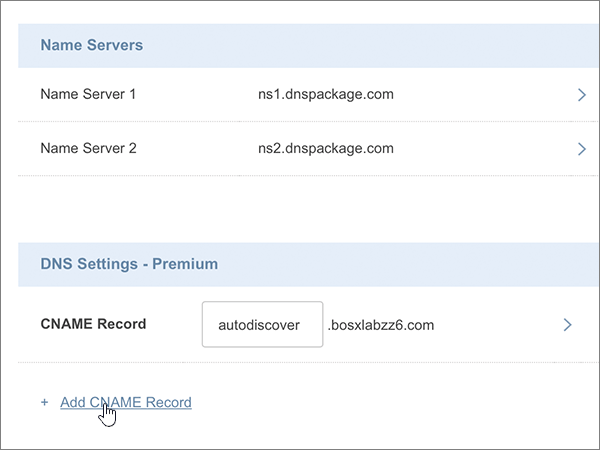
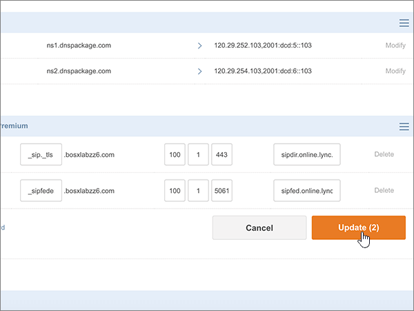

# 在 Crazy Domains 建立 Office 365 的 DNS 記錄Create DNS records at Crazy Domains for Office 365

 若您找不到所需功能，請**[檢查網域常見問題集](../setup/domains-faq.md)**。**[Check the Domains FAQ](../setup/domains-faq.md)** if you don't find what you're looking for. 
  
如果 Crazy Domains 是您的 DNS 主機服務提供者，請按照本文所述的步驟驗證網域，並設定電子郵件與商務用 Skype Online 等項目的 DNS 記錄。If Crazy Domains is your DNS hosting provider, follow the steps in this article to verify your domain and set up DNS records for email, Skype for Business Online, and so on.
  
在 Crazy Domains 新增這些記錄之後，您的網域就會設定為搭配 Office 365 服務使用。After you add these records at Crazy Domains, your domain will be set up to work with Office 365 services.
  
若要了解使用 Office 365 網站的虛擬主機和 DNS，請參閱[搭配 Office 365 使用公用網站](https://support.office.com/article/choose-a-public-website-3325d50e-d131-403c-a278-7f3296fe33a9)。To learn about webhosting and DNS for websites with Office 365, see [Use a public website with Office 365](https://support.office.com/article/choose-a-public-website-3325d50e-d131-403c-a278-7f3296fe33a9).
  
> [!NOTE]
> DNS 變更生效通常約需 15 分鐘的時間。而如果您所做的變更要在整個網際網路 DNS 系統中生效，有時可能需要更久的時間。在您新增 DNS 記錄後，如有郵件流程或其他方面的問題，請參閱[變更網域名稱或 DNS 記錄之後所發生問題的疑難排解](../get-help-with-domains/find-and-fix-issues.md)。Typically it takes about 15 minutes for DNS changes to take effect. However, it can occasionally take longer for a change you've made to update across the Internet's DNS system. If you're having trouble with mail flow or other issues after adding DNS records, see [Troubleshoot issues after changing your domain name or DNS records](../get-help-with-domains/find-and-fix-issues.md). 
  
## 新增 TXT 記錄以供驗證Add a TXT record for verification

在您將自己的網域用於 Office 365 之前，我們必須先確認您擁有該網域。如果您能在自己的網域註冊機構登入自己的帳戶並能建立 DNS 記錄，Office 365 就能確信您擁有該網域。Before you use your domain with Office 365, we have to make sure that you own it. Your ability to log in to your account at your domain registrar and create the DNS record proves to Office 365 that you own the domain.
  
> [!NOTE]
> 這筆記錄只會用於驗證您擁有自己的網域，不會影響其他項目。您可以選擇稍後再刪除記錄。This record is used only to verify that you own your domain; it doesn't affect anything else. You can delete it later, if you like. 
  
1. 首先請用[這個連結](https://manage.crazydomains.com/members/domains/)移至 Crazy Domains 上您的網域頁面。系統會提示您先登入。To get started, go to your domains page at Crazy Domains by using [this link](https://manage.crazydomains.com/members/domains/). You'll be prompted to log in first.
    
    
  
2. 在 [ **My Account** ] 區段中，選取 [**網域**]。In the **My Account** section, select **Domains**.
    
    
  
3. 在 [**網域名稱**] 頁面上，在 [**網域**] 區段中，選取您要更新的網域名稱。On the **Domain Names** page, in the **Domain** section, select the name of the domain that you are updating. 
    
    
  
4. 在 [ **DNS 設定**] 區段中，選取下拉式清單圖示。In the **DNS Settings** section, select the drop-down list icon. 
    
    
  
5. 選取 [**新增記錄**]。Select **Add Record**.
    
    
  
6. Choose **TXT Record** from the **Add Record** drop-down list.Choose **TXT Record** from the **Add Record** drop-down list. 
    
    
  
7. 選取 **[新增]**。Select **Add**.
    
    
  
8. 在每一筆新記錄的方塊中，輸入或複製並貼上下表中的值。In the boxes for the new record, type or copy and paste the values from the following table.
    
    |**Sub Domain****Sub Domain**|**Text Record****Text Record**|
    |:-----|:-----|
    |(Leave this field empty.)(Leave this field empty.)    |MS=ms *XXXXXXXX*MS=ms *XXXXXXXX*    **附註：** 這是範例。**Note:** This is an example. Use your specific **Destination or Points to Address** value here, from the table in Office 365.Use your specific **Destination or Points to Address** value here, from the table in Office 365.           [How do I find this?How do I find this?](../get-help-with-domains/information-for-dns-records.md)          |
   
    
  
9. 選取 [**更新**]。Select **Update**.
    
    
  
10. 繼續進行之前，請先稍候幾分鐘，好讓您剛剛建立的記錄能在網際網路上更新。Wait a few minutes before you continue, so that the record you just created can update across the Internet.
    
Now that you've added the record at your domain registrar's site, you'll go back to Office 365 and request Office 365 to look for the record.Now that you've added the record at your domain registrar's site, you'll go back to Office 365 and request Office 365 to look for the record.
  
When Office 365 finds the correct TXT record, your domain is verified.When Office 365 finds the correct TXT record, your domain is verified.
  
1. 在系統管理中心，移至 [**設定** \> <a href="https://go.microsoft.com/fwlink/p/?linkid=834818" target="_blank">網域</a>] 頁面。In the admin center, go to the **Settings** \> <a href="https://go.microsoft.com/fwlink/p/?linkid=834818" target="_blank">Domains</a> page.

    
2. 在 [**網域**] 頁面上，選取您要驗證的網域。On the **Domains** page, select the domain that you are verifying. 
    
    
  
3. 在 [**安裝**] 頁面上，選取 [**啟動安裝程式**。On the **Setup** page, select **Start setup**.
    
    
  
4. 在 [**驗證網域**] 頁面上，選取 [**驗證**]。On the **Verify domain** page, select **Verify**.
    
    
  
> [!NOTE]
>  DNS 變更生效通常約需 15 分鐘的時間。而如果您所做的變更要在整個網際網路 DNS 系統中生效，有時可能需要更久的時間。在您新增 DNS 記錄後，如有郵件流程或其他方面的問題，請參閱[變更網域名稱或 DNS 記錄之後所發生問題的疑難排解](../get-help-with-domains/find-and-fix-issues.md)。Typically it takes about 15 minutes for DNS changes to take effect. However, it can occasionally take longer for a change you've made to update across the Internet's DNS system. If you're having trouble with mail flow or other issues after adding DNS records, see [Troubleshoot issues after changing your domain name or DNS records](../get-help-with-domains/find-and-fix-issues.md). 
  
## 新增 MX 記錄，以將寄往您網域的電子郵件轉至 Office 365Add an MX record so email for your domain will come to Office 365

1. 首先請用[這個連結](https://manage.crazydomains.com/members/domains/)移至 Crazy Domains 上您的網域頁面。系統會提示您先登入。To get started, go to your domains page at Crazy Domains by using [this link](https://manage.crazydomains.com/members/domains/). You'll be prompted to log in first.
    
    
  
2. 在 [ **My Account** ] 區段中，選取 [**網域**]。In the **My Account** section, select **Domains**.
    
    
  
3. 在 [**網域名稱**] 頁面上，在 [**網域**] 區段中，選取您要更新的網域名稱。On the **Domain Names** page, in the **Domain** section, select the name of the domain that you are updating. 
    
    
  
4. 在 [ **DNS 設定**] 區段中，選取下拉式清單圖示。In the **DNS Settings** section, select the drop-down list icon. 
    
    
  
5. 選取 [**新增記錄**]。Select **Add Record**.
    
    
  
6. 選擇 [ **MX 記錄**從**新增記錄：** 下拉式清單。Choose **MX Record** from the **Add Record:** drop-down list. 
    
    
  
7. 選取 **[新增]**。Select **Add**.
    
    
  
8. 在新記錄的方塊中，輸入或複製並貼上下表中的值。In the boxes for the new record, type or copy and paste the values from the following table.
    
    （從下拉式清單選擇的**優先順序**值）。(Choose the **Priority** value from the drop-down list.) 
    
    |**Mail For Zone (區域郵件)****Mail For Zone**|**優先順序****Priority**|**Assigned To Server (指派給伺服器)****Assigned To Server**|
    |:-----|:-----|:-----|
    |(將此欄位保留空白。)(Leave this field empty.)    |11    如需關於優先順序的詳細資訊，請參閱[什麼是 MX 優先順序？](https://support.office.com/article/2784cc4d-95be-443d-b5f7-bb5dd867ba83.aspx)For more information about priority, see [What is MX priority?](https://support.office.com/article/2784cc4d-95be-443d-b5f7-bb5dd867ba83.aspx)   | *\<網域金鑰\>*  .mail.protection.outlook.com*\<domain-key\>*  .mail.protection.outlook.com    **附註：** 取得您*\<網域金鑰\>* 從您的 Office 365 帳戶。**Note:** Get your  *\<domain-key\>*  from your Office 365 account.           [How do I find this?How do I find this?](../get-help-with-domains/information-for-dns-records.md)          |
       
   
  
9. 選取 [**更新**]。Select **Update**.
    
    
  
10. 如果有任何其他 MX 記錄列在 [ **MX 記錄**] 區段中，選取 [**修改**其中的記錄。If there are any other MX records listed in the **MX Record** section, select **Modify** for one of those records. 
    
    
  
11. 選取 [**刪除**]。Select **Delete**.
    
    
  
12. 選取 [**更新**]，以確認刪除。Select **Update** to confirm the deletion. 
    
    
  
13. 使用相同方法移除清單中其他所有 MX 記錄，直到只剩下您先前在本程序中新增的記錄為止。Use the same process to remove any other MX records in the list, until only the one that you added earlier in this procedure remains.
    
## 新增 Office 365 所需的六筆 CNAME 記錄Add the six CNAME records that are required for Office 365

1. 首先請用[這個連結](https://manage.crazydomains.com/members/domains/)移至 Crazy Domains 上您的網域頁面。系統會提示您先登入。To get started, go to your domains page at Crazy Domains by using [this link](https://manage.crazydomains.com/members/domains/). You'll be prompted to log in first.
    
    
  
2. 在 [ **My Account** ] 區段中，選取 [**網域**]。In the **My Account** section, select **Domains**.
    
    
  
3. 在 [**網域名稱**] 頁面上，在 [**網域**] 區段中，選取您要更新的網域名稱。On the **Domain Names** page, in the **Domain** section, select the name of the domain that you are updating. 
    
    
  
4. 在 [ **DNS 設定**] 區段中，選取下拉式清單圖示。In the **DNS Settings** section, select the drop-down list icon. 
    
    
  
5. 選取 [**新增記錄**]。Select **Add Record**.
    
    
  
6. 選擇 [ **CNAME 記錄**從**新增記錄：** 下拉式清單。Choose **CNAME Record** from the **Add Record:** drop-down list. 
    
    
  
7. 選取 **[新增]**。Select **Add**.
    
    
  
8. 新增六筆 CNAME 記錄的第一筆。Add the first of the six CNAME records.
    
    在每一筆新記錄的方塊中，輸入或複製並貼上下表第一列中的值。In the boxes for the new record, type or copy and paste the values from the first row of the following table.
    
    |**Sub Domain****Sub Domain**|**Alias for (別名)****Alias for**|
    |:-----|:-----|
    |autodiscoverautodiscover    |autodiscover.outlook.comautodiscover.outlook.com    |
    |sipsip    |sipdir.online.lync.com>sipdir.online.lync.com    |
    |lyncdiscoverlyncdiscover    |webdir.online.lync.com>webdir.online.lync.com    |
    |enterpriseregistrationenterpriseregistration    |enterpriseregistration.windows.net>enterpriseregistration.windows.net    |
    |enterpriseenrollmententerpriseenrollment    |enterpriseenrollment-s.manage.microsoft.comenterpriseenrollment-s.manage.microsoft.com    |
   
    
  
9. 選取 [**新增 CNAME 記錄**。Select **Add CNAME Record**.
    
    
  
10. 新增第二筆 CNAME 記錄。Add the second CNAME record.
    
    在新記錄的方塊，在表格中，使用下一列的值，然後再次選擇 [ **Add CNAME Record**。In the boxes for the new record, use the values from the next row in the table, and then again select **Add CNAME Record**.
    
    重複這個程序，直到六筆 CNAME 記錄全部建立完畢。Repeat this process until you have created all six CNAME records.
    
11. 選取 [**更新**] 以儲存變更。Select **Update** to save your changes. 
    
    
  
## 新增 SPF 的 TXT 記錄以協助防範垃圾郵件Add a TXT record for SPF to help prevent email spam

> [!IMPORTANT]
> You cannot have more than one TXT record for SPF for a domain.You cannot have more than one TXT record for SPF for a domain. If your domain has more than one SPF record, you'll get email errors, as well as delivery and spam classification issues.If your domain has more than one SPF record, you'll get email errors, as well as delivery and spam classification issues. If you already have an SPF record for your domain, don't create a new one for Office 365.If you already have an SPF record for your domain, don't create a new one for Office 365. Instead, add the required Office 365 values to the current record so that you have a  *single*  SPF record that includes both sets of values.Instead, add the required Office 365 values to the current record so that you have a  *single*  SPF record that includes both sets of values. 
  
1. 首先請用[這個連結](https://manage.crazydomains.com/members/domains/)移至 Crazy Domains 上您的網域頁面。系統會提示您先登入。To get started, go to your domains page at Crazy Domains by using [this link](https://manage.crazydomains.com/members/domains/). You'll be prompted to log in first.
    
    
  
2. 在 [ **My Account** ] 區段中，選取 [**網域**]。In the **My Account** section, select **Domains**.
    
    
  
3. 在 [**網域名稱**] 頁面上，在 [**網域**] 區段中，選取您要更新的網域名稱。On the **Domain Names** page, in the **Domain** section, select the name of the domain that you are updating. 
    
    
  
4. 在 [ **DNS 設定**] 區段中，選取下拉式清單圖示。In the **DNS Settings** section, select the drop-down list icon. 
    
    
  
5. 選取 [**新增記錄**]。Select **Add Record**.
    
    
  
6. 選擇 [ **TXT 記錄**從**新增記錄：** 下拉式清單。Choose **TXT Record** from the **Add Record:** drop-down list. 
    
    
  
7. 選取 **[新增]**。Select **Add**.
    
    
  
8. 在新記錄的方塊中，輸入或貼上下表中的值。In the boxes for the new record, type or paste the values from the following table.
    
    |**Sub Domain****Sub Domain**|**Text Record****Text Record**|
    |:-----|:-----|
    |(將此欄位保留空白。)(Leave this field empty.)    |v=spf1 include:spf.protection.outlook.com -allv=spf1 include:spf.protection.outlook.com -all    **附註：** 建議您複製並貼上這個項目，好讓所有的間距保持正確。**Note:** We recommend copying and pasting this entry, so that all of the spacing stays correct.           |
   
    
  
9. 選取 [**更新**]。Select **Update**.
    
    
  
## 新增兩筆 Office 365 所需的 SRV 記錄Add the two SRV records that are required for Office 365

1. 首先請用[這個連結](https://manage.crazydomains.com/members/domains/)移至 Crazy Domains 上您的網域頁面。系統會提示您先登入。To get started, go to your domains page at Crazy Domains by using [this link](https://manage.crazydomains.com/members/domains/). You'll be prompted to log in first.
    
    
  
2. 在 [ **My Account** ] 區段中，選取 [**網域**]。In the **My Account** section, select **Domains**.
    
    
  
3. 在 [**網域名稱**] 頁面上，在 [**網域**] 區段中，選取您要更新的網域名稱。On the **Domain Names** page, in the **Domain** section, select the name of the domain that you are updating. 
    
    
  
4. 在 [ **DNS 設定**] 區段中，選取下拉式清單圖示。In the **DNS Settings** section, select the drop-down list icon. 
    
    
  
5. 選取 [**新增記錄**]。Select **Add Record**.
    
    
  
6. 選擇 [ **SRV 記錄**從**新增記錄：** 下拉式清單。Choose **SRV Record** from the **Add Record:** drop-down list. 
    
    
  
7. 選取 **[新增]**。Select **Add**.
    
    
  
8. 新增兩筆 SRV 記錄中的第一筆。Add the first of the two SRV records.
    
    在每一筆新記錄的方塊中，輸入或複製並貼上下表第一列中的值。In the boxes for the new record, type or copy and paste the values from the first row of the following table.
    
    |**Record Type****Record Type**|**Sub Domain****Sub Domain**|**優先順序****Priority**|**Weight****Weight**|**Port****Port**|**Target****Target**|
    |:-----|:-----|:-----|:-----|:-----|:-----|
    |SRV Record (SRV 記錄)SRV Record    |_sip._tls_sip._tls    |100100    |11    |443443    |sipdir.online.lync.com>sipdir.online.lync.com    |
    |SRV Record (SRV 記錄)SRV Record    |_sipfederationtls._tcp_sipfederationtls._tcp    |100100    |11    |50615061    |sipfed.online.lync.com>sipfed.online.lync.com    |
   
    
  
9. 選取 [**新增一筆 SRV 記錄**。Select **Add SRV Record**.
    
    
  
10. 新增另一筆 SRV 記錄。Add the other SRV record.
    
    在新記錄的方塊中，使用下表第二列中的值。In the boxes for the new record, use the values from the second row in the table.
    
11. 選取 [**更新**] 以儲存變更。Select **Update** to save your changes. 
    
    
  
> [!NOTE]
> DNS 變更生效通常約需 15 分鐘的時間。而如果您所做的變更要在整個網際網路 DNS 系統中生效，有時可能需要更久的時間。在您新增 DNS 記錄後，如有郵件流程或其他方面的問題，請參閱[變更網域名稱或 DNS 記錄之後所發生問題的疑難排解](../get-help-with-domains/find-and-fix-issues.md)。Typically it takes about 15 minutes for DNS changes to take effect. However, it can occasionally take longer for a change you've made to update across the Internet's DNS system. If you're having trouble with mail flow or other issues after adding DNS records, see [Troubleshoot issues after changing your domain name or DNS records](../get-help-with-domains/find-and-fix-issues.md). 
  
